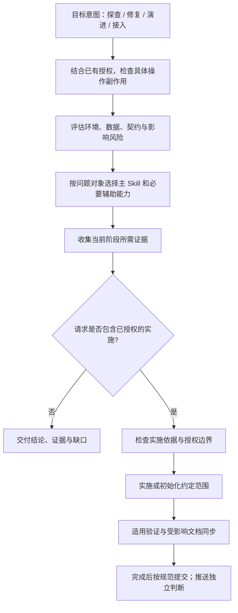

<!--
AUTO-GENERATED FROM CLAUDE.md by scripts/sync-agents.js
DO NOT EDIT THIS FILE DIRECTLY. EDIT CLAUDE.md AND RUN:
    node scripts/sync-agents.js
-->
# team-standards 插件开发规范（Codex 入口）

> 每次操作 Skill 前先读本文件。团队插件只保留跨项目稳定能力；项目特有架构、路由、脚手架和拓扑规则必须由实际项目声明。

## 统一主流程



主流程原则：

1. `change-readiness` 是开发前唯一主门禁；项目启用 OpenSpec 后，M/L 变更自动匹配或创建 change，并在实施期间更新、验证、同步和判断归档。只有未启用 OpenSpec 的项目，或用户明确批准的单次降级，才使用兼容设计文档。
2. `bug-doc-required` 是 Bug 唯一入口，覆盖证据、根因、最小修复和回归；未获修复授权时只调查。简单 Bug 不另建报告，复杂或高风险问题复用唯一持久记录，图表和独立报告按需生成。
3. `backend-evidence` 是单服务后端证据唯一入口；代码事实和反向影响使用 Graphify 即时查询，不维护第二套手工索引。
4. `markdown-writing-standards` 覆盖写前查重、Markdown/Mermaid 结构和写后索引登记。
5. `init-project-docs` 在当前目录幂等初始化六层 AI 工程入口、`.graphifyignore` 与 Graphify Git 共享边界，并覆盖通用项目 onboarding 与上下文状态；不生成平行事实投影。
6. 小改按风险缩短流程，但不得跳过通用编码规范；项目专属规则由项目内 Skill 或 `AGENTS.md` 叠加。
7. Graphify 提供带新鲜度边界的当前实现事实，OpenSpec 提供项目行为规格与活动变更；Skill 只做意图路由和质量门禁，不复制图谱或建立平行规格。
8. OpenSpec 文档按阶段准出和当前切片推进；change-readiness 维护概设详设、评审意见及交接，delivery-verification 提供真实验证。共享治理检查器检查绑定、范围、视图及证据新鲜度，默认报告试运行，实际宿主验收后启用 block；同步归档仍使用官方 OpenSpec。
9. AI 原生作业将实现、受影响文档和提交作为同一交付单元：每次更新核对 README 与规则入口，验证通过后自动提交本次范围。文档影响规则归 markdown-writing-standards，自动提交及例外归 git-commit-standards；本地 commit 与 push 分别判断授权。

状态契约治理复用现有四个 Skill：change-readiness 登记状态与影响，backend-evidence 核对存储及不变量，business-logic-orientation 定位消费者，delivery-verification 检查实际执行证据。共享入口为 `plugins/team-standards/scripts/state-contract.js`；按 [接入协议](plugins/team-standards/skills/change-readiness/references/state-contract.md) 逐模块启用，不将静态检查等同业务正确。

## 意图、授权与风险

按“目标意图 → 已有授权与具体操作副作用 → 影响风险 → 主 Skill → 必要阶段与交付”判断。四类意图用于理解结果，不直接授予权限、不直接指定 S/M/L，也不要求用户做四选一。

| 意图 | 目标与主入口 |
|---|---|
| 探查 Explore | 现状理解用 business-logic-orientation；异常原因用 bug-doc-required 调查模式；跨项目价值与工作量评估用 planning-evidence-discovery；专业审查按对象选择 Skill |
| 修复 Repair | 恢复预期行为，进入 bug-doc-required；区分只调查与已授权修复 |
| 演进 Evolve | 功能、纯重构、性能提升及规则维护；实施前进入 change-readiness，纯文档编辑直接使用文档规范 |
| 接入 Bootstrap | init-project-docs 的状态检查、初始化、配置或刷新；status 不自动升级为 init |

- 结合当前请求、上下文和已有授权理解目标，不以单个关键词决定实施。“评估是否迁移”不自动创建实施 change；“查明并修复”已包含调查和修复授权，证据与实施依据充分后连续推进。
- 按具体操作的副作用、可逆性、目标环境与数据范围判断边界。只读查询也可能有生产负载或敏感信息风险；Shell 既能查询也能修改，READ/WRITE/EXECUTE 标签不能替代操作判断。
- 风险独立评估。探查不默认 S，修复不默认可写或免规格，接入不自动获得业务代码、部署或外部写入授权。已有明确授权持续有效；仅对超出范围、尚未授权的破坏性操作、未决业务选择或无法消除的歧义补充确认，不因 M/L 或阶段切换重复审批。
- 纯重构以可观察行为、接口、状态、数据与依赖事实判断；使用相关回归或必要的特征测试验证，不凭自称免门禁，也不一律增加 PRD 或 AST 检查。OpenSpec 与风险简化路径仍按 change-readiness 执行。
- 探查默认直接交付答案与证据，不改项目、不创建实施 artifacts。用户要求文档或确有长期复用价值时在授权范围内维护唯一载体；不为分类结果新建报告。特定平台已有证据账本协议仍遵守，不复制另一份报告。
- 提交、日志、文档同步和验证是交付动作；用户单独请求时直接进入对应 Skill。混合任务按证据推进阶段，完成当前授权范围即可交付，不强行进入后续实施。
- 这些是 Agent 路由义务，不是物理隔离。Hook 受宿主与工具覆盖限制；真实访问限制由宿主权限、凭据和沙箱落实，不能声称仅拦 Edit/Write 就阻止了所有副作用。

## 主动触发表

| 用户意图或动作 | 调用 Skill / 模式 |
|---|---|
| 已授权实施的方案、需求、重构或源码修改 | `change-readiness` |
| 只咨询方案可行性、审查或影响 | 按问题对象探查；不自动进入实施 |
| 报告 Bug、异常、超时、错误行为；或明确要求修复 | `bug-doc-required` |
| 重构、复写、迁移前理解现有业务 | `business-logic-orientation` |
| 初步 PRD、价值分析、工时评估且证据跨项目 | `planning-evidence-discovery` |
| 开始写业务代码 | `architecture-ddd-lite-fullstack` |
| 任何源码 Edit/Write | `coding-standards-common` |
| Java 源码 | `java-coding-standards` |
| LLM SDK、Agent、Prompt、工具调用或结构化模型输出 | `llm-agent-coding-standards` |
| 创建、重做或显著提升生产 Web 前端 | `frontend-excellence` |
| 初始化 Design Registry、绑定 Profile、记录或归纳审美反馈 | `design-system-bootstrap` |
| 有意义的 UI 实现、视觉漂移或发布验收 | `design-system-guardian` |
| 后端表、SQL、状态、字段、事件、API、领域闭环或查询性能 | `backend-evidence` |
| 套件或项目更新的文档同步；新建或结构性修改 Markdown、Mermaid、复杂表格 | `markdown-writing-standards` |
| 术语缺失、歧义或命名不一致 | `glossary-required` |
| 初始化 AI 工程结构/AI 目录；初始化新项目、一键 onboard、接入新系统；或刷新上下文状态 | `init-project-docs` |
| 用户纠正 AI 编码规范错误；或项目前置违规表存在 | `coding-violation-log` |
| 用户明确要求批量清理存量注释 | `comment-cleanup` |
| 可执行改动完成、准备最终回复 | `delivery-verification` |
| 业务项目 M/L 源码改动收尾或要求记工作日志 | `daily-work-log` |
| team-standards 发生决策型变更 | `dev-log` |
| 本次作业完成且有可提交改动；任何 git commit 或生成提交信息 | `git-commit-standards` |

## 改动规模与流程档位

| 档位 | 判定 | 最小链路 |
|---|---|---|
| S | 不超过 2 个文件、30 行，仅局部修改，不动接口/状态/枚举/字段/事件 | `change-readiness` 极简判断 → 编码标准 → 验证 |
| M | 单 Feature、最多 6 个文件和 200 行，不改共享契约 | 设计依据 → 架构与编码标准 → 实施验证 → 日志 |
| L | 跨模块/项目，或改接口、状态机、枚举、字段、事件、数据模型 | 完整设计 → 后端事实/影响分析 → 精确定位 → 实施验证 → 知识回写 |

风险优先于行数：生产故障、高风险金额/库存/订单状态、不可逆迁移直接按 L 档处理。

## Skill 分类

| 类别 | Skill |
|---|---|
| 分析与设计 | `change-readiness`、`bug-doc-required`、`business-logic-orientation`、`planning-evidence-discovery` |
| 架构与编码 | `architecture-ddd-lite-fullstack`、`coding-standards-common`、`java-coding-standards`、`llm-agent-coding-standards` |
| 前端与设计治理 | `frontend-excellence`、`design-system-bootstrap`、`design-system-guardian` |
| 知识与文档 | `backend-evidence`、`glossary-required`、`markdown-writing-standards`、`init-project-docs` |
| 质量与反馈 | `coding-violation-log`、`comment-cleanup`、`delivery-verification` |
| 日志与交付 | `daily-work-log`、`dev-log`、`git-commit-standards` |

## Skill 索引

| Skill | 核心职责 | 关键模式或边界 |
|---|---|---|
| `architecture-ddd-lite-fullstack` | 跨语言 DDD-lite 分层、Feature 边界、单向依赖和原子能力 | 项目具体分层例外由项目声明 |
| `backend-evidence` | 单服务后端事实、DDL/SQL 正确性与性能、反向影响、领域规格 | 跨项目拓扑不归团队插件 |
| `bug-doc-required` | Bug 证据、根因、修复合同、最小修复与回归 | 调查模式不改源码；简单问题不强制独立文档 |
| `business-logic-orientation` | Graphify 优先的现状理解与业务语义核实 | 仅明确要求或需要长期基线时生成梳理文档 |
| `coding-standards-common` | 跨语言命名、结构、异常、重复、测试和注释规则 | 所有源码改动必经 |
| `coding-violation-log` | 记录用户纠正并在后续编码前回顾 | 只记录明确违规证据 |
| `comment-cleanup` | 用户授权下批量清理存量违规注释 | 不顺手扩大到逻辑修改 |
| `daily-work-log` | 业务项目按主题批量工作日志 | S 档默认免写；不机械累加工时 |
| `change-readiness` | OpenSpec change 自动生命周期、方案审视、风险分档和代码定位 | 已启用 OpenSpec 的 M/L 变更禁止静默 legacy 降级 |
| `design-system-bootstrap` | Registry/Profile 初始化、绑定、Preference Evidence 与 Pattern Mining | 只从证据晋升规则 |
| `design-system-guardian` | UI 实现治理、复用策略与视觉评审 | 小文案/间距不跑完整循环 |
| `delivery-verification` | 完成前真实验证、有限修复循环与 PASS-only Done | 优先 `forge_verify phase=all`，修改后证据失效 |
| `dev-log` | team-standards 决策日志 | 普通措辞和版本更新不记录 |
| `frontend-excellence` | 生产 Web 前端架构、视觉、响应式、可访问性和浏览器验收 | 不用于纯后端或无布局小改 |
| `git-commit-standards` | 提交标题、中文三段正文和 Author | 每次 commit 前调用 |
| `glossary-required` | 将业务术语路由到 domain knowledge，并用 Graphify 验证代码映射 | 不维护独立 glossary 候选池 |
| `init-project-docs` | 当前目录 AI 结构初始化、通用项目接入、上下文刷新与状态检查 | structure 创建最小入口和 Graphify 输入/共享边界；init 再编排真实工具，不复制 Graphify/OpenSpec |
| `java-coding-standards` | Java 与关系库独占规范 | 叠加 common |
| `llm-agent-coding-standards` | LLM/Agent 信任边界、确定性契约和循环兜底 | 仅 LLM 集成代码触发 |
| `markdown-writing-standards` | 文档查重、Markdown/Mermaid 结构与索引登记 | 日期日志与索引文件按规则豁免 |
| `planning-evidence-discovery` | 跨项目规划证据、轨迹和完成性门禁 | 不拥有项目契约 |

## 辅助资源索引

| 资源 | 所属 Skill | 用途 |
|---|---|---|
| `skills/change-readiness/references/solution-review.md` | `change-readiness` | 方案与生产风险审视 |
| `skills/change-readiness/references/classification.md` | `change-readiness` | S/M/L 与模板选择 |
| `skills/change-readiness/references/document-workflow.md` | `change-readiness` | 设计文档查找、命名和更新 |
| `skills/change-readiness/references/code-orientation.md` | `change-readiness` | 实施前代码坐标与约束 |
| `skills/change-readiness/references/openspec-lifecycle.md` | `change-readiness` | OpenSpec change 自动匹配、创建、更新、验证、同步与归档判定 |
| `skills/change-readiness/references/design-output-contract.md` | `change-readiness` | 适用概设详设视图、唯一正文与长期设计晋升 |
| `skills/change-readiness/references/governance-checker.md` | `change-readiness` | 任务绑定、JSON 证据、写前/Stop/CI 检查与支持边界 |
| `skills/business-logic-orientation/references/orientation-document-workflow.md` | `business-logic-orientation` | 仅在需要长期基线时加载的完整现状文档流程 |
| `skills/bug-doc-required/template.md` | `bug-doc-required` | 按需分析模板，不作为每次 Bug 的必填报告 |
| `skills/bug-doc-required/references/repair-rules.md` | `bug-doc-required` | 最小修复与回归证据，编码风格复用 common |
| `skills/backend-evidence/references/` | `backend-evidence` | 存储路由、更新、SQL 正确性、性能、反向影响和领域规格 |
| `skills/git-commit-standards/references/commit-details.md` | `git-commit-standards` | 按需提交示例与插件版本细则 |
| `skills/markdown-writing-standards/references/markdown-format.md` | `markdown-writing-standards` | 按需 Markdown/Mermaid 格式检查 |
| `skills/markdown-writing-standards/references/document-index-workflow.md` | `markdown-writing-standards` | 写前查重与写后登记 |
| `skills/init-project-docs/references/` | `init-project-docs` | onboarding、权威来源刷新与可选轻量画像流程 |
| `skills/init-project-docs/references/initialization-output.md` | `init-project-docs` | structure/init 的完整初始化清单、保留策略和不生成边界 |
| `skills/init-project-docs/onboard-pipeline.mjs` | `init-project-docs` | 九阶段可续跑状态与关卡脚本 |
| `skills/init-project-docs/init-ai-structure.mjs` | `init-project-docs` | 当前目录六层 AI 工程结构的 plan/apply/status 初始化器 |
| `skills/init-project-docs/assets/project-ai-structure/` | `init-project-docs` | 写入目标项目的最小 Agent、Docs 与 OpenSpec 模板 |
| `skills/design-system-bootstrap/assets/` | `design-system-bootstrap` | Registry 和 Profile 模板 |
| `skills/design-system-bootstrap/references/evidence-capture.md` | `design-system-bootstrap` | 偏好证据记录 |
| `skills/design-system-bootstrap/references/pattern-mining.md` | `design-system-bootstrap` | 候选模式归纳 |
| `skills/design-system-guardian/references/review-workflow.md` | `design-system-guardian` | 视觉验收流程 |

## 插件维护规则

1. 新增、删除或改变 Skill 核心行为时，同步本文件、`README.md`、`docs/skill-flow.md` 和 `docs/dev-log/{YYYY-MM-DD}.md`。
2. `AGENTS.md` 由本文件生成；修改后运行 `node scripts/sync-agents.js`，不要直接编辑 `AGENTS.md`。
3. 破坏性删除或重命名递增 Major；三个 manifest 版本必须一致：marketplace、Claude plugin、Codex plugin。
4. 项目专属编码规范、URL 路由、模块脚手架、架构 lint 和跨项目生态拓扑不进入本插件。
5. 辅助细则放 `references/`，必要的可复用资产放 `templates/` 或 `assets/`；能够引用权威来源时不创建模板副本，只有用户意图级入口才建立独立 Skill。
6. 每次套件更新按文档同步规则检查中文与英文 README、组件版本与数量、用法、流程和套件总览；受影响文档在同次作业中修正。完成验证后自动提交本次改动，不积压；明确禁止提交、无改动或验证失败等例外按提交 Skill 处理。

## 发版校验

本地按 [delivery-verification](plugins/team-standards/skills/delivery-verification/SKILL.md) 的变更影响表选择检查；CI 保留以下完整回归。Skill 指令不是纯说明，资源移动需安装测试，影响不明时扩大验证。

```bash
(cd plugins/team-standards/hooks && npm run test:full) && \
node scripts/sync-agents.js --check && \
node scripts/check-cross-refs.js && \
node scripts/check-version-sync.js && \
node scripts/audit-skills.js --warnings --ci
```


日常快测使用 `npm run test:fast --prefix plugins/team-standards/hooks`，仅检查轻量契约，不能替代变更相关集成测试。维护脚本回归使用 `node --test scripts/tests/workspace-maintenance.test.mjs`。临时输出只放仓库根 `.logs/`、`.tmp/` 或系统临时目录，不放插件载荷和工程顶层。

跨仓共享源与消费者路径唯一登记在 `scripts/shared-contracts.mjs`；先运行 `scripts/sync-shared-contracts.mjs --workspace <team-tools>` 预览，明确写入时加 `--write`，拒绝覆盖消费者未提交改动。消费者变更仍按自身运行载荷升版、验证和提交。维护根总览时先运行 `scripts/sync-workspace-overview.mjs --workspace <team-tools> --write`，再通过 `scripts/check-version-sync.js --workspace <team-tools>` 校验。详细边界以 README 维护章节为准。
