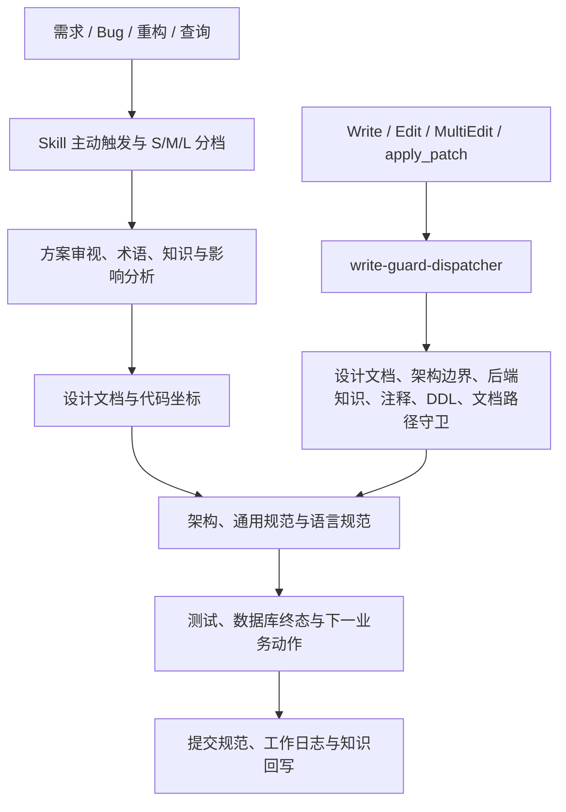
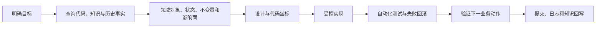

# team-standards

面向 Claude Code、Codex 和 Cursor 的团队级 AI 软件工程规范插件。它把需求分析、设计、代码定位、架构与编码、提交、验证和知识沉淀连接成一条可执行的工程链路，并用 Hook 为高风险写入提供确定性兜底。

> 本仓库回答“团队所有项目都必须遵守什么”。项目特有的编码与框架约定放在 `project-coding-profiles`，业务真理放在 `project-domain-knowledge`，跨项目连接放在 `cross-project-topology`。

## 快速导航

- [定位与边界](#定位与边界)
- [能力架构](#能力架构)
- [标准开发闭环](#标准开发闭环)
- [Skills 能力地图](#skills-能力地图)
- [Hook 硬门禁](#hook-硬门禁)
- [安装与升级](#安装与升级)
- [维护与验证](#维护与验证)

---

## 定位与边界

`team-standards` 不只是代码风格集合，而是 AI 编码的团队级控制平面。

| 负责 | 不负责 |
|---|---|
| 需求和方案是否清楚 | 某个遗留项目究竟使用 GBK 还是 UTF-8 |
| 是否先完成设计、代码定位和影响分析 | 某个 URL 对应哪个项目私有 Action/JSP |
| 分层、依赖方向、命名、错误处理和测试要求 | 某个业务字段的最终业务语义 |
| 状态/关联类需求是否完成对象规格挖掘 | 跨两个系统的真实接口连接关系 |
| 文档、提交、工作日志和知识沉淀流程 | 团队工具的安装、更新和日常运维 |

对应关系：

- 项目专属写法：`project-coding-profiles`
- 业务真理与规格候选：`project-domain-knowledge`
- 跨项目拓扑：`cross-project-topology`
- 套件编排：[yoooni-daily-plugin](https://gitee.com/wyoooni/yoooni-daily-plugin)

---

## 能力架构

插件采用“Skill 负责判断与流程、Hook 负责确定性底线”的双层结构：



架构亮点：

- **软判断与硬门禁分离**：Skill 能处理上下文和例外，Hook 只拦截客观、可机械判断的红线。
- **跨客户端统一输入**：`change-input.js` 将 Claude 写入事件与 Codex `apply_patch` 归一为 Change 列表。
- **单进程并发守卫**：`write-guard-dispatcher.js` 并发运行六条写入规则，并保持稳定输出顺序。
- **风险分档**：S/M/L 三档让小改轻量通过，状态机、字段、接口和跨模块改动进入完整链路。
- **证据驱动闭环**：状态/关联类需求不以接口成功为终点，而以业务对象终态和下一动作成功为验收标准。

---

## 标准开发闭环



典型状态类需求的门禁是：

1. 识别业务对象、状态字段、关联和不变量。
2. 规格探索先解析主项目与重构、迁移、依赖、集成项目，再查询 Graphify 静态事实、DDL、反向索引与已有领域知识。
3. 证据不足或冲突时，执行对象中心规格挖掘并保留人工评审。
4. 编码前确认事务边界、共用 Service 副作用和失败回滚。
5. 测试上游、当前动作、数据库终态和至少一个下游动作。
6. 将新增事实写回对应知识层，不把假设直接升级为稳定业务真理。

完整调用顺序见 [Skill 流程图](docs/skill-flow.md)，触发总表见 [Claude 入口](CLAUDE.md) 和 [Codex 入口](AGENTS.md)。

---

## Skills 能力地图

当前包含 33 个 Skill，按工程阶段分为九组。README 只提供地图，详细触发条件以各 `SKILL.md` 为准。

| 阶段 | Skills | 解决的问题 |
|---|---|---|
| 方案与需求 | `solution-review-required`、`design-doc-required`、`bug-doc-required`、`business-logic-orientation` | 先澄清目标、现状、方案和根因 |
| 实施前定位 | `pre-implementation-code-orientation`、`doc-index-required` | 精准找到代码坐标，避免重复扫描和重复文档 |
| 架构与编码 | `architecture-ddd-lite-fullstack`、`frontend-excellence`、`coding-standards-common`、`java-coding-standards`、`dart-coding-standards`、`llm-agent-coding-standards`、`bugfix-coding-style` | 控制分层、产品级前端体验、依赖、语言细节、LLM 边界和源码表达 |
| 设计治理 | `design-system-bootstrap`、`design-system-guardian`、`design-observer`、`design-pattern-miner`、`design-reviewer` | 初始化用户级 Registry，绑定和守护 Design Profile，从真实反馈形成 Evidence、Candidate 与视觉评审闭环 |
| 提交与日志 | `git-commit-standards`、`daily-work-log` | 形成可审查提交和连续工作记录 |
| 领域知识 | `backend-knowledge-graph-required`、`domain-spec-mining-required`、`planning-evidence-discovery`、`reverse-index-required`、`glossary-required`、`cross-project-locator` | 建立正向事实、对象规格、跨项目规划证据、反向影响、术语和拓扑索引 |
| 质量回路 | `coding-violation-log`、`arch-lint`、`comment-cleanup`、`markdown-writing-standards`、`project-docs-update` | 检测违规、清理存量问题并同步文档 |
| 项目初始化 | `init-project-docs`、`generate-project-profile` | 为新接入项目生成文档与项目画像基线 |
| 插件维护 | `dev-log` | 记录规则方向、触发链路和重大团队决策 |

其中 `domain-spec-mining-required` 是业务闭环的关键补强：它协调 Graphify、DDL、运行证据和规格候选，显式识别状态迁移、不变量、关联解除、冲突证据和下一动作。

`planning-evidence-discovery` 补齐 PRD 规划链的跨项目入口：先由 Forge 确定性解析项目关系和真实路径，再由 Agent 按关系选择业务知识、Graphify、DDL、路由、源码与拓扑；所有命中和失败进入可恢复的 `planning-evidence-trace-v2`，价值分析和工时评估复用同一轨迹。

---

## Hook 硬门禁

Hook 不替代 Skill，而是在工具写入和提交边界提供最后一道机械检查。

| 入口 | 默认规则 | 作用 |
|---|---|---|
| `Bash` | `check-git-commit-skill.js` | 小改自动放行，大改要求完成提交规范流程 |
| `Bash` | `check-commit-no-ai-signature.js` | 阻止 AI 署名或不合规提交信息进入历史 |
| `Write/Edit/MultiEdit` | `write-guard-dispatcher.js` | 统一并发运行六条写入守卫（含模块架构边界检查） |
| `UserPromptSubmit` | `prompt-signal-capture.js` | 本地记录脱敏后的疑问和纠正信号 |
| `UserPromptSubmit` | `check-plugin-version-stale.js` | 提醒本地插件版本落后 |

写入分发器包含：

- 设计文档存在性检查
- 后端知识图谱就绪检查
- 源码注释红线检查
- SQL DDL 就绪检查
- AI 文档输出位置检查

每条规则都有独立的 `TEAM_STANDARDS_*` 环境变量用于 `block`、`warn` 或 `off`。性能指标默认关闭；仅在排查时设置 `TEAM_STANDARDS_HOOK_METRICS=on`，指标不记录 Prompt、文件内容或绝对路径。

---

## 安装与升级

推荐通过 [yoooni-daily-plugin](https://gitee.com/wyoooni/yoooni-daily-plugin) 一键安装整套工具。单独安装本插件时，在 Claude Code 中执行：

```text
/plugin marketplace add https://gitee.com/wyoooni/team-standards.git
/plugin install team-standards@team-standards
/reload-plugins
```

升级：

```text
/plugin marketplace update team-standards
/plugin update team-standards@team-standards
/reload-plugins
```

仓库地址：

| 仓库 | 地址 |
|---|---|
| Gitee 主仓 | `https://gitee.com/wyoooni/team-standards.git` |
| GitHub 镜像 | `https://github.com/exception-coder/team-standards` |

---

## 维护与验证

### 发布内容结构

```text
team-standards/
├── .agents/                       # Codex marketplace
├── .claude-plugin/                # Claude marketplace
├── plugins/team-standards/
│   ├── .claude-plugin/            # Claude 插件 manifest
│   ├── .codex-plugin/             # Codex 插件 manifest
│   ├── skills/                    # 28 个 Skill
│   └── hooks/                     # 提交、写入和 Prompt 守卫
├── docs/                          # 流程、设计和决策记录
├── scripts/                       # 同步、审计、发布与工作区契约检查
├── CLAUDE.md                      # Claude 权威入口
├── AGENTS.md                      # 由 CLAUDE.md 同步生成的 Codex 入口
└── README.md
```

### 本地校验

```bash
# Hook 单测
cd plugins/team-standards/hooks && npm test

# Claude/Codex 入口同步
node scripts/sync-agents.js --check

# 跨文档引用、版本和 Skill 健康度
node scripts/check-cross-refs.js
node scripts/check-version-sync.js --verbose
node scripts/audit-skills.js --warnings --ci

# 三个 Plugin 仓库的只读发布演练
node scripts/release-team-tools.mjs --workspace .. --out <empty-temp-dir> --plugin-validator <validate_plugin.py>
```

发布前必须同步 `.claude-plugin/plugin.json`、`.claude-plugin/marketplace.json` 和 `.codex-plugin/plugin.json` 的版本。修改 `CLAUDE.md` 后必须重新生成 `AGENTS.md`；修改 Skill 触发链路后同步更新 [docs/skill-flow.md](docs/skill-flow.md)。

仅修改仓库 README 不需要重新安装插件；插件运行内容或 manifest 变化后才需要递增版本并重新加载。

CI 会比较 Git 基线：Skill、运行时 Hook、命令、Agent、App 或 MCP 载荷变化而版本未递增时阻断；测试、benchmark、README、docs 和纯发布脚本不触发发版。
