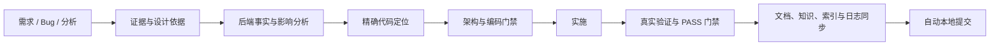

# team-standards

面向 AI 原生项目的跨项目工程治理插件。当前版本：**3.2.0**。它只保留团队层面稳定复用的分析、设计、架构、编码、文档和交付能力；项目特有的路由、脚手架、架构 lint、编码例外和系统拓扑由项目自身维护。

## 快速导航

- **理解统一流程** → [主流程](#主流程)、[Skill 流程图](docs/skill-flow.md)
- **查看能力清单** → [21 个 Skill](#21-个-skill)、[合并后的入口](#合并后的入口)
- **编码与门禁** → [编码规范叠加层级](#编码规范叠加层级)、[Hook 边界](#hook-边界)
- **未来上下文架构** → [Graphify 与 OpenSpec](#graphify-与-openspec)
- **安装和维护** → [安装](#安装)、[维护与验证](#维护与验证)、[作业完成条件](#作业完成条件)、[Bug 处理与记录](#bug-处理与记录)

---

## 主流程



详细模式与条件见 [Skill 流程图](docs/skill-flow.md)，完整触发表见 [CLAUDE.md](CLAUDE.md)。

---

## 21 个 Skill

| 类别 | Skill | 核心价值 |
|---|---|---|
| 分析设计 | `change-readiness` | 自动匹配或创建 OpenSpec change，持续更新 artifacts，并统一方案审视、风险分档和实施前代码定位 |
| 分析设计 | `bug-doc-required` | 证据驱动的 Bug 调查、最小修复与回归；简单问题不另建报告 |
| 分析设计 | `business-logic-orientation` | Graphify 优先理解当前业务逻辑，按需沉淀长期基线 |
| 分析设计 | `planning-evidence-discovery` | 跨项目 PRD 和估算的证据轨迹 |
| 架构编码 | `architecture-ddd-lite-fullstack` | 跨语言 DDD-lite 分层和依赖方向 |
| 架构编码 | `coding-standards-common` | 通用命名、结构、异常、测试与注释规则 |
| 架构编码 | `java-coding-standards` | Java 与关系数据库专属规范 |
| 架构编码 | `llm-agent-coding-standards` | LLM/Agent 信任边界和循环安全 |
| 前端设计 | `frontend-excellence` | 生产 Web 前端质量和浏览器验收 |
| 前端设计 | `design-system-bootstrap` | Design Registry/Profile 和偏好学习 |
| 前端设计 | `design-system-guardian` | UI 实施治理和视觉验收 |
| 知识文档 | `backend-evidence` | 单服务数据事实、Graphify 即时影响、领域规格与查询性能 |
| 知识文档 | `glossary-required` | 将业务术语路由到 domain knowledge，并用 Graphify 验证代码映射 |
| 知识文档 | `markdown-writing-standards` | 写前查重、Markdown/Mermaid 和写后索引 |
| 知识文档 | `init-project-docs` | 在当前目录幂等初始化 Agent、文档索引、OpenSpec、`.graphifyignore` 与 Graphify Git 共享边界，再编排上下文状态 |
| 质量反馈 | `coding-violation-log` | 记录用户纠正并防止重犯 |
| 质量反馈 | `comment-cleanup` | 经授权批量清理存量违规注释 |
| 质量反馈 | `delivery-verification` | 编码完成后调用真实验证，有限修复并以最新 PASS 放行 Done |
| 日志交付 | `daily-work-log` | 业务项目个人工作日志 |
| 日志交付 | `dev-log` | 插件决策型变更日志 |
| 日志交付 | `git-commit-standards` | 作业完成后自动提交本次范围，保留文档、验证与真实作者要求，独立判断 push |

---

## 合并后的入口

| 原独立能力 | 现在的位置 |
|---|---|
| 方案评审、实施前代码定位 | `change-readiness` 的按需参考 |
| Bug 修复编码约束 | `bug-doc-required` 修复模式 |
| 文档索引 | `markdown-writing-standards` 文档生命周期 |
| 反向影响、领域规格挖掘 | `backend-evidence` 使用 Graphify 即时查询和 domain knowledge 候选流程 |
| AI 工程目录、通用项目接入、上下文刷新、可选轻量画像 | `init-project-docs` 的 `structure/onboard/init/refresh/status/profile` 模式；初始化清单见 Skill reference，不生成 00–10 文档树与 Graphify 镜像 |

---

## 编码规范叠加层级

```text
coding-standards-common              所有源码修改的公共基线
├── java-coding-standards            Java 代码按需叠加
└── llm-agent-coding-standards       接入 LLM / Agent 时按需叠加
```

`architecture-ddd-lite-fullstack` 位于编码规范之前，负责分层和依赖方向；语言 Skill 只补充专属规则，不复制或替代 common。

---

## Hook 边界

OpenSpec 文档推进增加阶段准出、专家意见回写、概设详设和续跑交接，并提供共享治理检查器。新增检查默认 `warn` 试运行，保留原门禁；通过项目宿主验收后设置 `TEAM_STANDARDS_OPENSPEC_GOVERNANCE_HOOK=block`，按会话绑定 change 和文件范围，真实验证后记录内容指纹，写前/Stop/CI 使用同一检查结果。Stop 补齐最多两轮，退出循环仍可能未完成。详见 [治理检查器协议与当前支持边界](plugins/team-standards/skills/change-readiness/references/governance-checker.md)。

Hook 只承担可机械判断的最后一道检查，不替代 Skill 的语义决策。OpenSpec 项目要求当前会话明确选择并读取一个完整活动 change，仓库中的无关 change 或 legacy 设计文档不再自动放行；未启用 OpenSpec 的项目继续认可兼容设计文档。完成前 Hook 对可执行工作区改动要求最近一次 `forge_verify phase=all` 或项目 Forge CLI 返回 PASS，验证后再次编辑会使证据失效。后端上下文检查优先认可 Graphify 查询，图谱 manifest 早于目标文件时会显式提示或阻断。其余门禁包括架构边界、DDL、SQL 正确性风险、查询性能、注释红线和提交信息。

---

## Graphify 与 OpenSpec

- Graphify 是可再生的当前实现事实层。
- OpenSpec 是项目内已接受行为规格和活动变更的权威入口。
- Domain knowledge 保存经确认、跨变更稳定的业务真理和术语。
- `team-standards` 只负责意图路由与质量门禁，不复制图谱或建立平行规格。

项目的 OpenSpec 配置包含真实上下文后，M/L 变更由 `change-readiness` 自动匹配或创建 change，并复用 OpenSpec 官方 Skill/CLI 完成 artifacts、apply 上下文、update、verify、sync 与 archive 判定。没有相关 change 或生成 Skill 缺失不再是 legacy 降级理由；CLI 正常时继续走官方 agent 协议。Graphify 查询前还必须校验其对 HEAD 和工作区改动的新鲜度。具体职责矩阵见 [Skill 流程图](docs/skill-flow.md#graphify-与-openspec-接入边界)。

---

## 安装

Claude Code：

```text
/plugin marketplace add https://gitee.com/wyoooni/team-standards.git
/plugin install team-standards@team-standards
/reload-plugins
```

团队整套工具通过工具仓发布包或 `yoooni-daily-plugin/plugins/yoooni-daily-plugin/scripts/` 下的维护脚本安装和更新；这些命令不作为 Skill 暴露。

---

## Bug 处理与记录

`bug-doc-required` 保留调用名，职责收敛为调查与修复。简单 Bug 用诊断证据、回归测试和 commit 正文交付，不要求独立报告、固定章节、表格或 Mermaid。复杂、反复出现或高风险问题保留持久分析，优先复用已有问题记录、OpenSpec change 或项目文档，避免重复正文。

只有明确要求或确有沉淀需要且没有合适载体时，才创建独立报告；默认使用项目约定，未约定时写入 `docs/bug/` 的稳定主题文件。文档位置 Hook 放行该目录，其他新建文档路径规则保持原有边界；Hook 不判断报告是否必要或诊断是否正确。修复仍遵守实施准备、真实验证与自动提交规范。

---

## 作业完成条件

每次套件或项目更新，Agent 都必须核对并同步受影响的 README、用法、配置、Skill、规则入口和索引；文档与实现同次交付。确无文档影响时说明理由，不机械改写无关内容。中文与英文入口保持一致，生成的 AGENTS.md 从 CLAUDE.md 更新。

本次任务的验证和文档检查通过后，默认自动创建本地 commit，只提交本次作业的文件或片段，不等待下一次提醒。用户明确禁止提交、项目要求人工确认、验证失败、无改动或范围无法安全分离时，按提交规范处理并报告。自动 commit 不等于自动 push；team-standards 源码仓库保留自动推送规则，业务项目推送须有独立授权。

执行细则由 [文档同步规则](plugins/team-standards/skills/markdown-writing-standards/SKILL.md#作业交付时同步文档) 和 [提交规范](plugins/team-standards/skills/git-commit-standards/SKILL.md) 唯一维护。这是 Agent 工作流程约束，不代表已增加跨宿主强制 Hook。

---

## 维护与验证

3.2.0 增加共享契约单向同步、套件总览元数据检查和快测入口，保留 21 个 Skill、既有 warn/block 和 CI 完整回归。3.1.0 的按影响验证、日志批处理和按需细则继续生效。

`CLAUDE.md` 是 Claude/Codex 入口的单一来源，修改后运行：

```bash
node scripts/sync-agents.js
npm run test:full --prefix plugins/team-standards/hooks
node scripts/sync-agents.js --check
node scripts/check-cross-refs.js
node scripts/check-version-sync.js
node scripts/audit-skills.js --warnings --ci
```

破坏性 Skill 删除或重命名递增 Major，并同步 marketplace、Claude plugin、Codex plugin 三处版本。

日常确认输入适配、契约完整性与事件格式可用 `npm run test:fast --prefix plugins/team-standards/hooks`。它仅覆盖 8 项轻量契约测试，不覆盖 Hook 阻断、真实 Git、安装、OpenSpec 或状态场景；相关改动仍运行对应测试。`npm test` 与 `test:full` 均保持全量发现，新增测试不会默认漏入全量集合。耗时随机器变化，不以固定秒数替代验证范围。

套件维护命令从本仓根目录执行，`..` 必须确为包含各组件的 team-tools 工作区：

```bash
node scripts/sync-shared-contracts.mjs --workspace ..
node scripts/sync-shared-contracts.mjs --workspace .. --write
node scripts/check-workspace-contracts.mjs --workspace ..
node scripts/sync-workspace-overview.mjs --workspace .. --write
node scripts/check-version-sync.js --workspace ..
node --test scripts/tests/workspace-maintenance.test.mjs
```

共享路径只登记在 `scripts/shared-contracts.mjs`，team-standards 为主副本。同步默认预览，显式 `--write` 才复制；先检查全部目标，目标有未提交/已暂存改动、缺失文件或链接目录时拒绝，不自动覆盖本地工作。副本仍随插件独立分发，哈希保留作完整性检查；主副本适配器/fixture 改动后先更新经审阅的完整性元数据。消费者运行载荷发生变化仍需在对应仓库验证、升版和提交。

根 README 工具只修改组件版本、工程治理 Skill 数量与导航、公共层总数，不生成或覆盖说明正文；数据来自三个插件 manifest、实际 Skill 目录和知识服务 package.json。跨仓检查显式使用 `--workspace`，单仓 CI 不要求存在兄弟仓库；发布预检始终检查根 README。组件用途、Skill 清单和行为说明仍须人工核对。

临时日志使用仓库根 `.logs/` 或系统临时目录，禁止写到插件载荷目录或工程顶层。需要保存测试输出时，PowerShell 可执行：

```powershell
New-Item -ItemType Directory -Path .logs -Force | Out-Null
npm run test:full --prefix plugins/team-standards/hooks *> .logs/hooks-full.log
# 检查 $LASTEXITCODE；日志文件不是通过证据的替代品。
```

team-tools 根目录不是 Git 仓库，根 `.gitignore` 仅供工作区工具识别，不能约束嵌套仓库；本仓独立忽略 `.logs/`、`.tmp/` 和 `*.log`。历史根日志已归档，未删除；仓内未发现生成 replay/state-contract 根日志的固定脚本，临时命令须采用上述输出约定。


---

## 状态契约治理

从 2.6.0 起提供项目自有状态契约 Schema、源码影响检查、只读 Graphify 适配器，以及绑定当前输入的执行证据。通过 `.team-standards/state-contracts.json` 逐模块接入，既有 OpenSpec 治理入口检查已登记模块。静态检查不证明业务正确性或部署制品来源。

详见 [接入协议与 CLI](plugins/team-standards/skills/change-readiness/references/state-contract.md)。复用现有 Skill，不内置业务状态常量。
