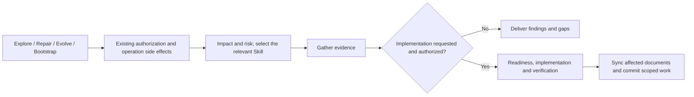

# team-standards

Cross-project engineering governance for Claude Code, Codex, and Cursor. Current version: **4.1.0**. The plugin exposes 16 user-intent-level Skills and keeps project-specific routing, scaffolding, architecture linting, and topology rules in the projects that own them.

Operational workspaces use the width and height allocated by their shell with explicit scroll ownership. Reading content may retain a readable maximum width. The [workspace viewport contract](plugins/team-standards/skills/frontend-excellence/references/quality-gates.md#workspace-viewport-contract) requires real-browser checks of tall, short and narrow viewports, live resizing, and sparse/overflowing content; it does not imply an automatic layout checker exists.

See the [suite panorama by engineering domain](docs/suite-panorama.md) for all 19 public Skills, evidence sources, hook checkpoints, maintenance tools and end-to-end task paths.

## Unified flow



The main consolidated entry points are:

- `change-readiness`: for authorized implementation, automatically matches or creates an OpenSpec change, keeps its artifacts coherent through implementation, and performs proposal review, risk classification, and code orientation. OpenSpec-enabled M/L changes cannot silently fall back to legacy design docs.
- `delivery-verification`: requires current execution evidence before completion, then routes documentation synchronization and automatic local commit.
- `bug-doc-required`: evidence-led investigation, minimal authorized fixes, and regression. Simple bugs do not require separate reports, diagrams, or fixed tables. Complex or high-risk bugs retain evidence in an existing issue, OpenSpec change, or project document; create a separate report only when needed. The existing invocation name remains compatible.
- `backend-evidence`: database/runtime truth, fresh Graphify impact queries, domain specifications, and query-performance gates; it does not maintain a parallel code index.
- `markdown-writing-standards`: document ownership, Markdown/Mermaid structure, and affected existing navigation.
- `init-project-docs`: idempotently initializes Agent entrypoints, document indexes, OpenSpec, `.graphifyignore`, and the Graphify Git sharing boundary, then routes project rules and evidence without duplicate fact projections.
- `design-system`: registry/profile initialization and evidence-based preference learning.
- `business-visualization-advisor`: business-object and lifecycle driven metrics, insights, chart selection, and dashboard information design. Management dashboards connect targets, gaps, evidence-backed breakdowns, and actionable details.
- `frontend-excellence`: UI implementation, responsive interactions, accessibility, and real-browser verification. It routes business charts to the advisor; design-system owns visual consistency. Ordinary pages do not load the full chart workflow.

See [README.md](README.md) for the complete 16-Skill catalog and [docs/skill-flow.md](docs/skill-flow.md) for routing details.

## Bug records

Prefer the existing authoritative record over duplicate reports. If an independent report is needed and no project location is defined, use a stable file under `docs/bug/`. The old document-location hook is retired; shared documents default to repository-native locations under project or user conventions. Investigation-only tasks do not modify source code or create empty commits.

## Task completion

For AI-native projects, implementation, affected documentation, and a local commit form one delivery unit. Every suite or project update includes a documentation-impact check and updates affected README language versions, usage, configuration, rules, and indexes. Record a reason when no documentation change is needed.

After current validation and documentation checks pass, automatically commit only the completed task changes, preserving unrelated work and staged content. Respect explicit no-commit or manual-confirmation instructions; report failed checks or inseparable changes, and do not create empty commits. Local commits do not authorize business-project pushes or deployment. The team-standards source repository retains its automatic-push exception. These are Agent workflow obligations, not a new cross-host enforcement hook.

See the [documentation rules](plugins/team-standards/skills/markdown-writing-standards/SKILL.md) and [commit rules](plugins/team-standards/skills/git-commit-standards/SKILL.md).

## Validation

Version 3.0.0 removed the Dart coding skill and distributes 21 Skills. Remove any project-specific invocations of the retired entrypoint.

```bash
node scripts/sync-agents.js
npm run test:full --prefix plugins/team-standards/hooks
node scripts/sync-agents.js --check
node scripts/check-cross-refs.js
node scripts/check-version-sync.js
node scripts/audit-skills.js --warnings --ci
```

## State contract governance / 状态契约治理

Version 2.6.0 adds a project-owned state contract schema, source-impact checks, a read-only Graphify adapter, and execution evidence bound to current inputs. Adopt per module through `.team-standards/state-contracts.json`; existing OpenSpec governance checks enrolled modules. Static checks do not prove business correctness or artifact provenance.

See [接入协议与 CLI](plugins/team-standards/skills/change-readiness/references/state-contract.md). No new Skill or business-specific state constants are required.

Local verification follows the change-impact table in [delivery-verification](plugins/team-standards/skills/delivery-verification/SKILL.md); Forge and full CI gates remain in force. Frequent Skills load detailed references only when needed. Git is the default work history; standalone daily logs are created only when explicitly required by the user or project. Automatic commits retain scoped staging and structured messages without repeating the full body in chat.


Version 3.2.0 adds `test:fast` (8 lightweight adapter/integrity/event tests); `npm test` and `test:full` retain full discovery. Fast checks do not replace affected integration tests. Run `node scripts/sync-shared-contracts.mjs --workspace ..` to preview canonical copies, adding `--write` to apply only when destinations are clean. Consumers remain independently packaged and versioned.

Run `node scripts/sync-workspace-overview.mjs --workspace .. --write` to update only the root README metadata, then `node scripts/check-version-sync.js --workspace ..` to verify it. Release preflight checks the overview; standalone CI needs no sibling repositories. Store temporary output in the repository-root `.logs/` or the OS temporary directory, outside plugin payloads. The non-Git workspace root's ignore file does not govern nested repositories. See [maintenance details](README.md#维护与验证).

Intent routing distinguishes Explore, Repair, Evolve and Bootstrap from authorization and risk. Choose the primary Skill by the problem, finish analysis without implicit implementation, and continue already authorized work across stages without repeated approval. Pure refactoring needs relevant regression evidence, not automatic specification exemption. See the [routing scenarios](docs/skill-flow.md#易混淆请求的预期路由).

## Minimal documentation (3.4.0)

Use existing OpenSpec artifacts, or one repository-native design when OpenSpec is not enabled. Separate coding summaries, AI reference indexes, personal Phase-A/B index registration and fixed diagram counts are no longer required. Preserve unique domain knowledge, decisions, incident reports and runbooks; update affected documentation without deleting historical assets.

The dispatcher now runs seven guards; the retired location entry remains callable without side effects. Governance keeps scenario coverage, named review, scope and verification fingerprints. Dedup/handoff records are optional, not-applicable views need reasons without duplicate chapters, and verification can reference raw result files directly. The checker does not execute tests or authenticate claimed results.

Policy/checker version 2 requires existing sessions to rebind without resetting baseline, scope or retries, then review and record valid evidence again. Old PASS records are not silently upgraded. See the [migration protocol](plugins/team-standards/skills/change-readiness/references/governance-checker.md#6-策略版本与升级).

## Go support

Version 3.5.0 adds [Go coding standards](plugins/team-standards/skills/go-coding-standards/SKILL.md) for package/interface design, errors, context, concurrency ownership, resource safety, and verification. The existing DDD-lite architecture skill now covers Go: consumer-owned ports, use-case transactions, framework-free domain behavior, and explicit adapters. Small projects need no empty layers or mandatory DI framework. Go import boundaries are not covered by the existing hooks.

## 4.0.0 migration

The distributed plugin now has 15 skills. Comment cleanup and coding feedback become common-coding modes; terminology becomes a business-orientation mode; work summaries become a commit mode. Design bootstrap and review share one design-system entry. Suite decision logging is repository-local; the Forge planning contract lives under docs/platform-integrations and is not distributed. Update old invocations using the Chinese README migration table. Existing logs and registries are preserved.
