# team-standards

Cross-project engineering governance for Claude Code, Codex, and Cursor. The plugin exposes 21 user-intent-level Skills and keeps project-specific routing, scaffolding, architecture linting, and topology rules in the projects that own them.

## Unified flow

```mermaid
flowchart LR
    INTENT["Requirement / bug / analysis"] --> EVIDENCE["Evidence and design basis"]
    EVIDENCE --> IMPACT["Backend facts and impact"]
    IMPACT --> LOCATE["Precise code orientation"]
    LOCATE --> GUARD["Architecture and coding gates"]
    GUARD --> BUILD["Implementation and verification"]
    BUILD --> WRITEBACK["Knowledge, index, and log write-back"]
    WRITEBACK --> COMMIT["Commit standard"]
```



The main consolidated entry points are:

- `change-readiness`: automatically matches or creates an OpenSpec change, keeps its artifacts coherent through implementation, and performs proposal review, risk classification, and code orientation. OpenSpec-enabled M/L changes cannot silently fall back to legacy design docs.
- `bug-doc-required`: evidence, root cause, repair contract, minimal fix, and regression.
- `backend-evidence`: database/runtime truth, fresh Graphify impact queries, domain specifications, and query-performance gates; it does not maintain a parallel code index.
- `markdown-writing-standards`: document deduplication, Markdown/Mermaid structure, and index registration.
- `init-project-docs`: initializes the standard AI project structure in the current directory, then routes project rules, Graphify, OpenSpec, and domain evidence without duplicate fact projections.
- `design-system-bootstrap`: registry/profile initialization and evidence-based preference learning.
- `design-system-guardian`: UI implementation governance and visual review.

See [README.md](README.md) for the complete 21-Skill catalog and [docs/skill-flow.md](docs/skill-flow.md) for routing details.

## Validation

```bash
node scripts/sync-agents.js
(cd hooks && npm test)
node scripts/sync-agents.js --check
node scripts/check-cross-refs.js
node scripts/check-version-sync.js
node scripts/audit-skills.js --warnings --ci
```
