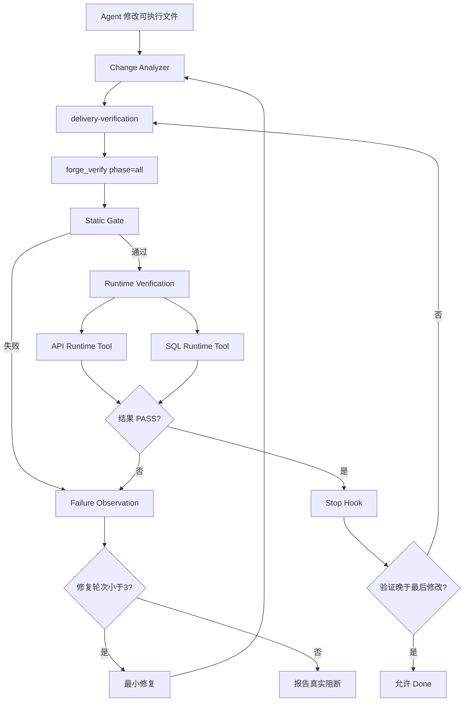

# Forge AI Coding真实验证闭环开发说明

当前 AI Coding 的主要风险不再是模型无法生成代码，而是代码生成后没有统一机制强制执行真实验证。编译成功、静态推理或模型自述都不能证明数据库、接口和业务场景真实可用。本方案在团队套件中增加完成前验证门禁，以 Forge Verification 作为确定性执行引擎，只有当前工作区获得 PASS 才允许 Done。

## 1. 首期目标

- 在编码完成、最终回复之前触发 `delivery-verification`。
- 分析当前 Git 工作区是否存在需要验证的可执行改动。
- `forge_verify` 可用时统一调用 `phase=all`。
- 复用项目 `.forge/verify.yml` 中的 SQL、API 和环境引用。
- 返回结构化失败观察，驱动最多 3 轮修复与重新验证。
- 完成前 Hook 检查验证是否发生在最后一次修改之后，并只放行 PASS。

首期不建设集中式环境控制台、不自动申请外部权限、不执行破坏性 SQL，也不实现无限自治修复。

---

## 2. 总体链路

---

## 3. 组件职责

| 组件 | 归属 | 首期职责 |
|---|---|---|
| before completion Hook | team-standards | 在 Stop 阶段检查当前会话是否具备最新 PASS 证据 |
| Change Analyzer | team-standards Hook | 取当前会话编辑记录与 Git 工作区的交集，识别源码、构建、SQL 和运行配置改动 |
| Environment Registry | 项目 `.forge/verify.yml` | 保存项目场景、URL、JDBC 地址和环境变量引用 |
| API Tool | Forge Runtime | 发起真实 HTTP 请求并验证状态与 JSON 路径 |
| SQL Tool | Forge Runtime | 真实 JDBC prepare、bind 和只读查询执行 |
| Failure Observation | Forge Report | 输出阶段、Rule、Scenario、消息和脱敏证据 |
| Auto Repair Loop | Agent Skill | 最多 3 轮最小修复和重新验证 |
| Pass-only Done | team-standards Hook | 没有最新 PASS 时阻止完成 |

团队插件不复制 Forge 的 SQL/API 执行器，Forge 也不承担 Agent 生命周期治理。

---

## 4. 触发与证据规则

需要触发的改动包括源码、构建配置、SQL、Migration、API 契约、测试和基础设施配置。纯 Markdown 文档默认不触发 Runtime。

有效证据同时满足：

1. 本轮执行过 `forge_verify`，或者在 MCP 不可用时执行项目声明的 Forge CLI。
2. MCP 调用使用 `phase=all`。
3. 结构化结果为 `status=PASSED`。
4. 验证发生在最后一次相关编辑之后。
5. 未出现在 `executedCheckers` 或 `executedVerifiers` 的能力不被宣称为通过。

Hook 支持 `TEAM_STANDARDS_DELIVERY_VERIFICATION_HOOK=off|warn|block`，默认 `block`。`warn` 仅用于接入观察期，不能作为正式交付的长期配置。

---

## 5. 失败与修复闭环

Agent 根据 `issues` 区分静态缺陷、运行缺陷、环境不可用和配置缺失，只修改当前失败所需的最小范围。每次修改后旧验证立即失效，必须重新执行完整验证。

自动修复最多 3 轮。达到上限后停止继续消耗资源，向用户交付最后一次真实失败、已尝试修复、未执行项和下一步人工动作，不伪造 Done。

---

## 6. 安全边界

- 数据库与 API 凭据只通过环境变量或既有 Secret 机制注入。
- Hook 不主动连接数据库，也不自行调用外部服务；真实执行由 Forge Runtime 完成。
- Runtime SQL 首期保持只读，不执行 DDL/DML。
- 环境不可用必须报告为真实失败或阻断，不得自动降级成 PASS。
- 完成门禁只检查当前会话证据，不把历史构建结果复用于新改动。

---

## 7. 验收标准

- 纯文档改动允许正常完成。
- 有可执行改动且没有验证证据时 Stop Hook 阻断。
- `forge_verify phase=all` 返回 PASS 且之后没有编辑时放行。
- PASS 后再次编辑时旧证据失效并阻断。
- `warn` 模式保留提示但不阻断。
- Hook、Skill、README、统一流程、版本和决策日志同步发布。
