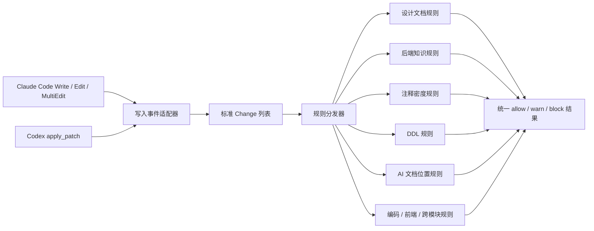
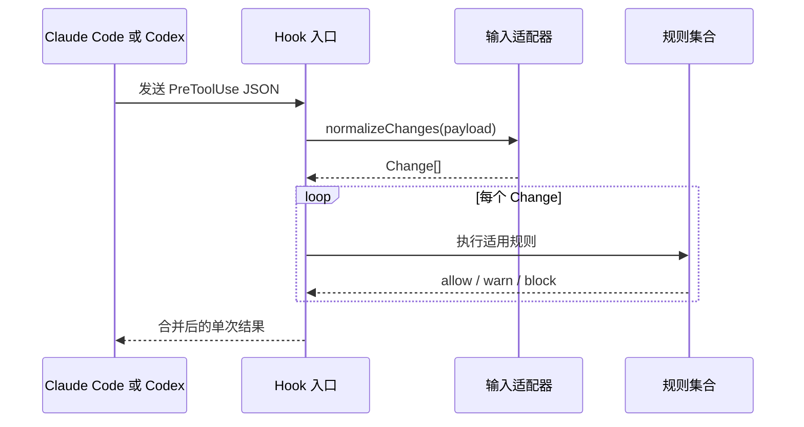
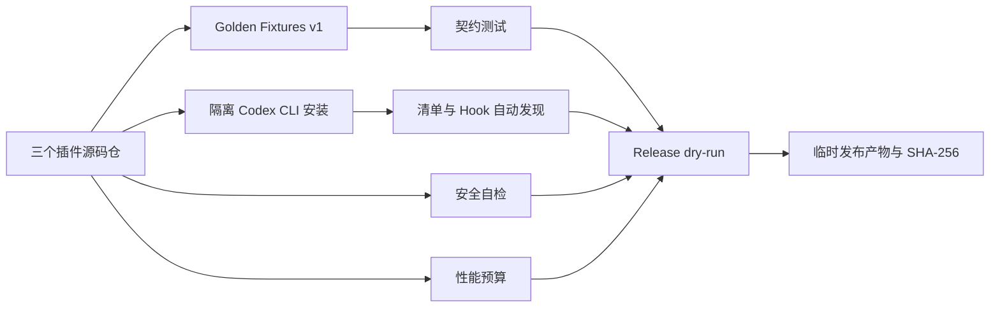
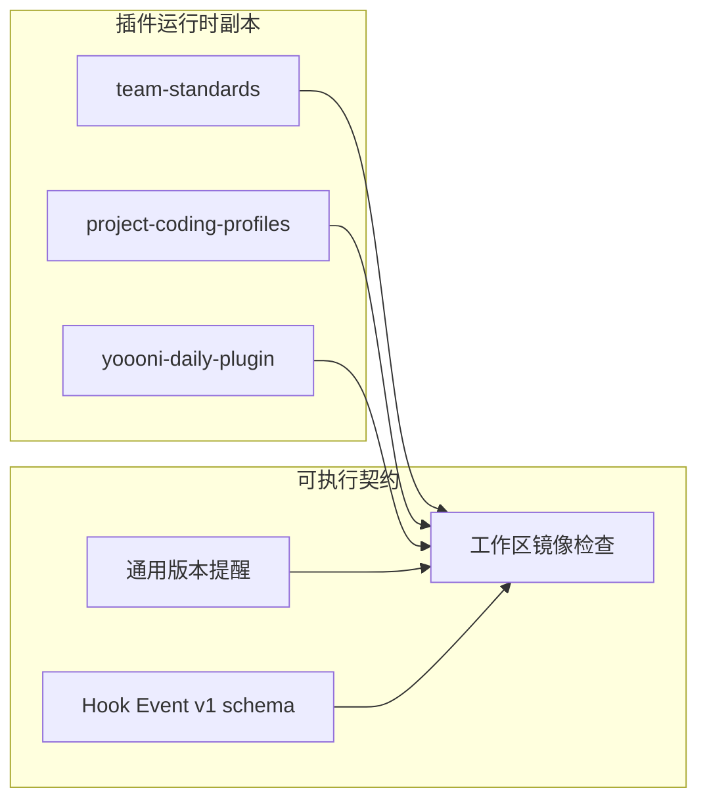
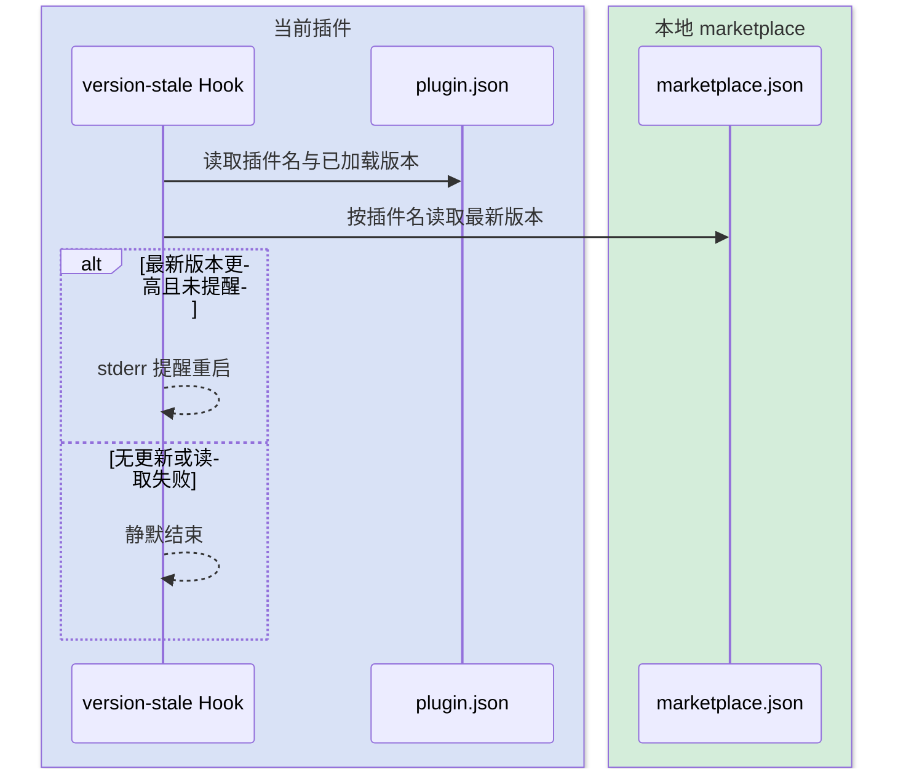
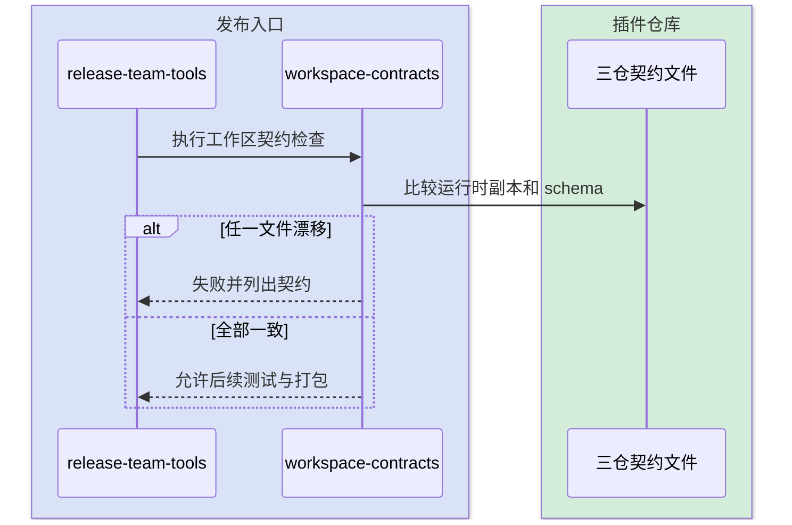
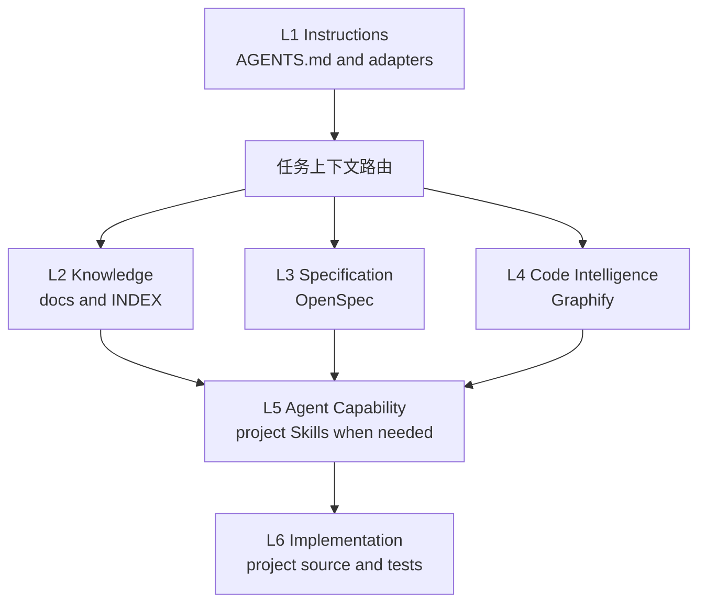
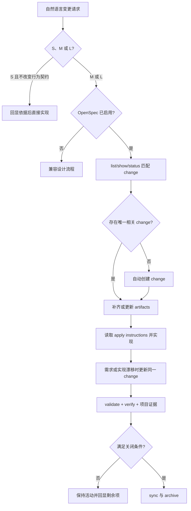

# Codex 插件可靠性加固设计

## 快速导航

- [第一轮背景与架构](#1-背景与目标)
- [第一轮实施结果](#11-实施结果)
- [第二轮目标与架构](#12-第二轮深化目标)
- [第二轮验收标准](#16-第二轮验收标准)
- [第二轮实施结果](#17-第二轮实施结果)
- [第三轮共享 Hook 契约](#19-第三轮共享-hook-契约收敛)
- [第三轮关键交互](#20-第三轮关键交互)
- [第四轮上下文门禁](#21-第四轮上下文门禁对齐)
- [第五轮 Skill 边界](#22-第五轮-skill-边界收敛)
- [第六轮事实源收敛](#23-第六轮事实源收敛)
- [第七轮项目接入轻量化](#24-第七轮项目接入轻量化)
- [第八轮 AI 工程结构初始化](#25-第八轮-ai-工程结构初始化)
- [第九轮 OpenSpec 自动生命周期](#26-第九轮-openspec-自动生命周期门禁)

## 1. 背景与目标

当前工作区包含 `team-standards`、`project-coding-profiles` 与 `yoooni-daily-plugin` 三个插件。现有写入类 Hook 主要按 Claude Code 的 `Write`、`Edit`、`MultiEdit` 输入设计；Codex 虽能通过 matcher 触发这些 Hook，但实际发送的规范工具名仍是 `apply_patch`，补丁正文位于 `tool_input.command`。这会使校验脚本被调用后因取不到 `file_path` 而静默放行。

本次优化目标如下：

1. 建立统一的写入事件适配层，让同一条规则能够处理 Claude Code 和 Codex 输入。
2. 通过契约测试覆盖新增、更新、删除、移动和多文件补丁，避免再次静默失效。
3. 将提示词采集、同步上传、生产凭据和原始日志改为安全默认值。
4. 在兼容性和安全性稳定后，再将多个 Node Hook 收敛为单进程分发，降低每次编辑的固定开销。

## 2. 范围与非目标

### 2.1 本次范围

- `team-standards` 的五个写入校验 Hook 与提示词信号采集。
- `project-coding-profiles` 的三个写入校验 Hook。
- `yoooni-daily-plugin` 的团队数据同步与生产日志查询脚本。
- 三个插件对应的测试、CI、使用文档和版本元数据。

### 2.2 非目标

- 不改变各条业务规则的判定口径。
- 不自动删除用户已有的明文凭据；迁移必须先成功加密再替换。
- 不在本轮重构跨插件公共发布包。插件必须能独立安装，因此适配器可在两个插件中保留小规模镜像实现。
- 不修改现有项目知识库内容。

## 3. 整体架构



安全链路与校验链路分开：提示词采集先脱敏和截断，默认只在本机保存；跨机器上传必须显式启用。生产日志查询从 Windows 用户级加密存储读取密码，下载内容在落盘前进行基础脱敏，并使用短期保留策略。

## 4. 模块职责

### 4.1 写入事件适配器

输入为完整 Hook JSON，输出零到多个标准变更对象：

```text
Change {
  operation: "add" | "update" | "delete" | "move",
  filePath: string,
  previousFilePath?: string,
  addedText: string,
  removedText: string
}
```

职责：

- 将相对路径按事件 `cwd` 解析为绝对路径。
- 将 Claude 的单文件写入和多段编辑转换为标准对象。
- 解析 Codex 自定义补丁中的 `Add File`、`Update File`、`Delete File`、`Move to` 段。
- 只提取新增文本供内容规则分析；删除操作保留空文本。
- 对未知或畸形输入返回空列表，不抛出导致编辑链路中断的异常。

### 4.2 规则执行层

每条现有规则只消费标准变更对象。多文件补丁必须逐项检查，并将命中信息合并为一次稳定输出。规则不得因为列表首项安全而漏检后续文件。

### 4.3 提示词信号采集

- 保存前屏蔽令牌、密码、Cookie、授权头、私钥等常见秘密。
- 限制单条文本长度，避免把大段源代码或日志当作遥测保存。
- 记录最小必要字段；不写入工作目录和会话标识。
- 上传开关由默认开启改为仅在 `YOOONI_PROMPT_SIGNAL_UPLOAD=on` 时开启。

### 4.4 生产日志查询

- 配置文件仅保存用户名、服务地址和 DPAPI `CurrentUser` 加密后的密码。
- 发现旧版明文密码时先加密，成功后原位迁移，不生成含明文的备份。
- 只允许 HTTPS 和明确的生产域名。
- 原始响应落盘前进行秘密、手机号和邮箱等基础脱敏；目录收紧 ACL，并清理过期文件。

## 5. 关键交互



## 6. 核心规则

1. 路径必须以事件 `cwd` 为基准解析，不能依赖 Hook 进程启动目录。
2. 适配器不读取目标文件内容、不写目标文件；仅为区分 Claude `Write` 的新增/覆盖语义检查路径是否存在。
3. 补丁解析以 `*** Begin Patch` 和文件段标记为边界；上下文行不计入 `addedText`。
4. 任一文件命中阻断规则时，整次操作阻断；多个提示应去重后合并。
5. 安全配置采用拒绝式默认值：未显式启用上传即不上传，未通过域名校验即不请求。
6. 兼容未知客户端字段：额外字段忽略，缺少关键字段时安全退出并允许原操作。

## 7. 编码落点

| 插件 | 位置 | 改造内容 |
|---|---|---|
| team-standards | `plugins/team-standards/hooks/change-input.js` | 新增统一输入适配器 |
| team-standards | `plugins/team-standards/hooks/check-*.js` | 改为消费 `Change[]` |
| team-standards | `plugins/team-standards/hooks/tests/` | 增加 Codex/Claude 契约与规则回归测试 |
| team-standards | `plugins/team-standards/hooks/prompt-signal-capture.js` | 脱敏、截断与数据最小化 |
| project-coding-profiles | `plugins/project-coding-profiles/hooks/change-input.js` | 独立安装所需的适配器镜像 |
| project-coding-profiles | `plugins/project-coding-profiles/hooks/check-*.js` | 改为消费 `Change[]` |
| yoooni-daily-plugin | `scripts/update-team-tools.ps1`、`.sh` | 上传显式启用 |
| yoooni-daily-plugin | `plugins/yoooni-daily-plugin/skills/yoooni-prod-log-query/query-prod-log.ps1` | 凭据加密、脱敏和保留期 |

## 8. 实施顺序

1. 新增标准变更对象和适配器契约测试。
2. 迁移八个写入 Hook，并运行现有规则测试。
3. 收紧提示词采集和跨机器上传默认值。
4. 加固生产凭据与日志文件。
5. 补齐缺失 CI、文档链接和版本一致性检查。
6. 用单个 Node 进程内的 Worker 分发器执行写入规则；以基准测试验证固定耗时下降。

## 9. 风险与回滚

- 自定义补丁语法新增变体可能无法解析。适配器对未知段安全放行并通过新增夹具迭代，不影响编辑工具本身。
- 多文件合并输出可能改变提示顺序。输出按文件路径和规则名稳定排序，便于测试与排障。
- DPAPI 绑定当前 Windows 用户，配置文件不能直接跨账号复制。脚本应给出重新录入凭据的明确提示。
- 默认关闭上传会减少团队遥测量，但这是有意的隐私边界；需要团队管理员显式配置启用。
- 每个阶段保持小提交边界；如出现回归，可按适配层、安全层、性能层独立回滚。

## 10. 验证方案

- Node 契约测试：Claude `Write/Edit/MultiEdit`，Codex add/update/delete/move/multi-file，畸形输入。
- 规则回归：对同一危险内容分别构造 Claude 与 Codex 事件，结果必须一致。
- PowerShell AST 解析与脚本级测试：旧配置迁移、错误域名拒绝、脱敏、过期文件清理。
- Shell 语法检查与上传开关测试。
- 三个插件运行 manifest 校验、版本一致性检查和各自完整测试。
- 性能基准使用固定无命中事件，比较优化前后中位数和 P95；目标是编辑 Hook 固定耗时至少下降 40%。

## 11. 实施结果

- 八个写入规则已统一消费 `Change[]`，并增加 Claude/Codex、多文件补丁端到端测试。
- 写入规则已收敛为两个分发入口；同机 8 轮无命中基准中，`team-standards` 平均从 540.4 ms 降到 175.8 ms（-67.5%），`project-coding-profiles` 从 350.4 ms 降到 154.5 ms（-55.9%）。
- 提示词采集已执行脱敏、1000 字符截断与字段最小化，上传改为显式 `on`。
- 生产日志脚本已完成 DPAPI、域名锁定、脱敏输出、ACL 与保留期加固。
- Codex 清单依赖标准 `hooks/hooks.json` 自动发现，移除了冗余清单覆盖项；三个插件均通过结构校验。
- 最终回归通过：`team-standards` 85/85、`project-coding-profiles` 5/5，20 个 JSON 文件及三个 README 本地链接全部校验成功。

## 12. 第二轮深化目标

第一轮解决运行时兼容、安全默认值和固定开销；第二轮解决长期回归、真实安装、跨仓一致性和可重复发布。目标如下：

1. 在隔离用户目录中调用真实 Codex CLI 安装本地 marketplace 插件，验证清单、缓存和 Hook 自动发现。
2. 用版本化 Golden Fixtures 约束 Claude/Codex 写入事件契约，并让两个插件消费同一份语义样例。
3. 将生产日志迁移、域名、脱敏、ACL、保留期和更新锁行为纳入自动化测试。
4. 提供默认只读的 release dry-run，统一执行版本、结构、测试、镜像和产物检查。
5. 增加默认关闭的匿名本地 Hook 耗时指标，并建立相对性能预算。
6. 对镜像适配器和契约夹具执行字节级防漂移检查，但不增加插件运行时依赖。

## 13. 第二轮架构



共享边界采用“测试契约共享、运行时代码随插件发布”的方式。`change-input.js` 继续随两个插件独立安装；工作区发布校验负责比较镜像和夹具，避免引入网络依赖或跨插件加载顺序。

## 14. 第二轮编码落点

| 能力 | 位置 | 约束 |
|---|---|---|
| 隔离安装冒烟 | 各插件 `hooks/tests/install-smoke.test.js` | 临时 `USERPROFILE`、`HOME`、`CODEX_HOME`，不得修改真实用户配置 |
| Golden Fixtures | 两个写入插件 `hooks/tests/fixtures/write-events.v1.json` | 内容和 SHA-256 必须一致 |
| 安全自检 | `query-prod-log.ps1 -SelfTest`、更新脚本自检入口 | 不访问生产网络、不读取真实凭据 |
| 发布编排 | `team-standards/scripts/release-team-tools.mjs` | 默认 dry-run；输出目录必须显式指定或使用临时目录 |
| 耗时指标 | 两个 dispatcher | 默认关闭；只记录插件、规则、耗时、退出码 |
| 防漂移 | `team-standards/scripts/check-workspace-contracts.mjs` | 只读比较，不自动覆盖对端仓库 |

## 15. 安全与失败边界

- 隔离安装测试只允许写入系统临时目录，并在清理前校验解析后的绝对路径仍位于临时目录。
- release dry-run 不修改版本、不提交、不推送；发现工作区不完整、版本不一致或测试失败时立即退出。
- 性能数据不包含 Prompt、文件内容、绝对路径、用户名、主机名或会话标识；未显式设置 `*_HOOK_METRICS=on` 时不创建文件。
- 性能门禁比较同机同轮的并发与顺序基线，采用宽松相对阈值，避免用跨机器绝对毫秒制造 CI 抖动。
- 安全自检使用合成秘密和临时配置，不允许触发登录或生产日志请求。

## 16. 第二轮验收标准

1. 三个插件均通过隔离 Codex CLI 本地 marketplace 安装，并能从安装副本发现 `hooks/hooks.json`。
2. 两个适配器通过同一版本的 Golden Fixtures，镜像文件和夹具哈希一致。
3. 生产日志自检覆盖 DPAPI、明文迁移、域名、端口、脱敏、ACL 和保留期；更新器覆盖活动锁与陈旧锁。
4. release dry-run 能统一执行三个仓库校验，并在临时目录生成清单、压缩包和 SHA-256。
5. 指标默认零落盘；显式开启后字段满足最小化约束。
6. 三个插件结构校验、完整测试、版本同步、JSON/Markdown 和 `git diff --check` 全部通过。

## 17. 第二轮实施结果

- 三个插件均已在隔离 `USERPROFILE`、`HOME`、`CODEX_HOME` 下通过真实 `codex plugin add <name>@personal --json`，安装副本的 Hook 自动发现和命令入口验证成功。
- 两个写入插件使用完全相同的 v1 Golden Fixtures；适配器、夹具和完整性元数据支持 SHA-256 本地门禁与工作区字节级比较。
- 生产日志自检已覆盖 DPAPI、旧明文迁移、严格域名与端口、脱敏、ACL 和保留期；更新器已覆盖活动、陈旧、非法 PID 锁与 abandoned Mutex。
- `release-team-tools.mjs` 已通过成功制品和缺失工作区失败测试，可生成三个 `tar.gz`、文件清单、Git 来源信息和 SHA-256。
- Hook 指标默认不创建文件，显式开启后只写五个批准字段；5 轮本机相对预算中，`team-standards` dispatcher/顺序中位数比值为 0.313，`project-coding-profiles` 为 0.446，均低于 0.95 门槛。

## 18. 运行载荷版本门禁

- 三处 manifest 相等只证明格式一致；CI 还要比较 Git 基线，运行载荷变化后版本必须严格递增。
- Plugin 载荷白名单包括 Skill、运行时 Hook、命令、Agent、App、MCP 及项目画像；README、docs、测试、benchmark 和纯发布脚本不触发发版。
- MCP 引擎载荷包括 `src/`、工具 schema、依赖锁和构建契约；知识 Markdown 不改变引擎版本，刷新 catalog 后调用 `reload_knowledge`。

## 19. 第三轮共享 Hook 契约收敛

第三轮不引入运行时共享包，继续保持三个插件可独立安装；通过相同运行时副本、版本化 schema 和工作区发布门禁消除静默漂移。



### 19.1 版本提醒

- 三个插件携带字节级一致的 `check-plugin-version-stale.js`。
- 插件名从当前 `CLAUDE_PLUGIN_ROOT/.claude-plugin/plugin.json` 推导，不维护三份常量分支。
- 通用关闭开关为 `TEAM_TOOLS_VERSION_REMINDER=off`，并兼容已有三个插件专属开关。
- marketplace 名与插件名保持一致；读取失败继续静默放行。

### 19.2 Hook Event v1

- 生产端显式构造字段，禁止调用方通过对象展开覆盖系统字段。
- daily 消费端兼容无版本历史数据，拒绝未知版本和非法字段，并输出无效记录数。
- schema 随三个插件分别分发，发布时执行三方字节比较。

### 19.3 目录与历史入口

- 删除已移除 Skill 留下的本地空目录；CI 只检测“含文件但缺少 `SKILL.md`”的可分发孤儿目录。
- 删除仍指向已移除 Skill 的 Cursor `.mdc` 规则。
- Claude 与 Codex manifest 的关键词按当前两个 daily Skill 对齐。

## 20. 第三轮关键交互

### 20.1 版本提醒解析



### 20.2 跨仓发布校验



## 21. 第四轮上下文门禁对齐

Skill 已将 OpenSpec 定义为首选设计载体、Graphify 定义为当前实现定位层后，机械 Hook 必须采用相同边界：

1. 设计依据检查认可项目内 OpenSpec，但不能只判断目录存在。配置必须包含真实 `context`，且至少一个非归档 change 同时具有 proposal、design、tasks 和 delta specs。
2. 传统 `docs/design` 与用户知识库继续作为未接入 OpenSpec 项目的兼容路径。
3. 后端上下文检查兼容历史知识卡并优先识别 Graphify 查询。历史卡只作为已有证据读取；Graphify 查询必须验证目标文件已被 manifest 覆盖且文件版本不晚于图谱。
4. Graphify 缺少 manifest、目标未索引或目标文件更新时间更新时，默认 warn；项目可通过既有 block 模式升级为硬阻断。
5. Hook 不选择“哪个 change 与本次需求相关”，也不判断业务设计质量；相关性和语义审查仍由 `change-readiness` 完成。

## 22. 第五轮 Skill 边界收敛

Graphify 与 OpenSpec 接入后，公共 Skill 只保留意图级编排和质量责任：

1. `design-doc-required` 更名为 `change-readiness`，明确它约束的是实施就绪，而不是强制自产设计文档。
2. `backend-knowledge-graph-required` 更名为 `backend-evidence`，明确 Graphify 之外仍需验证 DDL、数据库、运行证据和领域语义。
3. `init-project-docs` 不再复制 Graphify 的安装、语料检测、后端选择、抽取、聚类和导出手册；第七轮进一步取消事实投影，只保留调用、状态与新鲜度边界。
4. 项目画像不再全仓手工扫描 Entity、Service 和 Controller 建第二套索引，只消费 Graphify 并定向补证其无法证明的语义。
5. 新 Hook 名和环境变量与新职责一致；旧环境变量保留一个大版本周期的兼容读取，但不再出现在主文档和默认示例中。

## 23. 第六轮事实源收敛

第五轮完成名称和编排收敛后，`backend-evidence` 内部仍保留手工反向索引扫描器、四类索引模板和十类代码知识卡，实际仍与 Graphify/OpenSpec 构成平行事实源。本轮进一步明确：

1. 状态、字段、事件、API、读写点和调用方使用新鲜 Graphify 即时查询；图谱未覆盖时用 `git diff`、`rg` 和定向源码补证。
2. 当前变更的影响、协同项和验收写入相关 OpenSpec change，不生成长期手工反向索引。
3. 经确认且跨变更稳定的业务语义、不变量和术语进入 domain knowledge；DDL、迁移、Mapper 测试和运行记录留在各自权威系统。
4. 删除 `scan-reverse-index.js`、反向索引模板及代码知识卡模板，不再维护第二套 Entity、Service、流程、枚举和调用关系索引。
5. 工具自检必须比较工作区 manifest 与 Codex 缓存版本；只检测到缓存目录不能判定 Ready。
6. `glossary-required` 只保留术语对齐意图：稳定术语进入 domain knowledge，代码映射使用 Graphify，当前未决术语记录在 OpenSpec；删除独立候选池和 glossary 模板。

## 24. 第七轮项目接入轻量化

`init-project-docs` 虽已停止复制 Graphify 执行手册，但仍生成六份 Graphify Markdown 投影、00–10 项目说明树和三份项目画像。这些文件会在代码、Graphify、OpenSpec 与领域知识之外形成第四套需要同步的事实源。本轮收敛为：

1. 默认只输出会话内上下文状态，不创建项目说明文档树。
2. 项目自有规则归 `AGENTS.md` 或项目内 Skill；当前实现归 Graphify；目标行为归 OpenSpec；稳定业务语义归 domain knowledge。
3. `refresh` 更新权威来源本身，不再维护 `modules/api-map/data-access/impact-index` 等二次投影。
4. `profile` 仅在用户明确要求且现有入口不足时生成一份轻量 `project-profile.md` 导航，不复制业务上下文与编码规则正文。
5. `bug-doc-required` 与 `change-readiness` 改为直接按权威来源取上下文；旧 `00_project_overview.md` 只作为兼容导航读取。
6. 删除 20 份旧说明、画像和技术卡模板，保留 onboarding 状态脚本与三份编排 reference。

## 25. 第八轮 AI 工程结构初始化

Yoooni One 验证了轻量接入之后仍需要一个可重复执行的物理初始化入口，否则每个项目会以不同方式手工创建 `AGENTS.md`、文档索引、OpenSpec 和 Graphify 提交边界。本轮在 `init-project-docs` 内增加 `structure` 模式，不新增公共 Skill。

### 25.1 标准职责模型



六层是职责模型，不要求创建六个同名目录。初始化只生成能够承担真实职责的最小入口；`.codex/skills/`、领域、设计和 ADR 目录在出现实际内容时再创建，`graphify-out/` 由 Graphify 自身生成。

### 25.2 执行边界

1. 当前目录默认作为项目根，可用 `--root` 与 `--name` 覆盖。
2. `plan` 只报告；`apply` 创建缺失文件并维护 `.gitignore` 中带标记的 Graphify 共享边界；`status` 只检查。
3. 已有非托管文件一律保留，不覆盖、不搬迁；初始化结果必须明确列出 `created/preserved/updated/pending`。
4. 脚本只负责确定性骨架，不内嵌 Graphify 或 OpenSpec CLI；Skill 在脚本完成后调用各自权威工具生成和验证产物。
5. 默认共享 `graph.json`、`GRAPH_REPORT.md` 与 `manifest.json`，忽略 Graphify 缓存、memory 和本地分析文件。
6. 初始化结果必须幂等；重复执行不能制造副本、重复 `.gitignore` 规则或重写人工内容。

### 25.3 默认检索顺序

新项目的 Agent 入口统一声明：项目规则先读 `AGENTS.md`，长期知识经 `docs/INDEX.md` 路由，目标行为查询 OpenSpec，当前实现关系查询 Graphify，最后才定向读取源码。Graphify 结果在编辑前仍需用当前源码验证，OpenSpec 校验不替代实现、数据库和发布制品验证。

## 26. 第九轮 OpenSpec 自动生命周期门禁

此前 `change-readiness` 把 OpenSpec 作为优先载体，但“没有相关 change、artifacts 不完整或 CLI 不可用”会自动降级到 legacy。该策略使已接入 OpenSpec 的项目仍可能绕过规格生产，并且 Hook 只要发现任意完整活动 change 就会放行无关实现。

本轮将路由改为：



核心决策：

1. OpenSpec 项目的 M/L 变更必须使用相关 change；没有 change 时自动创建，不再以 legacy 作为默认退路。
2. 优先复用 OpenSpec 生成的 `openspec-*` Skill；缺失时使用 `list/status/instructions/new change/validate` 等结构化 CLI，不复制官方工作流实现。
3. Codex 为 Skills-only 集成，不把 `/opsx:*` 拼写写成跨宿主硬依赖。
4. 实施中发现行为、范围、失败方式或契约变化时，先使用官方 update 能力协调 existing artifacts，再继续代码修改。
5. Hook 要求 transcript 能定位到本会话实际选择的完整 change；仓库中无关 change 和 legacy 文档不能为 OpenSpec 项目放行。
6. verify 的 CRITICAL 结果、未完成任务、项目测试、DDL/数据库或发布证据缺失都会阻断团队层归档，即使 OpenSpec 自身只给出 warning。
7. 只有项目未启用 OpenSpec，或用户明确批准当前变更单次降级时，才进入 legacy；CLI/Skill 故障必须显式阻断和修复。
