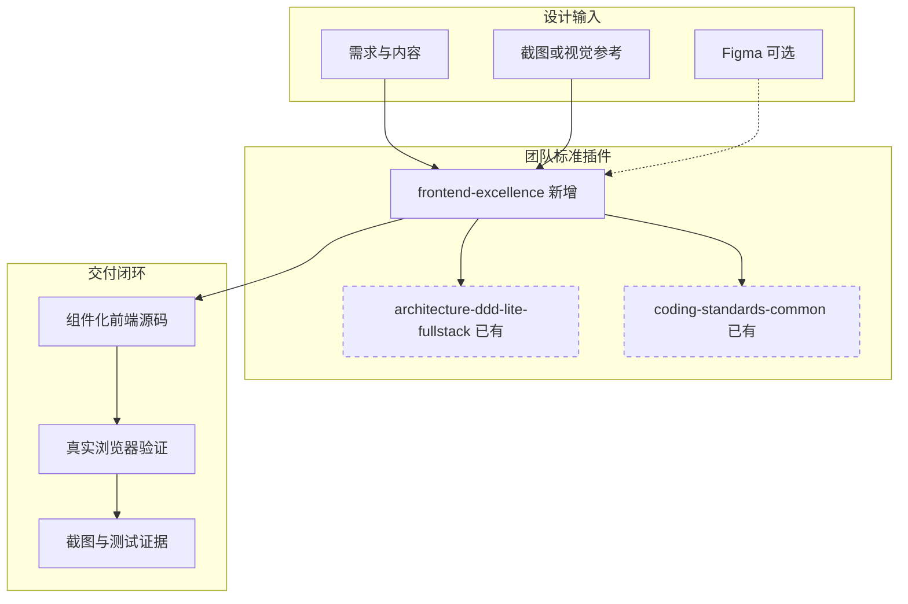
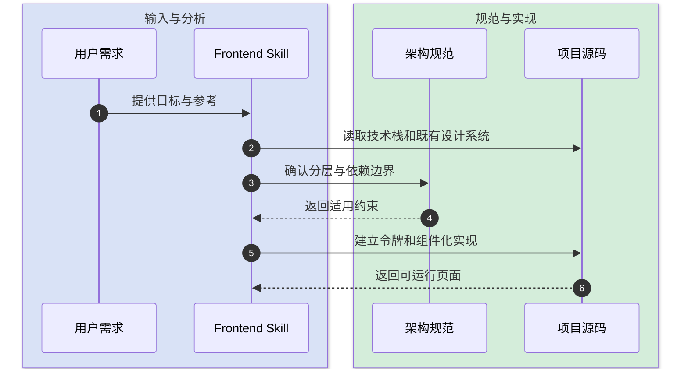
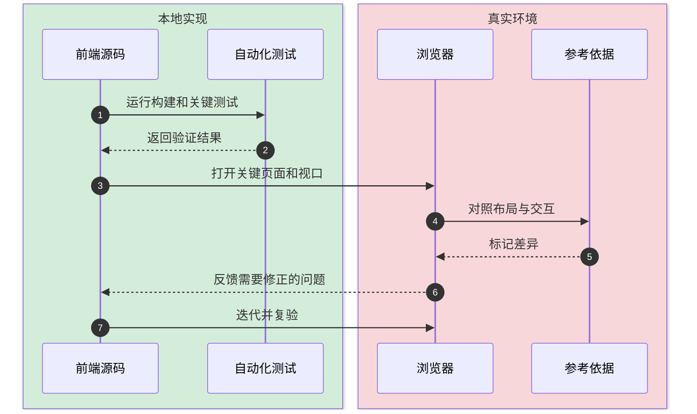
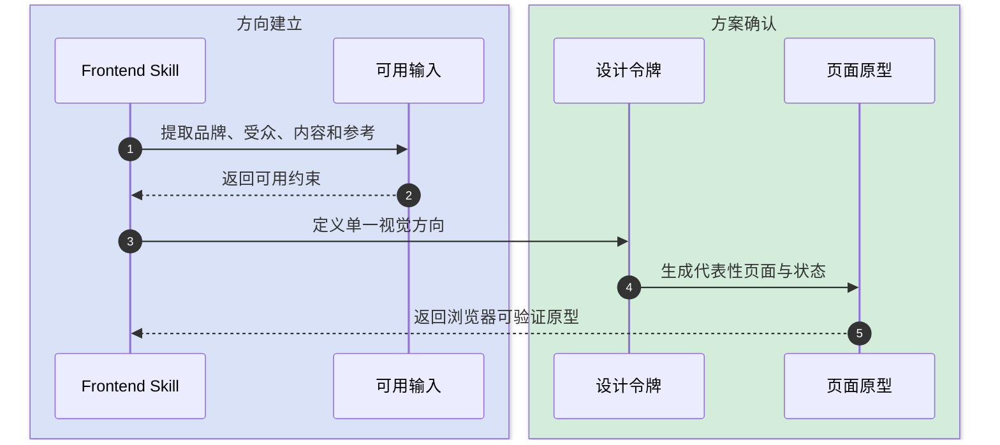

# Frontend Excellence Skill 技术设计

本文定义 `team-standards` 插件中的产品级前端工程能力。它在既有架构规范之上补齐视觉设计、设计系统、交互完整性、响应式、可访问性与真实浏览器验收，不重复维护 Feature 分层规则。

## 1. 目标与边界

- **要解决的问题**：AI 生成的前端容易停留在可运行的页面拼装，缺少稳定的视觉语言、完整交互状态和可验证的工程质量。
- **本次目标**：新增 `frontend-excellence` Skill，在创建或大幅修改 Web 前端、页面、组件库、仪表盘和落地页时自动触发，直接交付可维护的组件化源码。
- **不做什么**：不绑定单一框架；不复制 `architecture-ddd-lite-fullstack` 的 Feature 分层规则；不强制安装 Figma；不提供固定品牌模板；不替代产品需求确认。
- **设计结论**：以独立 Skill 编排“理解项目约束 → 建立视觉方向 → 设计系统化实现 → 完整状态实现 → 浏览器验证”，并按需加载架构、美学和验收参考。

## 2. 整体架构



## 3. 模块拆分与职责

### 3.1 Skill 主入口

- **定位**：判断前端任务类型并执行端到端质量工作流。
- **职责**：
  - 识别项目技术栈、既有设计系统和真实产品目标。
  - 路由架构、美学与质量参考资料。
  - 强制浏览器验证和交付证据。
- **上游**：前端创建、重做、页面设计、组件库、仪表盘、落地页等用户请求。
- **下游**：现有架构与编码 Skill、项目源码、浏览器或 Playwright。
- **关键设计点**：Figma 仅是可选输入；缺失时允许用截图、品牌材料或明确设计 brief 推进。

### 3.2 架构与状态参考

- **定位**：提供前端源码结构、状态归属和组件职责的具体准则。
- **职责**：
  - 区分路由编排、业务 Feature、领域实体和共享 UI。
  - 约束服务端状态、客户端状态、表单状态与 URL 状态归属。
  - 防止跨 Feature 内部依赖和页面巨型组件。
- **上游**：Skill 主入口。
- **下游**：项目目录和组件实现。
- **关键设计点**：只补充前端特有决策，Feature 单向依赖的规则源仍是 `architecture-ddd-lite-fullstack`。

### 3.3 设计系统与美学参考

- **定位**：把视觉方向转为可维护的设计令牌和组件规则。
- **职责**：
  - 定义字体、色彩、间距、圆角、阴影、层级和动效语言。
  - 约束组件完整状态和页面视觉层级。
  - 避免模板化渐变、无目的卡片堆叠和随机装饰。
- **上游**：Skill 主入口与设计输入。
- **下游**：tokens、基础组件和页面组合。
- **关键设计点**：视觉选择必须服务内容、品牌和任务，不以“炫技”代替信息层级。

### 3.4 质量门禁参考

- **定位**：定义可执行的完成标准。
- **职责**：
  - 覆盖响应式、键盘操作、焦点、对比度和减少动效。
  - 验证加载、空、错误、成功、禁用等状态。
  - 使用真实浏览器检查关键视口和交互路径。
- **上游**：已实现的前端源码。
- **下游**：测试、截图、构建和最终交付说明。
- **关键设计点**：不能仅以编译成功作为前端完成标准。

## 4. 关键交互

### 4.1 从需求到实现

触发：用户要求创建或显著修改前端体验。



### 4.2 从实现到视觉验收

触发：页面已能运行，准备完成交付。



### 4.3 缺少设计稿时的降级路径

触发：没有 Figma 或完整视觉稿，但用户要求直接产出高质量源码。



## 5. 核心规则

| 规则 | 说明 |
|---|---|
| 先读项目再选栈 | 已有项目复用其框架、组件库、令牌和数据模式，不平行创建第二套体系。 |
| 设计令牌优先 | 颜色、字体、间距、圆角、阴影、层级和动效必须由语义令牌表达。 |
| 组件状态完整 | 交互组件至少考虑默认、悬停、焦点、激活、禁用、加载和错误状态。 |
| 响应式是布局规则 | 不以简单缩放桌面稿代替移动端信息重排和交互调整。 |
| 可访问性内建 | 使用语义结构、键盘路径、可见焦点、合理对比度和减少动效支持。 |
| 视觉验收必做 | 至少验证桌面与移动关键视口；存在参考图时必须对照迭代。 |
| 禁止演示稿式源码 | 不用单文件 HTML、巨型页面组件、随机内联样式或假数据散落作为正式交付。 |

## 6. 编码落点

```text
plugins/team-standards/
└── skills/
    └── frontend-excellence/
        ├── SKILL.md                              [新增] 核心触发与执行工作流
        ├── agents/
        │   └── openai.yaml                      [新增] Codex UI 元数据
        └── references/
            ├── architecture-and-state.md        [新增] 前端结构与状态归属规则
            ├── design-system-and-aesthetics.md  [新增] 设计系统和视觉质量规则
            └── quality-gates.md                 [新增] 浏览器、可访问性与交付门禁

team-standards/
├── CLAUDE.md                                    [修改] 注册触发、索引和链路
├── AGENTS.md                                    [生成] 同步 Codex 入口
├── README.md                                    [修改] 登记新 Skill
├── README_en.md                                 [修改] 同步英文能力说明
├── CHANGELOG.md                                 [修改] 记录新增能力
├── docs/
│   ├── skill-flow.md                            [修改] 接入工作流
│   ├── skill-triggers.md                        [修改] 处理触发重叠
│   ├── skill-dependencies.md                    [修改] 登记依赖关系
│   └── dev-log/2026-08-13.md                    [新增] 记录决策背景
└── plugins/team-standards/
    ├── .codex-plugin/plugin.json                [修改] Minor 版本升级
    └── .claude-plugin manifests                 [修改] 同步版本
```

### 调用关系说明

- 前端需求 → `design-doc-required` → `pre-implementation-code-orientation` → `architecture-ddd-lite-fullstack` → `frontend-excellence` → `coding-standards-common` → 实现与浏览器验证。

## 7. 数据与依赖变更

| 类型 | 是否变化 | 说明 |
|---|---|---|
| 数据库表、字段、索引 | 无 | 纯插件规则能力。 |
| DTO、VO、枚举 | 无 | 不修改业务契约。 |
| 下游接口、外部依赖 | 无强制变化 | Figma、ImageGen、浏览器和 Playwright 均按环境能力选用。 |
| 缓存、消息、锁、事务 | 无 | 不适用。 |

## 8. 风险与待确认

| 风险 | 影响 | 处理方式 |
|---|---|---|
| 与架构 Skill 重复 | 规则漂移、上下文膨胀 | 新 Skill 只维护前端体验与验收，分层规则引用现有 Skill。 |
| 将某个框架写成唯一答案 | 破坏已有项目约束 | 先识别项目；只有新项目且用户未指定时才给推荐默认值。 |
| 视觉规则过度主观 | 产出风格不稳定 | 要求明确内容层级、受众、品牌线索和参考依据，并用浏览器结果校验。 |
| 强制外部插件 | 离线或未安装环境无法执行 | Figma 仅增强输入，不作为完成前置条件。 |
| 验收流程过重 | 小范围样式修复效率降低 | 按改动风险选择关键视口和路径，不要求全站截图。 |

## 9. 验证要点

- **正常路径**：新前端项目、现有页面重做、组件库建设均能正确触发并加载相关参考。
- **异常路径**：没有 Figma、没有截图或浏览器不可用时，Skill 能说明降级验证与残余风险。
- **边界条件**：纯后端、单行文案、无视觉影响的逻辑修复不得误触发。
- **回归范围**：Skill 审计、交叉引用、AGENTS 同步、三处版本同步、Hook 测试和插件安装冒烟测试。
