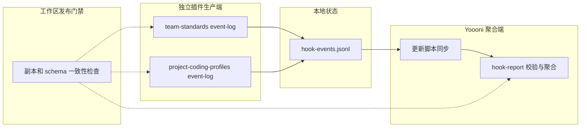
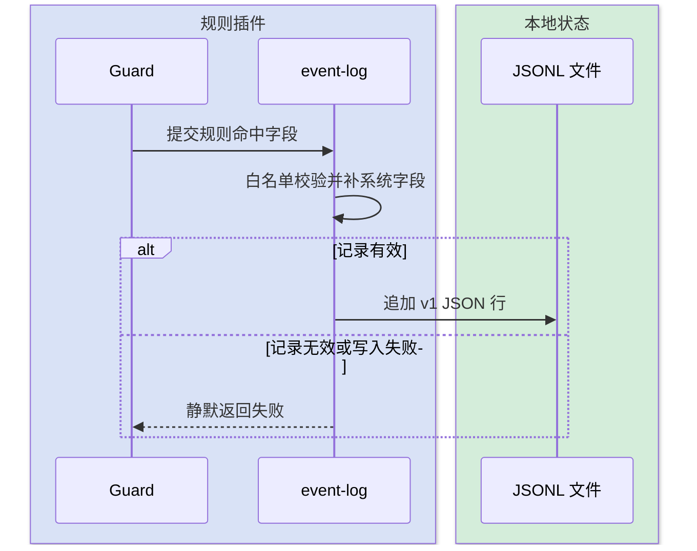
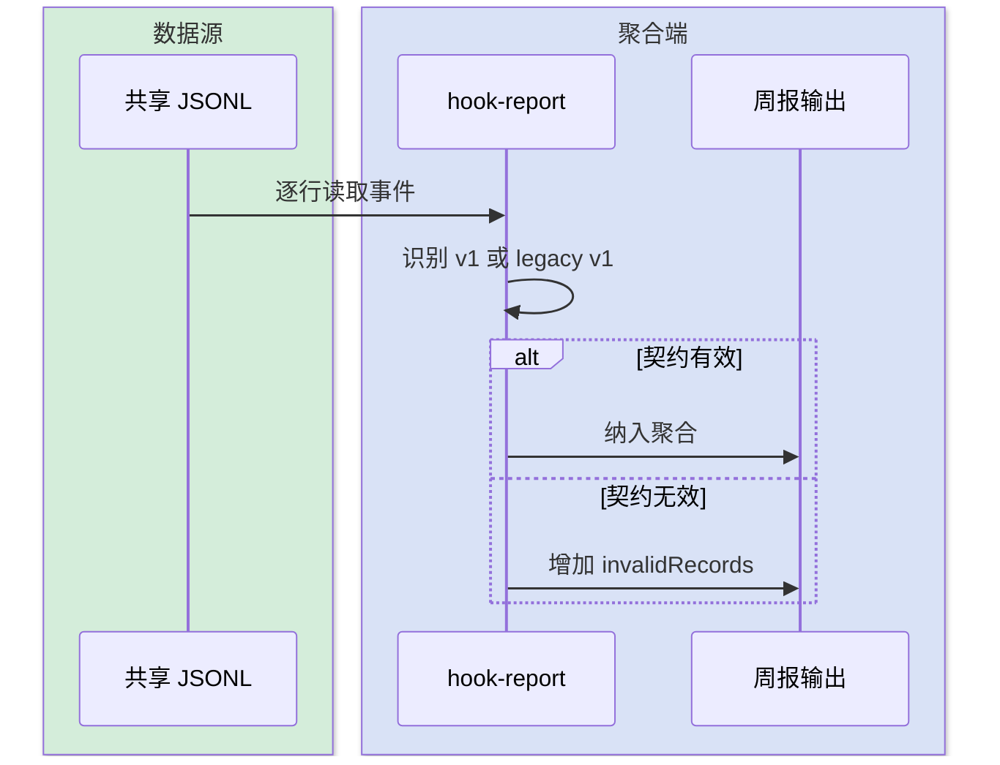

# Hook 命中事件本地登记设计

本设计定义三个独立插件共同遵守的 Hook Event v1 契约：生产端只写经过白名单规范化的本地 JSONL，daily 周报兼容读取历史无版本记录，并显式统计无效记录。

## 1. 背景与目标

warn 档 Hook 命中时把一行事件追加到本地 `~/.kai-toolbox/hook-events.jsonl`，为规则是否升级为 block、团队常见违规和误报分析提供数据。

## 2. 设计原则

- **只写本地**：Hook 热路径不访问 SMB 或网络。
- **best-effort**：登记失败不得改变放行或拦截结果。
- **无第三方依赖**：生产 helper 只使用 Node.js 内置模块。
- **独立安装、契约同源**：team-standards 与 project-coding-profiles 各自携带 `hooks/event-log.js`，不建立运行时跨插件依赖；工作区契约测试保证两个副本及 schema 一致。

## 3. 整体架构



## 4. Hook Event v1 契约

一行一条 JSON：

```json
{"schemaVersion":1,"ts":"2026-06-18T07:30:00.000Z","user":"zhang","host":"ZHANGK","plugin":"team-standards","hook":"check-sql-ddl-readiness","rule":"sql-ddl","mode":"warn","tool":"Edit","file":"D:\\\\proj\\\\X.xml"}
```

| 字段 | 含义 |
|---|---|
| `schemaVersion` | 当前固定为整数 `1`；历史缺失该字段的记录按 legacy v1 兼容读取 |
| `ts` | helper 自动生成的 ISO 8601 时间戳 |
| `user` / `host` | helper 从操作系统读取的用户与主机 |
| `plugin` | 来源插件 |
| `hook` | Hook 文件名 |
| `rule` | 规则短名 |
| `mode` | `warn` 或 `block` |
| `tool` | 触发工具 |
| `file` | 目标文件路径 |

### 4.1 生产端约束

1. `schemaVersion`、`ts`、`user`、`host` 由 helper 生成，调用方不得覆盖。
2. `plugin`、`hook`、`rule`、`tool`、`file` 必须是非空字符串，`mode` 只能是 `warn` 或 `block`。
3. helper 只写白名单字段；输入无效或落盘失败时返回失败并保持静默，不改变 Hook 判定。
4. schema 文件随三个独立插件分发，并由工作区契约检查保证字节一致。

### 4.2 消费端兼容规则

1. `schemaVersion: 1` 按 v1 校验。
2. 缺少 `schemaVersion` 的历史记录按 legacy v1 校验。
3. 未知版本、非法时间、非法模式或缺少必填字段的记录不参与统计，并计入 `invalidRecords`。
4. 文本输出展示跳过数量；JSON 输出包含 `invalidRecords`，避免数据质量问题静默发生。

## 5. 关键交互

### 5.1 事件写入



### 5.2 周报读取



## 6. 接入与下游

- team-standards 当前由 `check-sql-ddl-readiness`、`check-backend-evidence-readiness` 和 `check-query-performance-risk` 生产事件。
- project-coding-profiles 当前由编码、前端控件和跨模块耦合规则生产事件。
- daily 更新脚本把本地 JSONL best-effort 同步到 `\\IT01\版本更新\vibecoding`。
- `yoooni-hook-report` 只读共享目录并聚合。

通用规则插件不感知公司内网，daily 插件不参与生产端 Hook 判定。

## 7. 验证要点

- 两份 `event-log.js` 和三份 schema 通过工作区字节级一致性检查。
- 合成事件验证系统字段不可被调用方覆盖，非法模式和缺失字段不落盘。
- 周报同时读取 v1、legacy v1、未知版本和坏行，只聚合前两类并准确报告跳过数量。
- 三个插件仍可在隔离环境独立安装，不依赖兄弟插件路径。
