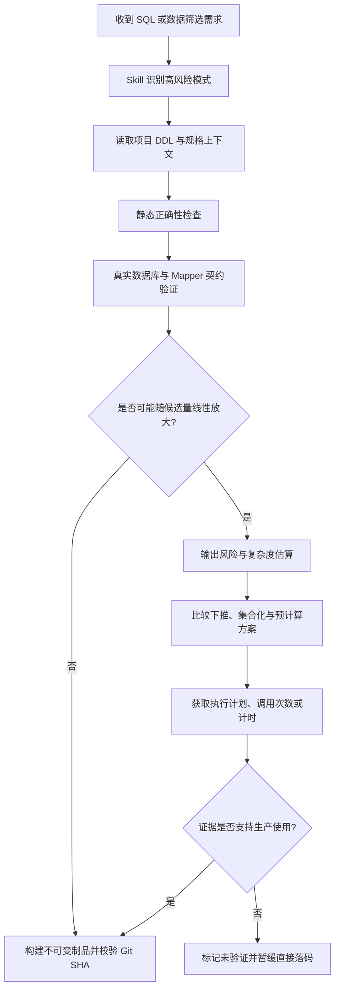

# SQL 正确性与性能门禁设计

## 快速导航

- **了解边界** → [目标与边界](#1-目标与边界)、[整体架构](#2-整体架构)
- **查看规则** → [模块职责](#3-模块职责)、[核心规则](#4-核心规则)
- **实施与验收** → [验证证据](#5-验证证据)、[编码落点](#6-编码落点)、[验收标准](#8-验收标准)

---

## 1. 目标与边界

在 AI 编写或修改 SQL、Mapper、DAO 和 Repository 时，先验证 Schema 与名称解析等正确性，再识别复杂度随候选数据量或逐项查询次数增长的性能风险，最后确认修复代码进入实际发布制品。

本设计覆盖：

- 多表字段歧义、通配投影、派生表输出和结果映射风险。
- 动态 SQL 分支、目标数据库方言与 Mapper 契约验证。
- 无界统计、低选择性聚合和大范围候选扫描。
- 计算结果筛选、应用层过滤后分页、批次遍历全部候选。
- 循环调用 DAO、Mapper 或 Repository 造成的 N+1 与跨表扇出。
- 高风险查询的执行计划、调用次数和真实请求计时证据。
- Maven 构建输出与部署制品的 Git SHA 一致性。

不把全表扫描一律判错。小表、离线任务、受控导出或经证据确认可接受的扫描可以保留，但必须记录数据边界、调用频率和保护措施。

---

## 2. 整体架构

语义判断由 `backend-evidence` 承担；语言规范补充不可直接落码的反模式；项目 CI 负责真实数据库和 Mapper 验证；Hook 只对客观文本信号做软提醒。

---

## 3. 模块职责

### 3.1 后端知识图谱门禁

- 识别无界聚合、派生筛选、应用层分页和 N+1。
- 要求估算候选量、批次数、单候选查询数和最坏 SQL 调用数。
- 在落码前给出数据库下推、集合查询、预计算或有界异步方案。

### 3.2 SQL 正确性门禁

- 统一规则位于 `references/sql-correctness-gate.md`，覆盖多数据源字段限定、显式投影、派生表输出、动态 SQL 和结果映射。
- `check-sql-correctness-risk.js` 只检查本次新增文本中的高置信度风险信号，不连接数据库、不扫描整个项目。
- 项目 CI 使用匹配版本的真实数据库和 Mapper 参数生成最终 SQL；解析、名称解析、方言或映射失败时阻断。

### 3.3 SQL 性能风险 Hook

- 检查本次新增内容中的明显无界聚合、集合加载后内存分页和循环数据访问。
- 始终软提醒，不因启发式命中硬阻断。
- 支持独立 `TEAM_STANDARDS_SQL_PERF_HOOK=warn|off` 开关并登记本地命中事件。

### 3.4 设计与语言规则

- 高风险查询至少进入轻量设计，不得因改动行数少走极简档。
- SQL 相关设计记录数据规模、调用频率、复杂度公式、备选方案和验证结果。
- Java 关系库规则明确禁止无说明地分页前过滤、循环逐条查询和加载全量后统计。

---

## 4. 核心规则

正确性规则：

1. 一个查询块引用两个或更多数据源时，所有实体字段必须使用表别名限定。
2. 多数据源查询禁止 `SELECT *`、`table.*` 和派生表透传 `*`。
3. CTE、子查询和派生表显式声明输出列；结果标签唯一并与 Mapper / DTO 契约一致。
4. 动态 SQL 覆盖所有会改变结构的有效分支，不能只检查 XML 原文。
5. Graphify 提供当前实现位置，OpenSpec 提供已接受行为与变更意图，真实 DDL 和数据库解析才是 Schema 与 SQL 正确性的最终证据。

性能规则：

高风险模式命中任一项即暂停直接实现：

1. 先分页取候选，再因计算结果过滤，为凑满一页持续向后扫描。
2. 以固定批次遍历全部候选，每个对象执行一组跨表查询。
3. 在循环或 Stream 中调用 DAO、Mapper 或 Repository。
4. 为 `count`、`exists` 或汇总加载完整明细到应用层。
5. 跨库或跨服务结果在应用层连接，且没有明确上限。
6. 无时间、租户、组织或主键范围的聚合、去重、排序查询可能作用于持续增长表。

风险回显至少包含：候选规模、批次大小、每候选查询数、最坏 SQL 次数、主要瓶颈和推荐方案。优先顺序是数据库原生过滤分页、集合化聚合或批量查询、持久化派生字段或预计算、受控异步任务，最后才是带硬上限和超时的应用层扫描。

---

## 5. 验证证据

高风险查询落码前优先取得：

- 目标数据库对最终 SQL 的解析或 `EXPLAIN` 结果。
- Mapper 动态分支和结果映射测试。
- 真实请求端到端耗时和超时边界。
- 每类 SQL 的调用次数、累计耗时和最大单次耗时。
- 估算行数与实际行数、循环次数、全扫、排序、临时空间和回表情况。
- 代表性数据规模下的返回条数和分页稳定性。

Oracle 优先读取真实游标计划，例如 `DBMS_XPLAN.DISPLAY_CURSOR(..., 'ALLSTATS LAST')`；MySQL 8.0.18+ 可在安全只读环境使用 `EXPLAIN ANALYZE`。会实际执行语句的分析方式不得直接用于不可控写语句或高负载生产请求。

无法连接可信环境时，明确标记“性能未验证”，给出验证命令和风险，不把方案描述为生产可用。

发布阶段使用干净工作区构建一次，测试和部署复用同一个不可变制品。可以缓存 Maven 依赖，但不得复用项目 `target/`；期望 Git SHA、制品 SHA 和运行实例 SHA 必须一致。

---

## 6. 编码落点

| 文件 | 改动 |
|---|---|
| `skills/backend-evidence/SKILL.md` | 增加高风险查询触发与硬门禁入口 |
| `skills/backend-evidence/references/sql-correctness-gate.md` | 承载 SQL 正确性、项目 CI 和制品一致性规则 |
| `skills/backend-evidence/references/query-performance-gate.md` | 承载识别、优化和证据流程 |
| `skills/backend-evidence/rules/card-templates.md` | SQL 查询卡增加规模与计划证据 |
| `skills/java-coding-standards/SKILL.md` | 增加应用层过滤分页和 N+1 禁令 |
| `skills/change-readiness/references/classification.md` | 高风险查询不得走极简档 |
| `skills/change-readiness/lightweight-template.md` | 增加条件式查询性能检查表 |
| `hooks/check-query-performance-risk.js` | 新增软告警 Hook |
| `hooks/check-sql-correctness-risk.js` | 检查多表裸字段和通配投影等编辑期风险 |
| `hooks/tests/check-query-performance-risk.test.js` | 覆盖命中、放行和关闭场景 |
| `hooks/tests/check-sql-correctness-risk.test.js` | 覆盖字段歧义、显式限定和通配投影场景 |

---

## 7. 风险与回滚

- 启发式可能误报，因此 Hook 不提供 block 模式；语义判断仍由 Skill 完成。
- Hook 不能穷举 MyBatis 动态分支，也不能证明 Schema 和方言正确；项目 CI 必须保留真实数据库与 Mapper 契约测试。
- 不要求所有 SQL 执行真实分析，只要求高风险查询优先取证；无环境时允许显式降级。
- 新 Hook 可通过独立环境变量关闭；Skill 规则可单独回滚，不影响现有 DDL 校验。

---

## 8. 验收标准

- 场景中的“500 条批次遍历全部候选 + 每款七节点查询 + Java 过滤分页”必须触发 Skill 强告警。
- `SELECT m.id, develop_id FROM milestone m JOIN latest ...` 必须提示未限定字段；改为 `m.develop_id` 后放行。
- 多数据源 `SELECT *` 或 `table.*` 必须提示显式投影。
- 明确受主键限制的普通查询不触发 Hook。
- 无界聚合、循环数据访问、集合加载后内存分页至少各有一个 Hook 测试。
- Hook 命中只返回 exit 0；`off` 完全静默。
- Skill 审计、Hook 测试、交叉引用、AGENTS 同步和版本同步全部通过。
