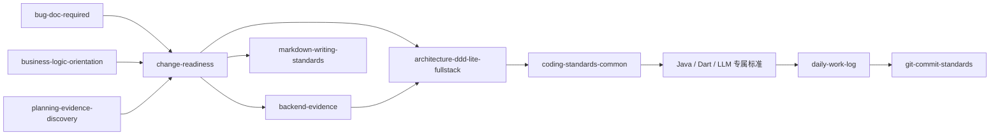

# Skill 依赖与模式

## 主依赖

## 依赖表

| Skill | 前置 | 后续 / 叠加 |
|---|---|---|
| `change-readiness` | 用户意图与可用项目证据 | 架构、后端事实或编码标准 |
| `bug-doc-required` | Bug 现象与可验证证据 | 需要修复时进入设计与编码链 |
| `business-logic-orientation` | 现有代码和业务场景 | 重构设计 |
| `planning-evidence-discovery` | 项目范围解析 | 规划输出或设计 |
| `backend-evidence` | 已识别服务边界 | 即时影响分析、领域规格或实施验证 |
| `markdown-writing-standards` | 已确定文档归属 | 写后索引登记 |
| `architecture-ddd-lite-fullstack` | 设计和代码坐标 | common 与语言规范 |
| `coding-standards-common` | 架构边界 | Java、Dart 或 LLM 专属规范 |
| `frontend-excellence` | 有意义的 Web UI 工作 | `design-system-guardian` 与浏览器验收 |
| `design-system-bootstrap` | 明确初始化或偏好证据 | `design-system-guardian` 消费 Profile |
| `init-project-docs` | 当前项目根和 Git/工作区状态 | structure 建最小入口；onboard/init/refresh/status 编排 Graphify、OpenSpec 与领域证据 |
| `daily-work-log` | 业务源码变化 | commit 前收尾 |
| `git-commit-standards` | 已验证改动 | commit |

## 规则

- 同一 Skill 的多个模式可以在同一链路中先后执行。
- S 档可缩短设计文档，但不能跳过通用编码标准。
- 状态、字段、事件、API 或数据模型变化必须进入后端事实与影响模式。
- 跨项目契约和项目专属规则由拥有它们的仓库维护。
- Graphify 作为当前实现事实适配器，OpenSpec 作为行为规格与变更制品；Skill 编排两者但不复制其产物。项目启用 OpenSpec 后，设计入口复用对应 change；项目接入也不再生成 Graphify Markdown 镜像或 00–10 文档树。
