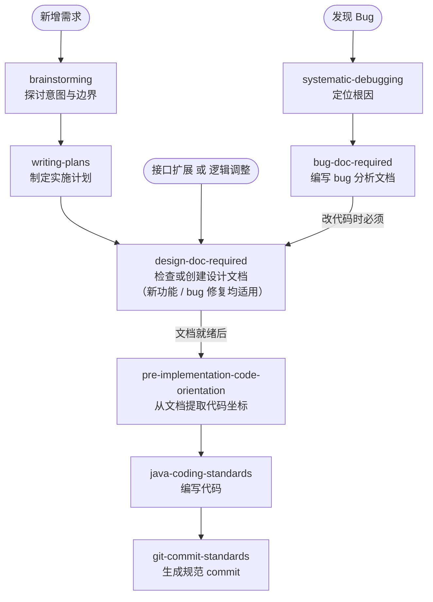
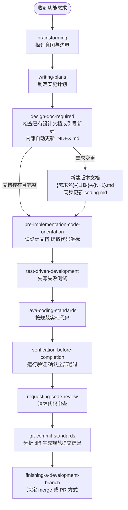
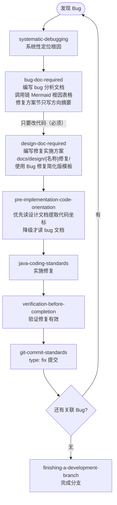
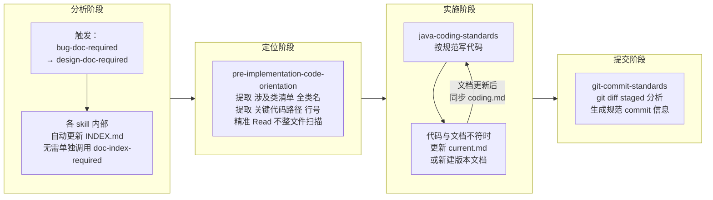

# Skill 链路全景图

> 本文档梳理 team-standards 与 superpowers 各 skill 的触发时机、调用关系及两条主链路，用于解决"该调哪个 skill、顺序是什么"的疑惑。
>
> **版本：2026-04-02 v2**
> 变更摘要：bug 修复链路改为必须经过 design-doc-required（不再有条件分支）；doc-index-required 降为辅助步骤（嵌入其他 skill 中，不再作为独立节点出现在主链路上）。
> 当前版本：`docs/skill-flow.md`

---

## Skill 总览

| Skill 名称 | 来源 | 触发时机 |
|---|---|---|
| `brainstorming` | superpowers | 任何功能创建、组件构建、行为改动前 |
| `writing-plans` | superpowers | 有 spec 或需求时，制定多步实施计划 |
| `systematic-debugging` | superpowers | 遇到 bug、测试失败、异常行为时 |
| `design-doc-required` | team-standards | 写任何实现代码前，或被要求提供修复方案/实施方案时（新功能和 bug 修复均适用） |
| `doc-index-required` | team-standards | **(辅助)** 写 docs/ 文档后自动更新索引，已嵌入 bug-doc / design-doc 流程，**无需单独调用** |
| `bug-doc-required` | team-standards | 编写 bug 分析文档时；完成后必须继续调用 design-doc-required 写修复实施方案 |
| `pre-implementation-code-orientation` | team-standards | 文档写完后、开始实施代码前 |
| `java-coding-standards` | team-standards | 编写或修改任何 Java 代码时（自动应用） |
| `test-driven-development` | superpowers | 实现功能或 bugfix 前（先写测试） |
| `verification-before-completion` | superpowers | 声明工作完成、提交或建 PR 前 |
| `requesting-code-review` | superpowers | 完成实现后请求代码审查 |
| `git-commit-standards` | team-standards | 执行 git commit 前 |
| `finishing-a-development-branch` | superpowers | 分支实现完成、决定如何集成时 |

---

## Skill 调用关系图

三类入口，汇入同一条实施链路：

---

## 功能开发完整链路

---

## Bug 修复完整链路

> **关键变更（v2）：** 原链路在"纯修复"时可绕过 design-doc-required。新链路**移除该分支**：只要 bug 需要改代码，design-doc-required 必须执行。bug 文档负责"分析清楚问题"，设计文档负责"规划清楚怎么改"，二者各有职责，不可合并。

---

## 文档-索引-coding 子循环详解

这是最容易混淆的部分，拆解如下：

### 各文档类型与用途

| 文件名格式 | 何时创建 | 谁来读 | 可否修改 |
|---|---|---|---|
| `{需求}-{日期}-v{N}.md` | 需求确定时 | 人 | 禁止，变更须新建版本 |
| `{需求}-{日期}-v{N}-coding.md` | 读完设计文档后自动生成 | AI（节省 token） | 随设计文档版本同步 |
| `{需求}-current.md` | 代码上线稳定后 | AI 优先读取 | 随代码演进直接覆盖 |
| `docs/bug/{名称}/{名称}.md` | 确认 bug 根因后 | 人 + AI 分析阶段 | 可补充，修复方案节只写方向摘要 |
| `docs/design/{名称}修复/{名称}修复-vN.md` | bug 分析完成后 | AI 实施阶段 | 禁止修改已有版本，变更须新建 |
| `docs/{subdir}/INDEX.md` | 首个文档创建时 | doc-index-required 读取 | 随文档新增自动追加 |

---

## 常见困惑速查

| 困惑 | 答案 |
|---|---|
| 需要单独调用 doc-index-required 吗? | 不需要，已嵌入 bug-doc-required 和 design-doc-required 内部，自动更新 INDEX |
| pre-implementation-code-orientation 什么时候调? | 两份文档（bug 分析 + 设计文档）都写完后、敲第一行代码前 |
| pre-implementation-code-orientation 读哪份文档? | 优先读设计文档（coding.md），没有则降级读 bug 文档的涉及类清单 |
| 需求变更时改原设计文档还是新建? | 新建版本文档（禁止改原文），design-doc-required 第五步有引导流程 |
| coding.md 和 current.md 有什么区别? | coding.md 是版本快照的精简摘要；current.md 是当前代码的终版描述，随代码直接覆盖 |
| Bug 修复需要调 design-doc-required 吗? | **必须**。只要 bug 需要改代码，就必须有设计文档。bug 文档负责分析，设计文档负责实施方案，两者职责不同不可省略。bug 修复可用简化版模板（仅 8 节）。 |
| bug 文档的修复方案节写什么? | 仅写方向摘要（每级一句话），加设计文档路径指引。详细实施细节写进设计文档。 |
