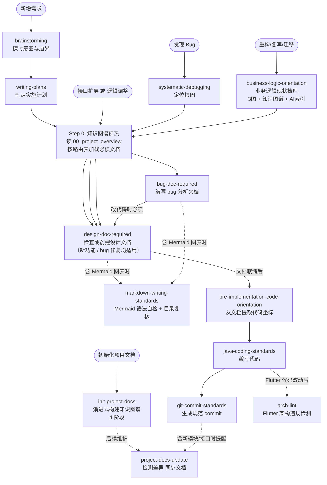
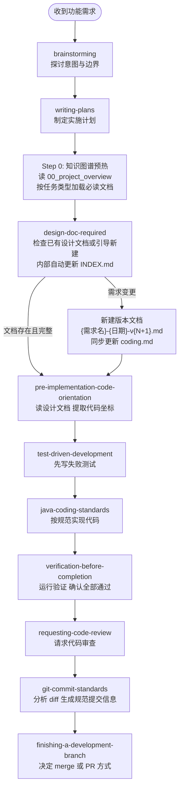
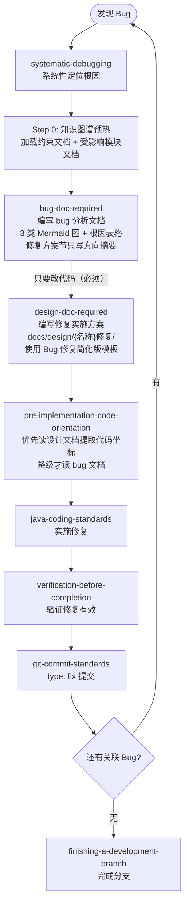
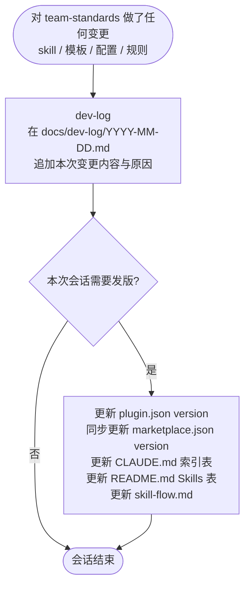
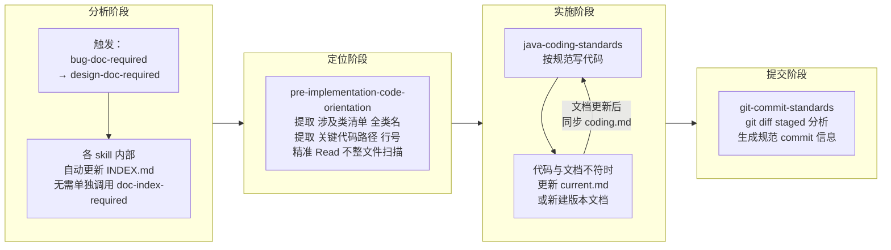

# Skill 链路全景图

> 本文档梳理 team-standards 与 superpowers 各 skill 的触发时机、调用关系及两条主链路，用于解决"该调哪个 skill、顺序是什么"的疑惑。
>
> **最后更新：2026-04-18 v6.2**
> 变更摘要：`bug-doc-required` 调整目录结构为三级（`docs/bug/{模块名}/{bug名称}/`），命名由英文 kebab-case 改为中文，与 `docs/design/` 模块命名对齐；未对应任何 design 模块的 bug 退化为一级扁平结构。流程节点无变化,仅目录与命名规则细化。
> 上一版：v6.1 `design-doc-required` 和 `bug-doc-required` 新增 Step 0（知识图谱上下文预热）。
> 再上一版：v6 新增 `project-docs-update`、`arch-lint`；`init-project-docs` 升级为 4 阶段。
> 历史版本：`docs/skill-flow-20260416-v6.md`（v6）、`docs/skill-flow-20260410-v5.1.md`（v5.1）、`docs/skill-flow-20260404-v4.md`（v4）、`docs/skill-flow-20260403-v3.md`（v3）、`docs/skill-flow-20260402-v2.md`（v2）

---

## Skill 总览

| Skill 名称 | 来源 | 触发时机 |
|---|---|---|
| `brainstorming` | superpowers | 任何功能创建、组件构建、行为改动前 |
| `writing-plans` | superpowers | 有 spec 或需求时，制定多步实施计划 |
| `systematic-debugging` | superpowers | 遇到 bug、测试失败、异常行为时 |
| `design-doc-required` | team-standards | 写任何实现代码前，或被要求提供修复方案/实施方案时（新功能和 bug 修复均适用）；**任何源码 Edit/Write 请求（含「根据文档改代码」「帮我改一下」等）也必须先触发** |
| `doc-index-required` | team-standards | **(辅助)** 写 docs/ 文档后自动更新索引，已嵌入 bug-doc / design-doc 流程，**无需单独调用** |
| `bug-doc-required` | team-standards | 编写 bug 分析文档时；完成后必须继续调用 design-doc-required 写修复实施方案 |
| `pre-implementation-code-orientation` | team-standards | 文档写完后、开始实施代码前（含「帮我修改代码」「改代码」等直接编码请求） |
| `java-coding-standards` | team-standards | 编写或修改任何 Java 代码时（自动应用） |
| `test-driven-development` | superpowers | 实现功能或 bugfix 前（先写测试） |
| `verification-before-completion` | superpowers | 声明工作完成、提交或建 PR 前 |
| `requesting-code-review` | superpowers | 完成实现后请求代码审查 |
| `git-commit-standards` | team-standards | 执行 git commit 前 |
| `finishing-a-development-branch` | superpowers | 分支实现完成、决定如何集成时 |
| `dev-log` | team-standards | 对 team-standards 有任何变更（skill/配置/模板修改）后、本次会话结束前 |
| `markdown-writing-standards` | team-standards | 生成或修改包含 Mermaid 图表的 Markdown 内容；完成 Markdown 文件的结构性写入/重组后做目录复核（自动应用，与 java-coding-standards 同级） |
| `business-logic-orientation` | team-standards | 重构/复写/迁移前需要理解现有业务逻辑时（产出梳理文档 + AI 速查索引） |
| `init-project-docs` | team-standards | 要求初始化/生成知识图谱/分析项目文档时（4 阶段渐进式构建，独立分析类 skill） |
| `generate-project-profile` | team-standards | 要求生成项目画像时（独立分析类 skill，生成 AI Agent 消费的 10 维度 Markdown） |
| `coding-violation-log` | team-standards | 用户纠正 AI 编码错误时登记违规；编码前回顾已登记记录防重犯（嵌入编码链路，java-coding-standards 之前） |
| `project-docs-update` | team-standards | 项目代码结构变更后同步知识图谱文档（检测差异 + 自动/确认更新） |
| `arch-lint` | team-standards | Flutter 架构违规检测（5 条分层规则，全量/轻量两种模式） |

---

## Skill 调用关系图

三类入口，汇入同一条实施链路：

---

## 功能开发完整链路

---

## Bug 修复完整链路

> **关键变更（v2）：** 原链路在"纯修复"时可绕过 design-doc-required。新链路**移除该分支**：只要 bug 需要改代码，design-doc-required 必须执行。bug 文档负责"分析清楚问题"，设计文档负责"规划清楚怎么改"，二者各有职责，不可合并。

---

## team-standards 维护链路

> 仅在**修改 team-standards 插件本身**时触发（修改 skill、模板、配置等）。与业务开发链路无关。

> **触发判断：** 只要在本次会话中创建、修改、删除了 `skills/` 下任意文件，或调整了 `CLAUDE.md` 规则，即必须在会话结束前调用 `dev-log`。

---

## 文档-索引-coding 子循环详解

这是最容易混淆的部分，拆解如下：

### 各文档类型与用途

| 文件名格式 | 何时创建 | 谁来读 | 可否修改 |
|---|---|---|---|
| `{需求}-{日期}-v{N}.md` | 需求确定时 | 人 | 禁止，变更须新建版本 |
| `{需求}-{日期}-v{N}-coding.md` | 读完设计文档后自动生成 | AI（节省 token） | 随设计文档版本同步 |
| `{需求}-current.md` | 代码上线稳定后 | AI 优先读取 | 随代码演进直接覆盖 |
| `docs/bug/{名称}/{名称}.md` | 确认 bug 根因后 | 人 + AI 分析阶段 | 可补充，修复方案节只写方向摘要 |
| `docs/design/{名称}修复/{名称}修复-vN.md` | bug 分析完成后 | AI 实施阶段 | 禁止修改已有版本，变更须新建 |
| `docs/{subdir}/INDEX.md` | 首个文档创建时 | doc-index-required 读取 | 随文档新增自动追加 |
| `docs/dev-log/YYYY-MM-DD.md` | team-standards 有变更时 | 人（追溯变更历史） | 当天可追加，禁止修改历史日期文件 |

---

## 常见困惑速查

| 困惑 | 答案 |
|---|---|
| 需要单独调用 doc-index-required 吗? | 不需要，已嵌入 bug-doc-required 和 design-doc-required 内部，自动更新 INDEX |
| pre-implementation-code-orientation 什么时候调? | 两份文档（bug 分析 + 设计文档）都写完后、敲第一行代码前 |
| pre-implementation-code-orientation 读哪份文档? | 优先读设计文档（coding.md），没有则降级读 bug 文档的涉及类清单 |
| 需求变更时改原设计文档还是新建? | 新建版本文档（禁止改原文），design-doc-required 第五步有引导流程 |
| coding.md 和 current.md 有什么区别? | coding.md 是版本快照的精简摘要；current.md 是当前代码的终版描述，随代码直接覆盖 |
| Bug 修复需要调 design-doc-required 吗? | **必须**。只要 bug 需要改代码，就必须有设计文档。bug 文档负责分析，设计文档负责实施方案，两者职责不同不可省略。bug 修复可用简化版模板（仅 8 节）。 |
| bug 文档的修复方案节写什么? | 仅写方向摘要（每级一句话），加设计文档路径指引。详细实施细节写进设计文档。 |
| dev-log 什么时候调? | 在对 team-standards 做了任何变更（skill/模板/配置）的会话结束前必须调用，记录改了什么、为什么改。 |
| dev-log 和 git-commit-standards 有什么区别? | git-commit-standards 生成 commit 提交信息（面向 git 历史）；dev-log 记录变更背景与决策原因（面向人工追溯），两者均需执行。 |
| init-project-docs 什么时候调? | 仅在明确要求"初始化项目文档"或"分析项目能力"时调用，是独立的分析类 skill，不属于功能开发或 bug 修复链路。 |
| markdown-writing-standards 和 design-doc-required 的 Mermaid 章节什么关系? | design-doc-required 规定「必须画哪些图」（功能模块图、能力分解图等），markdown-writing-standards 规定「图怎么画不出错」（语法规则、自检清单）。前者定义 what，后者定义 how。 |
| 写 Mermaid 时需要显式调用 markdown-writing-standards 吗? | 自动应用，与 java-coding-standards 同级。只要检测到要写 Mermaid 代码块，规则自动生效。 |
| business-logic-orientation 和 design-doc-required 的区别? | business-logic-orientation 梳理**现有代码的现状**（是什么），design-doc-required 规划**要改成什么样**（怎么改）。重构场景先梳理现状，再写设计文档。 |
| AI 速查索引和 coding.md 有什么区别? | AI 速查索引是对**现有代码**的紧凑索引（文件/方法/调用链/表操作），coding.md 是对**设计方案**的编码摘要（接口契约/类清单/业务规则）。前者面向理解，后者面向实施。 |
| init-project-docs 的 4 个 Phase 必须全部执行吗? | 不必须。Phase 1-2 是核心（全自动），Phase 3-4 可选。可以只运行 Phase 1-2 快速建立基础知识图谱，后续按需补充。 |
| project-docs-update 和 init-project-docs 的区别? | init-project-docs 是**从零构建**知识图谱（首次使用），project-docs-update 是**增量维护**（代码变更后同步文档）。前者生成，后者更新。 |
| arch-lint 和 java-coding-standards 的区别? | arch-lint 检测 **Flutter 架构分层**违规（presentation 层写 SQL 等跨层问题），java-coding-standards 检测 **Java 代码**质量（命名/格式/异常处理等）。一个管分层，一个管编码。 |
| Phase 3-4 的自动模式和确认模式怎么选? | 自动模式：AI 尽力推断后生成，标注"需人工校验"，适合快速产出初稿。确认模式：逐份展示等用户确认，适合对准确度要求高的场景。 |
| Step 0 知识图谱预热是什么? | 在 design-doc-required / bug-doc-required 执行前，先读 `00_project_overview.md` 获取全局索引，再按 AI 上下文路由表加载当前任务类型对应的 2-3 份文档。避免全量扫码，按需获取上下文。 |
| 项目没有知识图谱时 Step 0 怎么办? | 自动跳过。Step 0 检测 `docs/00_project_overview.md` 不存在时直接进入后续流程，完全向后兼容。 |
