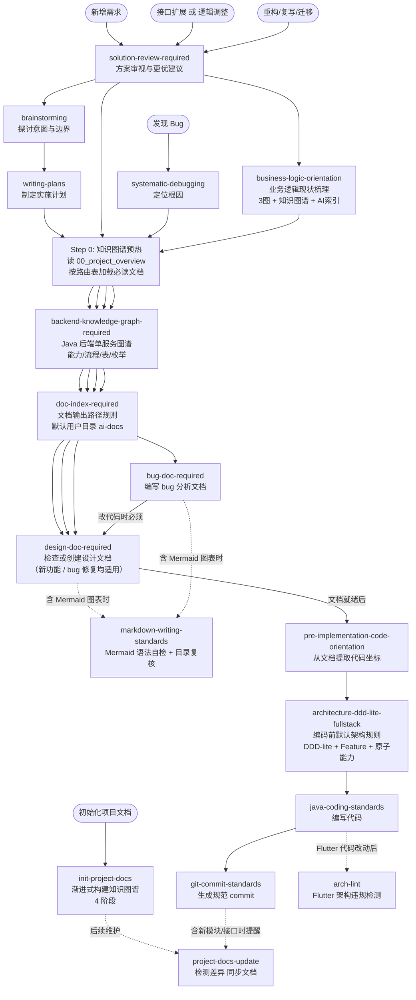
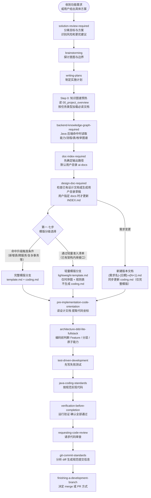
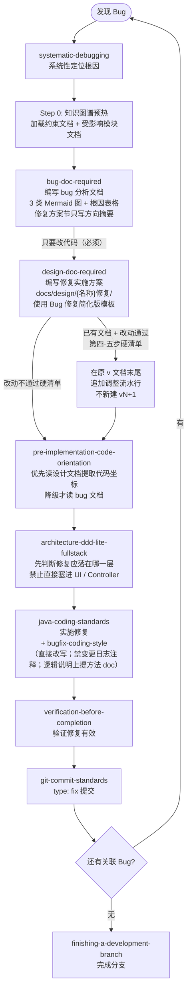
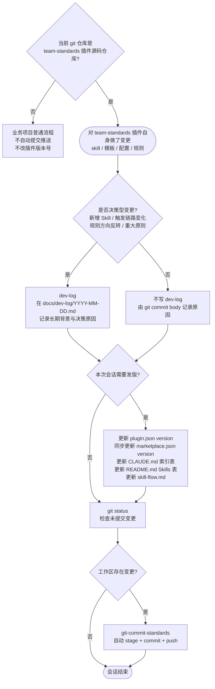
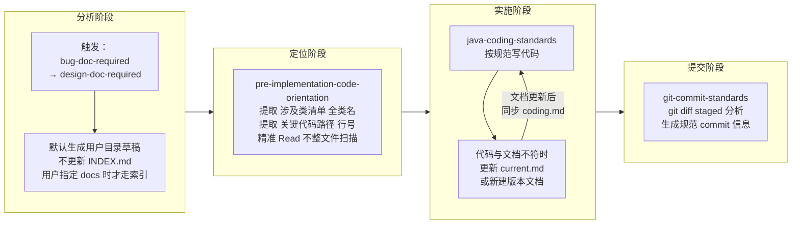

# Skill 链路全景图

> 本文档梳理 team-standards 与 superpowers 各 skill 的触发时机、调用关系及两条主链路，用于解决"该调哪个 skill、顺序是什么"的疑惑。
>
> **最后更新：2026-05-01 v17**
> 变更摘要 v17：`dev-log` 触发范围收窄为“决策型变更” —— git commit body 作为默认变更日志，普通小改、措辞同步、版本号递增不再写 `docs/dev-log/`；仅新增/删除 Skill、触发时机或核心行为变化、规则方向反转、跨 Skill 链路变化、重大团队原则沉淀等需要长期追溯背景的变更才写 dev-log。team-standards 维护链路新增 dev-log 判定分支，属于链路节点结构变化，创建 v17 快照。
> 变更摘要 v16.7：`solution-review-required` 增强反迎合与现有代码质量审视规则 —— 当用户要求按现有代码、云端逻辑、类似文件或具体方案直接实现时，AI 必须先分离目标与候选方案，评估现有代码是否值得参考；低质量旧结构只能作为事实材料提取业务规则，不能作为新实现模板扩散；风险明显时必须主动给出更优建议。该变更只补强节点文字与 FAQ，链路节点结构未变，按"轻微"处理未单独创建快照。
> 变更摘要 v16.6：`bugfix-coding-style` 方向反转 —— 之前的 A 类（`[DEPRECATED YYYY-MM-DD]` + 注释保留旧代码）/ B 类（`[ADDED YYYY-MM-DD]` 头注释）规则全部废止；改为禁止把变更历史写进源码（`[BUGFIX]` / 日期标记 / PR 引用 / 注释保留旧代码全部禁止），变更原因归 git log / commit message / bug 文档，源码内只保留对当下读者有价值的 WHY 注释且优先上提到方法 / 类 doc comment；适用范围扩展到所有源码改动（不限联调期）；遇到旧 `[DEPRECATED]` / `[ADDED]` 标记可在改同段代码时顺手清理。FAQ 中的相关问答同步调整（规则方向反转，但流程节点结构未变，按"轻微"处理未单独创建快照）。
> 变更摘要 v16.5：`korepos-backend-service` 新增「外部调用前的边界兜底校验」健壮性硬规则 —— service 调云端 HTTP / 跨子门面 / POS 硬件协议前，凡传给对方的金额/数量/配额等业务数值，若本地 DB 有可查的上限/边界，必须用 DB 实读值兜底校验，不信任入参或前序内存对象；校验抽 `_assertXxxWithinBound` 私有方法；金额比较加 ±0.005 浮点容差。Step 5 强制规则、自检清单、禁区表均同步追加（轻微规则补充，未单独创建快照）。
> 变更摘要 v16.4：`daily-work-log` 默认输出路径切换到用户文档目录 `{USER_DOCUMENTS}/ai-docs/{project}/work-log/{YYYY-MM-DD}.md`，与 `bug-doc-required` / `design-doc-required` / `doc-index-required` 完全对齐；项目内 `docs/work-log/` 与 `.gitignore` 兜底节降级为"用户明确指定路径"分支（轻微规则补充，未单独创建快照）。
> 变更摘要 v16.3：`bug-doc-required` 默认输出路径切换到用户文档目录 `{USER_DOCUMENTS}/ai-docs/{project}/{agent}/{YYYY-MM-DD}/`，与 `design-doc-required` / `doc-index-required` 一致；项目内 `docs/bug/` 降级为"用户明确指定路径或上传终版"分支；流程图分叉、红色警告与"各文档类型与用途"表同步调整（轻微规则补充，未单独创建快照）。
> 上一版：v16.7（2026-05-01，轻微规则补充未单独创建快照）；v16.6（2026-04-30，轻微规则补充未单独创建快照）；v16.5（2026-04-30，轻微规则补充未单独创建快照）；v16.4（2026-04-30，轻微规则补充未单独创建快照）；v16.3（2026-04-30，轻微规则补充未单独创建快照）；v16.2（2026-04-27）；v16.1（2026-04-27）；v16（2026-04-27，轻微规则补充未单独创建快照）。
> 再上一版：v15（2026-04-27）；v14（2026-04-27）；v13（2026-04-27）；v12（2026-04-27）；v11（2026-04-27）；v10（2026-04-27）；v9（2026-04-26）；v8（2026-04-25）；v7（2026-04-22）；v6.2 `bug-doc-required` 调整目录结构为三级；v6.1 新增 Step 0 知识图谱预热。
> 历史版本：`docs/skill-flow-20260501-v17.md`（v17）、`docs/skill-flow-20260427-v15.md`（v15）、`docs/skill-flow-20260427-v14.md`（v14）、`docs/skill-flow-20260427-v13.md`（v13）、`docs/skill-flow-20260427-v12.md`（v12）、`docs/skill-flow-20260427-v11.md`（v11）、`docs/skill-flow-20260427-v10.md`（v10）、`docs/skill-flow-20260427-v9.md`（v9）、`docs/skill-flow-20260425-v8.md`（v8）、`docs/skill-flow-20260422-v7.md`（v7）、`docs/skill-flow-20260416-v6.md`（v6）、`docs/skill-flow-20260410-v5.1.md`（v5.1）、`docs/skill-flow-20260404-v4.md`（v4）、`docs/skill-flow-20260403-v3.md`（v3）、`docs/skill-flow-20260402-v2.md`（v2）

---

## 快速导航

- **看触发时机** → [Skill 总览](#skill-总览)
- **看完整链路** → [Skill 调用关系图](#skill-调用关系图) / [功能开发完整链路](#功能开发完整链路) / [Bug 修复完整链路](#bug-修复完整链路)
- **看维护规则** → [team-standards 维护链路](#team-standards-维护链路) / [文档-索引-coding 子循环详解](#文档-索引-coding-子循环详解)
- **查常见问题** → [常见困惑速查](#常见困惑速查)

---

## Skill 总览

| Skill 名称 | 来源 | 触发时机 |
|---|---|---|
| `brainstorming` | superpowers | 任何功能创建、组件构建、行为改动前 |
| `writing-plans` | superpowers | 有 spec 或需求时，制定多步实施计划 |
| `systematic-debugging` | superpowers | 遇到 bug、测试失败、异常行为时 |
| `solution-review-required` | team-standards | 用户提出具体想法/方案并要求实施，或要求按某个回复、目录策略、架构路径、现有代码直接改时，先审视目标、现有代码质量、风险和更优方案 |
| `design-doc-required` | team-standards | 写任何实现代码前，或被要求提供修复方案/实施方案时（新功能和 bug 修复均适用）；**任何源码 Edit/Write 请求（含「根据文档改代码」「帮我改一下」等）也必须先触发** |
| `doc-index-required` | team-standards | **(辅助)** 创建任何 Markdown 文档前先确定输出路径；AI 生成 Markdown 默认写用户 Documents 下的 `ai-docs/{project}/`，仅用户指定 `docs/` 路径时更新索引 |
| `backend-knowledge-graph-required` | team-standards | Java 后端单服务需求分析前读取 `docs/knowledge-graph/backend/`；生成/更新后端图谱；会话事实自动候选沉淀，确认或代码验证后整理进正式图谱 |
| `bug-doc-required` | team-standards | 编写 bug 分析文档时；完成后必须继续调用 design-doc-required 写修复实施方案 |
| `pre-implementation-code-orientation` | team-standards | 文档写完后、开始实施代码前（含「帮我修改代码」「改代码」等直接编码请求） |
| `architecture-ddd-lite-fullstack` | team-standards | 编写或审查 Java / React / Vue / Flutter 业务代码前；在实施前代码定位后，先判断 Feature、分层、单向依赖与原子能力 |
| `java-coding-standards` | team-standards | 编写或修改任何 Java 代码时（自动应用） |
| `test-driven-development` | superpowers | 实现功能或 bugfix 前（先写测试） |
| `verification-before-completion` | superpowers | 声明工作完成、提交或建 PR 前 |
| `requesting-code-review` | superpowers | 完成实现后请求代码审查 |
| `git-commit-standards` | team-standards | 执行 git commit / push 前；仅在当前仓库就是 team-standards 插件源码仓库且插件自身变更完成后自动 stage、commit、push |
| `finishing-a-development-branch` | superpowers | 分支实现完成、决定如何集成时 |
| `dev-log` | team-standards | 对 team-standards 做决策型变更后：新增/删除 Skill、触发时机或核心行为变化、规则方向反转、跨 Skill 链路变化、重大团队原则沉淀；普通小改只写 commit body |
| `markdown-writing-standards` | team-standards | 生成或修改包含 Mermaid 图表的 Markdown 内容；完成 Markdown 文件的结构性写入/重组后做目录复核（自动应用，与 java-coding-standards 同级） |
| `business-logic-orientation` | team-standards | 重构/复写/迁移前需要理解现有业务逻辑时（产出梳理文档 + AI 速查索引） |
| `init-project-docs` | team-standards | 要求初始化/生成知识图谱/分析项目文档时（4 阶段渐进式构建，独立分析类 skill） |
| `generate-project-profile` | team-standards | 要求生成项目画像时（独立分析类 skill，生成 AI Agent 消费的 10 维度 Markdown） |
| `coding-violation-log` | team-standards | 用户纠正 AI 编码错误时登记违规；编码前回顾已登记记录防重犯（嵌入编码链路，java-coding-standards 之前） |
| `project-docs-update` | team-standards | 项目代码结构变更后同步知识图谱文档（检测差异 + 自动/确认更新） |
| `arch-lint` | team-standards | Flutter 架构违规检测（5 条分层规则，全量/轻量两种模式） |
| `bugfix-coding-style` | team-standards | bug 修复 / 任何源码改动的注释规范（v1.17 起方向反转）：禁止变更历史/日期标记/PR 引用/注释保留旧代码进入源码；变更原因归 git log + bug 文档；源码内只保留 WHY 注释且优先上提到方法 doc comment |

---

## Skill 调用关系图

三类入口，汇入同一条实施链路：

---

## 功能开发完整链路

---

## Bug 修复完整链路

> **关键变更（v2）：** 原链路在"纯修复"时可绕过 design-doc-required。新链路**移除该分支**：只要 bug 需要改代码，design-doc-required 必须执行。bug 文档负责"分析清楚问题"，设计文档负责"规划清楚怎么改"，二者各有职责，不可合并。

---

## team-standards 维护链路

> 仅在**修改 team-standards 插件本身**时触发（修改 skill、模板、配置等）。与业务开发链路无关。

> **触发判断：** 只有当前 git 仓库就是 `team-standards` / `kpay-team-standards` 插件源码仓库，且在本次会话中创建、修改、删除了 `skills/` 下任意文件，或调整了 `CLAUDE.md`、`AGENTS.md`、插件元数据、README、skill-flow 等插件自身规则，才进入本维护链路。
>
> **自动提交判断：** 只要 team-standards 插件源码仓库变更完成且 `git status --short` 非空，必须立即按 `git-commit-standards` 自动提交并 push，避免多轮变更累计到一个大提交。业务项目即使安装本 plugin，也不自动 commit/push、不自动改版本号。用户明确要求暂不提交或暂不 push 时除外。

---

## 文档-索引-coding 子循环详解

这是最容易混淆的部分，拆解如下：

### 各文档类型与用途

| 文件名格式 | 何时创建 | 谁来读 | 可否修改 |
|---|---|---|---|
| `{需求}-{日期}-v{N}.md` | 需求确定时 | 人 | 禁止，变更须新建版本 |
| `{需求}-{日期}-v{N}-coding.md` | 读完设计文档后自动生成 | AI（节省 token） | 随设计文档版本同步 |
| `{需求}-current.md` | 代码上线稳定后 | AI 优先读取 | 随代码演进直接覆盖 |
| `{USER_DOCUMENTS}/ai-docs/{project}/{agent}/{YYYY-MM-DD}/{bug 名称}-bug分析-{YYYYMMDD}-v{N}.md` | 确认 bug 根因后（**默认**） | 人 + AI 分析阶段 | 可补充，修复方案节只写方向摘要；终版由用户上传 |
| `docs/bug/{名称}/{名称}.md` | 用户明确要求"上传终版 / 写到 docs/" 时 | 人 + AI 分析阶段 | 可补充；写入项目时按模块分组 + 触发 doc-index-required |
| `docs/design/{名称}修复/{名称}修复-vN.md` | bug 分析完成后 | AI 实施阶段 | 禁止修改已有版本，变更须新建 |
| `docs/{subdir}/INDEX.md` | 首个文档创建时 | doc-index-required 读取 | 随文档新增自动追加 |
| `docs/dev-log/YYYY-MM-DD.md` | team-standards 决策型变更时 | 人（追溯重大规则为什么存在） | 当天可追加，禁止修改历史日期文件；普通小改不写 |

---

## 常见困惑速查

| 困惑 | 答案 |
|---|---|
| 什么时候要先调用 solution-review-required? | 用户已经给出具体方案、目录策略、架构路径、现有代码参考或要求“按这个回复实施”时先调用。它先判断真实目标、现有代码质量、风险和更优做法，再进入设计文档或编码流程。 |
| 用户要求“参考现有代码照着写”时可以直接抄吗? | 不可以默认抄。现有代码只能作为事实材料，必须先判断它是否符合当前架构、分层、状态机、数据一致性和测试约束。质量差的旧代码只能提取业务规则，不能作为新实现模板继续扩散。 |
| 用户没问更优方案时，AI 要主动提吗? | 要。`solution-review-required` 的核心职责就是反迎合：当用户方案或现有代码惯性存在明显风险时，必须主动指出问题，并给出更简单、更安全或更可维护的建议。 |
| 后端知识图谱会因为会话里反复提到就自动更新吗? | 会自动记录到用户目录候选池，避免遗漏；但不会无条件写入正式图谱。只有用户明确要求归档、代码/DDL/枚举/接口契约验证过，或本次后端代码变更影响了 API、Service、表、枚举、状态流转等，才整理进正式图谱。 |
| backend-knowledge-graph-required 管哪些范围? | 只管 Java 后端单服务。沉淀领域能力、原子能力、流程、表、枚举、API、外部依赖和代码坐标；前端、Flutter、跨项目拓扑不放进这个 skill。 |
| 多项目知识图谱还要整理什么? | 不做各服务内部能力的重复沉淀，主要记录服务间调用关系、入口契约、关键业务对象、数据归属、失败传播和幂等补偿边界；具体跨项目链路由 `cross-project-locator` 负责。 |
| 需要单独调用 doc-index-required 吗? | 创建任何 Markdown 文档前都要先应用它的“输出路径规则”。默认写入用户目录，不更新 INDEX；只有用户明确指定 `docs/` 路径或编辑已有 `docs/` 文件时，才执行 Phase-A/Phase-B。 |
| AI 生成文档默认写到哪里? | 默认写到用户 Documents 下的 `ai-docs/{project}/{agent}/{YYYY-MM-DD}/`；Windows 为 `%USERPROFILE%\Documents\ai-docs\...`，macOS/Linux 为 `~/Documents/ai-docs/...`，无 Documents 时兜底 `~/ai-docs/...`。 |
| 正式设计文档还能写 `docs/design/` 吗? | 可以，但不再由 AI 默认写入。终版文档由用户自行上传；或用户明确指定 `docs/...` 路径后，AI 才写项目目录并更新索引。 |
| pre-implementation-code-orientation 什么时候调? | 两份文档（bug 分析 + 设计文档）都写完后、敲第一行代码前 |
| pre-implementation-code-orientation 读哪份文档? | 优先读设计文档（coding.md），没有则降级读 bug 文档的涉及类清单 |
| 需求变更时改原设计文档还是新建? | 新建版本文档（禁止改原文），design-doc-required 第五步有引导流程 |
| coding.md 和 current.md 有什么区别? | coding.md 是版本快照的精简摘要；current.md 是当前代码的终版描述，随代码直接覆盖 |
| Bug 修复需要调 design-doc-required 吗? | **必须**。只要 bug 需要改代码，就必须有设计文档。bug 文档负责分析，设计文档负责实施方案，两者职责不同不可省略。bug 修复可用简化版模板（仅 8 节）。 |
| bug 文档的修复方案节写什么? | 仅写方向摘要（每级一句话），加设计文档路径指引。详细实施细节写进设计文档。 |
| dev-log 什么时候调? | 只在 team-standards 发生决策型变更时调用：新增/删除 Skill、触发时机或核心行为变化、规则方向反转、跨 Skill 链路变化、重大团队原则沉淀。普通小改、措辞同步、版本号递增不写 dev-log。 |
| dev-log 和 git-commit-standards 有什么区别? | git-commit-standards 是默认变更日志，commit body 要写清楚本次为什么改；dev-log 只记录“这个规则为什么存在”的长期背景。普通变更只需 commit body，重大规则决策才两者都写。 |
| team-standards 改完后会自动 commit 和 push 吗? | 只在当前 git 仓库就是 team-standards 插件源码仓库时会。业务项目安装本 plugin 后不会自动提交、推送或改版本号。 |
| 为什么每次 push 还可能要授权? | 自动 push 是 skill 的行为规则；是否弹授权由 Codex/宿主运行环境的命令审批策略控制。若环境没有持久化允许 `git push`，skill 不能绕过授权，只能在获准后继续执行。 |
| init-project-docs 什么时候调? | 仅在明确要求"初始化项目文档"或"分析项目能力"时调用，是独立的分析类 skill，不属于功能开发或 bug 修复链路。 |
| markdown-writing-standards 和 design-doc-required 的 Mermaid 章节什么关系? | design-doc-required 规定「必须画哪些图」（功能模块图、能力分解图等），markdown-writing-standards 规定「图怎么画不出错」（语法规则、自检清单）。前者定义 what，后者定义 how。 |
| 写 Mermaid 时需要显式调用 markdown-writing-standards 吗? | 自动应用，与 java-coding-standards 同级。只要检测到要写 Mermaid 代码块，规则自动生效。 |
| business-logic-orientation 和 design-doc-required 的区别? | business-logic-orientation 梳理**现有代码的现状**（是什么），design-doc-required 规划**要改成什么样**（怎么改）。重构场景先梳理现状，再写设计文档。 |
| AI 速查索引和 coding.md 有什么区别? | AI 速查索引是对**现有代码**的紧凑索引（文件/方法/调用链/表操作），coding.md 是对**设计方案**的编码摘要（接口契约/类清单/业务规则）。前者面向理解，后者面向实施。 |
| init-project-docs 的 4 个 Phase 必须全部执行吗? | 不必须。Phase 1-2 是核心（全自动），Phase 3-4 可选。可以只运行 Phase 1-2 快速建立基础知识图谱，后续按需补充。 |
| project-docs-update 和 init-project-docs 的区别? | init-project-docs 是**从零构建**知识图谱（首次使用），project-docs-update 是**增量维护**（代码变更后同步文档）。前者生成，后者更新。 |
| architecture-ddd-lite-fullstack 什么时候调? | 设计文档和代码定位完成后、第一行业务源码改动前。它是默认架构门禁：先判断 Feature、Presentation/Application/Domain/Repository/Infrastructure 分层、调用方向和原子能力，再写代码。 |
| architecture-ddd-lite-fullstack 和 java-coding-standards 的区别? | architecture-ddd-lite-fullstack 管**代码放哪一层、依赖方向、业务能力怎么复用**；java-coding-standards 管 **Java 代码质量**（命名、格式、异常、集合、日志等）。先分层，再写具体语言代码。 |
| arch-lint 和 java-coding-standards 的区别? | arch-lint 检测 **Flutter 架构分层**违规（presentation 层写 SQL 等跨层问题），java-coding-standards 检测 **Java 代码**质量（命名/格式/异常处理等）。一个管分层，一个管编码。 |
| Phase 3-4 的自动模式和确认模式怎么选? | 自动模式：AI 尽力推断后生成，标注"需人工校验"，适合快速产出初稿。确认模式：逐份展示等用户确认，适合对准确度要求高的场景。 |
| Step 0 知识图谱预热是什么? | 在 design-doc-required / bug-doc-required 执行前，先读 `00_project_overview.md` 获取全局索引，再按 AI 上下文路由表加载当前任务类型对应的 2-3 份文档。避免全量扫码，按需获取上下文。 |
| 什么时候走「轻量修订流水」而不是新建 vN+1? | 设计文档已存在 + 改动通过 design-doc-required 第四·五步硬清单（不新增接口/字段/类、不改方法签名、单文件 ≤30 行净变更、性质属修正/对齐/删冗余/修 bug）。任一项 ❌ 退回新建版本。 |
| 轻量修订流水期间代码怎么写? | 必须遵循 `bugfix-coding-style`（v1.17 起反转）：直接改写或新增，**禁止**在源码中保留 `[DEPRECATED]` / `[ADDED]` / `[BUGFIX 日期]` 等变更日志标记，**禁止**注释保留旧代码段。变更原因写进 commit message body / bug 文档；源码内只保留对当下读者有价值的 WHY 注释，且优先上提到方法 / 类 doc comment。 |
| `bugfix-coding-style` 和 `coding-violation-log` 有什么区别? | bugfix-coding-style 是**主动规则**（写代码时必须遵循的注释规范，v1.17 起核心规则是"禁变更日志、WHY 注释上提方法 doc"），coding-violation-log 是**反应式登记**（用户纠错后记录到违规表防重犯）。前者管"怎么写"，后者管"错过的别再错"。 |
| 项目没有知识图谱时 Step 0 怎么办? | 自动跳过。Step 0 检测 `docs/00_project_overview.md` 不存在时直接进入后续流程，完全向后兼容。 |
| 什么时候走「轻量模版」? | 命中第一·七步全部 9 项硬清单（不新增表/字段/对外契约/类 ≥3、不跨服务、不引入新中间件、不重设状态机、改动可由「时序图 + 规则表 + 失败行为表」描述）。任一 ❌ 升级到完整模版。已有架构内的单接口新增/调整、库表读写流程描述就是典型轻量场景。 |
| 轻量模版需要 coding.md 吗? | **不需要**。时序图 + 规则表 + 失败行为表已经覆盖编码所需的最小信息。第四步（生成 coding.md）和第六步（同步 coding.md）只对完整模版生效，轻量分支跳过。 |
| 轻量文档实施完后还要做什么? | 回填代码入口的真实行号（编码前可以写「待实现」，实施完成后填实际 Service / DAO 文件:line），让文档同时承担「设计意图」与「库表行为索引」两个角色。 |
| 轻量改到一半发现要新增表怎么办? | 立即升级到完整模版（按 lightweight-template 第 6 节「升级到完整模版的触发条件」处理）。以轻量文档为草稿，按 template.md 章节逐节展开，并新建 vN+1 + coding.md。 |
