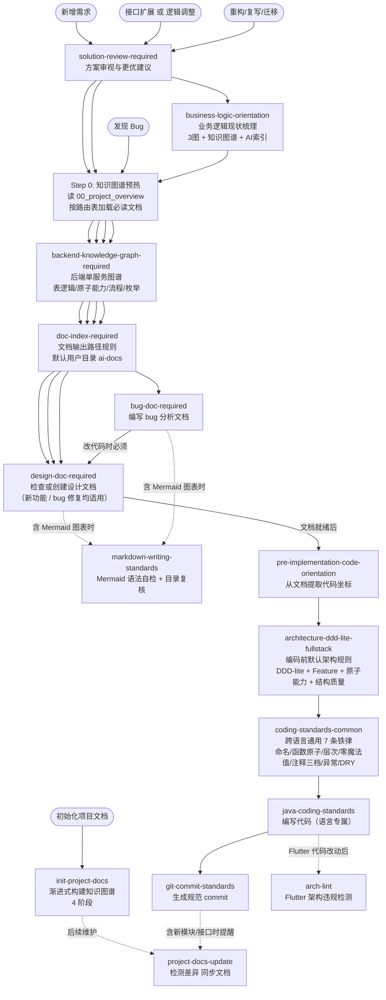
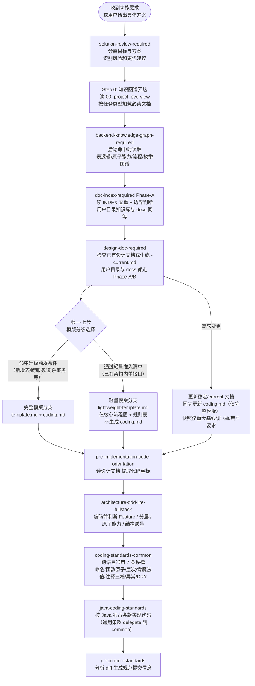
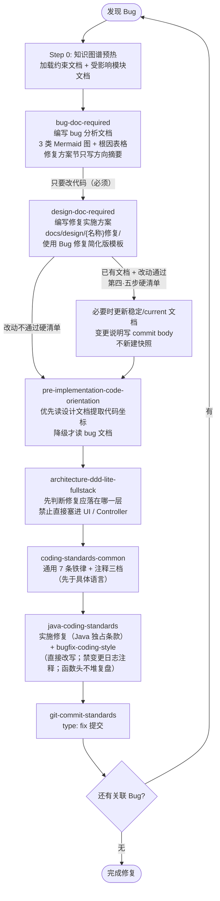
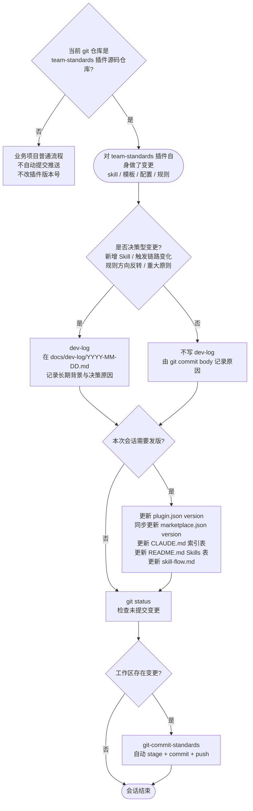
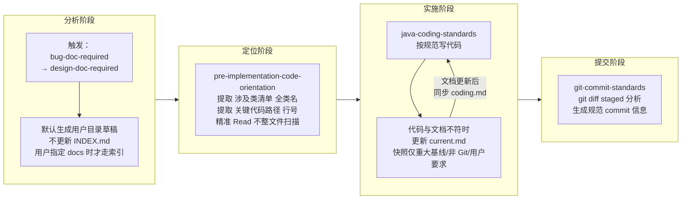

# Skill 链路全景图

> 本文档梳理 team-standards 各 skill 的触发时机、调用关系及两条主链路，用于解决"该调哪个 skill、顺序是什么"的疑惑。
>
> **最后更新：2026-05-06 v20.2**
> 变更摘要 v20.2：`backend-knowledge-graph-required` 范围扩展 —— 从"后端单服务业务图谱（表 / SQL / 状态机 / 原子能力）"扩展到双重职责：(1) **后端业务图谱**（原有职责保留）；(2) **项目级技术难点图谱**（新增），覆盖子进程编排、并发模型、性能瓶颈、资源争夺、外部依赖、JVM/进程生命周期、缓存键策略、超时回收等非业务技术陷阱。新增触发条件：**长对话识别** —— 同一会话同一技术主题用户反复疑问 ≥3 轮 / 出现回归性措辞（"为什么...还" / "怎么又..." / "上次说..." / "现在又卡了"）/ 修复后 ≥2 轮验证追问，自动追加 `分类: 技术难点` 候选记录到 `_candidates.md`，无需用户显式提醒；超过 5 轮反复或用户提示"这是核心点"时主动起 `scenarios/` 场景卡。候选记录格式新增 `分类` 和 `触发模式` 字段。SKILL.md frontmatter description 新增 BLOCKING 触发项 (7)；定位章节明确双重职责；BLOCKING 强触发清单加 2 行；误判反例加 3 条；会话沉淀规则加 4 行；红线加 4 条。CLAUDE.md / README.md skill 索引同步扩展覆盖范围与关键词。该变更属于触发条件根本性扩展（从业务-only 扩到 业务+技术难点），但链路节点和连线本身未变，按"轻微"处理未单独创建快照。
> 变更摘要 v20.1：`coding-standards-common` §5 注释三档新增 §5.0「注释语言默认 = 当前会话沟通语言」—— 默认与用户沟通语言一致（用户用中文沟通即写中文注释、用英文即写英文），用户明确要求特定语言时按要求执行；存量文件保持与已有注释一致，禁止同一文件内中英混用（专有名词 / API / 错误码字面量除外）；规则只约束源码注释，commit message 与文档语言由对应 skill 控制。CLAUDE.md / README.md skill 索引同步更新覆盖范围与关键词。该变更只补强 coding-standards-common §5 子节，链路节点结构未变，按"轻微"处理未单独创建快照。
> 变更摘要 v20：新增 `coding-standards-common` 跨语言通用编码 skill —— 把"命名表意 / 函数原子（80 行硬阈值 + ≤4 参数 + ≤3 嵌套）/ 层次分明（单向依赖 + UI 禁直 SQL/HTTP）/ 零魔法值（DB 字段值与协议码强制枚举）/ 注释三档（类 1-3 行 + 方法 1-2 行 + 核心代码块 1 行 + 禁变更日志 / 禁注释代码 / TODO 必带原因负责人）/ 异常不静默 / DRY rule of 3" 7 条铁律从 `java-coding-standards` 抽出，作为跨语言（Java / TS / JS / Dart / Python / Kotlin / Go / Vue / React 等）通用底；`java-coding-standards` 同步瘦身为 Java 独占条款（Javadoc 语法、Integer 比较、SimpleDateFormat、SLF4J、HashMap 容量、@Override、关系库 SQL 规范等），通用部分 delegate 到 common skill；触发链路 `coding-standards-common`（通用） → `{language}-coding-standards`（语言专属），common 先于具体语言 skill。注释立场综合：阿里黄山版「全员都要写」+ Clean Code「优先讲 WHY、要短」，与 `bugfix-coding-style` 的"禁源码内变更日志 / 函数头不堆复盘 / 复杂逻辑就近 WHY"完全对齐。CLAUDE.md / AGENTS.md 主动触发表 + Skill 索引、README.md Skills 表同步更新；plugin.json / marketplace.json: 1.20.0 → 1.21.0；.codex-plugin/plugin.json: 1.12.0 → 1.13.0。该变更属于链路新增节点（实施层在 architecture-ddd-lite-fullstack 之后、java-coding-standards 之前插入 coding-standards-common），创建 v20 快照。
> 变更摘要 v19.11：`doc-index-required` / `design-doc-required` / `bug-doc-required` / `business-logic-orientation` 联合调整 —— 用户目录 `{USER_DOCUMENTS}/ai-docs/{project}/` 从「草稿堆」升级为**项目级知识库**，承载本项目知识图谱、1-to-N 设计文档、bug 分析、现状梳理。① **路径硬约束**：删除 `{agent}/`（不再按 claude/codex 隔离）和 `{YYYY-MM-DD}/`（同一主题跨会话稳定汇聚），文件名禁止带日期后缀；新结构按 `{type}/{topic_path}/{filename}` 组织，design / bug / orientation 各 type 各有 `INDEX.md`。② **`doc-index-required` Phase-A/B 对用户目录开放**：v1.20 起用户目录知识库与项目 `docs/` 索引体系等同，写文档前必须 Phase-A 读 INDEX 查重，写完必须 Phase-B 登记；`work-log/`（日期型日志）和 `knowledge-graph/`（自有 `00_index.md`）走自管模式豁免。③ **`design-doc-required`** 输出从 `{agent}/{YYYY-MM-DD}/{需求名称}-{今日日期}-v1.md` 切换到 `design/{需求名称}/{需求名称}-current.md`，第一步查找设计文档同时扫两个根（项目 `docs/design/` + 用户目录 `ai-docs/{project}/design/`）。④ **`bug-doc-required`** 输出从带日期文件名切换到 `bug/{模块名}/{bug名称}/{bug名称}.md`，归档结构与项目 `docs/bug/` 保持一致。⑤ **`business-logic-orientation`** 默认输出 `orientation/{业务模块名}/{业务模块名}-现状梳理.md`（不带日期，始终最新）。该变更属于输出路径与索引覆盖范围的扩展，链路节点结构未变，按"轻微"处理未单独创建快照。
> 变更摘要 v19.10：`backend-knowledge-graph-required` 将 SQL 查询逻辑升级为后端图谱一等资产 —— 会话中只要提到业务、表、字段来源、DAO/Mapper 查询、SQL 写法/完善、join/where/group by/order by/聚合，就必须在同一回合追加 SQL 指纹候选到 `_sql_candidates.md`；整理或归档时合并到 `09_sql_query_index.md`、`sql-queries/{业务场景}.md` 和 `02_data_model_map.md`，形成“业务问题 → 全景 ER / 表关系 → SQL 指纹 → 原子能力 → 代码坐标 → 复用建议”的闭环。补充 SQL 候选格式、SQL 查询索引模板、SQL 查询卡模板、SQL 指纹去重合并规则和“完善 SQL”输出要求。该变更增强 backend-kg 核心行为但不改变主链路节点结构，按"轻微"处理未单独创建快照。
> 变更摘要 v19.9：`design-doc-required` 新增第三档「极简跳过」分支 —— 在原「轻量 / 完整」之上补一档**完全跳过文档**的合法例外，落在「合法的例外情况」章节。极简改动硬清单：≤2 文件 ∧ ≤30 行净变更 ∧ 0 新类/表/字段/对外契约 ∧ 不改既有出参语义 ∧ 不跨模块 ∧ 改动性质属于（透传层补漏字段 / 局部行为修正 / 简单条件分支调整 / 移除 dead code / 注释 import 整理）之一；命中所有项时跳过文档，**git commit body 必须承担变更说明（改了什么 + 为什么改 + 影响范围）**。执行流程图新增 TRIVIAL 前置判定节点，红色警告新增「用户说简单不需要文档」「commit body 简写」两条防线。CLAUDE.md skill 索引覆盖范围更新为「三档分级」。本次新增的是合法例外路径而非链路主节点，按"轻微"处理未单独创建快照。
> 变更摘要 v19.8：`backend-knowledge-graph-required` 强化主动触发并简化骨架 —— ① **写前拦截**：即将 Write/Edit 任何描述后端表关系/ER/状态扭转/业务流程→DB CRUD 的 .md（无论路径，含 `ai-docs/`、`work-log/`、`scenarios/` 而不仅 `docs/`）必须先经本 skill；② **会话问询触发**：用户问「X 与 Y 是 1:1 还是 1:N」/「改这个动哪些表」/「字段从哪来」/「分摊怎么算」/「是新建快照还是引用原表」等表关系/状态/原子能力问题必须自动触发并候选沉淀，不再等用户说"建图谱"才动；③ **调查对象路由**：图谱归属永远 = 被调查的后端单服务项目，与 cwd 无关（cwd=A 调查 B 云端时图谱归 B 命名空间），明确不再被误判为跨项目转给 `cross-project-locator`；④ **渐进式三层骨架**：Tier 1 起步只要 `00_index.md` + `scenarios/{场景}.md` + `_candidates.md` 即可投入使用，Tier 2（tables/enums/flows/atomic-capabilities）和 Tier 3（service profile / domain map / api entrypoints）按规模扩展；⑤ **候选池路径精简**：从 `{agent}/{YYYY-MM-DD}/backend-kg-candidates.md` 改为 `_candidates.md`（按被调查项目而非按日期累积）；⑥ **会话事实自动追加规则强化**：AI 回答任何后端表关系问题的同一回合必须自动追加 1 条候选记录，错过即流程违反。SKILL.md description、CLAUDE.md 主动触发表 + Skill 索引同步更新。该变更属于触发条件强化但不改变链路图节点和连线（同 v19.5 backend-kg 强化），按"轻微"处理未单独创建快照。
> 变更摘要 v19.7：`bugfix-coding-style` 补强源码注释边界 —— 禁止把 `[REWRITTEN 日期]`、旧实现缺陷、新实现步骤流水、未来版本计划、设计文档摘要堆到函数头注释；函数 / 类 doc comment 只写当前职责、输入输出语义、不变式和误用风险；复杂逻辑需要解释时在对应代码块附近写 1-2 行 WHY 注释。该变更只补强注释规范，不改变主链路节点结构，按"轻微"处理未单独创建快照。
> 变更摘要 v19.6：`korepos-backend-service` 补充三条强制规则 —— ① **编辑 backend 代码前的违规自检前置**（即将 Edit/Write `features/{module}/backend/` 或 `common/backend_infra/` 下 .dart 文件时必须先 grep 存量违规：裸 SQL / 单方法 ≥80 行 / DB 字段裸数字 / 裸 Exception，汇报清单后等用户三选一处置）；② **Service 长方法必拆 `_xxxStep` 私有方法**（>80 行强制按业务步骤拆，主方法只做编排+事务+日志；与 internal/ 和 backend_infra/services/ 形成拆分梯度，禁止越级升级）；③ **DB 字段值与枚举绑定**（任何与 DB 字段比较 / 过滤 / 写入 / 读取后判断的数字常量必须用枚举类引用，禁止 `item_type=1` / `state=3` 等裸数字字面量；新建枚举走 Step 1.5；违规登记 coding-violations.md）。SKILL.md 在 §核心原则 后新增「编写 backend 代码前的违规自检」章节、§Service 粒度规则后新增「方法粒度规则：长方法必拆」、§Service 装配中转 DTO 后新增「DB 字段值与枚举绑定」；CLAUDE.md skill 索引同步追加新关键词。该变更补强 skill 对存量代码的覆盖能力（机制层补丁），不改变主链路节点结构，按"轻微"处理未单独创建快照。
> 变更摘要 v19.5：`backend-knowledge-graph-required` 强化后端接口开发的表逻辑闭环 —— 新增 `07_table_logic_index.md`、`08_atomic_capability_index.md`、`table-logic/`、`atomic-capabilities/` 目录规范；后端接口编码前必须回顾表逻辑索引和原子能力索引，编码中优先复用已有 DAO/原子能力，编码后将 DAO/SQL、订单/退款/支付状态判定、金额聚合、表状态变化同步到正式图谱或用户目录候选池。该变更调整后端图谱核心行为但不改变主链路节点结构，按"轻微"处理未单独创建快照。
> 变更摘要 v19.4：`korepos-backend-service` 新增「跨 feature 业务原子能力层」规则 —— 在已有的「模块内 `service/internal/`」与「全局基础设施门面 `backend_infra/{capability}/`」之间补充中间层 `lib/common/backend_infra/services/`，沉淀 ≥2 feature 模块共享的业务原子能力（与 `daos/` 对偶，但允许跨表组合 + 业务规则计算）；强制维护 `INDEX.md` 索引（按文件登记 + 按业务关键词反查）；写新 service 主流程前必查索引，已有则注入复用、禁止复制粘贴；补充 internal/ → backend_infra/services/ 升级流程。SKILL.md 在 §Service/internal 章节后新增完整子章节，README.md 同步更新 backend_infra 目录结构 + 新增依赖落点表格行（轻微规则补充，未单独创建快照）。
> 变更摘要 v19.3：`design-doc-required` 将完整模版从 18 节功能设计压缩为 8 节方案/接口设计，明确设计文档是“某个方案/接口开发的简明编码依据”，重点确认核心逻辑、关键规则、编码落点和风险点；功能模块总览、能力分解、类调用图、数据结构、下游依赖、缓存/消息/事务等只写本次变化，不复写项目全集资料。该变更调整模版核心行为但不改变 Skill 链路节点，按"轻微"处理未单独创建快照。
> 变更摘要 v19.2：`design-doc-required` 调整 Mermaid 图表策略 —— 从“完整模版固定多图必备”改为“最小图原则 + 场景选图”；单个后端接口/单业务动作默认只要求 1 张接口自身核心流程图或库表读写时序图，模块图、能力图、状态图、依赖图仅在对应场景命中时触发。该变更只补强节点文字与 FAQ，链路节点结构未变，按"轻微"处理未单独创建快照。
> 变更摘要 v19.1：`git-commit-standards` hook 从"一刀切强制"调整为"按 staged diff 大小放行" —— `hooks/check-git-commit-skill.js` 在拦截 `git commit` 时先跑 `git diff --staged --shortstat` + `--name-status`，若 ≤2 文件 ∧ insertions+deletions ≤30 ∧ 全部为 `M` 修改则直接放行（让模型自行写一句 clear commit message），其它情况才强制 skill；阈值通过 `TEAM_STANDARDS_TRIVIAL_FILES` / `TEAM_STANDARDS_TRIVIAL_LINES` 环境变量可调；同时移除 `git push` 拦截（commit 已落地、push 无需再门禁）。SKILL.md description、CLAUDE.md/AGENTS.md 主动触发表 + Skill 索引、README.md 能力条目同步更新。该变更只调整触发条件粒度，链路节点结构未变，按"轻微"处理未单独创建快照。
> 变更摘要 v19：`git-commit-standards` 由"模型自觉调用"升级为"hook 强制调用" —— 新增 `hooks/check-git-commit-skill.js`（跨平台 Node 脚本），通过 `hooks/hooks.json` 默认启用 PreToolUse Bash matcher，在每次 `git commit` / `git push` 前 grep 当前会话 transcript 是否含 `team-standards:git-commit-standards` skill 调用记录，未命中直接 exit 2 阻断。同步更新 SKILL.md description、CLAUDE.md/AGENTS.md 主动触发表 + Skill 索引 + 辅助资源表、README.md 能力表 + 顶层目录表，新增 `git commit/push 前 skill 触发拦截` 链路节点。该变更属于触发机制语义变化（建议 → 强制），创建 v19 快照。
> 变更摘要 v18.2：`design-doc-required` 调整文档版本策略 —— 项目内正式文档进入 Git 后，默认维护稳定/current 文档，普通迭代直接修改原文档并由 git commit body 记录历史；`YYYYMMDD-vN` 快照仅用于重大基线、非 Git 管理文档或用户明确要求。`bugfix-coding-style` 同步强调源码只描述当前正确逻辑，过气逻辑和变更说明归 Git 历史。该变更只补强节点文字与 FAQ，链路节点结构未变，按"轻微"处理未单独创建快照。
> 变更摘要 v18.1：`architecture-ddd-lite-fullstack` 补充结构质量门禁 —— 编码前不仅判断分层、Feature、原子能力，也必须判断代码结构是否清晰、易维护、低耦合、高内聚；新增实现不得为了快速完成而复制低质量旧结构或制造职责混杂、难测、难替换的代码。该变更只补强节点文字与 Skill 规则，链路节点结构未变，按"轻微"处理未单独创建快照。
> 变更摘要 v18：移除 `superpowers` 外部 Skill 引用 —— `brainstorming`、`writing-plans`、`systematic-debugging`、`test-driven-development`、`verification-before-completion`、`requesting-code-review`、`finishing-a-development-branch` 不属于当前 team-standards 插件工程，已从 Skill 总览和主链路 Mermaid 图中删除，避免维护者误以为本插件依赖外部插件。链路结构发生变化，创建 v18 快照。
> 变更摘要 v17：`dev-log` 触发范围收窄为“决策型变更” —— git commit body 作为默认变更日志，普通小改、措辞同步、版本号递增不再写 `docs/dev-log/`；仅新增/删除 Skill、触发时机或核心行为变化、规则方向反转、跨 Skill 链路变化、重大团队原则沉淀等需要长期追溯背景的变更才写 dev-log。team-standards 维护链路新增 dev-log 判定分支，属于链路节点结构变化，创建 v17 快照。
> 变更摘要 v16.7：`solution-review-required` 增强反迎合与现有代码质量审视规则 —— 当用户要求按现有代码、云端逻辑、类似文件或具体方案直接实现时，AI 必须先分离目标与候选方案，评估现有代码是否值得参考；低质量旧结构只能作为事实材料提取业务规则，不能作为新实现模板扩散；风险明显时必须主动给出更优建议。该变更只补强节点文字与 FAQ，链路节点结构未变，按"轻微"处理未单独创建快照。
> 变更摘要 v16.6：`bugfix-coding-style` 方向反转 —— 之前的 A 类（`[DEPRECATED YYYY-MM-DD]` + 注释保留旧代码）/ B 类（`[ADDED YYYY-MM-DD]` 头注释）规则全部废止；改为禁止把变更历史写进源码（`[BUGFIX]` / 日期标记 / PR 引用 / 注释保留旧代码全部禁止），变更原因归 git log / commit message / bug 文档，源码内只保留对当下读者有价值的 WHY 注释且优先上提到方法 / 类 doc comment；适用范围扩展到所有源码改动（不限联调期）；遇到旧 `[DEPRECATED]` / `[ADDED]` 标记可在改同段代码时顺手清理。FAQ 中的相关问答同步调整（规则方向反转，但流程节点结构未变，按"轻微"处理未单独创建快照）。
> 变更摘要 v16.5：`korepos-backend-service` 新增「外部调用前的边界兜底校验」健壮性硬规则 —— service 调云端 HTTP / 跨子门面 / POS 硬件协议前，凡传给对方的金额/数量/配额等业务数值，若本地 DB 有可查的上限/边界，必须用 DB 实读值兜底校验，不信任入参或前序内存对象；校验抽 `_assertXxxWithinBound` 私有方法；金额比较加 ±0.005 浮点容差。Step 5 强制规则、自检清单、禁区表均同步追加（轻微规则补充，未单独创建快照）。
> 变更摘要 v16.4：`daily-work-log` 默认输出路径切换到用户文档目录 `{USER_DOCUMENTS}/ai-docs/{project}/work-log/{YYYY-MM-DD}.md`，与 `bug-doc-required` / `design-doc-required` / `doc-index-required` 完全对齐；项目内 `docs/work-log/` 与 `.gitignore` 兜底节降级为"用户明确指定路径"分支（轻微规则补充，未单独创建快照）。
> 变更摘要 v16.3：`bug-doc-required` 默认输出路径切换到用户文档目录 `{USER_DOCUMENTS}/ai-docs/{project}/{agent}/{YYYY-MM-DD}/`，与 `design-doc-required` / `doc-index-required` 一致；项目内 `docs/bug/` 降级为"用户明确指定路径或上传终版"分支；流程图分叉、红色警告与"各文档类型与用途"表同步调整（轻微规则补充，未单独创建快照）。
> 上一版：v19.10（2026-05-04，轻微规则补充未单独创建快照）；v19.9（2026-05-03，轻微规则补充未单独创建快照）；v19.8（2026-05-03，轻微规则补充未单独创建快照）；v19.7（2026-05-02，轻微规则补充未单独创建快照）；v19.6（2026-05-02，轻微规则补充未单独创建快照）；v19.5（2026-05-02，轻微规则补充未单独创建快照）；v19.4（2026-05-02，轻微规则补充未单独创建快照）；v19.3（2026-05-02，轻微规则补充未单独创建快照）；v19.2（2026-05-02，轻微规则补充未单独创建快照）；v19.1（2026-05-02，轻微规则补充未单独创建快照）；v19（2026-05-02）；v18.2（2026-05-01，轻微规则补充未单独创建快照）；v18.1（2026-05-01，轻微规则补充未单独创建快照）；v18（2026-05-01）；v17（2026-05-01）；v16.7（2026-05-01，轻微规则补充未单独创建快照）；v16.6（2026-04-30，轻微规则补充未单独创建快照）；v16.5（2026-04-30，轻微规则补充未单独创建快照）；v16.4（2026-04-30，轻微规则补充未单独创建快照）；v16.3（2026-04-30，轻微规则补充未单独创建快照）；v16.2（2026-04-27）；v16.1（2026-04-27）；v16（2026-04-27，轻微规则补充未单独创建快照）。
> 再上一版：v15（2026-04-27）；v14（2026-04-27）；v13（2026-04-27）；v12（2026-04-27）；v11（2026-04-27）；v10（2026-04-27）；v9（2026-04-26）；v8（2026-04-25）；v7（2026-04-22）；v6.2 `bug-doc-required` 调整目录结构为三级；v6.1 新增 Step 0 知识图谱预热。
> 历史版本：`docs/skill-flow-20260505-v20.md`（v20）、`docs/skill-flow-20260502-v19.md`（v19）、`docs/skill-flow-20260501-v18.md`（v18）、`docs/skill-flow-20260501-v17.md`（v17）、`docs/skill-flow-20260427-v15.md`（v15）、`docs/skill-flow-20260427-v14.md`（v14）、`docs/skill-flow-20260427-v13.md`（v13）、`docs/skill-flow-20260427-v12.md`（v12）、`docs/skill-flow-20260427-v11.md`（v11）、`docs/skill-flow-20260427-v10.md`（v10）、`docs/skill-flow-20260427-v9.md`（v9）、`docs/skill-flow-20260425-v8.md`（v8）、`docs/skill-flow-20260422-v7.md`（v7）、`docs/skill-flow-20260416-v6.md`（v6）、`docs/skill-flow-20260410-v5.1.md`（v5.1）、`docs/skill-flow-20260404-v4.md`（v4）、`docs/skill-flow-20260403-v3.md`（v3）、`docs/skill-flow-20260402-v2.md`（v2）

---

## 快速导航

- **看触发时机** → [Skill 总览](#skill-总览)
- **看完整链路** → [Skill 调用关系图](#skill-调用关系图) / [功能开发完整链路](#功能开发完整链路) / [Bug 修复完整链路](#bug-修复完整链路)
- **看维护规则** → [team-standards 维护链路](#team-standards-维护链路) / [文档-索引-coding 子循环详解](#文档-索引-coding-子循环详解)
- **查常见问题** → [常见困惑速查](#常见困惑速查)

---

## Skill 总览

| Skill 名称 | 来源 | 触发时机 |
|---|---|---|
| `solution-review-required` | team-standards | 用户提出具体想法/方案并要求实施，或要求按某个回复、目录策略、架构路径、现有代码直接改时，先审视目标、现有代码质量、风险和更优方案 |
| `design-doc-required` | team-standards | 写任何实现代码前，或被要求提供修复方案/实施方案时（新功能和 bug 修复均适用）；**任何源码 Edit/Write 请求（含「根据文档改代码」「帮我改一下」等）也必须先触发**；文档定位为方案/接口开发的简明编码依据，重点确认核心逻辑、编码落点和风险点；图表遵循最小图原则；Git 管理下默认维护稳定/current 文档，历史由 commit body 承担 |
| `doc-index-required` | team-standards | **(辅助)** 创建任何 Markdown 文档前先确定输出路径；AI 生成 Markdown 默认写用户 Documents 下的 `ai-docs/{project}/{type}/{topic}/{filename}`（无 `{agent}/`、无 `{YYYY-MM-DD}/`、文件名不带日期）；**v1.20 起用户目录知识库与项目 `docs/` 索引体系等同**，写文档前必须 Phase-A 读 INDEX 查重，写完必须 Phase-B 登记；`work-log/`（日期型）和 `knowledge-graph/`（自有 `00_index.md`）走自管模式 |
| `backend-knowledge-graph-required` | team-standards | 后端接口/服务开发前读取后端图谱，重点回顾表逻辑索引、原子能力索引和 SQL 查询索引；会话中提到业务、表、字段来源、SQL/DAO/Mapper 查询逻辑时自动沉淀 SQL 指纹；生成/更新全景 ER、SQL 查询卡、表逻辑和原子能力；编码后同步 DAO/SQL、表关系、订单/退款/支付状态判定、金额聚合、原子能力复用 |
| `bug-doc-required` | team-standards | 编写 bug 分析文档时；完成后必须继续调用 design-doc-required 写修复实施方案 |
| `pre-implementation-code-orientation` | team-standards | 文档写完后、开始实施代码前（含「帮我修改代码」「改代码」等直接编码请求） |
| `architecture-ddd-lite-fullstack` | team-standards | 编写或审查 Java / React / Vue / Flutter 业务代码前；在实施前代码定位后，先判断 Feature、分层、单向依赖、原子能力与结构质量（清晰、易维护、低耦合、高内聚） |
| `coding-standards-common` | team-standards | 编写/修改任何源码语言（Java / TS / JS / Dart / Python / Kotlin / Go 等）前；通用 7 条铁律 + 注释三档；先于具体语言 skill 触发 |
| `java-coding-standards` | team-standards | 编写或修改任何 Java 代码时（自动应用，通用条款 delegate 到 coding-standards-common） |
| `git-commit-standards` | team-standards | 大改 git commit 之前（>2 文件 / >30 行 / 含新增/重命名/删除文件）；**v1.18.1 起 hook 按改动大小放行**：`hooks/check-git-commit-skill.js` 看 staged diff，≤2 文件 ∧ ≤30 行 ∧ 仅 `M` 修改时直接放行（让模型自行写 commit message），其它情况未调用本 skill 时直接 exit 2 阻断；阈值可用 `TEAM_STANDARDS_TRIVIAL_FILES` / `TEAM_STANDARDS_TRIVIAL_LINES` 调整；git push 不门禁；仅在当前仓库就是 team-standards 插件源码仓库且插件自身变更完成后自动 stage、commit、push |
| `dev-log` | team-standards | 对 team-standards 做决策型变更后：新增/删除 Skill、触发时机或核心行为变化、规则方向反转、跨 Skill 链路变化、重大团队原则沉淀；普通小改只写 commit body |
| `markdown-writing-standards` | team-standards | 生成或修改包含 Mermaid 图表的 Markdown 内容；完成 Markdown 文件的结构性写入/重组后做目录复核（自动应用，与 java-coding-standards 同级） |
| `business-logic-orientation` | team-standards | 重构/复写/迁移前需要理解现有业务逻辑时（产出梳理文档 + AI 速查索引） |
| `init-project-docs` | team-standards | 要求初始化/生成知识图谱/分析项目文档时（4 阶段渐进式构建，独立分析类 skill） |
| `generate-project-profile` | team-standards | 要求生成项目画像时（独立分析类 skill，生成 AI Agent 消费的 10 维度 Markdown） |
| `coding-violation-log` | team-standards | 用户纠正 AI 编码错误时登记违规；编码前回顾已登记记录防重犯（嵌入编码链路，java-coding-standards 之前） |
| `project-docs-update` | team-standards | 项目代码结构变更后同步知识图谱文档（检测差异 + 自动/确认更新） |
| `arch-lint` | team-standards | Flutter 架构违规检测（5 条分层规则，全量/轻量两种模式） |
| `bugfix-coding-style` | team-standards | bug 修复 / 任何源码改动的注释规范（v1.17 起方向反转）：禁止变更历史/日期标记/PR 引用/注释保留旧代码进入源码；源码只描述当前正确逻辑，变更原因归 git log / commit body；函数头只写当前职责、输入输出语义、不变式和误用风险，复杂逻辑在对应代码块写短 WHY 注释 |

---

## Skill 调用关系图

三类入口，汇入同一条实施链路：

---

## 功能开发完整链路

---

## Bug 修复完整链路

> **关键变更（v2）：** 原链路在"纯修复"时可绕过 design-doc-required。新链路**移除该分支**：只要 bug 需要改代码，design-doc-required 必须执行。bug 文档负责"分析清楚问题"，设计文档负责"规划清楚怎么改"，二者各有职责，不可合并。

---

## team-standards 维护链路

> 仅在**修改 team-standards 插件本身**时触发（修改 skill、模板、配置等）。与业务开发链路无关。

> **触发判断：** 只有当前 git 仓库就是 `team-standards` / `kpay-team-standards` 插件源码仓库，且在本次会话中创建、修改、删除了 `skills/` 下任意文件，或调整了 `CLAUDE.md`、`AGENTS.md`、插件元数据、README、skill-flow 等插件自身规则，才进入本维护链路。
>
> **自动提交判断：** 只要 team-standards 插件源码仓库变更完成且 `git status --short` 非空，必须立即按 `git-commit-standards` 自动提交并 push，避免多轮变更累计到一个大提交。业务项目即使安装本 plugin，也不自动 commit/push、不自动改版本号。用户明确要求暂不提交或暂不 push 时除外。

---

## 文档-索引-coding 子循环详解

这是最容易混淆的部分，拆解如下：

### 各文档类型与用途

| 文件名格式 | 何时创建 | 谁来读 | 可否修改 |
|---|---|---|---|
| `{需求}-current.md` | Git 管理下的项目正式设计文档（默认） | 人 + AI 优先读取 | 随代码演进直接更新，历史由 git commit 负责 |
| `{需求}-coding.md` | 完整模版读完设计文档后自动生成 | AI（节省 token） | 随 current 文档同步 |
| `snapshots/{需求}-{日期}-v{N}.md` | 重大基线、发布快照、非 Git 管理文档或用户明确要求时 | 人 | 创建后不改，后续重大基线另建快照 |
| `{USER_DOCUMENTS}/ai-docs/{project}/bug/{模块名}/{bug名称}/{bug名称}.md` | 确认 bug 根因后（**默认**） | 人 + AI 分析阶段 | 可补充，修复方案节只写方向摘要；用户目录知识库由 doc-index-required Phase-A/B 管控 |
| `docs/bug/{模块名}/{bug名称}/{bug名称}.md` | 用户明确要求"上传终版 / 写到 docs/" 时 | 人 + AI 分析阶段 | 可补充；归档结构与用户目录一致，按模块分组 + 触发 doc-index-required |
| `docs/design/{名称}修复/{名称}修复-current.md` | bug 分析完成后 | AI 实施阶段 | 随修复方案演进直接更新，历史由 git commit 负责 |
| `docs/{subdir}/INDEX.md` | 首个文档创建时 | doc-index-required 读取 | 随文档新增自动追加 |
| `docs/dev-log/YYYY-MM-DD.md` | team-standards 决策型变更时 | 人（追溯重大规则为什么存在） | 当天可追加，禁止修改历史日期文件；普通小改不写 |

---

## 常见困惑速查

| 困惑 | 答案 |
|---|---|
| 什么时候要先调用 solution-review-required? | 用户已经给出具体方案、目录策略、架构路径、现有代码参考或要求“按这个回复实施”时先调用。它先判断真实目标、现有代码质量、风险和更优做法，再进入设计文档或编码流程。 |
| 用户要求“参考现有代码照着写”时可以直接抄吗? | 不可以默认抄。现有代码只能作为事实材料，必须先判断它是否符合当前架构、分层、状态机、数据一致性和测试约束。质量差的旧代码只能提取业务规则，不能作为新实现模板继续扩散。 |
| 用户没问更优方案时，AI 要主动提吗? | 要。`solution-review-required` 的核心职责就是反迎合：当用户方案或现有代码惯性存在明显风险时，必须主动指出问题，并给出更简单、更安全或更可维护的建议。 |
| 后端知识图谱会因为会话里反复提到就自动更新吗? | 会自动记录到用户目录候选池，避免遗漏；但不会把未验证猜测直接写入正式图谱。代码/DDL/枚举/API 契约验证过，或本次后端代码变更影响 DAO/SQL、表关系、状态判定、金额聚合、原子能力时，必须同步正式图谱或候选池。 |
| backend-knowledge-graph-required 管哪些范围? | 管后端单服务。沉淀领域能力、原子能力、流程、全景 ER、SQL 查询逻辑、表逻辑、表关系、枚举、状态判定、API、外部依赖和代码坐标；前端 UI、跨项目拓扑不放进这个 skill。 |
| 后端接口开发前要看哪些图谱? | 先看 `07_table_logic_index.md`、`08_atomic_capability_index.md` 和 `09_sql_query_index.md`，再看命中的 `table-logic/{scenario}.md`、`atomic-capabilities/{capability}.md`、`sql-queries/{scenario}.md`、表卡、流程卡、枚举卡，最后才读 DAO/Service 代码。 |
| 会话里提到 SQL 或业务查询逻辑要怎么处理? | 必须同回合追加到 `_sql_candidates.md`，记录业务问题、SQL 指纹、参数、返回字段、涉及表、join/where/group by/order by 语义、状态枚举、原子能力和代码坐标；用户要求整理时合并到 `09_sql_query_index.md`、`sql-queries/` 和全景 ER。 |
| “完善 SQL”时能直接新写一条吗? | 不能默认新写。先查 `09_sql_query_index.md` 和 `sql-queries/`，命中相似 SQL 时按 SQL 指纹合并为同一查询能力的变体，只补必要的 join/where/group by/order by，并回写图谱。 |
| 订单部分退、订单状态判定这类反复问题怎么处理? | 必须沉淀到 `table-logic/` 和原子能力索引。卡片要写清涉及表、状态/金额字段、判定矩阵、状态变化矩阵、可复用 DAO/Service 方法和代码坐标，后续新增接口先按图谱判断是否支持。 |
| 多项目知识图谱还要整理什么? | 不做各服务内部能力的重复沉淀，主要记录服务间调用关系、入口契约、关键业务对象、数据归属、失败传播和幂等补偿边界；具体跨项目链路由 `cross-project-locator` 负责。 |
| 需要单独调用 doc-index-required 吗? | 创建任何 Markdown 文档前都要先应用它的"输出路径规则"。**v1.20 起：用户目录知识库与项目 `docs/` 索引体系等同**，写文档前都要 Phase-A 读 INDEX 查重，写完都要 Phase-B 登记；`work-log/`（日期型）和 `knowledge-graph/`（自管 `00_index.md`）走豁免模式。 |
| AI 生成文档默认写到哪里? | 默认写到用户 Documents 下的 `ai-docs/{project}/{type}/{topic}/{filename}`（无 `{agent}/`、无 `{YYYY-MM-DD}/`、文件名不带日期）；Windows 为 `%USERPROFILE%\Documents\ai-docs\...`，macOS/Linux 为 `~/Documents/ai-docs/...`，无 Documents 时兜底 `~/ai-docs/...`。例：`ai-docs/{project}/design/{需求名}/{需求名}-current.md`、`ai-docs/{project}/bug/{模块名}/{bug名}/{bug名}.md`。 |
| 正式设计文档还能写 `docs/design/` 吗? | 可以，但不再由 AI 默认写入。终版文档由用户自行上传；或用户明确指定 `docs/...` 路径后，AI 才写项目目录并更新索引。 |
| pre-implementation-code-orientation 什么时候调? | 两份文档（bug 分析 + 设计文档）都写完后、敲第一行代码前 |
| pre-implementation-code-orientation 读哪份文档? | 优先读设计文档（coding.md），没有则降级读 bug 文档的涉及类清单 |
| 需求变更时改原设计文档还是新建? | 如果文档在项目 Git 中，默认直接更新 `{需求}-current.md`，历史由 commit body / PR diff / blame 负责。只有重大基线、非 Git 管理文档或用户明确要求时才新建 `YYYYMMDD-vN` 快照。 |
| coding.md 和 current.md 有什么区别? | current.md 是当前代码的正式设计描述；coding.md 是完整模版的当前编码摘要，给 AI 实施时节省 token。二者都随当前实现同步更新，不承担变更流水职责。 |
| Bug 修复需要调 design-doc-required 吗? | **必须**。只要 bug 需要改代码，就必须有设计文档。bug 文档负责分析，设计文档负责实施方案，两者职责不同不可省略。bug 修复可用简化版模板（仅 8 节）。 |
| bug 文档的修复方案节写什么? | 仅写方向摘要（每级一句话），加设计文档路径指引。详细实施细节写进设计文档。 |
| dev-log 什么时候调? | 只在 team-standards 发生决策型变更时调用：新增/删除 Skill、触发时机或核心行为变化、规则方向反转、跨 Skill 链路变化、重大团队原则沉淀。普通小改、措辞同步、版本号递增不写 dev-log。 |
| dev-log 和 git-commit-standards 有什么区别? | git-commit-standards 是默认变更日志，commit body 要写清楚本次为什么改；dev-log 只记录“这个规则为什么存在”的长期背景。普通变更只需 commit body，重大规则决策才两者都写。 |
| team-standards 改完后会自动 commit 和 push 吗? | 只在当前 git 仓库就是 team-standards 插件源码仓库时会。业务项目安装本 plugin 后不会自动提交、推送或改版本号。 |
| 为什么每次 push 还可能要授权? | 自动 push 是 skill 的行为规则；是否弹授权由 Codex/宿主运行环境的命令审批策略控制。若环境没有持久化允许 `git push`，skill 不能绕过授权，只能在获准后继续执行。 |
| init-project-docs 什么时候调? | 仅在明确要求"初始化项目文档"或"分析项目能力"时调用，是独立的分析类 skill，不属于功能开发或 bug 修复链路。 |
| markdown-writing-standards 和 design-doc-required 的 Mermaid 章节什么关系? | design-doc-required 规定「什么场景适合画什么图」，并遵循最小图原则：能一张图讲清就只画一张；markdown-writing-standards 规定「图怎么画不出错」（语法规则、自检清单）。前者定义 what，后者定义 how。 |
| 设计文档需要写完整模块资料吗? | 不需要。`design-doc-required` 的设计文档是某个方案/接口开发的编码依据，重点写核心逻辑、关键规则、编码落点、风险与验证。项目全集资料里已有的数据结构、下游依赖、缓存/消息/事务等，只在本次有新增、修改或风险时写。 |
| 功能模块总览图、能力分解图还要画吗? | 默认不画。简单接口设计、单个后端动作、已有模块内方案开发都不需要；涉及模块交互时也优先用文字/表格说明，只有不画就无法确认风险或职责边界时才画。 |
| 写 Mermaid 时需要显式调用 markdown-writing-standards 吗? | 自动应用，与 java-coding-standards 同级。只要检测到要写 Mermaid 代码块，规则自动生效。 |
| business-logic-orientation 和 design-doc-required 的区别? | business-logic-orientation 梳理**现有代码的现状**（是什么），design-doc-required 规划**要改成什么样**（怎么改）。重构场景先梳理现状，再写设计文档。 |
| AI 速查索引和 coding.md 有什么区别? | AI 速查索引是对**现有代码**的紧凑索引（文件/方法/调用链/表操作），coding.md 是对**设计方案**的编码摘要（接口契约/类清单/业务规则）。前者面向理解，后者面向实施。 |
| init-project-docs 的 4 个 Phase 必须全部执行吗? | 不必须。Phase 1-2 是核心（全自动），Phase 3-4 可选。可以只运行 Phase 1-2 快速建立基础知识图谱，后续按需补充。 |
| project-docs-update 和 init-project-docs 的区别? | init-project-docs 是**从零构建**知识图谱（首次使用），project-docs-update 是**增量维护**（代码变更后同步文档）。前者生成，后者更新。 |
| architecture-ddd-lite-fullstack 什么时候调? | 设计文档和代码定位完成后、第一行业务源码改动前。它是默认架构门禁：先判断 Feature、Presentation/Application/Domain/Repository/Infrastructure 分层、调用方向、原子能力和结构质量（清晰、易维护、低耦合、高内聚），再写代码。 |
| architecture-ddd-lite-fullstack 和 java-coding-standards 的区别? | architecture-ddd-lite-fullstack 管**代码放哪一层、依赖方向、业务能力怎么复用、结构是否清晰易维护且低耦合高内聚**；java-coding-standards 管 **Java 代码质量**（命名、格式、异常、集合、日志等）。先分层和结构设计，再写具体语言代码。 |
| coding-standards-common 和 java-coding-standards 的区别? | coding-standards-common 是**跨语言通用底**（命名表意、函数原子 80 行、层次分明、零魔法值、注释三档、异常不静默、DRY rule of 3），适用一切源码语言；java-coding-standards 是 **Java 独占条款**（Javadoc 语法、Integer 比较、SimpleDateFormat、SLF4J、HashMap 容量、@Override、关系库 SQL 规范等）。触发顺序：common 先（任何源码语言都要走） → 具体语言 skill 后（叠加独占条款）。新写 TS/Dart/Python 时只走 common，新写 Java 时同时满足 common + java。 |
| 注释到底要写多少? | 三档铁律：类 1-3 行（业务职责 + 所属层 + 关键协作）、方法 1-2 行 + 参数/返回/异常项（业务意图，不是重复方法名）、核心代码块 1 行（业务规则 / 技术决策 / 魔法数字 / 容错降级 / TODO）。**禁止**：注释掉的旧代码、变更历史/日期/PR 号、段落式设计史、重复函数名的废话、无原因 TODO。简要原则：写不下就说明你想塞实现细节，那部分应该进 design doc 而不是源码。 |
| arch-lint 和 java-coding-standards 的区别? | arch-lint 检测 **Flutter 架构分层**违规（presentation 层写 SQL 等跨层问题），java-coding-standards 检测 **Java 代码**质量（命名/格式/异常处理等）。一个管分层，一个管编码。 |
| Phase 3-4 的自动模式和确认模式怎么选? | 自动模式：AI 尽力推断后生成，标注"需人工校验"，适合快速产出初稿。确认模式：逐份展示等用户确认，适合对准确度要求高的场景。 |
| Step 0 知识图谱预热是什么? | 在 design-doc-required / bug-doc-required 执行前，先读 `00_project_overview.md` 获取全局索引，再按 AI 上下文路由表加载当前任务类型对应的 2-3 份文档。避免全量扫码，按需获取上下文。 |
| 什么时候走「轻量修订」而不是新建快照? | 设计文档已存在 + 改动通过 design-doc-required 第四·五步硬清单（不新增接口/字段/类、不改方法签名、单文件 ≤30 行净变更、性质属修正/对齐/删冗余/修 bug）。Git 管理下必要时更新 current 文档，变更说明写 commit body；任一项 ❌ 进入需求变更处理。 |
| 轻量修订期间代码怎么写? | 必须遵循 `bugfix-coding-style`（v1.17 起反转）：直接改写或新增，**禁止**在源码中保留 `[DEPRECATED]` / `[ADDED]` / `[BUGFIX 日期]` 等变更日志标记，**禁止**注释保留旧代码段。源码只描述当前正确逻辑，变更原因写进 commit message body；函数/类 doc comment 只写当前职责、输入输出语义、不变式和误用风险，复杂逻辑在对应代码块附近写 1-2 行 WHY 注释。 |
| 函数上能不能写一大段旧实现问题和新实现步骤? | 不能。`[REWRITTEN 日期]`、旧实现缺陷、新实现 1/2/3 步、设计文档第几节、未来版本计划都不应堆在函数头。当前职责写短 doc comment，复杂步骤在对应代码块附近用短 WHY 注释说明。 |
| `bugfix-coding-style` 和 `coding-violation-log` 有什么区别? | bugfix-coding-style 是**主动规则**（写代码时必须遵循的注释规范，核心规则是"禁变更日志、函数头不堆复盘、复杂逻辑局部短 WHY"），coding-violation-log 是**反应式登记**（用户纠错后记录到违规表防重犯）。前者管"怎么写"，后者管"错过的别再错"。 |
| 项目没有知识图谱时 Step 0 怎么办? | 自动跳过。Step 0 检测 `docs/00_project_overview.md` 不存在时直接进入后续流程，完全向后兼容。 |
| 什么时候走「轻量模版」? | 命中第一·七步全部 9 项硬清单（不新增表/字段/对外契约/类 ≥3、不跨服务、不引入新中间件、不重设状态机、改动可由「核心流程图 + 规则表 + 失败行为表」描述）。任一 ❌ 升级到完整模版。已有架构内的单接口新增/调整、接口自身流程或库表读写流程描述就是典型轻量场景。 |
| 轻量模版需要 coding.md 吗? | **不需要**。核心流程图 + 规则表 + 失败行为表已经覆盖编码所需的最小信息。第四步（生成 coding.md）和第六步（同步 coding.md）只对完整模版生效，轻量分支跳过。 |
| 轻量文档实施完后还要做什么? | 回填代码入口的真实行号（编码前可以写「待实现」，实施完成后填实际 Service / DAO 文件:line），让文档同时承担「设计意图」与「库表行为索引」两个角色。 |
| 轻量改到一半发现要新增表怎么办? | 立即升级到完整模版（按 lightweight-template 第 6 节「升级到完整模版的触发条件」处理）。以轻量文档为草稿，按 template.md 章节逐节展开；Git 管理下更新 current + coding，只有重大基线/非 Git/用户要求时才建快照。 |
