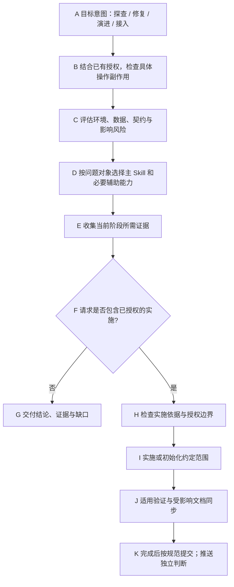
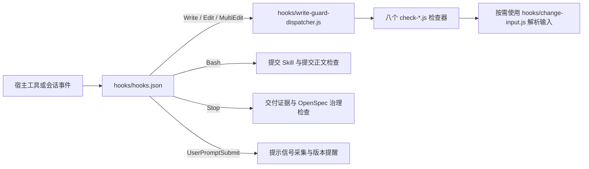
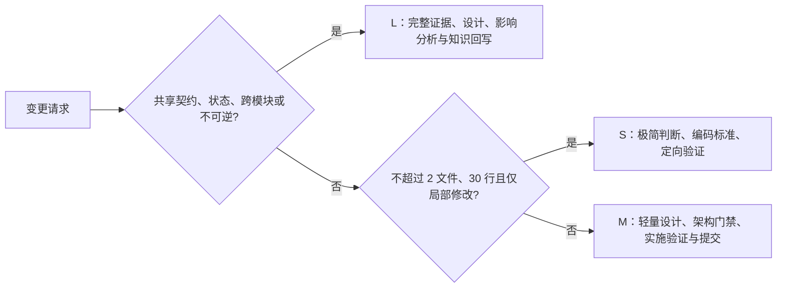

# Skill 链路全景图

本文件将任务链路映射到实际源码：每一步读哪些规则、哪些入口会执行、结果落在哪里。它是源码导航，不是另一套运行时路由器；执行规则以各 Skill 的 `SKILL.md` 为准。

导航：[总流程](#总流程) · [节点与源码](#总图节点对应哪些源码) · [目录结构](#先分清四种目录) · [Skill 文件索引](#全部-skill-的规则文件索引) · [执行调用链](#真正执行程序的调用链) · [目标项目与外部服务](#目标项目与外部服务中的内容) · [修改入口速查](#想改某个行为时从哪里下手) · [路由场景](#易混淆请求的预期路由)

OpenSpec 文档推进由 change-readiness 的 [生命周期参考](../plugins/team-standards/skills/change-readiness/references/openspec-lifecycle.md) 统一维护阶段准出、评审回写、设计视图及续跑交接。delivery-verification 完成真实验证后，按 [治理检查器协议](../plugins/team-standards/skills/change-readiness/references/governance-checker.md) 记录并检查本切片；同步与归档继续调用官方 OpenSpec。新增 Hook 默认报告试运行，宿主验收后才启用阻断。

整套组件、工程职责域及全部节点的输入输出见 [套件全景](suite-panorama.md)；本文保留任务路由和阶段规则。

## 总流程



---

意图与授权的权威规则见 [入口规范](../CLAUDE.md#意图授权与风险)。主 Skill 按问题对象选择；阶段推进不等于阶段审批。

## 总图节点对应哪些源码

图中箭头表示 Agent 的任务推进。只有下面明确标为“执行”的节点才表示调用脚本或工具，不应把所有箭头理解为 JavaScript import。

| 图节点 | 读取/执行位置（相对本仓根） | 这一步实际发生什么 |
|---|---|---|
| A 目标意图 | [CLAUDE.md](../CLAUDE.md) → [AGENTS.md](../AGENTS.md) | Claude 入口以 CLAUDE 为源，Codex 入口由 sync-agents 生成；Agent 结合请求理解目标 |
| B 授权与副作用 | CLAUDE 的意图规则 + 目标项目 AGENTS + 对话中已有授权 | 由 Agent 判断具体操作边界；本仓没有名为 resolveRoute 的分类器或权限状态机 |
| C 风险 | [change-readiness/references/classification.md](../plugins/team-standards/skills/change-readiness/references/classification.md) | 实施时按影响分档；探查也独立评估生产访问、负载和数据风险 |
| D 主 Skill | `plugins/team-standards/skills/<name>/SKILL.md`，见下方完整索引 | 宿主暴露名称/描述，Agent 读取匹配入口；不会自动全量读取 references |
| E 当前阶段证据 | [business-logic-orientation](../plugins/team-standards/skills/business-logic-orientation/SKILL.md)、[backend-evidence](../plugins/team-standards/skills/backend-evidence/SKILL.md)、[planning-evidence-discovery](../plugins/team-standards/skills/planning-evidence-discovery/SKILL.md) | 规则指定查什么；实际代码、数据、图谱与 MCP 内容在目标项目或外部服务 |
| F 是否实施 | CLAUDE 意图规则；[change-readiness 的阶段边界](../plugins/team-standards/skills/change-readiness/SKILL.md) | 结合当前目标与已有授权选择分支，不靠“迁移/重构”关键词自动改码 |
| G 分析交付 | 对应调查/现状/规划 Skill 的输出约定 | 默认直接回复结论与证据；没有必须运行的“生成报告.js” |
| H 变更就绪 | [change-readiness/SKILL.md](../plugins/team-standards/skills/change-readiness/SKILL.md)；其 `references/` 中的方案、分类、OpenSpec 与代码定位规则 | Agent 核对依据；OpenSpec 已接入时调用其官方能力，团队治理工具负责绑定与检查 |
| I 实施/初始化 | 架构、编码和 UI Skill；接入用 [init-ai-structure.mjs](../plugins/team-standards/skills/init-project-docs/init-ai-structure.mjs) / [onboard-pipeline.mjs](../plugins/team-standards/skills/init-project-docs/onboard-pipeline.mjs) | 业务实现写入目标项目；初始化脚本按指定模式处理约定基线 |
| J 验证与同步 | [delivery-verification](../plugins/team-standards/skills/delivery-verification/SKILL.md) + [markdown-writing-standards](../plugins/team-standards/skills/markdown-writing-standards/SKILL.md) | Agent 调用实际可用验证工具/项目命令，随后同步受影响说明；Skill 本身不是测试执行器 |
| K 提交 | [git-commit-standards](../plugins/team-standards/skills/git-commit-standards/SKILL.md) → [build-commit-message.js](../plugins/team-standards/skills/git-commit-standards/scripts/build-commit-message.js) → Git | 脚本生成经过校验的消息文件；Agent 定向暂存、执行 commit 并按授权推送 |

## 先分清四种目录

工作台布局实施通过 `frontend-excellence` 追踪 Shell → 页面 → 中间容器 → 面板的可用宽高及滚动归属；真实浏览器检查高屏、矮屏、窄屏、动态窗口变化和长短内容，再由 delivery-verification 汇总实际证据。细则只维护在 [可用视口契约](../plugins/team-standards/skills/frontend-excellence/references/quality-gates.md#workspace-viewport-contract)，不新增 Hook 或宣称已自动检测所有布局。

本文链接指向可维护的源码仓。安装后的宿主从插件安装目录/缓存读取载荷；缓存路径随宿主和版本变化，以当次加载路径为准，不直接修改缓存代替源码修复。推送源码不等于所有会话立即升级。

```text
team-tools/                              本机多仓工作区，本身不是 Git 仓库
├── team-standards/                       本文中的“本仓根”
│   ├── CLAUDE.md → AGENTS.md             入口规则及生成的 Codex 入口
│   ├── docs/skill-flow.md                当前链路与源码导航
│   ├── scripts/                         维护仓库、版本、同步和打包的脚本
│   └── plugins/team-standards/           分发给宿主的插件载荷根
│       ├── .claude-plugin/plugin.json   Claude 插件元数据
│       ├── .codex-plugin/plugin.json    Codex 插件元数据
│       ├── skills/<name>/                一个 Skill 的目录
│       │   ├── SKILL.md                  Agent 读取的主规则
│       │   ├── references/、rules/      按条件读取的细则，并非全部自动加载
│       │   ├── assets/                  模板、Schema 等资源
│       │   └── scripts/ 或 *.mjs        部分 Skill 的可执行辅助程序
│       ├── hooks/hooks.json             宿主事件与命令注册
│       ├── hooks/*.js                   写前、提交前、完成前检查
│       ├── hooks/governance/            OpenSpec 治理实现
│       ├── scripts/                     治理 CLI，不是根目录的维护 scripts
│       └── state-contract/              状态契约校验、影响与真实验证实现
├── project-coding-profiles/              编码画像及 encoding-guard
├── project-domain-knowledge/             知识内容与 MCP 引擎源码
├── cross-project-topology/               跨系统知识内容，复用上述引擎
└── yoooni-daily-plugin/                  SMB、周报与安装维护工具

<目标业务项目>/                          实际被分析/修改的代码仓，可在其他位置
├── AGENTS.md、项目本地 Skill             项目特例、命令和边界
├── 源码、测试、DDL、配置                  真正的业务实现与验证对象
├── openspec/                            已接入时的规格、活动 change 与归档
├── graphify-out/                        已生成的代码图谱
└── .forge/verify.yml                    已接入时的验证配置
```

只有部分 Skill 有 `references/`、`assets/` 或脚本，不能按照示意树假设每个目录都存在。目标项目也不要求用相同业务源码目录名。

## 全部 Skill 的规则文件索引

每行第一列可直接打开主入口；第二列列出当前实际存在的细则/辅助资源。先读 SKILL.md，再按其中条件读取具体文件，不按这张表逐项强制执行。

| Skill 主入口 | 下钻目录或主要文件 | 与程序的关系 |
|---|---|---|
| [architecture-ddd-lite-fullstack](../plugins/team-standards/skills/architecture-ddd-lite-fullstack/SKILL.md) | [references/](../plugins/team-standards/skills/architecture-ddd-lite-fullstack/references/)；[rules/](../plugins/team-standards/skills/architecture-ddd-lite-fullstack/rules/) | Agent 读取的规则；没有独立同名执行器 |
| [backend-evidence](../plugins/team-standards/skills/backend-evidence/SKILL.md) | [references/](../plugins/team-standards/skills/backend-evidence/references/) | 读取规则后查询代码、知识及运行证据 |
| [bug-doc-required](../plugins/team-standards/skills/bug-doc-required/SKILL.md) | [references/](../plugins/team-standards/skills/bug-doc-required/references/) | Agent 读取的规则；没有独立同名执行器 |
| [business-logic-orientation](../plugins/team-standards/skills/business-logic-orientation/SKILL.md) | [references/](../plugins/team-standards/skills/business-logic-orientation/references/) | Agent 读取的规则；没有独立同名执行器 |
| [change-readiness](../plugins/team-standards/skills/change-readiness/SKILL.md) | [references/](../plugins/team-standards/skills/change-readiness/references/)；[rules/](../plugins/team-standards/skills/change-readiness/rules/) | 规则编排；OpenSpec 与治理程序见下一节 |
| [coding-standards-common](../plugins/team-standards/skills/coding-standards-common/SKILL.md) | [references/](../plugins/team-standards/skills/coding-standards-common/references/) | Agent 读取的规则；没有独立同名执行器 |
| [coding-violation-log](../plugins/team-standards/skills/coding-violation-log/SKILL.md) | 直接阅读主入口；无上述下钻目录 | Agent 读取的规则；没有独立同名执行器 |
| [comment-cleanup](../plugins/team-standards/skills/comment-cleanup/SKILL.md) | 直接阅读主入口；无上述下钻目录 | Agent 读取的规则；没有独立同名执行器 |
| [daily-work-log](../plugins/team-standards/skills/daily-work-log/SKILL.md) | 直接阅读主入口；无上述下钻目录 | Agent 读取的规则；没有独立同名执行器 |
| [delivery-verification](../plugins/team-standards/skills/delivery-verification/SKILL.md) | 直接阅读主入口；无上述下钻目录 | 读取规则后调用外部 Forge 或项目声明命令 |
| [design-system-bootstrap](../plugins/team-standards/skills/design-system-bootstrap/SKILL.md) | [references/](../plugins/team-standards/skills/design-system-bootstrap/references/)；[assets/](../plugins/team-standards/skills/design-system-bootstrap/assets/) | Agent 读取的规则；没有独立同名执行器 |
| [design-system-guardian](../plugins/team-standards/skills/design-system-guardian/SKILL.md) | [references/](../plugins/team-standards/skills/design-system-guardian/references/) | Agent 读取的规则；没有独立同名执行器 |
| [dev-log](../plugins/team-standards/skills/dev-log/SKILL.md) | 直接阅读主入口；无上述下钻目录 | Agent 读取的规则；没有独立同名执行器 |
| [frontend-excellence](../plugins/team-standards/skills/frontend-excellence/SKILL.md) | [references/](../plugins/team-standards/skills/frontend-excellence/references/) | Agent 读取的规则；没有独立同名执行器 |
| [git-commit-standards](../plugins/team-standards/skills/git-commit-standards/SKILL.md) | [references/](../plugins/team-standards/skills/git-commit-standards/references/)；[scripts/](../plugins/team-standards/skills/git-commit-standards/scripts/) | scripts/build-commit-message.js 生成消息；Git 负责提交 |
| [glossary-required](../plugins/team-standards/skills/glossary-required/SKILL.md) | 直接阅读主入口；无上述下钻目录 | Agent 读取的规则；没有独立同名执行器 |
| [init-project-docs](../plugins/team-standards/skills/init-project-docs/SKILL.md) | [references/](../plugins/team-standards/skills/init-project-docs/references/)；[assets/](../plugins/team-standards/skills/init-project-docs/assets/)；[init-ai-structure.mjs](../plugins/team-standards/skills/init-project-docs/init-ai-structure.mjs)；[onboard-pipeline.mjs](../plugins/team-standards/skills/init-project-docs/onboard-pipeline.mjs) | 同时含初始化和 onboarding 可执行入口 |
| [java-coding-standards](../plugins/team-standards/skills/java-coding-standards/SKILL.md) | 直接阅读主入口；无上述下钻目录 | Agent 读取的规则；没有独立同名执行器 |
| [go-coding-standards](../plugins/team-standards/skills/go-coding-standards/SKILL.md) | 直接阅读主入口；架构复用 DDD-lite 的 Go 章节 | Go 语言规则；没有独立 Go Hook |
| [llm-agent-coding-standards](../plugins/team-standards/skills/llm-agent-coding-standards/SKILL.md) | 直接阅读主入口；无上述下钻目录 | Agent 读取的规则；没有独立同名执行器 |
| [markdown-writing-standards](../plugins/team-standards/skills/markdown-writing-standards/SKILL.md) | [references/](../plugins/team-standards/skills/markdown-writing-standards/references/) | Agent 读取的规则；没有独立同名执行器 |
| [planning-evidence-discovery](../plugins/team-standards/skills/planning-evidence-discovery/SKILL.md) | [references/](../plugins/team-standards/skills/planning-evidence-discovery/references/) | 读取工具契约后调用外部规划证据平台 |

### 按模式找具体参考文件

| 要理解的环节 | 实际文件 |
|---|---|
| 方案审视 / 风险分档 / 代码定位 | [solution-review.md](../plugins/team-standards/skills/change-readiness/references/solution-review.md) / [classification.md](../plugins/team-standards/skills/change-readiness/references/classification.md) / [code-orientation.md](../plugins/team-standards/skills/change-readiness/references/code-orientation.md) |
| OpenSpec 生命周期与阶段检查 | [openspec-lifecycle.md](../plugins/team-standards/skills/change-readiness/references/openspec-lifecycle.md) / [governance-checker.md](../plugins/team-standards/skills/change-readiness/references/governance-checker.md) |
| Bug 最小修复与记录模板 | [repair-rules.md](../plugins/team-standards/skills/bug-doc-required/references/repair-rules.md) / [template.md](../plugins/team-standards/skills/bug-doc-required/template.md) |
| SQL 正确性 / 查询性能 / 领域规格候选 | [sql-correctness-gate.md](../plugins/team-standards/skills/backend-evidence/references/sql-correctness-gate.md) / [query-performance-gate.md](../plugins/team-standards/skills/backend-evidence/references/query-performance-gate.md) / [domain-spec-mining.md](../plugins/team-standards/skills/backend-evidence/references/domain-spec-mining.md) |
| 分层边界 / 结构质量 | [layers-and-boundaries.md](../plugins/team-standards/skills/architecture-ddd-lite-fullstack/references/layers-and-boundaries.md) / [structure-quality-gates.md](../plugins/team-standards/skills/architecture-ddd-lite-fullstack/rules/structure-quality-gates.md) |
| UI 绑定解析（guardian 复用 bootstrap 的 resolver）/ 视觉评审 | [resolver.md](../plugins/team-standards/skills/design-system-bootstrap/references/resolver.md) / [review-workflow.md](../plugins/team-standards/skills/design-system-guardian/references/review-workflow.md) |
| 设计偏好 / 模式候选 | [evidence-capture.md](../plugins/team-standards/skills/design-system-bootstrap/references/evidence-capture.md) / [pattern-mining.md](../plugins/team-standards/skills/design-system-bootstrap/references/pattern-mining.md) |
| 初始化输出 / onboarding / 刷新 | [initialization-output.md](../plugins/team-standards/skills/init-project-docs/references/initialization-output.md) / [onboard-workflow.md](../plugins/team-standards/skills/init-project-docs/references/onboard-workflow.md) / [update-workflow.md](../plugins/team-standards/skills/init-project-docs/references/update-workflow.md) |
| 文档归属索引 / Markdown 格式 | [document-index-workflow.md](../plugins/team-standards/skills/markdown-writing-standards/references/document-index-workflow.md) / [markdown-format.md](../plugins/team-standards/skills/markdown-writing-standards/references/markdown-format.md) |

## 真正执行程序的调用链

### 宿主事件到 Hook

注册源是 [hooks/hooks.json](../plugins/team-standards/hooks/hooks.json)，各命令路径相对插件载荷根。宿主是否触发必须以实际支持和事件证据为准。



- 写入分发清单在 [write-guard-dispatcher.js](../plugins/team-standards/hooks/write-guard-dispatcher.js) 的 `GUARDS`；七项分别检查就绪、架构、后端证据、注释、DDL、SQL 正确性与性能；旧文档位置入口已退役，不再分发。每项职责见 [全景中的机械门禁表](suite-panorama.md#机械门禁在什么位置工作)。它使用 Worker 分发原始输入，不负责选择主 Skill。
- Bash 入口是 [check-git-commit-skill.js](../plugins/team-standards/hooks/check-git-commit-skill.js) 和 [check-commit-no-ai-signature.js](../plugins/team-standards/hooks/check-commit-no-ai-signature.js)；不是 Git 自带 pre-commit，也不会替 Agent 自动写好提交正文。
- Stop 入口是 [check-delivery-verification.js](../plugins/team-standards/hooks/check-delivery-verification.js) 与 [check-openspec-governance.js](../plugins/team-standards/hooks/check-openspec-governance.js)。前者判定证据，后者检查已接入治理；不是业务测试执行器。
- 提示事件入口是 [prompt-signal-capture.js](../plugins/team-standards/hooks/prompt-signal-capture.js) 与 [check-plugin-version-stale.js](../plugins/team-standards/hooks/check-plugin-version-stale.js)。事件与性能辅助分别见 [event-log.js](../plugins/team-standards/hooks/event-log.js)、[hook-metrics.js](../plugins/team-standards/hooks/hook-metrics.js)。

### OpenSpec 团队治理

规则入口为 change-readiness 的治理参考；以下才是其本仓实现：

```text
plugins/team-standards/scripts/openspec-governance.js  CLI 参数与 JSON 输出
  → hooks/governance/service.js                      discover/bind/record/check 等业务编排
    → openspec.js                                   官方 OpenSpec 接口适配
    → repository.js                                 仓库、配置与修改范围
    → evidence.js                                   证据计划校验
    → storage.js                                    安全路径、指纹、会话状态存取
    → state-contract/enrollment.js                  已登记状态模块检查

hooks/check-openspec-governance.js                    宿主事件入口
  → 同一个 hooks/governance/service.js               复用上述实现
```

可点开 [CLI](../plugins/team-standards/scripts/openspec-governance.js)、[service.js](../plugins/team-standards/hooks/governance/service.js)、[governance 目录](../plugins/team-standards/hooks/governance/)。绑定状态默认落在用户目录 `.local/share/team-standards/governance/` 下的仓库/会话哈希路径，可由 `TEAM_STANDARDS_GOVERNANCE_DATA` 指定。它不是 OpenSpec 规格正文，也不把 `record` 当作测试执行。官方 OpenSpec 引擎不在这个目录中。

### 状态契约执行

[plugins/team-standards/scripts/state-contract.js](../plugins/team-standards/scripts/state-contract.js) 提供 `check/impact/verify`，调用 [state-contract/](../plugins/team-standards/state-contract/) 内的实际模块：`check.js` 分析，`graph.js` 读取图谱候选，`verify.js` 执行契约登记的命令并检查证据，`schema.js`/`files.js` 处理结构与路径，`enrollment.js` 对接已登记模块。项目契约和命令配置归目标项目，详见 [接入协议](../plugins/team-standards/skills/change-readiness/references/state-contract.md)。

### 项目初始化与提交

- [init-ai-structure.mjs](../plugins/team-standards/skills/init-project-docs/init-ai-structure.mjs) 消费 [assets/project-ai-structure/](../plugins/team-standards/skills/init-project-docs/assets/project-ai-structure/) 中的基线资源；[onboard-pipeline.mjs](../plugins/team-standards/skills/init-project-docs/onboard-pipeline.mjs) 编排接入阶段。资源模板不是业务源码，实际目标目录由调用参数和项目约定确定。
- [build-commit-message.js](../plugins/team-standards/skills/git-commit-standards/scripts/build-commit-message.js) 校验并写出提交消息；随后才执行 `git commit -F`。它不替 Agent 决定哪些用户文件可以暂存。
- 根 [scripts/](../scripts/) 是维护这套插件的脚本，如 sync-agents、版本与引用检查、跨仓同步和 release-team-tools；不要与载荷内 `plugins/team-standards/scripts/` 的治理 CLI 混淆。维护调用职责见 [全景 H 域](suite-panorama.md#h套件运维与分发域)。

## 目标项目与外部服务中的内容

以下以 `team-tools/` 为路径起点；目录可能未安装、未构建或未接入，不能把源码路径当作可调用工具。

| 能力 | 源码/内容实际位置 | 当前链路怎么使用 |
|---|---|---|
| 业务知识 MCP | `project-domain-knowledge/src/server.ts`；查询实现在 `src/knowledge.ts`、`project-context.ts`、`consult-evidence.ts`、`spec-candidates.ts`；内容在 `knowledge/` | 构建后的 `dist/server.js` 作为 MCP 进程，Agent 调工具读业务知识 |
| 跨项目拓扑 MCP | `cross-project-topology/knowledge/` | 同一知识引擎配不同 DOMAIN_KB_DIR 启动第二实例，无独立同名 server 源码 |
| 编码保护 | `project-coding-profiles/plugins/project-coding-profiles/` 下的 `skills/encoding-guard/`、`hooks/`、`profiles/` | 按匹配画像保护目标文件；不在 team-standards 的 skills 目录内 |
| SMB 与团队周报 | `yoooni-daily-plugin/plugins/yoooni-daily-plugin/skills/` 下的两个 Skill | 独立日常请求加载；安装维护脚本另在该插件 `scripts/` |
| Graphify | 外部安装的 CLI/Skill；目标项目 `graphify-out/` | 查询当前代码图谱；本仓图谱只描述本仓，不等于业务项目图谱 |
| OpenSpec | 外部 CLI/项目生成能力；目标项目 `openspec/` | 官方生命周期操作读写项目规格；团队 reference 规定何时调用 |
| Forge 验证 | 外部 MCP/项目声明 CLI；目标项目 `.forge/verify.yml` 与环境 | 本仓 delivery Skill 定义调用规则，Forge 服务实现不在本仓 |
| 跨项目规划平台 | 外部项目范围解析、查询与账本工具；协议在 [tool-contracts.md](../plugins/team-standards/skills/planning-evidence-discovery/references/tool-contracts.md) | planning Skill 调用已接入服务，不在本仓自行猜项目关系 |

## 想改某个行为时从哪里下手

| 要改什么 | 优先改哪里 | 对应检查/注意事项 |
|---|---|---|
| 意图识别、授权和阶段推进 | CLAUDE.md + 相关 SKILL.md | 生成 AGENTS，同步本流程；不能只改图就认为规则已生效 |
| 某个 Skill 的触发或正文 | 对应 SKILL.md 的 description/正文 | Skill 结构、引用与场景审视；载荷变化按版本规则升版 |
| 某种规则细节 | 该 Skill 明确链接的 references/rules | 保持主入口可达，不新增无人读取的细则 |
| Hook 什么时候触发 | hooks/hooks.json | 宿主兼容/安装测试；声明 matcher 不代表所有宿主支持 |
| Hook 检查如何判定 | 对应 hooks/*.js，必要时 governance/ | 相关 hooks/tests/ 测试；不要只改 Skill 文案来改变程序判定 |
| 状态契约校验算法 | state-contract/ | hooks/tests/state-contract.test.js；区别静态分析和真实执行 |
| 初始化生成什么 | init-project-docs 的程序及 assets | hooks/tests/ai-structure-initializer.test.mjs 与 onboard-pipeline.test.mjs |
| 业务规则/跨系统关系 | 所属知识仓及其内容约定 | 更新目录/索引与实际 MCP 内容；不要写进通用 Skill 充当业务真相 |
| 业务代码、SQL、页面、测试 | 目标业务项目 | 按项目命令验证；修改 team-standards 不会自动修复业务系统 |
| 套件版本、同步、打包 | 根 scripts/、三个 manifest 及相关 README | 版本/同步/打包检查；更新源码后还需宿主更新插件才能使用新载荷 |

## 入口模式

| 主入口 | 模式 | 什么时候加载 |
|---|---|---|
| `change-readiness` | 方案审视 | 审视用户给出的解法；仅咨询时不创建实施 change |
| `change-readiness` | 风险分档与设计 | 已授权源码修改；风险与 OpenSpec 简化条件按本 Skill 执行 |
| `change-readiness` | 代码定位 | 设计依据确认后、修改第一行代码前 |
| `bug-doc-required` | 调查 | 用证据解释问题，不改源码；简单问题直接回复，不另建报告 |
| `bug-doc-required` | 修复 | 已授权修复：最小改动与回归；复杂或高风险问题复用持久记录 |
| `backend-evidence` | 数据与运行事实 | DDL、真实数据库、SQL、日志、执行计划和性能问题 |
| `backend-evidence` | 即时影响 | 修改状态、字段、事件或 API 前用新鲜 Graphify 查询；不回写手工索引 |
| `backend-evidence` | 领域规格 | 状态密集业务缺少不变量、终态或下一动作证据 |
| `markdown-writing-standards` | 文档同步 / 写前 / 写中 / 写后 | 套件或项目更新核对文档影响，唯一归属、结构与 Mermaid、必要已有链接 |
| `git-commit-standards` | 完成收尾 / 提交 | 文档和验证完成后自动提交本次范围；独立判断推送授权 |
| `init-project-docs` | structure / onboard / init / refresh / status / profile | 当前目录 Agent/Docs/OpenSpec 入口、Graphify 输入与 Git 共享边界、九阶段接入、增量刷新、状态或可选画像 |
| `design-system-bootstrap` | registry / preference | 建立设计资料或记录、归纳偏好证据 |
| `design-system-guardian` | implementation / review | UI 实施和代表性渲染验收 |
| `delivery-verification` | completion | 可执行改动完成后、最终回复前调用 Forge 并检查最新 PASS 证据 |

---

## 作业完成闭环

本次作业完成前，按 [文档同步规则](../plugins/team-standards/skills/markdown-writing-standards/SKILL.md#作业交付时同步文档) 核对并更新受影响的说明、规则与索引；对最终输入完成适用验证后，按 [提交规范](../plugins/team-standards/skills/git-commit-standards/SKILL.md) 自动提交本次范围。纯文档作业执行文档检查后提交，不要求虚构 Runtime 证据。当前切片可独立完成时及时提交，不等待整个 OpenSpec change 归档。

用户禁止提交、验证失败、归属混合等例外按提交规范处理并明确剩余项；push 独立判断授权。该闭环由 Agent 主动执行，现有 Hook 不保证覆盖全部宿主，也不证明文档语义正确。

---

## Graphify 与 OpenSpec 接入边界

Graphify、OpenSpec 和 Skill 分属不同层级，不建立三个并行主流程：

| 能力 | 唯一职责 | 不再重复承担 |
|---|---|---|
| Graphify | 从代码提取模块、符号、调用、依赖和数据访问等当前实现事实 | 不决定需求、不生成另一套设计流程、不把推断晋升为业务真相 |
| OpenSpec | 在项目内维护已接受行为规格、活动变更、任务和归档 | 不证明当前代码或数据库已经符合规格 |
| `team-standards` Skill | 识别用户意图，选择证据源，施加架构、编码、安全、SQL 和验证门禁 | 不复制 Graphify 图谱，不在 OpenSpec 之外生成平行规格 |

项目已启用 OpenSpec 时：

1. `change-readiness` 对 M/L 变更自动匹配或创建 OpenSpec change，不再创建平行设计文档；实施中的需求修正和新发现通过官方 `update` 工作流回写同一 change。
2. `business-logic-orientation` 优先查询 Graphify 获取代码事实，只补充 Graphify 无法证明的业务语义与运行证据；除非用户明确要求或需要长期重构基线，否则不生成新的梳理文档和 AI 索引。
3. `backend-evidence` 使用 OpenSpec `specs/` 作为已接受行为契约，使用 Graphify 查询当前实现和影响，以 DDL、SQL、数据库和日志验证数据事实；不维护同义行为规格或手工代码索引。
4. `init-project-docs` 先以 structure 模式建立六层最小入口、`.graphifyignore` 和 Graphify Git 共享白名单，再由 init 编排真实 Graphify、OpenSpec 与领域证据；不复制图谱、规格或 00–10 文档树。
5. `planning-evidence-discovery` 继续负责跨项目证据编排；Graphify 和 OpenSpec只是证据适配器，不替代项目关系权威源。

“已启用”不等于目录存在：`openspec/config.yaml` 必须包含真实项目上下文。启用后，没有相关 change 就自动创建，artifacts 不完整就按 schema 补齐，生成 Skill 缺失但 CLI 正常时走 agent-compatible CLI；这些都不再触发静默 legacy。只有项目未启用 OpenSpec，或用户明确批准当前变更降级时，才使用兼容设计文档。

完成阶段复用 OpenSpec 官方能力：严格 validate 后执行 verify；需要提前合并 delta specs 时 sync；任务与验证满足条件后才 archive。OpenSpec 自身的 verify/archive warning 在团队门禁中不能替代阻断判断，项目测试、数据库和发布证据仍独立验证。

Graphify 查询也不天然代表当前工作区。消费图谱前比较其 manifest 或来源元数据与 Git HEAD、未提交文件版本；过期时先按已安装能力刷新，或用 `git diff`、`rg` 和定向源码读取补齐。OpenSpec 校验通过只证明 artifacts 结构合法，不能代替 DDL、数据库、测试和发布制品验证。

---

## S/M/L 路由



---

## 冲突规则

1. 同一 Skill 多次出现表示不同模式，不是重复触发。
2. Bug 链路中 `bug-doc-required` 管诊断证据和最小修复，`change-readiness` 管实施风险与代码坐标。简单 Bug 不以独立文档为前置条件；复杂问题优先复用已有 OpenSpec change、问题记录或项目文档，仅无合适载体且有沉淀必要时新建报告。代码定位消费会话证据与当前源码，日志默认由 Git 承载，需要独立日报时按问题主题归并，不反向要求补文档。
3. `coding-standards-common` 先于 Java 或 LLM 专属标准，专属标准只补充不替代。
4. 后端即时影响与领域规格属于 `backend-evidence`，跨项目契约仍由实际项目或拓扑仓维护。
5. 项目专属规范始终优先从项目内 Skill 或 `AGENTS.md` 读取；独立项目画像只是缺少入口时的可选导航，不承载规范正文。

---

## 收尾

| 变化 | 回写 |
|---|---|
| 套件或项目更新 | `markdown-writing-standards` 文档影响核对与同步 |
| Markdown 新建或重组 | `markdown-writing-standards` 检查受影响导航 |
| 状态、字段、事件、API 变化 | `backend-evidence` Graphify 即时影响查询；协同项写入 OpenSpec |
| 项目结构、API、数据访问变化 | `init-project-docs` refresh：更新 Graphify 本体，不生成 Markdown 镜像 |
| 用户或项目明确要求工作日志 | `daily-work-log` |
| 用户纠正规范错误 | `coding-violation-log` |
| team-standards 决策变化 | `dev-log` |
| 可执行改动准备交付 | `delivery-verification`；优先 `forge_verify phase=all` |
| 作业完成且有可提交改动 / 准备 commit | `git-commit-standards` 自动本地提交本次范围 |

## 状态契约治理扩展

change-readiness → backend-evidence / business-logic-orientation → delivery-verification 复用同一状态契约检查器。模块逐步登记，策略统一、业务链路测试与输入新鲜度共同防止状态漂移。详见 [状态契约治理协议](../plugins/team-standards/skills/change-readiness/references/state-contract.md)。

## 轻量交付

本地检查按 [delivery-verification 的影响分级](../plugins/team-standards/skills/delivery-verification/SKILL.md) 选择，Forge 与 CI 门禁保持原约束。Markdown 格式细则和提交示例由对应 Skill 按需加载。日常日志默认由 Git 承载，明确要求独立日报时按主题合并，不按文件数累加工时；正常自动提交仅报告提交结果，不重复展示完整正文。


套件维护复用 [README 的维护入口](../README.md#维护与验证)：快测只覆盖轻量契约，改动相关集成测试与完整 CI 继续执行；共享副本先预览再同步，消费者独立验证升版；发布前检查根总览元数据。此轮保持 21 个独立意图入口与现有 warn/block，清理架构 Skill 的 Dart 触发残留。


## 易混淆请求的预期路由

以下用于人工场景审视，不是关键词分类器或已运行的 Agent 准确率测试。

| 请求与上下文 | 主入口 / 阶段 | 边界与交付 |
|---|---|---|
| 为什么报错（没有既有修复授权） | bug-doc-required / 调查 | 证据与原因，不自动改码 |
| 查明原因并修复 | bug-doc-required / 调查 → 就绪 → 修复 → 验证 | 已授权范围连续推进，必要规格照常维护 |
| 上轮已要求修复，本轮补充报错日志 | 继续原修复任务 | 不把最新短句视作撤销已有授权 |
| 评估迁移是否值得 | 规划探查；跨项目用 planning-evidence-discovery | 默认回答，不因“迁移”创建实施 change |
| 分析怎么重构 / 按方案重构 | 前者方案探查，后者 change-readiness / 纯重构 | 实施才进入设计生命周期，回归支持行为保持 |
| 为什么 SQL 慢 / 优化 SQL | 前者后端探查，后者演进；已知性能退化归修复 | 查询负载与数据访问风险独立评估 |
| 检查接入状态 / 初始化项目 | init-project-docs / status 或 init | status 不写入修复，init 仅改约定基线 |
| 查线上订单金额不一致 | bug-doc-required 调查 + backend-evidence | 不将只读等同低风险，不默认授权修数据 |
| 只更新 README / 提交已完成改动 | markdown-writing-standards / git-commit-standards | 直接进入专门动作，不新增需求生命周期 |
| 已授权修复但发现需删除生产数据 | 继续安全调查，补齐具体操作授权 | 修复授权不自动覆盖破坏性数据操作 |

## 最小证据链与产物去留

| 需要回答的问题 | 读取哪里 / 如何维护 | 不再默认产出 |
|---|---|---|
| 当前实现与影响是什么 | 新鲜 Graphify + 定向源码；见 business-logic-orientation | 现状双文档、ai-ref、手工调用索引 |
| 本次应该改什么、为何这样改 | change-readiness → OpenSpec 实际工件；未启用时复用一份仓内设计 | 独立 coding 摘要、API 摘要和并行设计正文 |
| 实际是否通过验证 | delivery-verification → 真实命令/CI/Forge/运行结果；治理文件引用其位置和输入指纹 | 为机器引用而转抄的 validation.md |
| 文档如何被找到 | markdown-writing-standards → 唯一归属和受影响的已有导航 | 个人目录 Phase-A/B、逐层 INDEX、编号文档树 |
| 作业做了什么 | git-commit-standards → 已验证的范围与 Git 提交 | 自动 Markdown 日报；daily-work-log 改为按需 |

不是所有知识都能由这三类工具恢复：业务术语、不变量、架构取舍、事故复盘和运行手册保留独有内容；已有历史文档不批量删除。长期文档仍在实现变化时同步。

实际源码：文档规则见上方 references 表；旧 `hooks/check-ai-doc-location.js` 仅兼容旧宿主调用，当前 dispatcher 不再加载。`hooks/governance/evidence.js` 接受可选 dedup/handoff、无需正文的不适用视图及原始验证文件；`service.js` 执行策略版本迁移、范围和新鲜度检查。升级步骤见 [治理协议](../plugins/team-standards/skills/change-readiness/references/governance-checker.md#6-策略版本与升级)。

## 项目知识候选链路与源码

项目接入后先消费已有 MCP 上下文，缺口或已授权初始化才进入探索。初始化以各项目 Graphify 导航，源码核验后起草候选；不把代码事实直接提升成业务规则。

| 环节 | 套件中的源码 | 输出与约束 |
|---|---|---|
| 模块候选 | `project-domain-knowledge/scripts/lib/module-bootstrap.mjs`、`graphify-input.mjs` | 模块节点、关联、源码指纹与覆盖缺口；图谱新鲜度未经证明为 unknown |
| 业务挖掘 | `project-domain-knowledge/scripts/spec-mining.mjs` | 现有候选与评审；accepted 当前证据版本仅晋升 draft |
| 拓扑候选 | `project-domain-knowledge/scripts/lib/topology-candidates.mjs` | 双方项目、环境、协议和契约唯一匹配；缺失/多义保留 unresolved |
| 证据核对 | `project-domain-knowledge/src/evidence-provenance.ts`、`scripts/evidence-check.mjs` | 捕获文件字节指纹变化为 stale；不改变业务 stability |
| 按任务消费 | `project-domain-knowledge/src/consult-evidence.ts`、`src/topology-candidates.ts` | MCP 返回有限摘要、缺口与新鲜度，Agent 只补查相关部分 |

格式与执行命令统一维护在 [知识引擎 README](../../project-domain-knowledge/README.md#项目图谱到候选知识的闭环)。文件指纹不涵盖新增文件和外部系统变化；Graphify 不可用允许模块扫描降级。CI、Semgrep、OTel 的各业务项目接入按需实施，不宣称已自动覆盖全部项目。

## Go 编码链路

Go 源码 → `coding-standards-common` + `go-coding-standards`；业务边界变更叠加 `architecture-ddd-lite-fullstack/references/framework-rules.md` 的 Go 章节。需求/修复仍复用原入口，SQL 复用 backend-evidence，交付使用项目 Go 工具链与 delivery-verification，最后同步文档和提交。包结构、接口归属和事务归 DDD-lite；错误、context、goroutine、资源释放与 Go 验证归 Go Skill。
