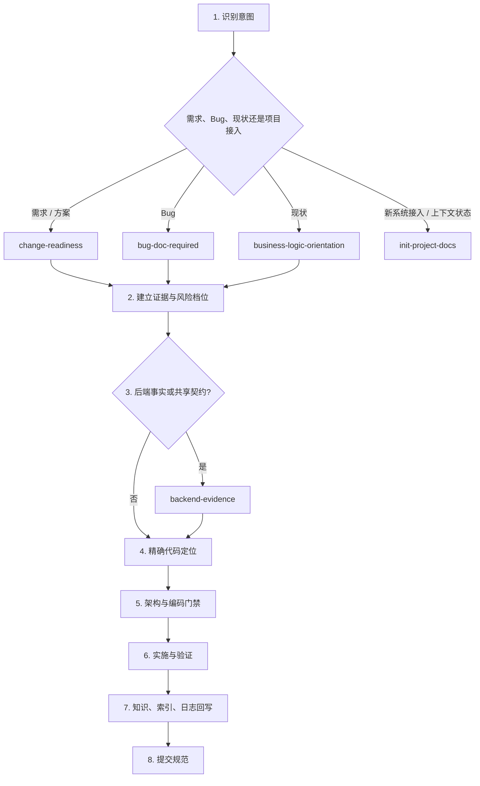

# Skill 链路全景图

本文件只描述 `team-standards` 的统一调度。详细规则以各 Skill 的 `SKILL.md` 为准。

## 总流程

---

## 入口模式

| 主入口 | 模式 | 什么时候加载 |
|---|---|---|
| `change-readiness` | 方案审视 | 用户给出具体解法、目录策略或参考实现 |
| `change-readiness` | 风险分档与设计 | 所有源码修改请求；S 档允许极简跳过文档 |
| `change-readiness` | 代码定位 | 设计依据确认后、修改第一行代码前 |
| `bug-doc-required` | 调查 | 用户只要求诊断或解释，不改源码 |
| `bug-doc-required` | 修复 | 用户明确要求修复、对齐权威逻辑或删修复冗余 |
| `backend-evidence` | 数据与运行事实 | DDL、真实数据库、SQL、日志、执行计划和性能问题 |
| `backend-evidence` | 即时影响 | 修改状态、字段、事件或 API 前用新鲜 Graphify 查询；不回写手工索引 |
| `backend-evidence` | 领域规格 | 状态密集业务缺少不变量、终态或下一动作证据 |
| `markdown-writing-standards` | 写前 / 写中 / 写后 | 查重归属、结构与 Mermaid、索引登记 |
| `init-project-docs` | onboard / init / refresh / status / profile | 九阶段系统接入、权威入口初始化、增量刷新、状态检查或可选轻量画像 |
| `design-system-bootstrap` | registry / preference | 建立设计资料或记录、归纳偏好证据 |
| `design-system-guardian` | implementation / review | UI 实施和代表性渲染验收 |

---

## Graphify 与 OpenSpec 接入边界

Graphify、OpenSpec 和 Skill 分属不同层级，不建立三个并行主流程：

| 能力 | 唯一职责 | 不再重复承担 |
|---|---|---|
| Graphify | 从代码提取模块、符号、调用、依赖和数据访问等当前实现事实 | 不决定需求、不生成另一套设计流程、不把推断晋升为业务真相 |
| OpenSpec | 在项目内维护已接受行为规格、活动变更、任务和归档 | 不证明当前代码或数据库已经符合规格 |
| `team-standards` Skill | 识别用户意图，选择证据源，施加架构、编码、安全、SQL 和验证门禁 | 不复制 Graphify 图谱，不在 OpenSpec 之外生成平行规格 |

项目已启用 OpenSpec 时：

1. `change-readiness` 读取并评审对应 OpenSpec change，不再创建一份平行设计文档；风险分档和团队必填项优先进入项目的 OpenSpec schema 或配置。
2. `business-logic-orientation` 优先查询 Graphify 获取代码事实，只补充 Graphify 无法证明的业务语义与运行证据；除非用户明确要求或需要长期重构基线，否则不生成新的梳理文档和 AI 索引。
3. `backend-evidence` 使用 OpenSpec `specs/` 作为已接受行为契约，使用 Graphify 查询当前实现和影响，以 DDL、SQL、数据库和日志验证数据事实；不维护同义行为规格或手工代码索引。
4. `init-project-docs` 编排项目规则、Graphify、OpenSpec 与领域证据的初始化和状态；不复制图谱、规格或 00–10 文档树。
5. `planning-evidence-discovery` 继续负责跨项目证据编排；Graphify 和 OpenSpec只是证据适配器，不替代项目关系权威源。

“已启用”不等于目录存在：`openspec/config.yaml` 必须包含真实项目上下文，相关 change 可定位且所需 artifacts 可读取。只有空模板、无相关 change、artifacts 不完整或 CLI 不可用时，现有设计文档流程才作为兼容路径。

Graphify 查询也不天然代表当前工作区。消费图谱前比较其 manifest 或来源元数据与 Git HEAD、未提交文件版本；过期时先按已安装能力刷新，或用 `git diff`、`rg` 和定向源码读取补齐。OpenSpec 校验通过只证明 artifacts 结构合法，不能代替 DDL、数据库、测试和发布制品验证。

---

## S/M/L 路由

---

## 冲突规则

1. 同一 Skill 多次出现表示不同模式，不是重复触发。
2. Bug 链路中 `bug-doc-required` 管根因和修复合同，`change-readiness` 管实施风险与代码坐标。
3. `coding-standards-common` 先于 Java、Dart 或 LLM 专属标准，专属标准只补充不替代。
4. 后端即时影响与领域规格属于 `backend-evidence`，跨项目契约仍由实际项目或拓扑仓维护。
5. 项目专属规范始终优先从项目内 Skill 或 `AGENTS.md` 读取；独立项目画像只是缺少入口时的可选导航，不承载规范正文。

---

## 收尾

| 变化 | 回写 |
|---|---|
| Markdown 新建或重组 | `markdown-writing-standards` 写后索引 |
| 状态、字段、事件、API 变化 | `backend-evidence` Graphify 即时影响查询；协同项写入 OpenSpec |
| 项目结构、API、数据访问变化 | `init-project-docs` refresh：更新 Graphify 本体，不生成 Markdown 镜像 |
| 业务源码变化 | `daily-work-log` |
| 用户纠正规范错误 | `coding-violation-log` |
| team-standards 决策变化 | `dev-log` |
| 准备 commit | `git-commit-standards` |
