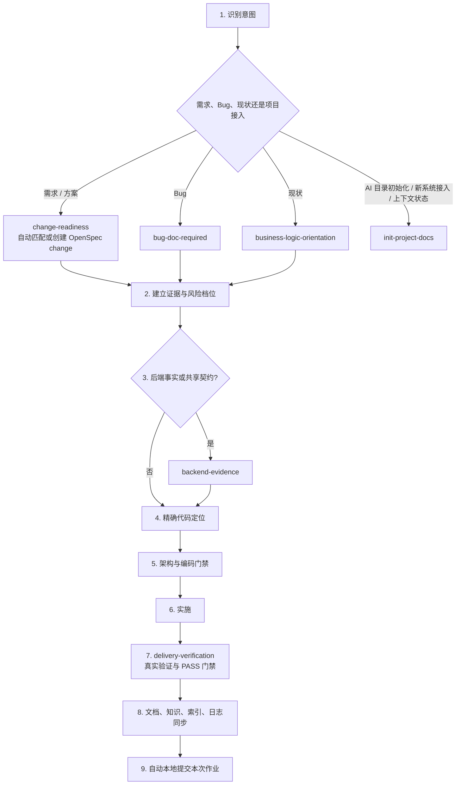

# Skill 链路全景图

本文件只描述 `team-standards` 的统一调度。详细规则以各 Skill 的 `SKILL.md` 为准。

OpenSpec 文档推进由 change-readiness 的 [生命周期参考](../plugins/team-standards/skills/change-readiness/references/openspec-lifecycle.md) 统一维护阶段准出、评审回写、设计视图及续跑交接。delivery-verification 完成真实验证后，按 [治理检查器协议](../plugins/team-standards/skills/change-readiness/references/governance-checker.md) 记录并检查本切片；同步与归档继续调用官方 OpenSpec。新增 Hook 默认报告试运行，宿主验收后才启用阻断。

## 总流程

---

## 入口模式

| 主入口 | 模式 | 什么时候加载 |
|---|---|---|
| `change-readiness` | 方案审视 | 用户给出具体解法、目录策略或参考实现 |
| `change-readiness` | 风险分档与设计 | 所有源码修改请求；S 档允许极简跳过文档 |
| `change-readiness` | 代码定位 | 设计依据确认后、修改第一行代码前 |
| `bug-doc-required` | 调查 | 用证据解释问题，不改源码；简单问题直接回复，不另建报告 |
| `bug-doc-required` | 修复 | 已授权修复：最小改动与回归；复杂或高风险问题复用持久记录 |
| `backend-evidence` | 数据与运行事实 | DDL、真实数据库、SQL、日志、执行计划和性能问题 |
| `backend-evidence` | 即时影响 | 修改状态、字段、事件或 API 前用新鲜 Graphify 查询；不回写手工索引 |
| `backend-evidence` | 领域规格 | 状态密集业务缺少不变量、终态或下一动作证据 |
| `markdown-writing-standards` | 文档同步 / 写前 / 写中 / 写后 | 套件或项目更新核对文档影响，查重归属、结构与 Mermaid、索引登记 |
| `git-commit-standards` | 完成收尾 / 提交 | 文档和验证完成后自动提交本次范围；独立判断推送授权 |
| `init-project-docs` | structure / onboard / init / refresh / status / profile | 当前目录 Agent/Docs/OpenSpec 入口、Graphify 输入与 Git 共享边界、九阶段接入、增量刷新、状态或可选画像 |
| `design-system-bootstrap` | registry / preference | 建立设计资料或记录、归纳偏好证据 |
| `design-system-guardian` | implementation / review | UI 实施和代表性渲染验收 |
| `delivery-verification` | completion | 可执行改动完成后、最终回复前调用 Forge 并检查最新 PASS 证据 |

---

## 作业完成闭环

本次作业完成前，按 [文档同步规则](../plugins/team-standards/skills/markdown-writing-standards/SKILL.md#作业交付时同步文档) 核对并更新受影响的说明、规则与索引；对最终输入完成适用验证后，按 [提交规范](../plugins/team-standards/skills/git-commit-standards/SKILL.md) 自动提交本次范围。纯文档作业执行文档检查后提交，不要求虚构 Runtime 证据。当前切片可独立完成时及时提交，不等待整个 OpenSpec change 归档。

用户禁止提交、验证失败、归属混合等例外按提交规范处理并明确剩余项；push 独立判断授权。该闭环由 Agent 主动执行，现有 Hook 不保证覆盖全部宿主，也不证明文档语义正确。

---

## Graphify 与 OpenSpec 接入边界

Graphify、OpenSpec 和 Skill 分属不同层级，不建立三个并行主流程：

| 能力 | 唯一职责 | 不再重复承担 |
|---|---|---|
| Graphify | 从代码提取模块、符号、调用、依赖和数据访问等当前实现事实 | 不决定需求、不生成另一套设计流程、不把推断晋升为业务真相 |
| OpenSpec | 在项目内维护已接受行为规格、活动变更、任务和归档 | 不证明当前代码或数据库已经符合规格 |
| `team-standards` Skill | 识别用户意图，选择证据源，施加架构、编码、安全、SQL 和验证门禁 | 不复制 Graphify 图谱，不在 OpenSpec 之外生成平行规格 |

项目已启用 OpenSpec 时：

1. `change-readiness` 对 M/L 变更自动匹配或创建 OpenSpec change，不再创建平行设计文档；实施中的需求修正和新发现通过官方 `update` 工作流回写同一 change。
2. `business-logic-orientation` 优先查询 Graphify 获取代码事实，只补充 Graphify 无法证明的业务语义与运行证据；除非用户明确要求或需要长期重构基线，否则不生成新的梳理文档和 AI 索引。
3. `backend-evidence` 使用 OpenSpec `specs/` 作为已接受行为契约，使用 Graphify 查询当前实现和影响，以 DDL、SQL、数据库和日志验证数据事实；不维护同义行为规格或手工代码索引。
4. `init-project-docs` 先以 structure 模式建立六层最小入口、`.graphifyignore` 和 Graphify Git 共享白名单，再由 init 编排真实 Graphify、OpenSpec 与领域证据；不复制图谱、规格或 00–10 文档树。
5. `planning-evidence-discovery` 继续负责跨项目证据编排；Graphify 和 OpenSpec只是证据适配器，不替代项目关系权威源。

“已启用”不等于目录存在：`openspec/config.yaml` 必须包含真实项目上下文。启用后，没有相关 change 就自动创建，artifacts 不完整就按 schema 补齐，生成 Skill 缺失但 CLI 正常时走 agent-compatible CLI；这些都不再触发静默 legacy。只有项目未启用 OpenSpec，或用户明确批准当前变更降级时，才使用兼容设计文档。

完成阶段复用 OpenSpec 官方能力：严格 validate 后执行 verify；需要提前合并 delta specs 时 sync；任务与验证满足条件后才 archive。OpenSpec 自身的 verify/archive warning 在团队门禁中不能替代阻断判断，项目测试、数据库和发布证据仍独立验证。

Graphify 查询也不天然代表当前工作区。消费图谱前比较其 manifest 或来源元数据与 Git HEAD、未提交文件版本；过期时先按已安装能力刷新，或用 `git diff`、`rg` 和定向源码读取补齐。OpenSpec 校验通过只证明 artifacts 结构合法，不能代替 DDL、数据库、测试和发布制品验证。

---

## S/M/L 路由

---

## 冲突规则

1. 同一 Skill 多次出现表示不同模式，不是重复触发。
2. Bug 链路中 `bug-doc-required` 管诊断证据和最小修复，`change-readiness` 管实施风险与代码坐标。简单 Bug 不以独立文档为前置条件；复杂问题优先复用已有 OpenSpec change、问题记录或项目文档，仅无合适载体且有沉淀必要时新建报告。代码定位消费会话证据与当前源码，工作日志按问题主题归并，不反向要求补文档。
3. `coding-standards-common` 先于 Java、Dart 或 LLM 专属标准，专属标准只补充不替代。
4. 后端即时影响与领域规格属于 `backend-evidence`，跨项目契约仍由实际项目或拓扑仓维护。
5. 项目专属规范始终优先从项目内 Skill 或 `AGENTS.md` 读取；独立项目画像只是缺少入口时的可选导航，不承载规范正文。

---

## 收尾

| 变化 | 回写 |
|---|---|
| 套件或项目更新 | `markdown-writing-standards` 文档影响核对与同步 |
| Markdown 新建或重组 | `markdown-writing-standards` 写后索引 |
| 状态、字段、事件、API 变化 | `backend-evidence` Graphify 即时影响查询；协同项写入 OpenSpec |
| 项目结构、API、数据访问变化 | `init-project-docs` refresh：更新 Graphify 本体，不生成 Markdown 镜像 |
| 业务源码变化 | `daily-work-log` |
| 用户纠正规范错误 | `coding-violation-log` |
| team-standards 决策变化 | `dev-log` |
| 可执行改动准备交付 | `delivery-verification`；优先 `forge_verify phase=all` |
| 作业完成且有可提交改动 / 准备 commit | `git-commit-standards` 自动本地提交本次范围 |

## 状态契约治理扩展

change-readiness → backend-evidence / business-logic-orientation → delivery-verification 复用同一状态契约检查器。模块逐步登记，策略统一、业务链路测试与输入新鲜度共同防止状态漂移。详见 [状态契约治理协议](../plugins/team-standards/skills/change-readiness/references/state-contract.md)。
