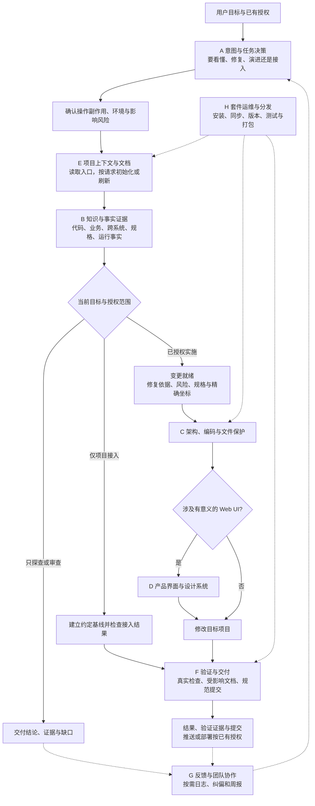

# 团队工具套件全景：按工程职责域看链路与节点

这套工具帮助 AI 把自然语言目标转成有依据、边界明确、可验证、可交接的工程成果。它同时管理“怎样工作”和“依据什么工作”：前者是工程规范，后者是项目事实、业务知识与行为规格。

本文按工程职责域组织，不要求每个任务跑完全部节点。它是导航与职责说明，执行细则仍以各 Skill、项目规则和工具契约为准。基于 3.3.0 工作区核对：三个公共插件合计 18 个 Skill，其中 team-standards 21 个。

需要从节点找到实际文件、理解 Skill 与程序的关系时，先看 [链路源码导航](skill-flow.md#总图节点对应哪些源码)。

阅读顺序：[组件](#组件分别是什么) → [全景图](#八个职责域的全景链路) → [节点字典](#节点字典) → [机械门禁](#机械门禁在什么位置工作) → [实际任务](#六种任务如何穿过全景图) → [接入边界](#能力存在与项目已接入的区别)。

## 组件分别是什么

| 组件 | 在整套中扮演什么角色 | 保存或提供什么 |
|---|---|---|
| team-standards | 工程工作方法与质量约束 | 21 个 Skill、Hook、状态契约工具及套件维护脚本 |
| project-coding-profiles | 遗留项目编码保护 | encoding-guard、项目识别画像、逐文件编码约定与写前/提交检查 |
| project-domain-knowledge | 业务知识内容与 MCP 查询引擎 | 经确认的术语、规则、状态语义，以及与正式知识分开的规格候选 |
| cross-project-topology | 系统连接知识内容 | 跨项目调用、数据流、提供方/消费方和接口契约；复用知识引擎作为第二个 MCP 实例 |
| yoooni-daily-plugin | Yoooni 团队协作辅助 | SMB 访问诊断/修复、Hook 周报两个 Skill；另有安装更新维护脚本 |
| 目标业务项目 | 真正被分析、修改与验证的对象 | 源码、测试、DDL、配置、项目 AGENTS、本地 Skill、OpenSpec 与验证配置 |
| Graphify / OpenSpec / Forge 与宿主 | 按项目安装或接入的外部能力 | 代码图谱、变更规格、验证执行，以及实际工具与权限；不是上述五仓自动内置的业务环境 |

Skill 是 Agent 按需读取的工作规则；MCP 是工具调用接口；Hook 是宿主事件触发的检查；知识库是带来源的内容；脚本是需要执行才生效的程序。它们的存在不代表每个项目都已经接入或执行。

## 八个职责域的全景链路

实线表示主任务推进，虚线表示按需查询或反馈。图中每个域都在下方有对应节点字典。

接入只检查状态时可直接返回结果，不需要产生提交。探查中发现 Bug 或优化点只形成发现，不自动取得实施授权。已明确要求“查明并修复”的任务则在证据充分后继续，不逐阶段重复审批。

## 节点字典

### A：意图与任务决策域

这个域决定“当前任务要交付什么”，不靠意图名称授予写权限或决定风险档位。

| 节点 | 输入 | 做什么 | 输出与下一站 |
|---|---|---|---|
| 意图/授权/风险判断 | 当前请求、历史授权、项目与环境 | 分别判断目标、可做范围、具体副作用和 S/M/L 影响 | 专业主入口与必要阶段；没有独立总路由 Skill |
| [business-logic-orientation](../plugins/team-standards/skills/business-logic-orientation/SKILL.md) | 现有业务、源码与行为问题 | 理解入口、分支、依赖和不变量，区分事实与推断 | 现状结论；已授权重构时给 change-readiness 提供依据 |
| [bug-doc-required](../plugins/team-standards/skills/bug-doc-required/SKILL.md) | 现象、预期、日志或失败测试 | 调查根因；有授权才做最小修复；按风险选择记录载体 | 诊断结论，或修复依据与回归结果；简单 Bug 不强制独立报告 |
| [change-readiness](../plugins/team-standards/skills/change-readiness/SKILL.md) | 已授权变更目标、影响与项目规则 | 审视方案、分档、定位；按项目 OpenSpec 或合法兼容路径准备实施 | 设计依据、活动切片和代码坐标；进入架构与实现 |

入口细则见 [CLAUDE 的意图规则](../CLAUDE.md#意图授权与风险)，成对请求见 [路由场景](skill-flow.md#易混淆请求的预期路由)。

### B：知识与事实证据域

这个域分别回答“业务应该怎样”“代码现在怎样”“系统之间怎样连接”“现场实际发生了什么”。这些答案可能不一致，必须解释差异，不能互相替代。

| 节点 | 输入 | 做什么 | 输出与消费者 |
|---|---|---|---|
| Graphify | 当前项目源码与图谱版本 | 查调用、依赖、实现坐标和候选影响；消费前检查新鲜度 | 当前实现事实，供现状分析、设计和回归定位使用 |
| OpenSpec | 已接受 specs、当前 change 与任务 | 表达目标行为和活动变更；按生命周期维护、校验、同步、归档 | 可追踪行为契约；不能单独证明运行正确 |
| Domain Knowledge | 项目、模块、术语或业务问题 | 渐进查询经确认的业务语义，保留来源与稳定性 | 术语、规则、状态、公式与业务流程；供设计和解释使用 |
| Cross-project topology | 相关系统与调用/数据流问题 | 查询跨项目连接、接口提供消费关系和失败边界 | 跨系统影响范围；不能替代单项目代码图谱 |
| DDL / 数据库 / 日志 / 测试 | 授权环境与有边界的查询 | 核实真实结构、记录、执行计划和运行行为 | 现场证据；只读查询仍需考虑负载、租户和敏感数据 |
| [backend-evidence](../plugins/team-standards/skills/backend-evidence/SKILL.md) | 表、SQL、状态、字段、事件、API 或性能问题 | 协调上述来源，核对数据关系、不变量、反向影响和性能依据 | 后端事实结论与待验证影响，送往方案、实现或回归 |
| 规格挖掘与评审 | 代码、DDL、日志与历史证据 | 形成对象/状态/不变量/冲突候选，保留反例与评审状态 | 候选经 owner 评审后才可晋升，不把高频实现当业务真理 |

知识查询通常先目录/摘要，再全文：`list_projects` → `list_modules/list_topics/search_knowledge` → `get_knowledge/get_related`。模块咨询和规格候选分别使用引擎提供的上下文、Core Spec 与候选查询接口，按当前契约调用，不要求每次全部执行。

状态相关任务还有一条贯穿链：change-readiness 登记契约与影响 → backend-evidence 核实数据和不变量 → business-logic-orientation 定位消费者 → delivery-verification 执行已登记检查。共享工具见 [状态契约协议](../plugins/team-standards/skills/change-readiness/references/state-contract.md)；静态扫描不是业务 PASS。

### C：架构、编码与文件保护域

| 节点 | 输入 | 做什么 | 输出与下一站 |
|---|---|---|---|
| [architecture-ddd-lite-fullstack](../plugins/team-standards/skills/architecture-ddd-lite-fullstack/SKILL.md) | 需求边界、现有结构与实现坐标 | 确定 Feature、层次、可复用能力及单向依赖 | 放置代码的边界与依赖约束 |
| [coding-standards-common](../plugins/team-standards/skills/coding-standards-common/SKILL.md) | 本次源码改动 | 约束命名、职责、错误处理、重复、测试与注释 | 清晰、可维护的实现基线 |
| [java-coding-standards](../plugins/team-standards/skills/java-coding-standards/SKILL.md) | Java 改动 | 在 common 上叠加 Java、并发、集合、日志与关系库规则 | Java 专属约束；不用于非 Java 任务 |
| [llm-agent-coding-standards](../plugins/team-standards/skills/llm-agent-coding-standards/SKILL.md) | LLM SDK、Prompt、工具调用或 Agent 循环 | 校验信任边界、参数、结构化输出、超时与循环出口 | 可检查的模型集成契约与失败处理 |
| [encoding-guard](https://github.com/exception-coder/project-coding-profiles/blob/main/plugins/project-coding-profiles/skills/encoding-guard/SKILL.md) | 已登记项目的待修改文件 | 识别画像，核对实际编码，必要时安全转换回环并复核 | 保持原编码的文件；不批量转换未触及文件 |

前两项是结构与编码的共同基线，后面三项按技术和项目触发。项目自己的 AGENTS、本地 Skill 与编码画像提供具体例外和路径，不由公共套件猜测。

### D：产品界面与设计系统域

| 节点 | 输入 | 做什么 | 输出与下一站 |
|---|---|---|---|
| [design-system](../plugins/team-standards/skills/design-system/references/review-mode.md) | 有意义的 UI 修改或视觉审查 | 读取项目绑定、Profile 和既有实现，控制复用与探索，核对漂移 | UI 约束与视觉验收结论 |
| [frontend-excellence](../plugins/team-standards/skills/frontend-excellence/SKILL.md) | 新建、重做或显著改善 Web 前端 | 设计并实现布局、组件、响应式、可访问性与完整交互状态 | 可运行页面及真实浏览器验证结果 |

有可复用 Profile 时直接消费，不每次重建。典型链路是“绑定/读取设计依据 → 页面实现 → 代表性浏览器验收”，纯文字修改不跑完整设计循环。

### E：项目上下文与文档域

| 节点 | 输入 | 做什么 | 输出与下一站 |
|---|---|---|---|
| 项目 AGENTS / 本地 Skill | 当前项目及工作目录 | 提供项目边界、启动测试方法、目录和专属操作规则 | 所有专业节点的项目上下文；由项目拥有 |
| [init-project-docs](../plugins/team-standards/skills/init-project-docs/SKILL.md) | 接入、初始化、刷新或状态请求 | status 只检查；structure/init/onboard 建立或编排约定基线；refresh 更新已授权上下文；profile 按请求生成画像 | Agent/文档/OpenSpec/Graphify 入口与接入缺口，不生成虚构业务内容 |
| [markdown-writing-standards](../plugins/team-standards/skills/markdown-writing-standards/SKILL.md) | 文档变更或套件/项目交付 | 查唯一归属、同步受影响事实、校验结构与链接、维护索引 | 当前有效的说明与导航；不要求每次任务另写报告 |

文档写到哪里取决于用途和已有约定：行为契约归 OpenSpec，稳定语义归业务知识，跨系统连接归拓扑，日常日志默认由 Git 承载，按需个人日报默认在用户目录。不要用 README、日志或图谱复制另一份完整规则。

### F：验证与交付域

| 节点 | 输入 | 做什么 | 输出与下一站 |
|---|---|---|---|
| [delivery-verification](../plugins/team-standards/skills/delivery-verification/SKILL.md) | 本次可执行改动与项目验证配置 | 优先调用可用 Forge；否则按声明与影响执行原生验证，判断实际执行和最新证据，失败时有限修复 | 明确通过/失败/环境缺口；静态与运行结果分开 |
| Forge / 项目测试与运行环境 | 已登记验证场景、当前构建与配置 | 真正运行检查、测试、数据库或浏览器场景 | 可核验执行记录；工具注册不等于执行完成 |
| [git-commit-standards](../plugins/team-standards/skills/git-commit-standards/SKILL.md) | 已完成、验证过的本次文件/片段 | 核对文档、范围和真实作者，生成三段正文并自动本地提交 | 可审查 commit；不混入无关暂存内容 |
| 推送 / 部署 | 已有明确授权、目标与项目流程 | 推送指定远端或执行项目自己的发布流程 | 远端提交或经验证的发布结果；本地 commit 不自动授权部署 |

本地测试按影响选择；快测只提供对应契约证据，不能替代集成场景。纯文档交付做文档检查，不编造运行证据。完整门禁与命令见 [维护与验证](../README.md#维护与验证)。

### G：反馈与团队协作域

| 节点 | 输入 | 做什么 | 输出与回流位置 |
|---|---|---|---|
| [yoooni-hook-report](https://github.com/exception-coder/yoooni-daily-plugin/blob/master/plugins/yoooni-daily-plugin/skills/yoooni-hook-report/SKILL.md) | 用户要求团队 Hook 周报或反馈分析 | 汇总命中、warn、纠正及脱敏信号 | 反馈报告；不自动修改规则或业务项目 |
| [yoooni-smb-share-access](https://github.com/exception-coder/yoooni-daily-plugin/blob/master/plugins/yoooni-daily-plugin/skills/yoooni-smb-share-access/SKILL.md) | IT01 SMB 访问异常或明确修复请求 | 诊断网络、凭据与安全策略，在授权下修复访问 | 访问诊断或恢复结果；不承担项目环境初始化 |

反馈进入下一轮规则优化需要证据和具体任务授权。命中多不等于规则错，warn 多也不自动升级为 block。

### H：套件运维与分发域

这些是维护命令，不是新增的意图 Skill。

| 节点 | 输入 | 做什么 | 输出 |
|---|---|---|---|
| 安装/更新/检查/卸载脚本 | 目标宿主与用户操作 | 安装或维护插件和 MCP 配置；自动更新计划须明确启用 | 可用版本与安装状态，具体脚本在 yoooni-daily-plugin |
| sync-agents.js | CLAUDE.md | 生成 Codex 的 AGENTS.md；check 模式检测漂移 | 两个宿主入口同源 |
| shared-contracts.mjs + sync-shared-contracts.mjs | 主副本与登记的消费者路径 | 默认预览；显式写入前保护目标本地工作 | 独立插件内的一致副本；消费者仍独立验证升版 |
| check-workspace-contracts.mjs | 共享副本及完整性元数据 | 检查漂移与主副本完整性 | 同步是否一致，不替代语义回归 |
| sync-workspace-overview.mjs + check-version-sync.js | manifest、实际 Skill 目录、根 README | 更新/校验组件版本与数量；不覆盖说明正文 | 准确的元数据摘要 |
| check-cross-refs / audit-skills / runtime-version-bump / graphify-freshness | 入口、引用、载荷差异与来源指纹 | 校验可达性、健康度、升版规则和图谱来源新鲜度 | 发布前静态检查结果 |
| test:fast / test:full / CI | 当前代码、fixture 与环境 | 执行轻量契约或完整回归；CI 按配置运行 | 实际测试结果，不把全量耗时当作单次编辑延迟 |
| release-team-tools.mjs | 完整套件工作区与输出目录 | 预检共享契约、总览、元数据与测试，打包三个插件并生成清单/校验和 | dry-run 分发产物；不自动上传或部署业务系统 |

维护细则和当前命令统一见 [README](../README.md#维护与验证)。各插件保留独立 Git 仓库；根 team-tools 本身不是 Git 仓库。

## 机械门禁在什么位置工作

下表描述当前注册节点的职责，不表示所有宿主都实际触发。具体 warn/block/off、匹配条件与宿主验收状态以配置和实测为准。Hook 不是操作系统沙箱。

| 时点 | 节点 | 检查或记录什么 |
|---|---|---|
| 用户输入 | prompt-signal-capture | 按配置筛选、脱敏并登记有价值的提示/纠正信号 |
| 用户输入 | check-plugin-version-stale | 提醒插件版本可能过期，不等于自动更新 |
| 文件修改前 | change-input + write-guard-dispatcher | 适配写入事件，把同一输入分发到启用的检查器并汇总结果 |
| 写入分发 1 | check-change-readiness | 实施依据及活动 change 是否满足已声明要求 |
| 写入分发 2 | check-architecture-boundaries | 可机械识别的模块依赖、Feature 边界等风险 |
| 写入分发 3 | check-backend-evidence-readiness | 后端变更是否具备要求的上下文证据 |
| 写入分发 4 | check-comment-density | 注释密度与相关内容风险 |
| 写入分发 5 | check-sql-ddl-readiness | SQL/DDL 变更所需结构依据 |
| 写入分发 6 | check-sql-correctness-risk | 可识别 SQL 正确性风险 |
| 写入分发 7 | check-query-performance-risk | 查询性能风险信号 |
| 已退役兼容入口 | check-ai-doc-location | 当前不分发；旧宿主调用无副作用放行，不再要求个人文档目录 |
| 写入/提交保护 | check-file-encoding / pre-commit-encoding | 已登记项目文件是否保持要求的编码；Git 兜底须已安装 |
| Bash 提交前 | check-git-commit-skill | 需要重审的提交是否进入提交 Skill |
| Bash 提交前 | check-commit-no-ai-signature | 标题、三段正文、真实 Author 与 AI 署名约束 |
| 完成前 | check-delivery-verification | 当前相关可执行改动是否有有效验证证据 |
| 完成前 | check-openspec-governance | 已接入 OpenSpec 治理的绑定、范围、阶段与证据条件 |
| 按配置记录 | hook-metrics / event-log | 最小化性能指标与结构化 Hook 事件；为排查和反馈提供数据 |

注册来源：[hooks.json](../plugins/team-standards/hooks/hooks.json)；八个写入检查来源：[dispatcher](../plugins/team-standards/hooks/write-guard-dispatcher.js)。Shell、外部工具与未支持事件可能不受这些检查覆盖，仍需宿主权限、访问凭据和具体操作判断。

## 六种任务如何穿过全景图

| 任务 | 实际路径 | 完成时应得到什么 |
|---|---|---|
| “解释订单状态为什么这样流转” | A 现状/异常探查 → B 业务知识、代码、规格及必要运行证据 | 当前事实与预期的解释；没有实施授权就不改项目 |
| “查明金额错误并修复” | A 修复调查 → B 金额/状态事实 → 变更就绪 → C 实现 → F 回归与提交 | 根因、聚焦修复、真实回归和本次 commit；必要文档同步 |
| “增加审批页面与接口” | A 演进 → B 行为/数据/跨系统影响 → C 分层 → D UI → F 验证交付 | 接口与页面实现、异常/空态等交互及运行验证 |
| “评估是否迁移系统” | A 跨项目规划 → B 领域规则、拓扑、当前实现与估算证据 | 有依据的选项、成本与缺口；不自动创建实施 change |
| “初始化新项目的 AI 工作基础” | A 接入 → E 初始化/编排 → F 接入检查及适用提交 | 可用入口和基线、已接入/未接入能力清单，不自动开发业务 |
| “优化团队套件并同步发布” | A 演进或指定维护动作 → H 同步/校验/打包 → E 文档 → F 提交及授权推送 | 一致的源文件与版本、验证证据、可分发产物或明确远端结果 |

## 能力存在与项目已接入的区别

| 能力 | 要实际工作还需要什么 | 缺失时如何表述 |
|---|---|---|
| Skill 路由 | 宿主加载当前插件和项目上下文 | 源码文档更新不等于所有成员会话已升级 |
| Graphify | 已安装能力、项目图谱及来源新鲜度 | 图谱缺失/过期时定向源码取证并披露覆盖缺口；只读任务不擅自重建文件 |
| OpenSpec | 项目已完成配置、活动变更和 CLI | 按变更就绪规则处理，不伪造活动 change 或静默绕过 |
| Forge / 规划证据平台 | 可调用工具、项目/关系登记、验证配置与实际环境 | 缺口如实报告；规划账本不能猜造，验证降级按对应 Skill 执行 |
| Domain / Topology MCP | 内容目录、引擎进程与宿主注册 | 文件存在不等于 MCP 已连通，候选存在不等于业务结论已确认 |
| 编码保护 | 匹配的画像、准确编码映射、宿主 Hook 或 Git Hook 接入 | 未登记项目不宣称已得到画像保护 |
| UI 验收 | 项目绑定、设计资产、可运行页面与浏览器 | 规范存在不等于页面已渲染或验收通过 |
| 日常协作 | 授权网络访问、事件数据及相应配置 | 不把无数据当零问题，不把周报生成当规则已优化 |

部署、生产权限、数据库连接、业务启动和项目专属脚手架由目标项目拥有。套件提供方法、证据路由和检查能力，具体业务结果必须由当前项目的实际执行来证明。
