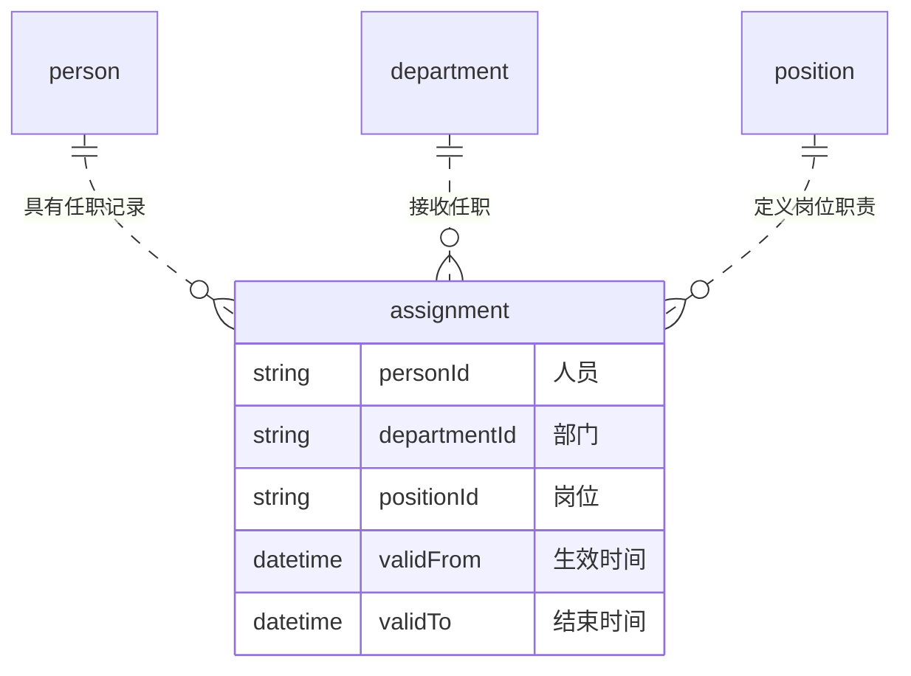

# 编写示例：把对象和规则讲清楚

这些示例用于展示表达方法，不规定所有项目必须采用相同对象、状态或安全策略。

## 对象表之前先解释拆分理由

不充分的表达：只列出人员、部门、岗位、任职四个对象及字段。

更清晰的表达：人员回答“谁”，部门回答“在哪个组织”，岗位回答“承担什么职责”，任职把三者与生效时间连接起来。人员换岗时结束旧任职并新增任职，避免覆盖历史。是否支持兼职属于首期范围决策，不能因为画了一对多关系就默认需要兼职管理界面。

假设当前设计已确认一条任职必须关联一个人员、部门和岗位，可画：

读图说明：一个人员可以没有任职，也可以有多条当前或历史任职；每条任职引用一个人员、部门和岗位。连线是逻辑关系，不要求建立物理外键；若项目允许任职不指定岗位，应同步调整基数与文字。

资料来源约定、身份核对问题和紧急停用记录，宜另画协作关系图，不强行用同一种 ER 关系连在一起。只有数据流图仍然不足以解释任职为何是独立对象。

## 长段落拆成可顺读的规则

原来的问题：同一段同时解释在职、离职、恢复、ERP 不可用、多来源、缓存和权限，读者需要自行还原算法。

改写顺序：

1. 状态表说明状态含义与转换条件；现有状态图放在附近。
2. 编号步骤说明检查次序，例如紧急阻断、来源确认、状态、任职。
3. 小段落说明数据从哪来，避免把“读取同步记录”误解为每次请求远程查询。
4. 异常表区分资料过期与来源冲突，分别引用项目已确认的处理规则。

| 情况 | 需要写清的内容 |
|---|---|
| 来源暂不可用但同步资料仍有效 | 是否继续读取本地资料，紧急阻断是否仍生效 |
| 同步资料过期 | 返回结果、允许或拒绝哪些请求、策略归属 |
| 来源冲突 | 是否阻断、谁处理、恢复条件 |

不要在简化表述时自行改变放行规则；若原文规则不完整，应把缺口列为待确认，而不是用漂亮的表格掩盖。

## 扩展留口不等于提前建框架

| 能力 | 基础版 | 扩展位置 | 后置内容 |
|---|---|---|---|
| 文件存储 | 一种存储实现及上传下载授权 | 存储适配接口 | 多存储路由、在线迁移管理 |
| 审批 | 一种固定流程实现及待办、结果事件 | 业务审批契约和内部执行边界 | 双引擎并存、设计器、复杂编排 |

评审时检查：若后置编排仍出现在首期实体表、公开接口或验收用例里，范围尚未真正收敛。仅写“以后扩展”不能抵消详设中的实施要求。

## 术语替换先核对含义

以下是本次经验中的反例，用于核对含义，不要求每份设计都出现这些术语，也不替项目决定实现方案。

| 原词或建议 | 直接替换的问题 | 更准确的表达方式 |
|---|---|---|
| 可信主体 → 当前登录人 | 遗漏服务账号和其他非人员身份 | 已核验的人员或服务账号；身份由认证模块确认，不能信任请求参数自报 |
| 可靠投递 → 保证送达 | 把记录、重试和失败处理扩大为无条件成功承诺 | 保存待发送记录、跟踪结果、重试并处理最终失败；外部系统是否处理成功须另行确认 |
| 消费幂等 → 重复消费不出错 | “不报错”不等于“不重复产生业务效果” | 同一事件重复处理不重复扣款等；具体去重范围按原设计 |
| 下一次请求生效 → 改完即生效 | 掩盖提交时点、进行中请求及外部同步延迟 | 平台变更提交成功后，下一次请求按新状态检查；外部变化按同步规则发现 |
| 公开契约 → 免登录接口 | 混淆模块间调用约定与认证要求 | 公开接口及输入输出、事件和错误约定；仅明确登记的免登录端点免认证 |
| 模块化单体 → 只能一个进程部署 | 把同一应用内模块协作误写成只能运行一个实例 | 构建为一个后端应用，可按部署方案运行多个实例 |
| 双时态 → 完整历史查询 | 丢失两种时间维度 | 分别记录业务何时生效、系统何时记录或更正 |
| RPO → 最多丢多少数据 | 容易误解为行数或容量 | 可接受的数据丢失时间窗口；RTO 是目标恢复时长 |

试讲示例：“权威状态不可达则拒绝”仍需解释读取什么、拒绝谁。例如，在原规则如此规定时写成：“无法读取当前会话或权限状态时，拒绝本次受保护请求，不沿用旧结果。”不能顺手改成“ERP 一断开，全员拒绝登录”，因为 ERP 同步资料是否仍可用是另一条规则。

评审建议若本身改变了设计，不当作文字润色直接应用；明确指出变化，按用户已经授权的范围处理。已经清楚且准确的段落保持原样，无需为了试讲增加重复说明。
