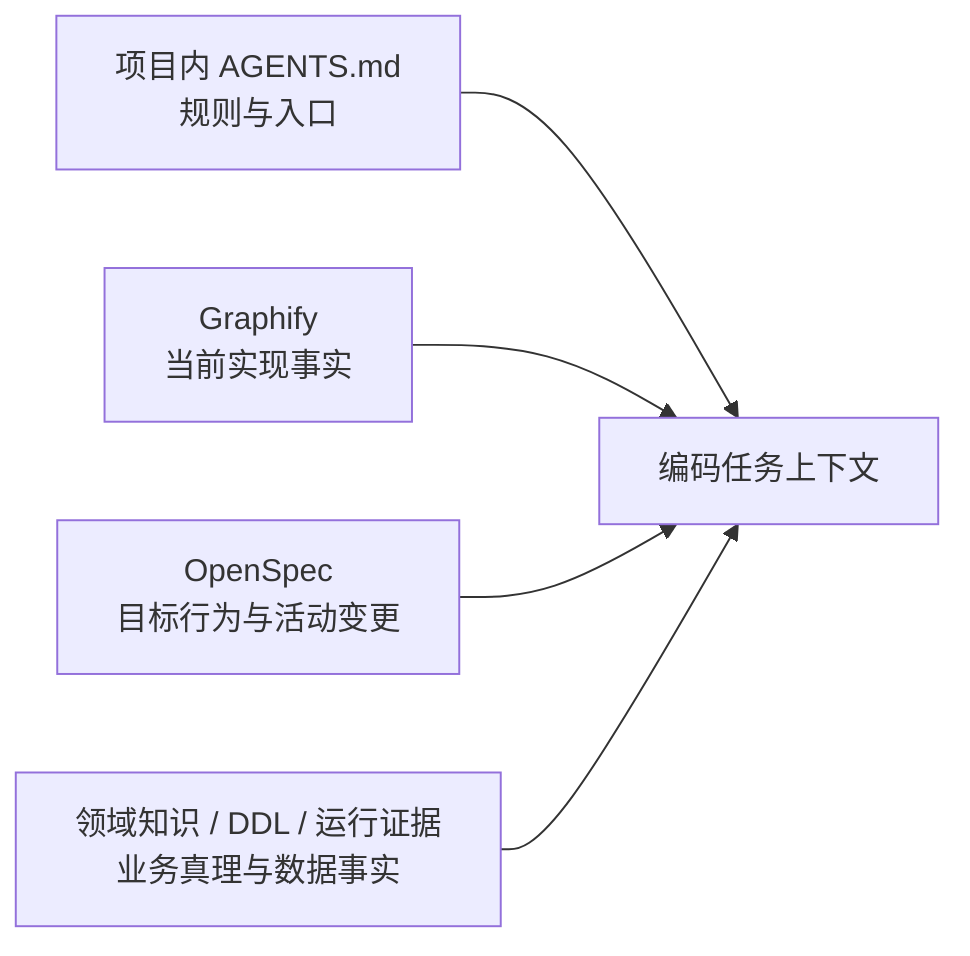

# 项目上下文接入

## 定位

本 Skill 是项目上下文的轻量编排入口，不是文档生成器，也不维护第二套代码事实或业务规格。



## 模式

- `onboard`：新系统首次接入时读取 [references/onboard-workflow.md](references/onboard-workflow.md)，使用 `onboard-pipeline.mjs` 断点续跑。
- `structure`：用户要求初始化 AI 工程结构、AI 目录或默认项目解析结构时，读取 [references/initialization-output.md](references/initialization-output.md)，在当前目录执行 `init-ai-structure.mjs`，建立六层职责入口、Graphify 输入边界和 Git 共享边界。
- `init`：读取 [references/initialization-output.md](references/initialization-output.md)，先执行 `structure`，再构建或校验 Graphify、严格校验 OpenSpec，并报告领域知识与运行证据连接状态。
- `refresh`：读取 [references/update-workflow.md](references/update-workflow.md)，按 Git 变化刷新权威产物，不生成平行投影。
- `status`：只读检查项目入口、图谱新鲜度、OpenSpec 状态和知识缺口。
- `profile`：用户明确要求独立画像时读取 [references/project-profile-generation.md](references/project-profile-generation.md)，只生成一份轻量导航。

## 权威边界

| 权威来源 | 唯一职责 | 本 Skill 的行为 |
|---|---|---|
| 项目 `AGENTS.md` / 项目内 Skill | 项目特有编码、目录、接线、启动与验证规则 | 读取、补入口；不复制团队通用规则 |
| Graphify | 当前代码的模块、符号、调用、API、数据访问与依赖 | 调用、查询、检查新鲜度；不再生成 `modules.md` 等镜像 |
| OpenSpec | 已接受行为与活动变更 | 初始化或链接；不复制 proposal/spec/design/tasks |
| Domain Knowledge | 术语、业务规则、状态语义与经确认决策 | 建立项目映射；候选仍经人工确认 |
| DDL / 数据库 / 日志 | 表结构与运行事实 | 记录权威入口；不由静态图谱推断替代 |

## 共享流程

### 初始化内容摘要

| 类型 | `structure` 负责 | `init` 继续负责 |
|---|---|---|
| 项目入口 | `AGENTS.md`、`CLAUDE.md` | 读取并核实项目边界与项目自有规则 |
| 长期文档 | `docs/README.md`、`docs/INDEX.md`、`docs/ai-coding-architecture.md` | 检查权威入口和知识缺口，不生成 00–10 文档树 |
| 行为规格 | `openspec/AGENTS.md`、`openspec/config.yaml` | 严格校验配置和活动 change，不伪造 specs/changes |
| 代码图谱 | `.graphifyignore` 与 `.gitignore` 共享白名单 | 由 Graphify 生成或刷新 `graph.json`、`manifest.json`、`GRAPH_REPORT.md` |
| 领域与运行事实 | 不生成正文 | 识别领域知识、DDL、数据库、日志和验证命令入口并报告状态 |

完整文件、保留策略和明确不初始化的内容见 [references/initialization-output.md](references/initialization-output.md)。

### 0. 初始化 AI 工程结构

用户明确要求初始化时，当前目录就是默认项目根；只有用户给出其它路径时才使用 `--root`。执行：

```text
node <skill-root>/init-ai-structure.mjs plan --root <project-root>
node <skill-root>/init-ai-structure.mjs apply --root <project-root>
```

先回显 `plan` 的 `missing/preserved/update` 清单，再运行 `apply`。显式执行本 Skill 即授权创建当前项目范围内的缺失结构；不得扩展到父目录、用户主目录或其它仓库。

脚本创建最小入口：

- `AGENTS.md` 与 `CLAUDE.md`
- `docs/README.md`、`docs/INDEX.md`、`docs/ai-coding-architecture.md`
- `openspec/AGENTS.md` 与 `openspec/config.yaml`
- `.graphifyignore` 中团队共享的 Graphify 输入排除基线
- `.gitignore` 中受标记管理的 Graphify 共享边界

已有文件按字节保留并标记 `preserved`，由 Agent 读取后决定是否需要人工合并；禁止使用强制覆盖绕过项目自有规则。脚本不创建空 `.codex/skills`、领域、设计、ADR、OpenSpec specs/changes 或 `graphify-out/` 目录。

`apply` 后继续执行当前安装的 Graphify Skill；首次项目构建图谱，已有图谱则检查新鲜度并按需增量更新。随后运行 OpenSpec 严格校验。最后执行：

```text
node <skill-root>/init-ai-structure.mjs status --root <project-root>
```

Graphify 产物缺失属于 `pending`，不是脚本伪造文件的理由；OpenSpec 只有空配置时也必须报告 `initialized-empty`，不能包装为已具备业务规格。

### 1. 确认项目身份

1. 确认项目根、仓库/系统边界、当前 HEAD 与工作区变化。
2. 读取 `AGENTS.md`、README、构建文件和既有索引，识别项目自有规则。
3. 缺少 Agent 入口时通过 `structure` 模式补齐；不得自动创建 00–10 文档树。

### 2. 校验实现事实

1. 完整读取当前安装的 Graphify Skill，并按其当前版本查询、增量更新或首次构建。
2. 使用图谱前验证它覆盖当前 HEAD 和任务涉及的未提交文件；过期时刷新，或用 `git diff`、`rg` 与定向源码读取补齐并声明缺口。
3. Graphify 不可用时允许确定性扫描降级，但必须标记 `fallback`。
4. 不把 `graph.json`、HTML、报告或查询结果复制成长期维护的 Markdown 清单。

### 3. 校验目标行为与业务真理

1. 若存在 `openspec/config.yaml`，通过 OpenSpec CLI 检查配置、活动 change 与严格校验结果。
2. OpenSpec 缺失时只在项目确实采用该工作流且用户授权初始化时创建，不能把空模板报告为已具备规格。
3. 领域知识、DDL 与运行证据只记录唯一入口和状态；缺失内容作为 gap，不在项目说明中补写猜测版正文。

### 4. 输出状态

默认只在会话中输出状态摘要：

```text
项目上下文状态：
- 项目边界：{repos/services}
- Agent 入口：{ready|missing|stale}
- Graphify：{fresh|stale|missing|fallback}
- OpenSpec：{active|initialized-empty|missing|not-applicable}
- 领域知识：{stable|draft|missing|not-applicable}
- 数据/运行证据：{verified|partial|missing|not-applicable}
- 待处理缺口：{gaps}
```

只有用户明确要求持久化项目画像时才写一份 `project-profile.md`；已有 README、AGENTS 或知识索引能承担导航时，不新增文件。

## 完成标准

- 每类事实只有一个权威正文，链接可达且状态可验证。
- Graphify 与当前 Git/工作区的覆盖关系已说明。
- OpenSpec 的“当前目标”与 Graphify 的“当前实现”没有混为一谈。
- 未确认业务候选、空规格和缺失运行证据被如实标记。
- `status` 不写文件；其他模式只修改当前模式拥有的入口或权威产物。

## 约束与协作

- 不自动安装或升级 Graphify/OpenSpec，不修改全局配置，不创建定时任务。
- 不把 Yoooni One 的 Java、React、Oracle、模块命名或业务规则写入通用初始化模板。
- 不把项目特有规范写回公共插件；它们属于项目 `AGENTS.md` 或项目内 Skill。
- `backend-evidence` 按需查询 Graphify、领域知识、DDL 与运行证据，不消费二次影响索引。
- `change-readiness` 以 OpenSpec/兼容设计为变更依据，以 Graphify/源码为实现坐标。
- `markdown-writing-standards` 只在实际写 Markdown 时叠加。
- `git-commit-standards` 可提示上下文过期，但不强制每次提交重建。
