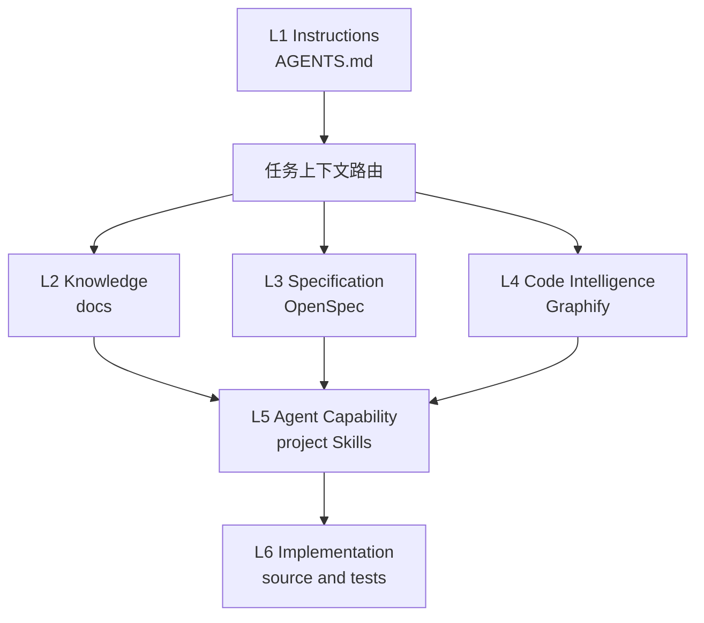

# {{PROJECT_NAME}} AI 编程结构规范

本规范定义 Agent 如何在项目规则、长期知识、行为规格、代码事实、执行能力和实现代码之间选择上下文。六层是职责模型，不要求每层都复制为同名目录。

## 目录速览

```text
{{PROJECT_NAME}}/
├── AGENTS.md                     项目规则与上下文总入口
├── CLAUDE.md                     Claude 适配器
├── docs/                         人工维护的长期知识
│   ├── README.md                 面向人的阅读入口
│   ├── INDEX.md                  面向 Agent 的权威文档索引
│   └── ai-coding-architecture.md 本规范
├── openspec/                     已接受行为与活动变更
│   ├── AGENTS.md                 OpenSpec 局部规则
│   └── config.yaml               项目上下文与 artifact 规则
├── .graphifyignore               Graphify 输入排除边界
├── .gitignore                    Graphify 共享产物白名单
├── graphify-out/                 Graphify 后续生成的当前代码事实
│   ├── graph.json                Agent 查询的共享图谱
│   ├── manifest.json             增量更新与新鲜度依据
│   └── GRAPH_REPORT.md           人工审计报告
├── .codex/skills/                项目特有能力 按需创建
└── source and tests              最终实现与验证证据
```

不提前创建空的项目 Skill、领域、设计、决策或规格目录。初始化脚本只创建 `.graphifyignore` 和 `.gitignore` 共享边界；`graphify-out/` 及其内容由 Graphify 生成，不由初始化脚本伪造。

---

## 六层职责模型

| 层级 | 权威内容 | 典型落位 | 回答的问题 |
|---|---|---|---|
| L1 Instructions | 强制规则与任务路由 | `AGENTS.md`、适配器 | Agent 必须遵守什么 |
| L2 Knowledge | 人工确认的知识与理由 | `docs/` | 为什么这样设计 |
| L3 Specification | 已接受行为与计划变更 | OpenSpec | 系统应该怎样工作或变化 |
| L4 Code Intelligence | 当前模块、调用、依赖与影响 | Graphify | 代码现在怎样连接 |
| L5 Agent Capability | 可复用执行方法 | 项目内 Skills 和脚本 | Agent 怎样完成任务 |
| L6 Implementation | 源码、测试与运行配置 | 项目工程目录 | 精确实现是什么 |



---

## 默认检索路由

1. 先读根或最近作用域的 `AGENTS.md`。
2. 架构原因、术语、开发约定和 ADR 经 `docs/INDEX.md` 定位。
3. 当前接受行为和活动变更分别查询 `openspec/specs/` 与 `openspec/changes/`。
4. 陌生代码入口、调用链和影响范围先查询新鲜 Graphify。
5. 最后只读取任务相关源码、测试、DDL、数据库或运行证据。

不得把宽泛全仓扫描作为陌生项目的默认第一步。Graphify 查询只用于缩小范围，编辑前仍须核对目标源码。

---

## 事实冲突处理

- 项目规则冲突时，以作用域最近且明确适用的 `AGENTS.md` 为准。
- OpenSpec 与代码不一致时，先确认 change 状态；不要自动把任一侧覆盖另一侧。
- Graphify 与源码不一致时，以当前源码为实现事实并刷新图谱。
- 文档业务语义与运行证据冲突时，记录候选差异并交由 owner 确认。
- OpenSpec、Graphify、测试和发布制品必须分别验证，不能相互代替。

---

## 目录落位规则

- 项目特有规则和能力归项目仓；团队通用规范只引用，不复制。
- 长期文档必须登记到 `docs/INDEX.md`，临时分析不自动升级为权威文档。
- OpenSpec 只承载可观察行为与变更，不复制代码结构报告。
- `.graphifyignore` 固定团队共同的扫描输入边界；项目特有的生成物或 vendor 路径在这里追加。
- Graphify 产物保持可再生；`.gitignore` 默认只共享 `graph.json`、`manifest.json` 与 `GRAPH_REPORT.md`，机器路径、缓存、成本和个人学习状态不得提交。
- `.codex/skills/`、`.claude/` 和知识子目录只有在出现真实内容时才创建。
