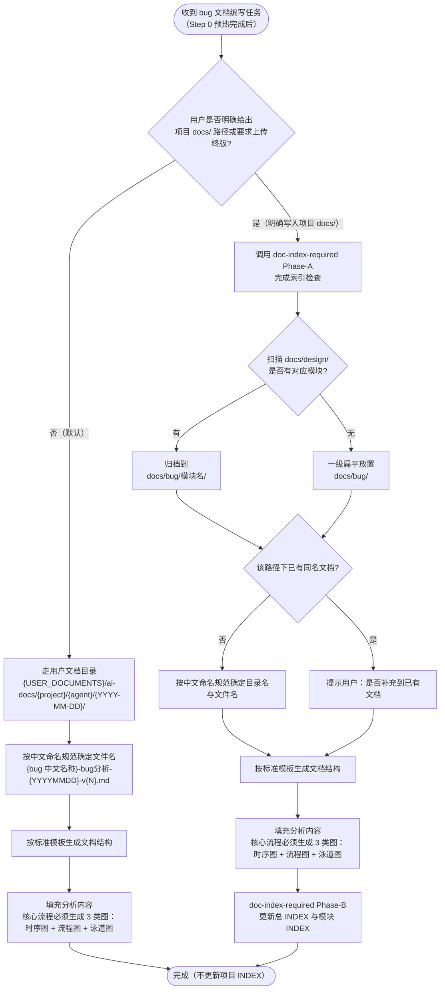
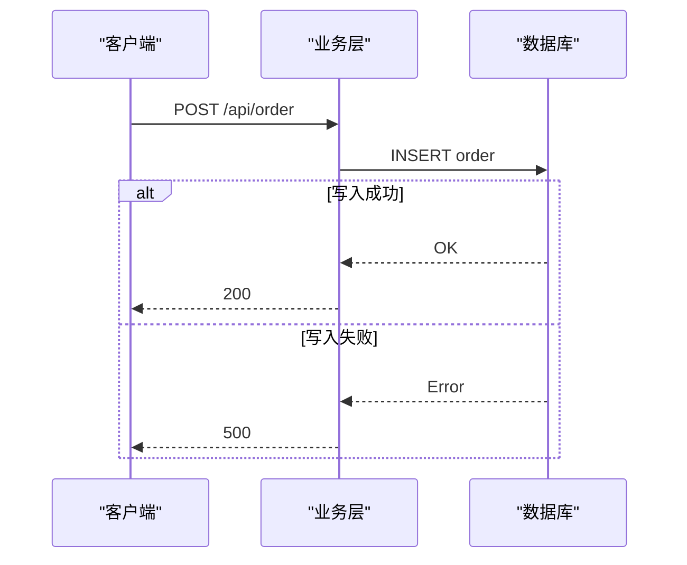
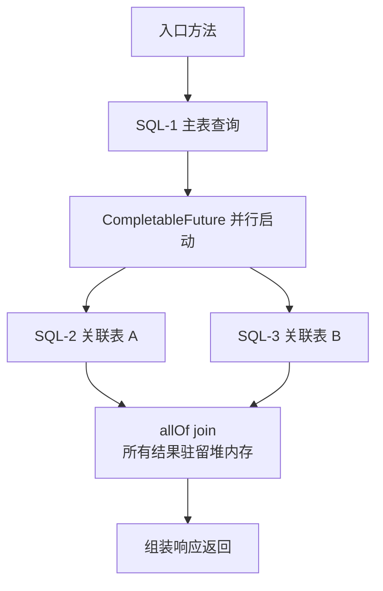
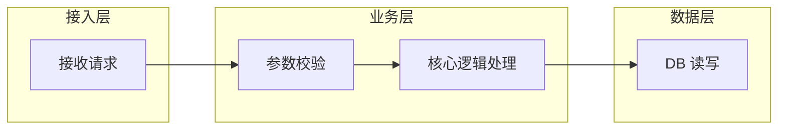

# Bug 分析文档强制规范

## 核心原则

**编写 bug 文档必须遵守标准章节结构，核心流程必须包含 3 类 Mermaid 图（时序图、流程图、泳道图）。**

---

## Step 0：知识图谱上下文预热

**在开始 Bug 分析之前，先加载项目知识图谱上下文，快速定位受影响的模块和架构约束。**

1. 检查项目 `docs/00_project_overview.md` 是否存在
2. **若存在**：
   - 读取该文件，获取项目全局索引 + AI 上下文路由表
   - 按路由表「Bug 修复」行加载：`08_constraints_and_rules` + `modules/{受影响模块}.md`
   - 按需：若 Bug 涉及数据库，追加读 `04_data_model_map`；涉及接口调用，追加读 `06_frontend_backend_mapping`
3. **若不存在**：跳过，直接进入下方流程（兼容无知识图谱的项目）

> Step 0 提供的上下文用于：准确判断 Bug 涉及哪些类/层/模块、识别是否违反架构约束、加速「涉及类清单」和「关键代码路径」的填写。

---

## 执行流程



---

## 输出路径边界

> **核心规则**：AI 生成的 bug 分析文档**默认写入用户文档目录**，不直接写入项目 `docs/bug/`。与 `design-doc-required` 保持一致，最终由用户确认终版后自行上传到项目，或在用户明确指定路径时由 AI 写入。

### 默认输出路径（用户未指定项目内路径时）

```text
{USER_DOCUMENTS}/ai-docs/{project}/{agent}/{YYYY-MM-DD}/{bug 中文名称}-bug分析-{YYYYMMDD}-v{N}.md
```

路径解析规则与 `doc-index-required` 完全一致：

1. Windows：`%USERPROFILE%\Documents\ai-docs\{project}\{agent}\{YYYY-MM-DD}\{文件名}`
2. macOS / Linux：`~/Documents/ai-docs/{project}/{agent}/{YYYY-MM-DD}/{文件名}`
3. 若系统没有 Documents 目录，兜底写入 `~/ai-docs/{project}/{agent}/{YYYY-MM-DD}/{文件名}`
4. `{project}` 取当前项目目录名；`{agent}` 取当前 AI agent 名称（`claude` / `codex` 等）

**默认路径下的文档：**
- 不调用 `doc-index-required` Phase-A / Phase-B，不更新任何 INDEX
- 写入前必须按 `doc-index-required` 的"输出路径回显"要求向用户展示一行目标路径
- 若同主题已有当日草稿，版本号 `v{N}` 自增追加，不覆盖旧版本

### 项目 docs/bug/ 例外（仅当用户明确要求时）

只有以下三种情况，AI 才允许把 bug 文档直接写入项目 `docs/bug/` 并触发 `doc-index-required` 全流程：

1. 用户明确给出 `docs/bug/...` 路径
2. 用户明确说"上传终版文档 / 写到项目 docs / 更新项目 bug 文档"
3. 当前操作是编辑、移动、整理已有 `docs/bug/` 下的文件

满足上述条件时，按下方"项目 docs/bug/ 归档结构"组织目录。

---

## 项目 docs/bug/ 归档结构（仅终版/用户指定路径时使用）

bug 文档在 `docs/bug/` 下**必须按模块分组**(对齐 `docs/design/` 的模块划分),结构为三级：

```
docs/bug/
  INDEX.md                              ← 顶层索引,列出所有模块目录和未归类 bug
  {模块名}/                              ← 模块目录,必须与 docs/design/{模块名}/ 同名
    INDEX.md                            ← 模块级 bug 子索引,列出该模块下所有 bug
    {bug名称}/                          ← bug 独立目录
      {bug名称}.md                      ← bug 分析文档,文件名与目录名一致
  {bug名称}/                            ← 若无对应 design 模块,退化为一级扁平结构
    {bug名称}.md
```

**命名规则：** 目录名和文件名统一使用**中文**描述 bug 核心现象(与 `docs/design/` 下模块命名保持一致风格):

```
docs/bug/
  退款退货逻辑重构/                      ← 对应 docs/design/退款退货逻辑重构/
    INDEX.md
    订单附加费必填字段缺失/
      订单附加费必填字段缺失.md
    退款算价结果缺分摊/
      退款算价结果缺分摊.md
  反结账/                                ← 对应 docs/design/反结账/
    INDEX.md
    结账回滚后金额未还原/
      结账回滚后金额未还原.md
  打印机启动闪退/                         ← 无对应 design 模块,一级扁平放置
    打印机启动闪退.md
```

**规范：**
- 模块目录名必须与 `docs/design/` 下已有模块**完全一致**(包括大小写、空格、下划线等),不允许同义替换
- 写入项目 `docs/bug/` 前必须先扫描 `docs/design/` 判断是否有对应模块：
  - 有 → `docs/bug/{模块名}/{bug名称}/{bug名称}.md`
  - 没有 → `docs/bug/{bug名称}/{bug名称}.md`(一级扁平,作为未归类兜底)
- bug 目录名和文档名使用中文,简洁描述核心现象,不加 `bug-` / `bug_` 前缀
- 目录名与文档文件名保持一致
- 禁止直接把 `.md` 文件放在 `docs/bug/` 或 `docs/bug/{模块名}/` 根目录下,必须建对应 bug 子目录
- 历史遗留的英文 kebab-case 目录**不要求强制迁移**,新建 bug 必须按新规则

---

## 标准章节结构

每份 bug 文档**必须包含**以下章节，顺序固定：

```
# {Bug 简要标题}

## 问题背景
## 触发条件
## 涉及类清单        ← 必须写全类名
## 关键代码路径      ← 文件路径 + 行号 + 说明
## 核心流程分析      ← 必须包含 3 类 Mermaid 图（时序图、流程图、泳道图）
## 相关代码 / SQL 清单
## 根因总结          ← 必须用表格
## 修复方案
```

各章节规范如下：

### 问题背景

必须包含：
- 接口或功能路径
- 现象描述（一句话）
- 复现参数（JSON 代码块）
- 错误日志（代码块，截取关键行）

### 触发条件

用表格列出触发该 bug 的关键条件，例如数据量、时间范围、并发数等。

### 涉及类清单

**必须使用全类名（完整包路径），禁止只写短类名。** 目的是让 AI 在后续会话中无需扫描即可精准定位文件。

用表格列出所有直接参与该 bug 的类，按角色分类：

| 角色 | 全类名 |
|---|---|
| Controller | `com.example.xxx.XxxController` |
| Service 实现 | `com.example.xxx.impl.XxxServiceImpl` |
| Mapper | `com.example.xxx.XxxMapper` |
| 请求 / 响应参数 | `com.example.xxx.XxxRequest` |

**全类名来源：** 读取对应 `.java` / `.kt` 文件头部的 `package` 声明 + 类名拼接。不确定时先 Grep 再填写，禁止凭记忆猜测。

### 关键代码路径

**必须用表格**，列出所有直接相关的文件路径、行号和说明。目的是让 AI 在后续会话中无需扫描即可精准跳转。

| 描述 | 文件路径 | 行号 | 说明 |
|---|---|---|---|
| {角色} | `{模块/src/main/.../XxxClass.java}` | {行号} | {该行/方法的关键作用} |

**规范：**
- 文件路径从模块名开始写（如 `kpay-pos-order-manage-server/src/...`），不写绝对路径
- 行号通过 Grep 或 IDE 确认后填写，禁止估算
- 说明聚焦「为什么这行重要」，不复述方法名
- 核心问题代码行须加粗标注

### 核心流程分析

**必须包含以下 3 类 Mermaid 图**，禁止用 ASCII 字符图（`├──`、`↓` 等）。

| 图类型 | Mermaid 语法 | 侧重点 |
|--------|-------------|--------|
| 时序图 | `sequenceDiagram` | 组件间消息传递顺序、请求/响应方向、分支条件（alt/opt） |
| 流程图 | `flowchart TD` | 完整决策路径、条件分支、异常处理走向 |
| 泳道图 | `flowchart` + `subgraph` | 按职责层级划分（如 网关/业务层/数据层/外部系统），展示跨层调用关系 |

Mermaid 语法规范：
- 节点标签含 `=`、`,`、`/`、`(`、`)`、`[`、`]`、`:` 必须加双引号
- `<` 和 `>` 改用文字替代，不得出现在标签内
- 不使用 emoji
- 并行分支用多条 `-->` 从同一节点分叉表示
- 时序图中用 `rect rgb(...)` 高亮关键区域（如锁保护范围、事务边界）
- 泳道图中 `subgraph` 标题用中文标注层级名称

状态流转图（如有需要）使用 `stateDiagram-v2`。

**示例 — 时序图：**



**示例 — 流程图：**



**示例 — 泳道图：**



### 相关代码 / SQL 清单

- SQL 使用代码块，标注表名和关键 WHERE 条件
- 代码引用注明文件路径和行号

### 根因总结

**必须用表格**，列出每个问题现象和对应根因：

| 问题现象 | 根因 |
|---|---|
| ... | ... |

### 修复方案

按以下三级分类：

| 级别 | 说明 |
|---|---|
| 短期（治标）| 最小改动，快速止血 |
| 中期（治本）| 从设计层面解决根本问题 |
| 配置 / 运维 | 不改代码的临时缓解手段（如有）|

---

## 与其他 Skill 的协作关系

| Skill | 何时调用 |
|---|---|
| `doc-index-required` | **默认走用户目录时不调用**（不更新项目 INDEX）；仅当用户明确要求写入项目 `docs/bug/` 时，按"前置 Phase-A → 文档写作 → 后置 Phase-B"流程调用 |
| `design-doc-required` | 若 bug 修复需要引入新功能或接口变更，修复方案实施前须调用 |

---

## 红色警告

| 想法 | 正确处理 |
|---|---|
| "默认就写到项目 docs/bug/" | **错**。AI 生成的 bug 文档默认走 `{USER_DOCUMENTS}/ai-docs/{project}/{agent}/{YYYY-MM-DD}/`，仅当用户明确指定项目内路径或要求上传终版时才写入 `docs/bug/` |
| "调用链用文字描述就够了" | 必须用 3 类 Mermaid 图（时序图、流程图、泳道图） |
| "画一种图就够了" | 3 类图各有侧重，缺一不可：时序看交互、流程看决策、泳道看分层 |
| "根因写一段话说明" | 必须用表格，一行一个问题 |
| "不用更新 INDEX.md" | 仅当文档写入项目 `docs/bug/` 时强制要求；用户目录草稿不更新任何 INDEX |
| "直接放在 docs/bug/ 根目录" | 写入项目时必须建 {模块名}/{bug名称}/ 或 {bug名称}/ 子目录再放文件（仅适用项目内路径） |
| "用英文 kebab-case 命名目录就行" | 写入项目 `docs/bug/` 时必须用**中文**命名 bug 目录与文档；用户目录草稿同样以中文主题命名文件 |
| "不用看 design 目录,直接扁平放" | 写入项目 `docs/bug/` 前必须扫描 `docs/design/`,有对应模块必须归到 {模块名}/ 下,不得随意扁平化 |
| "自己新创建个和 design 不一样的模块名也行" | 写入项目时模块名必须与 `docs/design/{模块名}/` **完全一致**,不允许同义替换 |
| "类名我知道，不用查" | 必须读 package 声明确认，禁止凭记忆填写 |
| "只写短类名就够了" | 短类名无法精准定位文件，必须写完整包路径 |
