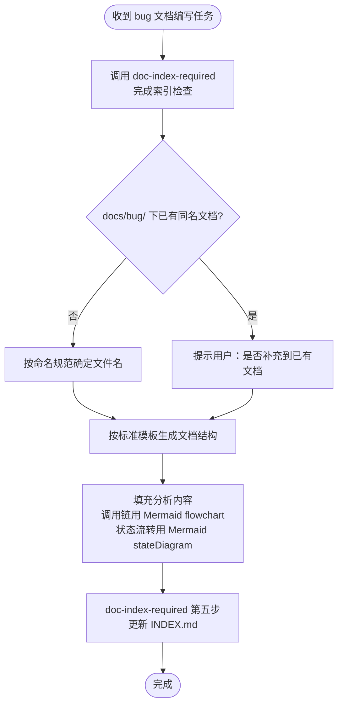
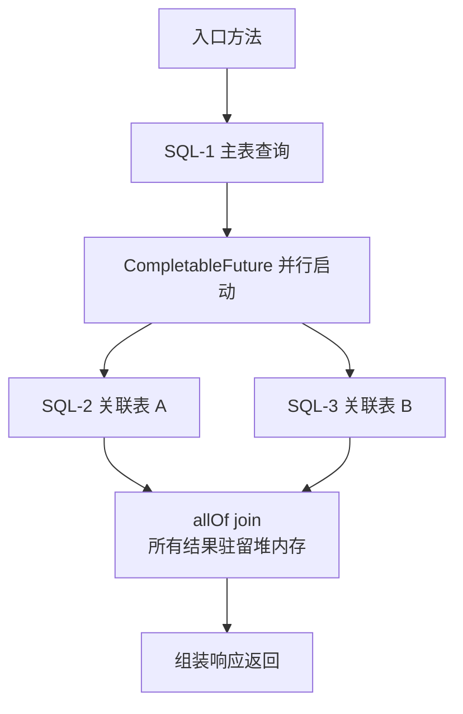

# Bug 分析文档强制规范

## 核心原则

**编写 bug 文档必须遵守标准章节结构，调用链和状态流转必须使用 Mermaid 图。**

---

## 执行流程



---

## 文档目录结构

```
docs/bug/
  INDEX.md                              ← 顶层索引，列出所有 bug 目录
  {bug名称}/                            ← 每个 bug 独立目录，目录名 = bug 名称
    {bug名称}.md                        ← bug 分析文档
    （预留：后期可在此目录下补充 module 归属、关联 PR、复现脚本等）
```

**命名规则：** 目录名和文件名统一用英文 kebab-case 描述 bug 核心现象：

```
docs/bug/
  queryOrderAllDataToB-oom/
    queryOrderAllDataToB-oom.md
  business-day-settlement-sync/
    business-day-settlement-sync.md
  order-item-duplicate-on-retry/
    order-item-duplicate-on-retry.md
```

**规范：**
- 目录名不加 `bug-` 前缀，名称本身已隐含是 bug 分析
- 目录名与文档文件名保持一致
- 新建 bug 文档时必须新建对应目录，禁止直接放在 `docs/bug/` 根目录下

---

## 标准章节结构

每份 bug 文档**必须包含**以下章节，顺序固定：

```
# {Bug 简要标题}

## 问题背景
## 触发条件
## 涉及类清单        ← 必须写全类名
## 关键代码路径      ← 文件路径 + 行号 + 说明
## 调用链分析        ← 必须用 Mermaid flowchart
## 相关代码 / SQL 清单
## 根因总结          ← 必须用表格
## 修复方案
```

各章节规范如下：

### 问题背景

必须包含：
- 接口或功能路径
- 现象描述（一句话）
- 复现参数（JSON 代码块）
- 错误日志（代码块，截取关键行）

### 触发条件

用表格列出触发该 bug 的关键条件，例如数据量、时间范围、并发数等。

### 涉及类清单

**必须使用全类名（完整包路径），禁止只写短类名。** 目的是让 AI 在后续会话中无需扫描即可精准定位文件。

用表格列出所有直接参与该 bug 的类，按角色分类：

| 角色 | 全类名 |
|---|---|
| Controller | `com.example.xxx.XxxController` |
| Service 实现 | `com.example.xxx.impl.XxxServiceImpl` |
| Mapper | `com.example.xxx.XxxMapper` |
| 请求 / 响应参数 | `com.example.xxx.XxxRequest` |

**全类名来源：** 读取对应 `.java` / `.kt` 文件头部的 `package` 声明 + 类名拼接。不确定时先 Grep 再填写，禁止凭记忆猜测。

### 关键代码路径

**必须用表格**，列出所有直接相关的文件路径、行号和说明。目的是让 AI 在后续会话中无需扫描即可精准跳转。

| 描述 | 文件路径 | 行号 | 说明 |
|---|---|---|---|
| {角色} | `{模块/src/main/.../XxxClass.java}` | {行号} | {该行/方法的关键作用} |

**规范：**
- 文件路径从模块名开始写（如 `kpay-pos-order-manage-server/src/...`），不写绝对路径
- 行号通过 Grep 或 IDE 确认后填写，禁止估算
- 说明聚焦「为什么这行重要」，不复述方法名
- 核心问题代码行须加粗标注

### 调用链分析

**必须使用 Mermaid `flowchart`**，禁止用 ASCII 字符图（`├──`、`↓` 等）。

Mermaid 语法规范：
- 节点标签含 `=`、`,`、`/`、`(`、`)`、`[`、`]`、`:` 必须加双引号
- `<` 和 `>` 改用文字替代，不得出现在标签内
- 不使用 emoji
- 并行分支用多条 `-->` 从同一节点分叉表示

状态流转图使用 `stateDiagram-v2`。

**示例（并行查询）：**



### 相关代码 / SQL 清单

- SQL 使用代码块，标注表名和关键 WHERE 条件
- 代码引用注明文件路径和行号

### 根因总结

**必须用表格**，列出每个问题现象和对应根因：

| 问题现象 | 根因 |
|---|---|
| ... | ... |

### 修复方案

按以下三级分类：

| 级别 | 说明 |
|---|---|
| 短期（治标）| 最小改动，快速止血 |
| 中期（治本）| 从设计层面解决根本问题 |
| 配置 / 运维 | 不改代码的临时缓解手段（如有）|

---

## 与其他 Skill 的协作关系

| Skill | 何时调用 |
|---|---|
| `doc-index-required` | 本 skill 执行流程第一步，必须先调用，完成索引读取和更新 |
| `design-doc-required` | 若 bug 修复需要引入新功能或接口变更，修复方案实施前须调用 |

---

## 红色警告

| 想法 | 正确处理 |
|---|---|
| "调用链用文字描述就够了" | 必须用 Mermaid flowchart |
| "根因写一段话说明" | 必须用表格，一行一个问题 |
| "不用更新 INDEX.md" | doc-index-required 第五步是强制要求 |
| "直接放在 docs/bug/ 根目录" | 必须建 {bug名称}/ 子目录再放文件 |
| "类名我知道，不用查" | 必须读 package 声明确认，禁止凭记忆填写 |
| "只写短类名就够了" | 短类名无法精准定位文件，必须写完整包路径 |
