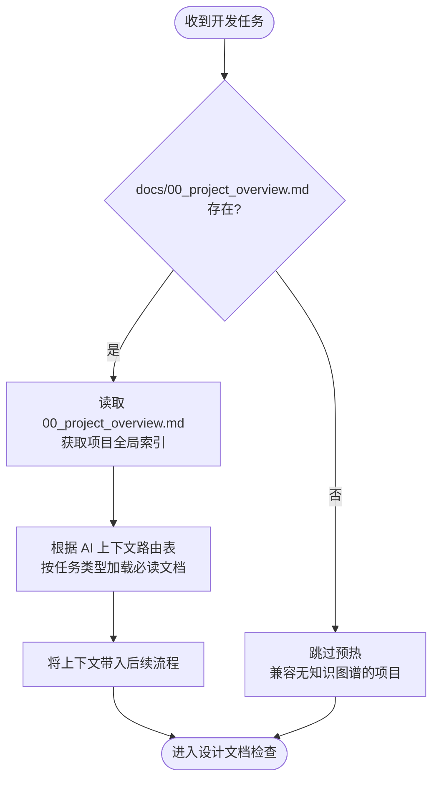
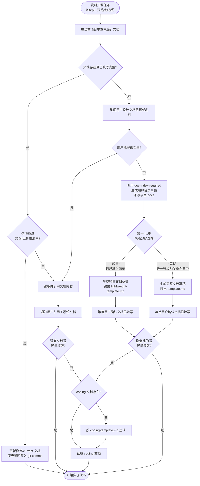

# 开发前设计文档强制检查

## 核心原则

**禁止在没有设计文档的情况下分析方案、讨论架构或编写任何实现代码。**

这不是建议，是强制要求。无论任务看起来多简单，也无论用户是要求「分析」还是「实现」，都必须先完成设计文档检查。

**所有设计文档中的架构图、流程图、模块关系图必须使用 Mermaid 语法绘制，禁止使用 ASCII art 或纯文本框图。**

<HARD-GATE>
Do NOT analyze implementation approaches, discuss architecture, propose solutions, evaluate feasibility, or write any code until the design document check below is complete. This applies even when the user only asks for analysis or architectural discussion — design doc check comes FIRST, before any response about implementation.

Do NOT write any implementation code (Edit/Write .java, .ts, .py, etc.) until BOTH the design document AND the corresponding coding summary document (-coding.md) have been created and confirmed. The coding document is NOT optional — it is the second mandatory gate before any code change.
</HARD-GATE>

---

## Step 0：知识图谱上下文预热

**在执行设计文档检查之前，先加载项目知识图谱上下文，避免后续全量扫码。**



### 执行规则

1. 检查项目 `docs/00_project_overview.md` 是否存在
2. **若存在**：
   - 读取该文件（约 3KB），获取项目概要 + 文档导航 + AI 上下文路由表
   - 根据路由表中的「按任务类型加载」，读取当前任务对应的**必读文档**（通常 2-3 份）
   - **按需文档不在此时加载**，留到实施阶段碰到具体问题时再读
3. **若不存在**：跳过本步骤，直接进入设计文档检查（兼容没有知识图谱的项目）

### 任务类型判断

| 用户意图 | 任务类型 | 路由表对应行 |
|---|---|---|
| 新增功能、新建接口 | 新功能开发 | `01_architecture` + `02_module_map` + `05_api_map` |
| 修复 Bug、处理异常 | Bug 修复 | `08_constraints` + `modules/{模块}` |
| 重构、迁移、优化架构 | 重构/迁移 | `08_constraints` + `09_refactor_plan` + `skills/{tech}` |
| 修改接口入参出参 | 接口变更 | `05_api_map` + `06_frontend_backend_mapping` |
| 加表、改字段 | 数据库变更 | `04_data_model_map` + `08_constraints` |

> **注意**：Step 0 只负责加载上下文，不替代后续的设计文档检查。预热完成后，正常进入下方流程。

---

## 执行流程



---

## 文档目录结构规范

AI 生成的设计文档默认存放在用户文档目录，不直接写入项目 `docs/design/`。用户确认终版后，可自行上传到项目 `docs/design/` 或明确指定项目内路径让 AI 写入。

> **输出路径边界：** AI 生成的方案草稿、设计文档、代码扫描笔记、对照分析、个人备忘默认写入 `{USER_DOCUMENTS}/ai-docs/{project}/{agent}/{YYYY-MM-DD}/`。项目 `docs/design/` 只接收用户明确指定路径或用户自行上传的终版文档。

```
docs/design/
  {需求名称}/                              ← 顶层需求目录
    {需求名称}-current.md                  ← Git 管理下的默认稳定文档
    {需求名称}-coding.md                   ← 完整模版对应的当前编码摘要（仅完整模版需要）
    snapshots/                              ← 仅重大基线/发布快照/用户明确要求时创建
      {需求名称}-{YYYYMMDD}-v{N}.md
    {子模块名称}/                           ← 子模块目录（当本需求是更大架构的一部分时）
      {子模块名称}-current.md
      snapshots/
        {子模块名称}-{YYYYMMDD}-v{N}.md
```

**示例：**
```
docs/design/
  通用智能体架构/                            ← 顶层架构设计
    通用智能体架构-current.md
    多平台模型路由层/                         ← 子模块，归属于通用智能体架构
      多平台模型路由层-current.md
      多平台模型路由层-coding.md
  用户权限管理/                              ← 独立需求
    用户权限管理-current.md
    用户权限管理-coding.md
```

### 目录层级规则

| 规则 | 说明 |
|------|------|
| **独立需求** | 直接在 `docs/design/` 下创建顶层目录 |
| **子模块/子功能** | 如果本需求属于某个已有架构设计的一部分，**必须创建独立子目录**（`docs/design/{父需求}/{子模块名}/`），**禁止**将子模块文件直接放在父需求目录下与父文档混在一起 |
| **最大嵌套深度** | 不超过 2 层（`docs/design/{父需求}/{子模块}/`），避免目录过深 |
| **归属判断标准** | 见下方「目录归属分析」步骤 |

### 命名规则

| 部分 | 规则 | 示例 |
|------|------|------|
| 需求名称 | 与需求/功能名一致，禁止缩写 | `用户权限管理` |
| 稳定文档 | Git 管理下默认使用 `{需求名称}-current.md` 或用户指定的稳定文件名 | `用户权限管理-current.md` |
| 编码摘要 | 完整模版对应 `{需求名称}-coding.md`，随稳定文档同步 | `用户权限管理-coding.md` |
| 快照文档 | 仅重大基线/发布快照/用户明确要求/非 Git 管理场景使用 `YYYYMMDD-vN` | `用户权限管理-20260330-v1.md` |

### 版本更新原则

- **Git 管理下的项目正式文档默认直接更新稳定文档**，历史由 git commit / PR diff / blame 负责，不靠不断复制 `v1/v2/v3` 文件留痕。
- 只有以下情况才新建版本快照：用户目录草稿尚未进入 Git、重大架构基线或发布基线、用户明确要求保留快照、文档不在 Git 管理范围内。
- 微小错别字、格式修正、普通迭代和常规需求调整均直接修改稳定文档，并在 commit body 写清楚变更原因。

---

## 步骤详解

### 第一步：查找设计文档

在当前项目 `docs/design/` 目录下按以下优先级查找：

1. 询问用户本次开发对应的**需求名称**
2. 在 `docs/design/{需求名称}/` 目录下优先查找 `{需求名称}-current.md` 或用户指定的稳定文档
3. 若完整模版命中，同时查找 `{需求名称}-coding.md`
4. 若未找到稳定文档，再查找 `snapshots/` 或目录内最新 `YYYYMMDD-vN` 快照作为参考
5. 若顶层未找到，**递归搜索子目录**（如 `docs/design/{父需求}/{需求名称}/`）
6. 若目录不存在，则认为文档缺失，进入第一·五步（目录归属分析）后再进入第三步

### 第一·五步：目录归属分析

文档缺失需要新建时，**在创建目录前必须先分析目录归属**：

1. **扫描 `docs/design/` 下所有已有目录**（读取 `docs/design/INDEX.md` 获取各需求摘要）
2. **判断本次需求是否属于某个已有架构/系统设计的子模块**，判断依据：

| 判断维度 | 归属为子模块的信号 | 保持独立的信号 |
|---------|------------------|--------------|
| **功能依赖** | 本需求实现的功能是已有架构的组成部分 | 本需求可独立运行，无父架构 |
| **接口引用** | 本需求实现的接口定义在已有架构文档中 | 本需求自定义全部接口 |
| **文档提及** | 已有架构文档的「功能范围」或「后续扩展」明确提到本需求 | 无任何文档提及 |
| **模块归属** | 本需求的代码位于已有架构相同的 Maven 模块内 | 本需求位于独立模块 |

3. **判定结果处理**：
   - **属于子模块** → 目录路径为 `docs/design/{父需求}/{子模块名}/`，告知用户归属原因
   - **独立需求** → 目录路径为 `docs/design/{需求名称}/`
   - **不确定** → 列出候选父目录及判断理由，让用户决定

> **示例：** 新建「多平台模型路由层」设计文档时，扫描发现「通用智能体架构」的功能范围和后续扩展章节明确提到了模型路由，且代码位于同一个 `llm-domain` 模块 → 判定为子模块 → 建议路径 `docs/design/通用智能体架构/多平台模型路由层/`

### 第一·七步：模版分级选择（轻量 vs 完整）

**目录确定后、输出模版前，必须先决定本次用「轻量模版」还是「完整模版」。** 直接用完整模版处理小接口、或用轻量模版偷懒做大改造，都属于流程错位。

#### 模版定位

| 模版 | 文件 | 适用场景 | 配套 coding.md |
|------|------|---------|----------------|
| **轻量** | `lightweight-template.md` | 单接口的自身流程 / 库表读写流程描述、已有架构内的接口新增/调整、入参出参微调 | **不需要**（核心流程图 + 规则表已涵盖） |
| **完整** | `template.md` | 跨服务/跨模块协作、新增数据库表、新增对外契约、复杂事务/分布式锁、状态机重设计 | **需要**，按 `coding-template.md` 生成 |

#### 准入硬清单（命中**所有**项才允许走轻量分支）

只要任意一项 ❌，立即升级到完整模版。**严禁口头判定「差不多就走轻量」。**

- [ ] **不**新增数据库表
- [ ] **不**新增字段（仅读取现有字段）或字段变更属于纯枚举值扩充
- [ ] **不**新增对外服务契约入口（HTTP 路径 / Feign 方法）
- [ ] **不**改既有对外接口的入参/出参语义（字段重命名、含义变化）
- [ ] **不**跨服务、不跨模块协作（只在当前模块内）
- [ ] **不**引入新的中间件/消息队列/分布式锁/补偿事务
- [ ] **不**新增 ≥3 个类（顶多 1-2 个新类）
- [ ] **不**重新设计实体状态机（在已有状态机内增减状态算扩充，不算重设计）
- [ ] 改动核心可由「核心流程图 + 库表过滤规则表 + 失败行为表」完整描述

#### 判定边界示例

✅ 走轻量：
- 给「获取可退商品」接口加一个 `includeMergeTable` 入参，控制是否聚合联台兄弟订单
- 把订单查询的 `WHERE` 条件多加一个过滤项，剔除某种特殊状态
- 在已有 Service 加一个查询方法，本质是按新条件读现有表

❌ 必须用完整模版：
- 新建「积分账户」表 + 配套接口（**新增表**）
- 把「订单创建」从同步改为消息异步推送（**引入消息队列**）
- 引入分布式锁防止重复退款（**新增分布式锁**）
- 设计三方对账的全新接口契约（**新增对外契约**）

#### 决策动作

1. 对照硬清单逐项判定
2. **轻量分支**：输出 `lightweight-template.md`，告知用户填写要点 + 升级触发条件
3. **完整分支**：输出 `template.md`，进入第三步既有流程

> **决策必须显式告知用户：** 必须先回复"判定为【轻量/完整】模版，原因：xxx"，再输出模版。**不允许默默选择。**

---

### 第二步：文档存在时

**先识别文档类型**（看文件头部声明 / 目录结构）：

- **轻量文档**（基于 `lightweight-template.md`）：直接读取该文档作为编码依据，**不需要** coding.md
- **完整文档**（基于 `template.md`）：检查是否同时存在对应的编码摘要文档（`-coding.md`）

完整文档的 coding.md 处理：

- **存在 `{需求名称}-coding.md` 或对应 `-coding.md`**：优先读取编码摘要文档，以节省 token、降低幻觉风险
- **不存在 `-coding.md`**：读取完整文档，并在读取后**自动生成**对应的编码摘要文档

在开始编码前明确告知用户：

> "已读取编码摘要：`docs/design/{需求名称}/{文件名}-coding.md`
> 本次实现依据：
> - 核心业务规则：XXX
> - 涉及类（全类名）：XXX
> - 关键约束：XXX
> 如有不符，请告知我，我将先更新稳定设计文档；只有重大基线或非 Git 管理场景才创建版本快照。"

### 第三步：文档不存在时

**禁止直接开始编码。** 执行以下步骤：

1. 告知用户未找到对应需求的设计文档
2. 询问是否有已有文档需要手动指定路径
3. 若无文档，先执行 `doc-index-required` 的**文档输出路径规则**，默认写入 `{USER_DOCUMENTS}/ai-docs/{project}/{agent}/{YYYY-MM-DD}/`
4. 仅当用户明确指定 `docs/...` 终版路径时，才调用 `doc-index-required Phase-A / Phase-B` 更新项目索引
5. **执行第一·七步模版分级选择**
6. 按对应模版生成用户目录草稿：

---

#### 轻量分支引导（命中第一·七步轻量准入清单）

> **本次改动判定为【轻量级】，按接口级模版处理。**
>
> 请按以下步骤操作：
> 1. 默认创建到用户目录：`{USER_DOCUMENTS}/ai-docs/{project}/{agent}/{YYYY-MM-DD}/`
> 2. 创建文件：`{需求名称}-{今日日期}-v1.md`
> 3. 参考 `lightweight-template.md`，至少完成以下章节：
>    - 第 1 节：代码入口（先写"待实现"也可以）
>    - 第 2 节：接口契约（核心入参/出参）
>    - 第 3 节：核心流程图（接口自身流程 / 库表读写顺序，必填 1 张 Mermaid flowchart 或 sequenceDiagram）
>    - 第 4 节：关键过滤/写入规则
>    - 第 5 节：失败行为
> 4. 草稿确认后告知我文件路径，我将读取后开始实现；终版是否上传到项目 `docs/` 由用户自行决定
> 5. **本分支无需生成 `-coding.md`**

模板文件位于：`skills/design-doc-required/lightweight-template.md`

---

#### 完整分支引导（命中第一·七步任一升级触发条件）

> **本次改动判定为【完整级】，按完整模版处理。**
>
> 请按以下步骤操作：
> 1. 默认创建到用户目录：`{USER_DOCUMENTS}/ai-docs/{project}/{agent}/{YYYY-MM-DD}/`
> 2. 创建文件：`{需求名称}-{今日日期}-v1.md`
> 3. 参考模板填写内容（至少完成以下章节）：
>    - 第 2 节：背景与目标
>    - 第 4 节：业务流程设计
>    - 第 5 节：接口设计（如涉及接口变更）
>    - 第 8 节：核心业务规则
> 4. 草稿确认后告知我文件路径，我将读取后开始实现；终版是否上传到项目 `docs/` 由用户自行决定

模板文件位于：`skills/design-doc-required/template.md`（安装后路径由 `$CLAUDE_PLUGIN_ROOT` 指定）

### 第三·五步：文档写完后更新索引

用户目录草稿确认后，不自动调用 `doc-index-required Phase-B`，也不更新 `docs/design/INDEX.md`。只有用户明确指定项目 `docs/...` 终版路径时，才执行 Phase-B 并登记索引。

---

### 第四步：生成编码摘要文档（编码前第二道门禁）

> **本步仅适用于完整模版（基于 `template.md`）。** 轻量模版（基于 `lightweight-template.md`）不需要 coding.md，核心流程图 + 规则表已经覆盖编码所需信息，跳过本步直接进入实现。

**编码摘要文档是完整文档编码前的第二道强制门禁。** 设计文档确认后、第一行实现代码之前，必须确保 `-coding.md` 存在。若不存在，立即按 `coding-template.md` 生成。

> **禁止在 `-coding.md` 缺失的情况下开始编码（完整模版分支）。** 即使用户催促"直接写代码"，也必须先完成本步。

文件命名：
- Git 管理下的稳定文档默认使用 `{需求名称}-coding.md`
- 版本快照场景才使用 `{需求名称}-{YYYYMMDD}-v{N}-coding.md`（与快照文档对应）

#### 设计文档 vs 编码文档的职责边界

| 内容 | 设计文档（template.md） | 编码文档（coding-template.md） |
|------|----------------------|---------------------------|
| 分层架构图 | 保留 | 不重复 |
| 类清单 + 变更类型 + 一句话职责 | 保留（一行一类） | 展开方法级操作说明 |
| 方法签名列表 | **不写** | 保留（全路径 + 签名 + 职责） |
| 方法职责详细说明 | **不写** | 保留 |
| 类调用关系图 | 保留（类级别方向） | 不重复 |
| 表操作矩阵 | 保留（入参→表→出参概要） | 展开字段级细节 |
| 实现伪代码 | **不写**——只放流程图 | 保留（完整实现代码） |

**原则：设计文档回答"哪些类、什么职责、怎么协作"，编码文档回答"每个方法怎么写"。**

#### 生成规则

从完整文档中提取以下内容填入编码文档：

- 变更记录 → 精简为一行摘要
- 第 6 节类清单 → 提取**全路径**填入「涉及类清单」，**补充方法签名和职责**（设计文档中没有方法级细节，需从业务流程和接口设计中推导）
- 第 5 节接口设计 → 提取入口接口契约和请求示例
- 第 8 节核心业务规则 → 原文提取
- 第 7/9 节数据库/事务 → 提取关键字段和约束
- 其余章节（背景、上线、风险等）**不纳入编码摘要**

**全路径要求：** 类设计中所有类必须使用完整路径（包路径或文件路径），禁止只写短类名，以便精准定位代码文件。

---

### 第四·五步：轻量修订（小修直接更新稳定文档）

**适用场景：** 设计文档已存在、本次改动属于该文档覆盖范围内的修正/对齐/删冗余，引入"新建快照 + coding.md"的成本明显大于收益。Git 管理下这类改动默认**直接更新稳定/current 文档**，变更原因写入 commit body；不再为了留痕在文档末尾追加流水，也不新建版本号、不新建 coding.md。

#### 准入硬清单（必须全部 ✅ 才能走本分支）

只要任意一项 ❌，立即退回[第五步：需求变更时更新稳定文档]。**严禁口头判定"差不多就走轻量"。**

- [ ] 设计文档已存在（优先 `docs/design/{需求}/{需求}-current.md`，兼容历史 `...vN.md`）
- [ ] 改动**不**新增对外接口、**不**修改入参/出参字段
- [ ] 改动**不**新增数据库表、**不**新增/重命名/删除字段
- [ ] 改动**不**新增类、**不**新增/删除/重命名公开方法
- [ ] 改动**不**改变方法签名（参数/返回值/异常）
- [ ] 改动**不**引入新的外部依赖（pub/maven/npm 等）
- [ ] 改动范围 ≤ 单文件、≤ 30 行净变更
- [ ] 改动性质属于以下**一种**：
  - 修正与上游/云端/规范的不一致（对齐）
  - 删除冗余、错误或被强制覆盖的逻辑
  - 修复明确的 bug 且不改变文档已声明的业务规则方向
  - 补充注释、日志、错误信息文案

> **判定边界示例：**
> ✅ 走轻量：删除 `_calculateRefundPriceRaw` 中强制覆盖 `selectedServices` 的 6 行 if 块（与云端 `calculateRefundPrice` 对齐）
> ❌ 必须进入需求变更处理：把 `selectedServices` 改成支持半选的全新数据结构（改了入参语义）
> ❌ 必须进入需求变更处理：从 `selectedServices` 派生出新的 `selectedServiceTypeFlag` 字段（新增字段）

#### 处理动作

1. 若稳定文档中的业务规则、接口描述、代码入口或表操作说明会失真，直接更新 `{需求名称}-current.md`；若文档内容仍准确，则不必为本次小修强行改文档
2. **不**新建快照文档、**不**新建/更新 `-coding.md`
3. **跳过** `doc-index-required` Phase-B（INDEX 摘要无需更新）
4. 进入代码改动时**必须遵循 `bugfix-coding-style`**（v1.17 起方向反转）：直接改写或新增；**禁止**在源码中保留 `[DEPRECATED]` / `[ADDED]` / `[BUGFIX 日期]` 等变更日志标记，**禁止**注释保留旧代码段；变更原因写进 commit message body，源码内只保留 WHY 注释且优先上提到方法 / 类 doc comment
5. commit 信息按 `git-commit-standards` 规范，在 body 写清楚本次为什么改；若同步更新了设计文档，在 body 引用文档路径

#### 红线

| 想法 | 正确处理 |
|------|---------|
| "这次只改 5 行，但顺手删个无用方法" | 删方法即破清单第 4 项，必须进入需求变更处理 |
| "顺便把入参字段名规范一下" | 改入参字段即破清单第 2 项，必须进入需求变更处理 |
| "走轻量分支就不用写 commit body 了" | 错。Git commit body 是默认变更日志，必须写清楚为什么改 |

---

### 第五步：需求变更时更新稳定文档

若改动**未通过** [第四·五步硬清单]（任意一项 ❌），即视为需求变更：

- **项目内 Git 管理的正式文档**：直接更新 `{需求名称}-current.md` 或用户指定的稳定文档，并同步更新 `{需求名称}-coding.md`（完整模版）
- **用户目录草稿 / 非 Git 管理文档 / 重大基线 / 用户明确要求快照**：才引导创建 `{需求名称}-{今日日期}-v{N+1}.md`

对用户提示：

> "检测到需求变更。若这是项目内 Git 管理的正式文档，我会先更新稳定设计文档并依赖 git commit 留痕；若你需要保留基线快照，请明确要求我创建 `{需求名称}-{今日日期}-v{N+1}.md`。"

---

### 第六步：修改设计文档后同步 coding 文档

> **本步仅适用于完整模版。** 轻量模版没有配套 coding.md，跳过本步。

**每次对完整设计文档进行实质性内容变更后（包括直接修改稳定文档和创建快照），必须同步更新对应的 `-coding.md`。**

按以下映射关系更新对应章节：

| 设计文档变更内容 | 需同步更新 coding 文档的章节 |
|----------------|--------------------------|
| 接口清单增删或分类调整 | 第 2 节：接口契约 |
| 类清单增删 | 第 3 节：涉及类清单（同步增删类条目，补充方法签名） |
| 核心业务规则变更 | 第 1 节：核心业务规则 |
| 数据库字段/DDL/Mapper 变更 | 第 4 节：数据结构 |
| 约束、事务、边界说明变更 | 第 5 节：重要约束与边界 |

> **注意**：设计文档的类清单只有一句话职责，coding 文档需自行补充方法签名和详细操作说明。设计文档新增一个类时，coding 文档不只是复制一行，而要展开该类的方法级细节。

若文档使用稳定命名，coding 文档直接同步覆盖；若文档是快照命名，coding 文档与快照版本号保持一致。

若以上章节均未涉及，则跳过 coding 文档更新。

---

## Mermaid 图表要求

> **Mermaid 语法规范由 `markdown-writing-standards` Skill 统一管控。**
> 本章节只定义设计文档中「哪些场景适合画哪些图」，具体「图怎么画不出错」请遵循 `markdown-writing-standards`。
> 生成 Mermaid 代码块前，**必须先调用 `markdown-writing-standards`** 进行语法自检。

### 最小图原则

设计文档的图表目标是**清晰明了地表达业务与实现边界**，不是凑齐图表类型。

1. **能用一张图表达清楚，就只画一张图。** 禁止为了满足模板形式重复画功能图、能力图、流程图和依赖图。
2. **图随场景选，不随章节凑。** 单个后端接口优先画接口自身流程；跨模块协作才画模块/依赖；状态变化明显才画状态图。
3. **同一事实不要多图重复表达。** 如果核心流程图已经同时表达了模块、调用、库表读写和异常分支，不再额外拆模块图或类调用图。
4. **复杂才拆图。** 当一张图超过 12 个节点、分支超过 4 个、或同时混入业务流程与系统依赖导致难读时，才拆成多张图。

### 场景选图表

| 场景 | 推荐图 | 是否必填 | 说明 |
|---|---|---|---|
| 单个后端接口 / 单个业务动作 | **接口自身流程图**（`flowchart TD`）或**库表读写时序图**（`sequenceDiagram`） | 必填 1 张 | 例如退款后端接口，一张图讲清入参校验、查询、判断、写表、返回即可 |
| 查询/写表顺序是核心 | `sequenceDiagram` | 条件必填 | 需要按执行顺序说明读写哪些表、哪些字段、业务含义时使用 |
| 业务分支/异常路径是核心 | `flowchart TD` | 条件必填 | 需要表达判断条件、失败行为、兜底策略时使用 |
| 涉及 2 个以上模块/服务协作 | 模块/组件关系图（`graph TD`） | 条件必填 | 只在模块边界、调用关系本身需要被看清时画 |
| 涉及实体状态变化 | 状态流转图（`stateDiagram-v2`） | 条件必填 | 只有新增/调整状态、状态迁移规则复杂时画 |
| 跨系统/外部依赖较多 | 依赖图（`graph TD`） | 条件必填 | 只在依赖关系影响设计、部署、降级或风险时画 |
| 能力拆分复杂、多人协作开发 | 能力分解图（`mindmap` / `graph TD`） | 选填 | 只在能力边界不画就容易误解时使用 |

#### 完整模版（template.md）图表要求

完整模版不再要求固定凑齐多张图。默认要求是：

- **至少 1 张核心图**：从「接口自身流程图 / 库表读写时序图 / 模块关系图」中选择最能表达本次设计的一张。
- 其余图表按上方「场景选图表」触发；未命中场景时必须省略或写“本场景不需要”，不得画空泛示意图。

| 图表类型 | 适用章节 | Mermaid 图类型 | 触发条件 |
|---------|---------|---------------|------|
| **接口自身流程图** | 第 4 节（业务流程设计） | `flowchart TD` | 单接口、单业务动作、退款/下单/查询等自身流程 |
| **库表读写时序图** | 第 4 节或第 7 节 | `sequenceDiagram` | 读写表顺序、字段含义、事务边界是核心 |
| **功能模块总览图** | 第 3 节（功能范围） | `graph TD` | 涉及 2 个以上模块/服务，且模块关系不画会误解 |
| **能力分解图** | 第 3 节（功能范围） | `mindmap` / `graph TD` | 能力边界复杂、多人并行或后续扩展较多 |
| **状态流转图** | 第 4 节（状态流转） | `stateDiagram-v2` | 有实体状态新增、重命名、迁移规则变化 |
| **类调用关系图** | 第 6.3 节（类调用关系） | `graph LR` / `sequenceDiagram` | 新增/改造类较多，类协作关系不画会误解 |
| **组件/接口依赖图** | 第 12 节（下游依赖） | `graph TD` | 新增或调整外部依赖、Feign/HTTP/消息/硬件调用 |

#### 轻量模版（lightweight-template.md）图表要求

| 图表类型 | 适用章节 | Mermaid 图类型 | 目的 |
|---------|---------|---------------|------|
| **接口自身流程图 / 库表读写时序图（二选一）** | 第 3 节（核心流程图） | `flowchart TD` / `sequenceDiagram` | 用一张图讲清接口自己的执行路径；流程分支强用 flowchart，库表顺序强用 sequenceDiagram |

> 轻量模版不强制要求功能模块总览图、能力分解图、类调用关系图、依赖图。所有业务规则下沉到核心流程图的节点/Note 与第 4 节规则表。

### 功能模块总览图要求

仅当本次设计涉及 2 个以上功能模块/服务，且模块关系不画会影响理解时，第 3 节才需要功能模块总览图。该图需要：

1. **列出所有要开发的功能模块**（矩形节点）
2. **标注模块间的依赖/调用关系**（带箭头的连线 + 关系说明）
3. **区分新建模块与复用/改造模块**（用不同样式，如 `stroke-dasharray: 5 5` = 已有模块）
4. **按分层或业务域分组**（用 `subgraph` 分区）

### Mermaid 图表分组（subgraph / box）规范

**所有 Mermaid 图表中，属于同一主题、同一系统、同一职责域的节点必须用 `subgraph` 包裹为同一个 BOX。** 这是大型项目中清晰展示模块边界和系统调用关系的关键。

**分组原则：**

| 图类型 | 分组维度 | 示例 |
|--------|---------|------|
| `flowchart` / `graph` | 按业务阶段、系统边界、职责层 | `subgraph Stage1["阶段一 前置查询"]` |
| `sequenceDiagram` | 用 `box` 包裹同一系统/层的参与者 | `box 本地数据层` 包裹 Repository + SQLite |
| `classDiagram` | 按包/模块分组 | `namespace Application` |

**flowchart/graph 分组规则：**

1. **同一业务阶段的模块必须放入同一 subgraph**（如"前置查询阶段"包裹所有查询接口）
2. **同一系统/服务的模块必须放入同一 subgraph**（如"外部服务"包裹 KPay API + POS 设备）
3. **subgraph 嵌套不超过 2 层**，避免视觉混乱
4. **subgraph 必须使用 `ID["显示名"]` 格式**，ID 用英文，显示名用中文

**sequenceDiagram 分组规则：**

1. **属于同一系统的参与者必须用 `box` 包裹**
2. 格式：`box rgba(颜色) 分组名称`，包裹 participant 声明
3. 典型分组：`前端层`、`业务编排层`、`数据层`、`外部服务`

```
正确:
  box rgb(212, 237, 218) 本地数据层
    participant REPO as RefundLocalRepository
    participant DB as SQLite
  end

  box rgb(248, 215, 218) 外部服务
    participant KPAY as KPay Cloud
    participant POS as POS Device
  end

错误:（参与者散列，无法看出谁属于哪个系统）
  participant REPO as RefundLocalRepository
  participant KPAY as KPay Cloud
  participant DB as SQLite
  participant POS as POS Device
```

### 能力分解图要求

仅当功能能力较复杂、多人协作边界不清、或后续扩展点较多时，才需要能力分解图。简单单接口、单后端动作不需要能力分解图。

### 检查清单

#### 完整模版检查清单

生成或审查完整设计文档时，必须逐项确认：

- [ ] 已按「最小图原则」选择图表，能一张图讲清的场景没有拆成多张图
- [ ] 至少包含 1 张核心图（接口自身流程图 / 库表读写时序图 / 模块关系图三选一）
- [ ] 若涉及 2 个以上模块/服务，且关系不画会误解，第 3 节包含功能模块总览图
- [ ] 若能力边界复杂，第 3 节包含能力分解图；简单单接口已省略
- [ ] 若业务分支/异常路径是核心，第 4 节使用 mermaid flowchart 绘制
- [ ] 若库表读写顺序是核心，第 4 节或第 7 节使用 mermaid sequenceDiagram 绘制
- [ ] 若有实体状态变化，第 4.3 节使用 mermaid stateDiagram
- [ ] 若类协作关系不画会误解，第 6.3 节使用 mermaid graph 或 sequenceDiagram
- [ ] 若新增/调整外部依赖，第 12 节使用 mermaid graph
- [ ] **所有图表中同一主题/系统/职责域的节点已用 `subgraph`（flowchart）或 `box`（sequenceDiagram）分组**
- [ ] 文档中无任何 ASCII 框图（`┌─┐`、`│`、`└─┘`、`→`、`↓` 等字符画）
- [ ] 所有 Mermaid 代码块已通过 `markdown-writing-standards` 自检清单

#### 轻量模版检查清单

生成或审查轻量设计文档时，必须逐项确认：

- [ ] 第 1 节代码入口已写明 Service / DAO 入口（编码前可写「待实现」）
- [ ] 第 3 节包含 1 张 **mermaid 核心图**（flowchart 或 sequenceDiagram），能讲清接口自身执行路径
- [ ] 若使用 sequenceDiagram，每条关键 SQL 后挂 `Note over DB`，说明字段 + 业务含义
- [ ] 第 4 节关键过滤/写入规则表已列出所有非显然的过滤条件
- [ ] 第 5 节失败行为表已覆盖入参校验 / 业务规则 / SQL 异常三类
- [ ] 文档中无任何 ASCII 框图
- [ ] Mermaid 代码块通过 `markdown-writing-standards` 自检清单

---

## 终版文档（current）

Git 管理下的项目正式文档以稳定/current 文档为主。版本快照只作为少数场景的辅助，而不是日常迭代默认动作。

| 文件名格式 | 用途 | 更新方式 |
|-----------|------|----------|
| `{需求名称}-current.md` | 默认正式设计文档，反映当前代码的实际实现 | 随代码演进直接更新，历史由 Git 负责 |
| `{需求名称}-coding.md` | 完整模版对应的当前编码摘要 | 随 current 文档同步更新 |
| `snapshots/{需求名称}-{YYYYMMDD}-v{N}.md` | 重大基线、发布快照、用户明确要求或非 Git 管理场景 | 创建后不再修改，后续变更另建快照 |

**终版文档规则：**
- 无版本号、无日期前缀，命名固定为 `{需求名称}-current.md`
- 内容结构与完整设计文档模板一致，但头部注明「最后更新日期」
- 每次代码变更后同步更新，保证与代码一致
- 存在 `current.md` 时，AI 编码优先读取 `current.md`（而非历史版本快照）
- 不在 `current.md` 里堆“本次改了什么”的流水账；这类说明写入 git commit body

**查找优先级（第一步查找文档时）：**
1. `{需求名称}-current.md`（终版，优先）
2. `{需求名称}-coding.md`（当前编码摘要，完整模版需要）
3. `snapshots/{需求名称}-{YYYYMMDD}-v{N}.md` 或历史 `{需求名称}-{YYYYMMDD}-v{N}.md`（最新快照）

---

## 合法的例外情况

以下情况可以**完全跳过**设计文档检查（不需要文档、也不需要文档留痕）：

- 单元测试补充
- 配置文件修改（非业务规则相关）
- 与设计文档完全无关的纯 Bug 修复（如修字符串拼写、import 排序）
- 代码重构（不改变业务逻辑、不改变文档已声明的边界）

**与"轻量修订"的区别：**

| 改动性质 | 处理方式 |
|---------|---------|
| 设计文档已存在，且改动会影响文档已描述的业务规则/边界 | **第四·五步：轻量修订**（必要时更新稳定/current 文档，变更说明写 commit body） |
| 设计文档不存在或改动引入新功能/接口/类/字段 | **第三/五步：创建或更新稳定文档；仅例外场景新建快照** |
| 改动与任何设计文档都无业务关系 | **本节：合法例外**（完全跳过） |

**判断标准：** 是否会让设计文档与代码的描述失真。如有疑问，按"轻量修订"处理：必要时更新稳定文档，并在 commit body 留痕。

---

## 与其他 Skill 的协作关系

| Skill | 何时调用 |
|-------|---------|
| `markdown-writing-standards` | 生成或修改设计文档中的 Mermaid 图表时，必须先调用进行语法自检 |
| `doc-index-required` | 创建设计文档草稿前必须先执行输出路径规则；默认写用户目录。只有用户明确指定 `docs/...` 终版路径时，才执行 Phase-A / Phase-B 更新索引 |
| `backend-knowledge-graph-required` | Java 后端单服务需求分析前，若项目存在 `docs/knowledge-graph/backend/`，必须先读取后端知识图谱中的能力、流程、表、枚举、API 与外部依赖 |
| `pre-implementation-code-orientation` | 设计文档确认完毕、开始写第一行实现代码前调用 |
| `dev-log` | 仅 team-standards 自身发生决策型规则变更时调用；业务项目设计文档的普通演进由 git commit body 记录 |

---

## 红色警告

以下想法出现时立即停止，回到文档检查流程：

| 理由 | 正确处理 |
|------|----------|
| "需求很简单，不需要设计文档" | 简单功能的文档也可以简单，但不能没有 |
| "用户让我快点做" | 先确认文档，再快速实现 |
| "我已经理解需求了" | 理解 ≠ 文档存在，仍须检查 |
| "只改一个方法" | 判断是否属于例外情况，否则仍须检查 |
| "直接建文件，不用查索引" | 必须先执行 doc-index-required 的输出路径规则；只有用户指定 `docs/...` 时才进入 Phase-A |
| "先把草稿也放到 docs/design 里" | AI 生成文档默认放用户目录；终版由用户自行上传，或用户明确指定 `docs/...` 路径后再写项目目录 |
| "直接建文件，不用确认输出路径" | 仍需先执行 doc-index-required 的输出路径规则；默认用户目录，用户指定 `docs/...` 时才进入项目索引流程 |
| "doc-index-required 会自动触发" | 不会。必须在本流程中显式执行输出路径规则；只有用户指定 `docs/...` 时才显式调用 Phase-A 和 Phase-B |
| "子功能文件放父目录就行" | 子模块必须创建独立子目录，禁止将文件直接放在父需求目录下 |
| "项目文档已经进 Git，但每次变更还要新建 vN 文件" | 不需要。Git 管理下默认更新稳定/current 文档，历史由 commit 负责；只有重大基线、非 Git 文档或用户明确要求才建快照 |
| "文档末尾追加调整流水更保险" | 默认不要。流水账属于 commit body；设计文档只描述当前业务规则、接口、表操作和实现边界 |
| "设计文档确认了，直接写代码" | 还差一步：必须确认 `-coding.md` 存在后才能编码 |
| "coding 文档内容简单，不用生成" | 无论多简单，coding 文档是编码前的第二道强制门禁，不可跳过 |
| "用户让我根据文档直接改代码" | 有文档 ≠ 已完成设计文档检查，仍须先触发本 skill 确认文档合规，再走 coding.md 门禁 |
| "用户只是让我帮忙改一下代码，不是新需求" | 任何源码 Edit/Write 操作都必须先过本 skill，由本 skill 判断是否属于合法例外 |
| "用户已经提供了分析文档，可以直接编码" | 分析/梳理文档 ≠ 设计文档，仍须检查用户提供的设计文档路径或生成用户目录设计草稿，并确认 coding.md 门禁 |
| "看着不大就走轻量模版吧" | 必须按第一·七步硬清单逐项判定，不允许凭感觉。命中任一升级触发条件立即升级到完整模版 |
| "轻量模版可以省略核心流程图" | 核心流程图是轻量模版的核心载体，省略后等于没有设计文档。缺图直接退回让用户补全 |
| "轻量分支没 coding.md，顺手生成一个吧" | 轻量分支显式不需要 coding.md，多生成一份只会让 token 浪费 + 后续维护双份。绝对不要主动生成 |
| "改动里要新增表，但其它都不大，走轻量算了" | 新增表是硬清单第 1 项 ❌，必须升级到完整模版 |
