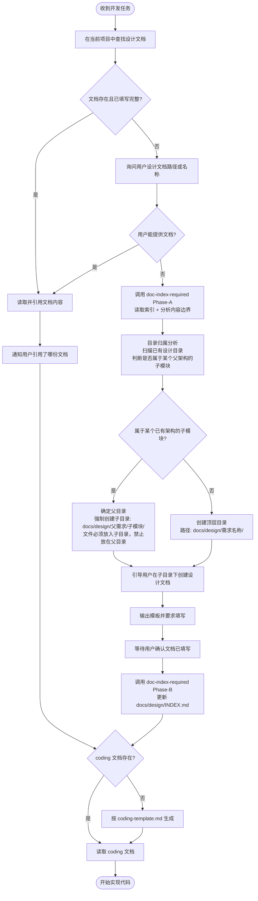

# 开发前设计文档强制检查

## 核心原则

**禁止在没有设计文档的情况下分析方案、讨论架构或编写任何实现代码。**

这不是建议，是强制要求。无论任务看起来多简单，也无论用户是要求「分析」还是「实现」，都必须先完成设计文档检查。

**所有设计文档中的架构图、流程图、模块关系图必须使用 Mermaid 语法绘制，禁止使用 ASCII art 或纯文本框图。**

<HARD-GATE>
Do NOT analyze implementation approaches, discuss architecture, propose solutions, evaluate feasibility, or write any code until the design document check below is complete. This applies even when the user only asks for analysis or architectural discussion — design doc check comes FIRST, before any response about implementation.

Do NOT write any implementation code (Edit/Write .java, .ts, .py, etc.) until BOTH the design document AND the corresponding coding summary document (-coding.md) have been created and confirmed. The coding document is NOT optional — it is the second mandatory gate before any code change.
</HARD-GATE>

---

## 执行流程



---

## 文档目录结构规范

设计文档统一存放在项目 `docs/design/` 目录下，支持**扁平目录**和**层级嵌套**两种组织方式：

```
docs/design/
  {需求名称}/                              ← 顶层需求目录
    {需求名称}-{YYYYMMDD}-v{N}.md          ← 首个版本
    {需求名称}-{YYYYMMDD}-v{N}.md          ← 更新版本（新建文件，不覆盖旧版本）
    {子模块名称}/                           ← 子模块目录（当本需求是更大架构的一部分时）
      {子模块名称}-{YYYYMMDD}-v{N}.md
```

**示例：**
```
docs/design/
  通用智能体架构/                            ← 顶层架构设计
    通用智能体架构-20260404-v1.md
    多平台模型路由层/                         ← 子模块，归属于通用智能体架构
      多平台模型路由层-20260331-v1.md
      多平台模型路由层-20260331-v1-coding.md
      多平台模型路由层-current.md
  用户权限管理/                              ← 独立需求
    用户权限管理-20260330-v1.md
    用户权限管理-20260330-v1-coding.md
```

### 目录层级规则

| 规则 | 说明 |
|------|------|
| **独立需求** | 直接在 `docs/design/` 下创建顶层目录 |
| **子模块/子功能** | 如果本需求属于某个已有架构设计的一部分，**必须创建独立子目录**（`docs/design/{父需求}/{子模块名}/`），**禁止**将子模块文件直接放在父需求目录下与父文档混在一起 |
| **最大嵌套深度** | 不超过 2 层（`docs/design/{父需求}/{子模块}/`），避免目录过深 |
| **归属判断标准** | 见下方「目录归属分析」步骤 |

### 命名规则

| 部分 | 规则 | 示例 |
|------|------|------|
| 需求名称 | 与需求/功能名一致，禁止缩写 | `用户权限管理` |
| 日期 | `YYYYMMDD` 格式，为文档**创建或本次修订**的日期 | `20260330` |
| 版本号 | `v` + 数字，从 `v1` 开始，每次实质性变更递增 | `v1`、`v2` |

### 版本更新原则

- **禁止在原有文档上直接修改后保存**（会丢失历史）
- 需求有实质性变更时：复制最新版本文件 → 修改日期和版本号 → 填写新内容
- 微小错别字/格式修正可在原文件修改，不需要新建版本

---

## 步骤详解

### 第一步：查找设计文档

在当前项目 `docs/design/` 目录下按以下优先级查找：

1. 询问用户本次开发对应的**需求名称**
2. 在 `docs/design/{需求名称}/` 目录下查找版本号最大（日期最新）的 `.md` 文件
3. 若顶层未找到，**递归搜索子目录**（如 `docs/design/{父需求}/{需求名称}/`）
4. 若目录不存在，则认为文档缺失，进入第一·五步（目录归属分析）后再进入第三步

### 第一·五步：目录归属分析

文档缺失需要新建时，**在创建目录前必须先分析目录归属**：

1. **扫描 `docs/design/` 下所有已有目录**（读取 `docs/design/INDEX.md` 获取各需求摘要）
2. **判断本次需求是否属于某个已有架构/系统设计的子模块**，判断依据：

| 判断维度 | 归属为子模块的信号 | 保持独立的信号 |
|---------|------------------|--------------|
| **功能依赖** | 本需求实现的功能是已有架构的组成部分 | 本需求可独立运行，无父架构 |
| **接口引用** | 本需求实现的接口定义在已有架构文档中 | 本需求自定义全部接口 |
| **文档提及** | 已有架构文档的「功能范围」或「后续扩展」明确提到本需求 | 无任何文档提及 |
| **模块归属** | 本需求的代码位于已有架构相同的 Maven 模块内 | 本需求位于独立模块 |

3. **判定结果处理**：
   - **属于子模块** → 目录路径为 `docs/design/{父需求}/{子模块名}/`，告知用户归属原因
   - **独立需求** → 目录路径为 `docs/design/{需求名称}/`
   - **不确定** → 列出候选父目录及判断理由，让用户决定

> **示例：** 新建「多平台模型路由层」设计文档时，扫描发现「通用智能体架构」的功能范围和后续扩展章节明确提到了模型路由，且代码位于同一个 `llm-domain` 模块 → 判定为子模块 → 建议路径 `docs/design/通用智能体架构/多平台模型路由层/`

---

### 第二步：文档存在时

检查是否同时存在对应的编码摘要文档（`-coding.md`）：

- **存在 `-coding.md`**：优先读取编码摘要文档，以节省 token、降低幻觉风险
- **不存在 `-coding.md`**：读取完整文档，并在读取后**自动生成**对应的编码摘要文档

在开始编码前明确告知用户：

> "已读取编码摘要：`docs/design/{需求名称}/{文件名}-coding.md`
> 本次实现依据：
> - 核心业务规则：XXX
> - 涉及类（全类名）：XXX
> - 关键约束：XXX
> 如有不符，请告知我，我将引导你创建新版本文档后再继续。"

### 第三步：文档不存在时

**禁止直接开始编码。** 执行以下步骤：

1. 告知用户未找到对应需求的设计文档
2. 询问是否有已有文档需要手动指定路径
3. 若无文档，**立即调用 `doc-index-required` Phase-A**（前置阶段），完成以下两项：
   - 读取 `docs/INDEX.md` 与 `docs/design/INDEX.md`，确认内容边界（是否已有重叠文档）
   - 分析结果告知用户后，进入文档创建引导
4. 引导用户按规范创建（**注意：若第一·五步判定为子模块，此处目录必须为子目录路径**）：

---

> **开始编码前，请先创建功能设计文档。**
>
> 请按以下步骤操作：
> 1. 在项目中创建目录（根据第一·五步归属分析结果）：
>    - **独立需求** → `docs/design/{需求名称}/`
>    - **子模块** → `docs/design/{父需求}/{子模块名}/`（**禁止**将子模块文件直接放在父目录下）
> 2. 在该目录下创建文件：`{需求名称}-{今日日期}-v1.md`（如 `用户权限管理-20260330-v1.md`）
> 3. 参考模板填写内容（至少完成以下章节）：
>    - 第 2 节：背景与目标
>    - 第 4 节：业务流程设计
>    - 第 5 节：接口设计（如涉及接口变更）
>    - 第 8 节：核心业务规则
> 4. 填写完毕后告知我文件路径，我将读取后开始实现

模板文件位于：`skills/design-doc-required/template.md`（安装后路径由 `$CLAUDE_PLUGIN_ROOT` 指定）

### 第三·五步：文档写完后更新索引

用户确认设计文档填写完毕后，**调用 `doc-index-required` Phase-B**（后置阶段），将新文档登记到 `docs/design/INDEX.md`（含摘要和大纲）。若 `docs/INDEX.md` 中尚无 `design/` 条目，一并追加。

---

### 第四步：生成编码摘要文档（编码前第二道门禁）

**编码摘要文档是编码前的第二道强制门禁。** 设计文档确认后、第一行实现代码之前，必须确保 `-coding.md` 存在。若不存在，立即按 `coding-template.md` 生成。

> **禁止在 `-coding.md` 缺失的情况下开始编码。** 即使用户催促"直接写代码"，也必须先完成本步。

文件命名：`{需求名称}-{YYYYMMDD}-v{N}-coding.md`（与完整文档版本对应）

#### 设计文档 vs 编码文档的职责边界

| 内容 | 设计文档（template.md） | 编码文档（coding-template.md） |
|------|----------------------|---------------------------|
| 分层架构图 | 保留 | 不重复 |
| 类清单 + 变更类型 + 一句话职责 | 保留（一行一类） | 展开方法级操作说明 |
| 方法签名列表 | **不写** | 保留（全路径 + 签名 + 职责） |
| 方法职责详细说明 | **不写** | 保留 |
| 类调用关系图 | 保留（类级别方向） | 不重复 |
| 表操作矩阵 | 保留（入参→表→出参概要） | 展开字段级细节 |
| 实现伪代码 | **不写**——只放流程图 | 保留（完整实现代码） |

**原则：设计文档回答"哪些类、什么职责、怎么协作"，编码文档回答"每个方法怎么写"。**

#### 生成规则

从完整文档中提取以下内容填入编码文档：

- 变更记录 → 精简为一行摘要
- 第 6 节类清单 → 提取**全路径**填入「涉及类清单」，**补充方法签名和职责**（设计文档中没有方法级细节，需从业务流程和接口设计中推导）
- 第 5 节接口设计 → 提取入口接口契约和请求示例
- 第 8 节核心业务规则 → 原文提取
- 第 7/9 节数据库/事务 → 提取关键字段和约束
- 其余章节（背景、上线、风险等）**不纳入编码摘要**

**全路径要求：** 类设计中所有类必须使用完整路径（包路径或文件路径），禁止只写短类名，以便精准定位代码文件。

---

### 第五步：需求变更时引导新建版本

若用户提及需求有调整，**禁止直接修改旧文档**，须引导：

> "检测到需求变更，请按规范新建版本文档：
> 复制 `{当前文件名}` → 重命名为 `{需求名称}-{今日日期}-v{N+1}.md` → 修改变更内容后告知我。"

---

### 第六步：修改设计文档后同步 coding 文档

**每次对设计文档进行实质性内容变更后（包括直接修改和新建版本），必须同步更新对应的 `-coding.md`。**

按以下映射关系更新对应章节：

| 设计文档变更内容 | 需同步更新 coding 文档的章节 |
|----------------|--------------------------|
| 接口清单增删或分类调整 | 第 2 节：接口契约 |
| 类清单增删 | 第 3 节：涉及类清单（同步增删类条目，补充方法签名） |
| 核心业务规则变更 | 第 1 节：核心业务规则 |
| 数据库字段/DDL/Mapper 变更 | 第 4 节：数据结构 |
| 约束、事务、边界说明变更 | 第 5 节：重要约束与边界 |

> **注意**：设计文档的类清单只有一句话职责，coding 文档需自行补充方法签名和详细操作说明。设计文档新增一个类时，coding 文档不只是复制一行，而要展开该类的方法级细节。

**变更记录必须同步追加一行**，与设计文档版本号保持一致。

若以上章节均未涉及，则跳过 coding 文档更新。

---

## Mermaid 图表强制要求

> **Mermaid 语法规范由 `markdown-writing-standards` Skill 统一管控。**
> 本章节只定义设计文档中「必须画哪些图」，具体「图怎么画不出错」请遵循 `markdown-writing-standards`。
> 生成 Mermaid 代码块前，**必须先调用 `markdown-writing-standards`** 进行语法自检。

### 必须包含的图表

| 图表类型 | 适用章节 | Mermaid 图类型 | 目的 |
|---------|---------|---------------|------|
| **功能模块总览图** | 第 3 节（功能范围） | `graph TD` | 一眼看清要开发几个功能、功能之间的关系 |
| **能力分解图** | 第 3 节（功能范围） | `mindmap` / `graph TD` | 每个功能模块的具体能力点拆解 |
| **业务流程图** | 第 4 节（业务流程设计） | `flowchart TD` | 正常流程、异常流程的完整链路 |
| **状态流转图** | 第 4 节（状态流转） | `stateDiagram-v2` | 实体状态变化（若有状态流转） |
| **类调用关系图** | 第 6.3 节（类调用关系） | `graph LR` / `sequenceDiagram` | 核心调用链路可视化（类级别，不标方法名） |
| **组件/接口依赖图** | 第 12 节（下游依赖） | `graph TD` | 系统间依赖关系 |

### 功能模块总览图要求

**每份设计文档的第 3 节必须包含一张功能模块总览图**，该图需要：

1. **列出所有要开发的功能模块**（矩形节点）
2. **标注模块间的依赖/调用关系**（带箭头的连线 + 关系说明）
3. **区分新建模块与复用/改造模块**（用不同样式，如 `stroke-dasharray: 5 5` = 已有模块）
4. **按分层或业务域分组**（用 `subgraph` 分区）

### 能力分解图要求

**每个核心功能模块必须展示其具体能力点**，推荐使用 mindmap 或嵌套 graph。

### 检查清单

生成或审查设计文档时，必须逐项确认：

- [ ] 第 3 节包含**功能模块总览图**（mermaid graph），能一眼看出要开发几个功能
- [ ] 第 3 节包含**能力分解图**（mermaid mindmap/graph），能看到每个模块的能力点
- [ ] 第 4 节所有业务流程使用 **mermaid flowchart** 绘制，而非 ASCII art
- [ ] 第 4.3 节状态流转使用 **mermaid stateDiagram**（若有状态变化）
- [ ] 第 6.3 节类调用关系使用 **mermaid graph 或 sequenceDiagram**
- [ ] 第 12 节下游依赖使用 **mermaid graph**
- [ ] 文档中无任何 ASCII 框图（`┌─┐`、`│`、`└─┘`、`→`、`↓` 等字符画）
- [ ] 所有 Mermaid 代码块已通过 `markdown-writing-standards` 自检清单

---

## 终版文档（current）

每个需求目录下可以同时存在两类文档：

| 文件名格式 | 用途 | 更新方式 |
|-----------|------|----------|
| `{需求名称}-{YYYYMMDD}-v{N}.md` | 变更快照，记录某次需求迭代的设计决策 | 禁止修改已有版本，变更时新建文件 |
| `{需求名称}-current.md` | 终版方案，反映当前代码的实际实现 | 随代码演进直接覆盖更新，无需保留历史 |

**终版文档规则：**
- 无版本号、无日期前缀，命名固定为 `{需求名称}-current.md`
- 内容结构与完整设计文档模板一致，但头部注明「最后更新日期」
- 每次代码变更后同步更新，保证与代码一致
- 存在 `current.md` 时，AI 编码优先读取 `current.md`（而非历史版本快照）

**查找优先级（第一步查找文档时）：**
1. `{需求名称}-current.md`（终版，优先）
2. `{需求名称}-{YYYYMMDD}-v{N}-coding.md`（最新版本编码摘要）
3. `{需求名称}-{YYYYMMDD}-v{N}.md`（最新版本完整文档）

---

## 合法的例外情况

以下情况可以跳过设计文档检查：

- 纯 Bug 修复（不涉及新功能、不改变接口）
- 代码重构（不改变业务逻辑）
- 单元测试补充
- 配置文件修改

**判断标准：** 是否引入新的业务逻辑或接口变更。如有疑问，按需要文档处理。

---

## 与其他 Skill 的协作关系

| Skill | 何时调用 |
|-------|---------|
| `markdown-writing-standards` | 生成或修改设计文档中的 Mermaid 图表时，必须先调用进行语法自检 |
| `doc-index-required` | **Phase-A**：文档不存在时，创建文档**前**必须调用（读索引 + 边界分析）；**Phase-B**：文档写完**后**再次调用（更新索引）。前后两次缺一不可 |
| `pre-implementation-code-orientation` | 设计文档确认完毕、开始写第一行实现代码前调用 |
| `dev-log` | 本次会话中对设计文档有实质性变更时，会话结束前调用 |

---

## 红色警告

以下想法出现时立即停止，回到文档检查流程：

| 理由 | 正确处理 |
|------|----------|
| "需求很简单，不需要设计文档" | 简单功能的文档也可以简单，但不能没有 |
| "用户让我快点做" | 先确认文档，再快速实现 |
| "我已经理解需求了" | 理解 ≠ 文档存在，仍须检查 |
| "只改一个方法" | 判断是否属于例外情况，否则仍须检查 |
| "直接建文件，不用查索引" | 必须先调用 doc-index-required Phase-A，禁止跳过 |
| "doc-index-required 会自动触发" | 不会。必须在本流程中显式调用 Phase-A 和 Phase-B，不依赖自动识别 |
| "子功能文件放父目录就行" | 子模块必须创建独立子目录，禁止将文件直接放在父需求目录下 |
| "设计文档确认了，直接写代码" | 还差一步：必须确认 `-coding.md` 存在后才能编码 |
| "coding 文档内容简单，不用生成" | 无论多简单，coding 文档是编码前的第二道强制门禁，不可跳过 |
| "用户让我根据文档直接改代码" | 有文档 ≠ 已完成设计文档检查，仍须先触发本 skill 确认文档合规，再走 coding.md 门禁 |
| "用户只是让我帮忙改一下代码，不是新需求" | 任何源码 Edit/Write 操作都必须先过本 skill，由本 skill 判断是否属于合法例外 |
| "用户已经提供了分析文档，可以直接编码" | 分析/梳理文档 ≠ 设计文档，仍须检查 `docs/design/` 下是否有对应的设计文档和 coding.md |
