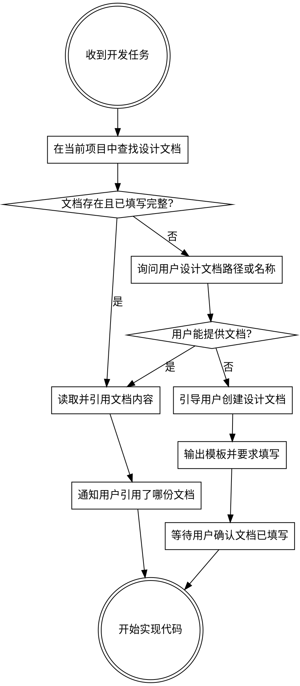

# 开发前设计文档强制检查

## 核心原则

**禁止在没有设计文档的情况下编写任何实现代码。**

这不是建议，是强制要求。无论任务看起来多简单，都必须先完成设计文档检查，再动手写代码。

---

## 执行流程



---

## 文档目录结构规范

设计文档统一存放在项目 `docs/design/` 目录下，**每个需求对应一个子目录**，目录下存放该需求的所有版本文档：

```
docs/design/
  {需求名称}/                              ← 需求目录（中文或英文均可，与功能名一致）
    {需求名称}-{YYYYMMDD}-v{N}.md          ← 首个版本
    {需求名称}-{YYYYMMDD}-v{N}.md          ← 更新版本（新建文件，不覆盖旧版本）
```

**示例：**
```
docs/design/
  用户权限管理/
    用户权限管理-20260330-v1.md            ← 完整设计文档（人读）
    用户权限管理-20260330-v1-coding.md     ← 编码摘要（AI 读，自动生成）
    用户权限管理-20260401-v2.md            ← 需求变更后新建
    用户权限管理-20260401-v2-coding.md     ← 对应新版本的编码摘要
  订单结算功能/
    订单结算功能-20260328-v1.md
    订单结算功能-20260328-v1-coding.md
```

### 命名规则

| 部分 | 规则 | 示例 |
|------|------|------|
| 需求名称 | 与需求/功能名一致，禁止缩写 | `用户权限管理` |
| 日期 | `YYYYMMDD` 格式，为文档**创建或本次修订**的日期 | `20260330` |
| 版本号 | `v` + 数字，从 `v1` 开始，每次实质性变更递增 | `v1`、`v2` |

### 版本更新原则

- **禁止在原有文档上直接修改后保存**（会丢失历史）
- 需求有实质性变更时：复制最新版本文件 → 修改日期和版本号 → 填写新内容
- 微小错别字/格式修正可在原文件修改，不需要新建版本

---

## 步骤详解

### 第一步：查找设计文档

在当前项目 `docs/design/` 目录下按以下优先级查找：

1. 询问用户本次开发对应的**需求名称**
2. 在 `docs/design/{需求名称}/` 目录下查找版本号最大（日期最新）的 `.md` 文件
3. 若目录不存在，则认为文档缺失，进入第三步

### 第二步：文档存在时

检查是否同时存在对应的编码摘要文档（`-coding.md`）：

- **存在 `-coding.md`**：优先读取编码摘要文档，以节省 token、降低幻觉风险
- **不存在 `-coding.md`**：读取完整文档，并在读取后**自动生成**对应的编码摘要文档

在开始编码前明确告知用户：

> "已读取编码摘要：`docs/design/{需求名称}/{文件名}-coding.md`
> 本次实现依据：
> - 核心业务规则：XXX
> - 涉及类（全类名）：XXX
> - 关键约束：XXX
> 如有不符，请告知我，我将引导你创建新版本文档后再继续。"

### 第三步：文档不存在时

**禁止直接开始编码。** 执行以下步骤：

1. 告知用户未找到对应需求的设计文档
2. 询问是否有已有文档需要手动指定路径
3. 若无文档，引导用户按规范创建：

---

> **开始编码前，请先创建功能设计文档。**
>
> 请按以下步骤操作：
> 1. 在项目中创建目录：`docs/design/{需求名称}/`
> 2. 在该目录下创建文件：`{需求名称}-{今日日期}-v1.md`（如 `用户权限管理-20260330-v1.md`）
> 3. 参考模板填写内容（至少完成以下章节）：
>    - 第 2 节：背景与目标
>    - 第 4 节：业务流程设计
>    - 第 5 节：接口设计（如涉及接口变更）
>    - 第 8 节：核心业务规则
> 4. 填写完毕后告知我文件路径，我将读取后开始实现

模板文件位于：`skills/design-doc-required/template.md`（安装后路径由 `$CLAUDE_PLUGIN_ROOT` 指定）

### 第四步：自动生成编码摘要文档

读取完整设计文档后，若 `-coding.md` 不存在，自动按 `coding-template.md` 生成：

文件命名：`{需求名称}-{YYYYMMDD}-v{N}-coding.md`（与完整文档版本对应）

生成内容从完整文档中提取：
- 变更记录 → 精简为一行摘要
- 第 6 节类设计 → 提取**全类名**填入「涉及类清单」
- 第 5 节接口设计 → 提取方法签名（须含全类名）
- 第 8 节核心业务规则 → 原文提取
- 第 7/9 节数据库/事务 → 提取关键字段和约束
- 其余章节（背景、上线、风险等）**不纳入编码摘要**

**全类名要求：** 类设计章节中所有类必须使用完整包路径，如 `com.example.order.service.impl.OrderServiceImpl`，禁止只写短类名，以便后期代码变更时精准定位文件。

---

### 第五步：需求变更时引导新建版本

若用户提及需求有调整，**禁止直接修改旧文档**，须引导：

> "检测到需求变更，请按规范新建版本文档：
> 复制 `{当前文件名}` → 重命名为 `{需求名称}-{今日日期}-v{N+1}.md` → 修改变更内容后告知我。"

---

## 合法的例外情况

以下情况可以跳过设计文档检查：

- 纯 Bug 修复（不涉及新功能、不改变接口）
- 代码重构（不改变业务逻辑）
- 单元测试补充
- 配置文件修改

**判断标准：** 是否引入新的业务逻辑或接口变更。如有疑问，按需要文档处理。

---

## 红色警告

以下想法出现时立即停止，回到文档检查流程：

| 理由 | 正确处理 |
|------|----------|
| "需求很简单，不需要设计文档" | 简单功能的文档也可以简单，但不能没有 |
| "用户让我快点做" | 先确认文档，再快速实现 |
| "我已经理解需求了" | 理解 ≠ 文档存在，仍须检查 |
| "只改一个方法" | 判断是否属于例外情况，否则仍须检查 |
