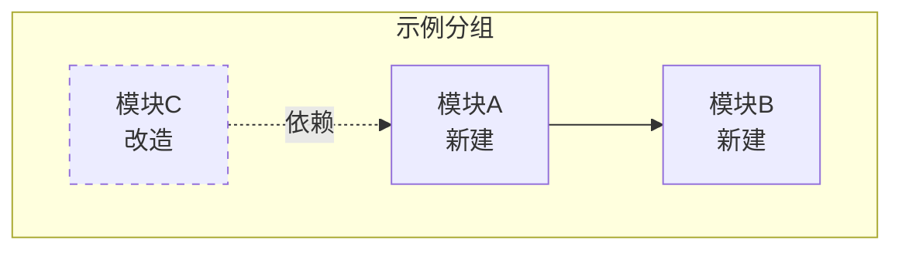
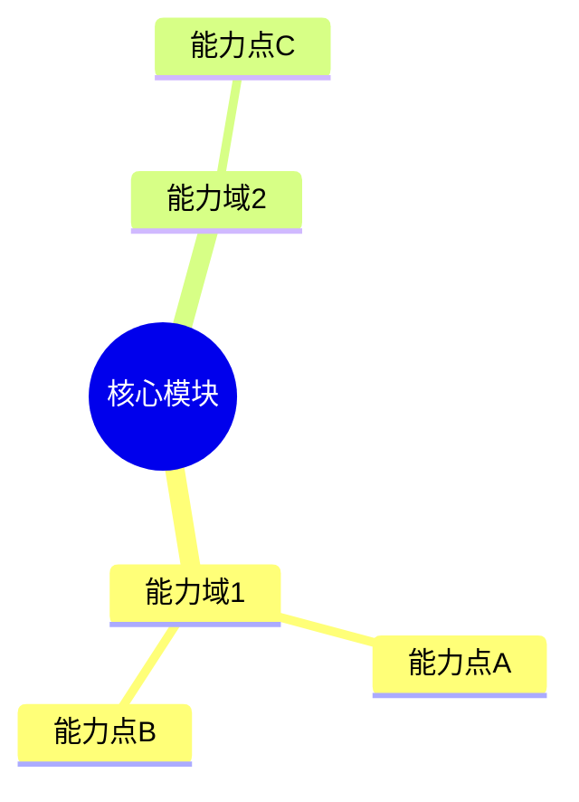
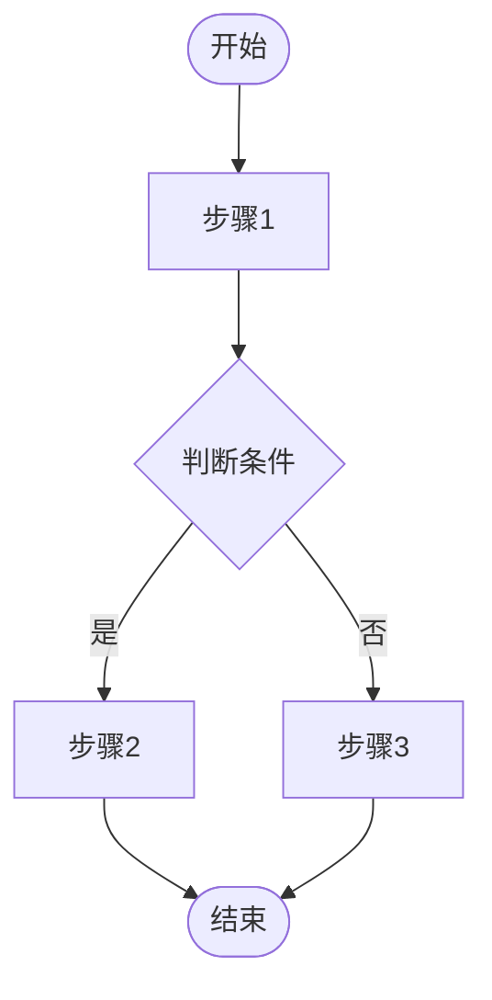
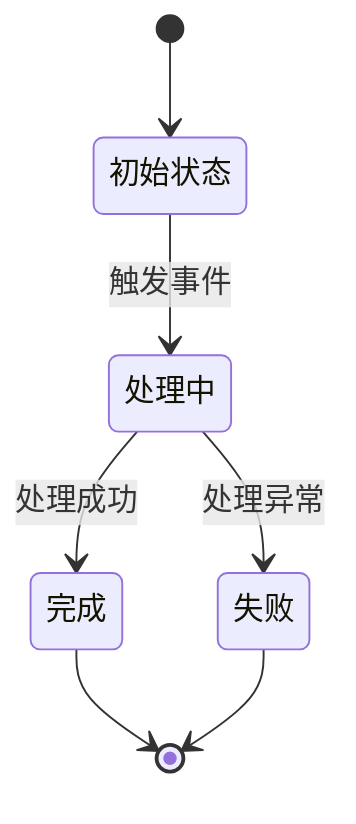
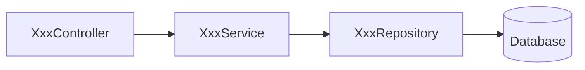
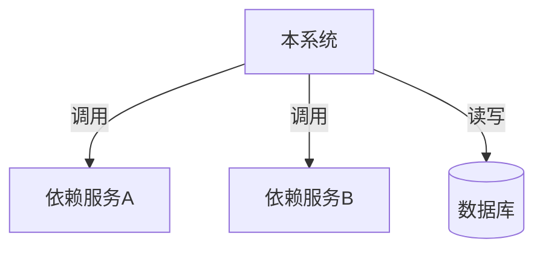

# 功能设计文档

## 变更记录

| 版本 | 日期 | 修改人 | 变更内容摘要 |
|------|------|--------|--------------|
| v1 | YYYY-MM-DD | | 初始版本 |

---

## 1. 基本信息
- 功能名称：
- 所属系统：
- 所属模块：
- 需求来源：
- 负责人：
- 版本号：

## 2. 背景与目标
- 背景：
- 问题：
- 目标：
- 设计边界：

## 3. 功能范围

### 3.1 功能模块总览图

> **【必填·Mermaid】** 用 mermaid graph 绘制本次涉及的所有功能模块及其关系。
> 要求：① 列出所有模块节点 ② 标注依赖/调用关系 ③ 区分新建与改造（虚线=已有） ④ 用 subgraph 按层/域分组



### 3.2 能力分解图

> **【必填·Mermaid】** 用 mermaid mindmap 或 graph 拆解每个核心模块的具体能力点。



### 3.3 功能范围说明

- 本次包含：
- 本次不包含：
- 后续扩展：

## 4. 业务流程设计

> **【强制】** 本节所有流程图必须使用 mermaid 绘制，禁止 ASCII art。

### 4.1 正常流程

> **【必填·Mermaid flowchart】** 用 `flowchart TD` 绘制主流程。



### 4.2 异常流程

> **【必填·Mermaid flowchart】** 用 `flowchart TD` 绘制异常处理流程。

### 4.3 状态流转

> **【选填·Mermaid stateDiagram】** 若有实体状态变化，用 `stateDiagram-v2` 绘制。



## 5. 接口设计
### 5.1 接口清单
### 5.2 请求参数
### 5.3 返回参数
### 5.4 错误码设计

### 5.5 请求示例

> 涉及新增接口时必填；仅修改已有接口的内部逻辑时可省略。
> 目的：让开发/测试可直接复制发起调用，无需猜测参数格式。

**请求示例：**

```http
POST /v1/{path}
Content-Type: application/json

{
  "field1": "value1",
  "field2": 123
}
```

**响应示例（成功）：**

```json
{
  "code": 0,
  "data": {
    "field1": "value1"
  }
}
```

**响应示例（失败）：**

```json
{
  "code": 40001,
  "message": "错误描述"
}
```

## 6. 类设计

> **本节定位：回答"哪些类、什么职责、怎么协作"。**
> 方法签名、方法职责、实现伪代码等编码级细节归入 `-coding.md`（编码摘要文档），设计文档不展开。
>
> **要求：所有类名必须填写全路径（含包/目录路径），以便精准定位代码文件。**

### 6.1 分层设计

> 说明各层职责划分，标注每层对应的包/目录路径前缀。

### 6.2 核心类清单

> 列出本次涉及的所有类。每类一行，标注变更类型和一句话职责。
> **不展开方法列表**——方法级细节在 coding 文档中描述。

| 全路径 | 类型 | 变更 | 一句话职责 |
|--------|------|------|-----------|
| `com.example.xxx.XxxController` | Controller | 新增 | 接收请求，调用 Service |
| `com.example.xxx.XxxServiceImpl` | Service | 修改 | 业务编排，调用 Repository |
| `com.example.xxx.XxxRepository` | Repository | 不变 | 数据访问 |
| `com.example.xxx.domain.XxxDO` | Domain | 新增 | 数据对象 |
| `com.example.xxx.convert.XxxConvert` | MapStruct | 新增 | DO/DTO/VO 转换 |

### 6.3 类调用关系

> **【必填·Mermaid】** 用 mermaid graph 或 sequenceDiagram 绘制核心调用链路，禁止纯文本箭头。
> 只画类级别的调用方向，不标注具体方法名。



## 7. 数据库设计
### 7.1 表设计
### 7.2 字段说明
### 7.3 索引设计
### 7.4 一致性设计
### 7.5 数据量预估

## 8. 核心业务规则
## 9. 事务与并发控制
## 10. 缓存设计
## 11. 消息与异步设计
## 12. 下游依赖设计

> **【必填·Mermaid graph】** 用 mermaid 绘制系统/组件间依赖关系图。
> 同时列出依赖的外部服务/接口全类名或 FeignClient 全类名。



## 13. 安全设计
## 14. 日志与监控设计
## 15. 异常处理设计
## 16. 测试要点
## 17. 上线与回滚方案
## 18. 风险点与待确认事项
