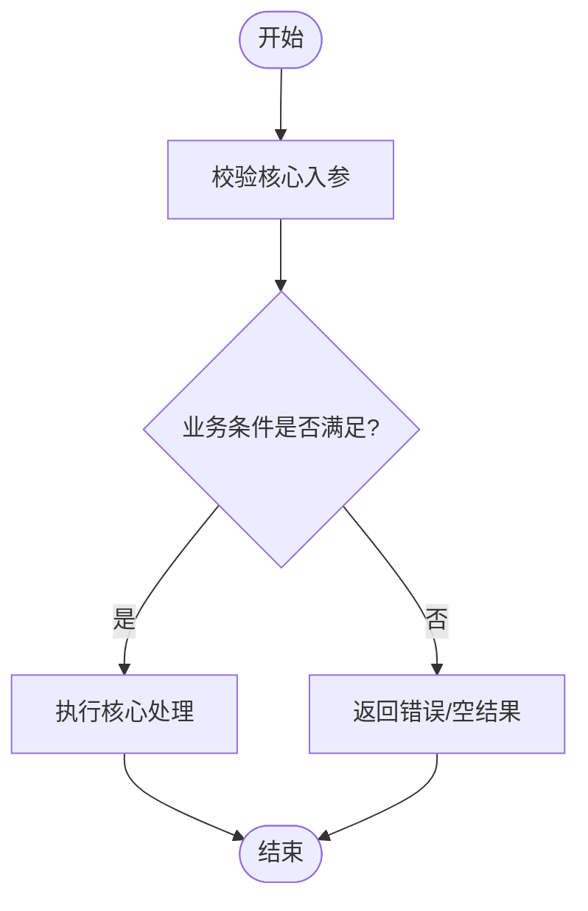

# 方案 / 接口设计文档

> **定位**：本文档用于某个方案开发、接口开发或核心逻辑调整前确认编码依据。目标是简明扼要地说清楚核心逻辑、关键规则、风险点和落代码位置，不是复写项目全集资料。
>
> **写作原则**：
> - 只写本次方案相对现状的变化和关键判断，项目已有架构、数据字典、下游依赖等全集资料不重复粘贴。
> - 能用一张核心流程图讲清，就只画一张图。主流程和异常流程能合并时，用分支节点合并表达。
> - 不涉及变化的章节写“无变化”或直接省略说明，不写套话。

---

## 变更记录

| 版本 | 日期 | 修改人 | 变更内容摘要 |
|------|------|--------|--------------|
| v1 | YYYY-MM-DD | | 初始版本 |

---

## 1. 目标与边界

- **要解决的问题**：
- **本次目标**：
- **不做什么**：
- **设计结论（一句话）**：

---

## 2. 接口 / 入口契约

> 涉及新增或调整接口时必填；仅改内部逻辑时写内部方法入口即可。

- **入口**：`{HTTP 方法} {路径}` 或 `{类/文件}#{方法名}`
- **核心入参**：
  - `{字段名}: {类型}` — {含义 / 默认值 / 枚举 / 是否必填}
- **核心出参**：
  - `{字段名}: {类型}` — {含义}
- **错误行为**：
  - `{场景}` → `{错误码 / 异常 / 返回值}`

---

## 3. 核心流程

> **【必填·Mermaid】** 用一张图表达本次核心逻辑。主流程和异常流程优先合并到同一张图，通过判断节点展示不同路径。
>
> - 业务分支/异常路径是核心：用 `flowchart TD`
> - 库表读写顺序是核心：用 `sequenceDiagram`
> - 图中只放关键判断和关键副作用，细枝末节放到第 4 节规则表



---

## 4. 核心业务规则

> 只列编码时不能丢的规则。能在项目全集资料中查到、且本次不改变的基础规则不重复写。

| 规则 | 说明 |
|------|------|
| 规则 1 | |
| 规则 2 | |

---

## 5. 编码落点

> 设计文档只确认落点和职责，不展开方法伪代码。方法级细节放到 `-coding.md`。
>
> **必须用目录树结构展示**，禁止用扁平表格。每个文件末尾紧跟 `[新增] / [修改] / [不变]` 标注 + 一句话职责。
> - 同一根目录下的相关文件用一棵树展开，多模块或前后端混合时分多棵树
> - 树形比表格更能体现包/目录层级与归属，文件多时一眼看出模块划分
> - 无变更的目录可省略，只保留涉及本次方案的层级

```text
{module-or-package-root}/
├── {子包/子目录}/
│   ├── {ClassName}.{ext}        [新增] 一句话职责
│   └── {ClassName}.{ext}        [修改] 一句话职责（说明改了什么）
└── {ClassName}.{ext}            [不变] 一句话职责（仅引用，不改动）

{另一棵树：如前端 / 另一个服务 / 另一个 module}/
└── ...
```

### 调用关系说明

> 仅当调用关系本身是核心逻辑或不说明会误解时填写。能用文字说清就不用画图。

- `{入口}` → `{服务}` → `{DAO/下游}`：

---

## 6. 数据与依赖变更

> 只写本次新增、修改或依赖风险；项目已有表结构、字段字典、下游清单不重复粘贴。

| 类型 | 是否变化 | 说明 |
|------|----------|------|
| 数据库表 / 字段 / 索引 | 无 / 有 | |
| DTO / VO / 枚举 | 无 / 有 | |
| 下游接口 / 外部依赖 | 无 / 有 | |
| 缓存 / 消息 / 锁 / 事务 | 无 / 有 | |

---

## 7. 风险与待确认

| 风险 / 待确认点 | 影响 | 处理方式 |
|----------------|------|----------|
| | | |

---

## 8. 验证要点

- **正常路径**：
- **异常路径**：
- **边界条件**：
- **回归范围**：
