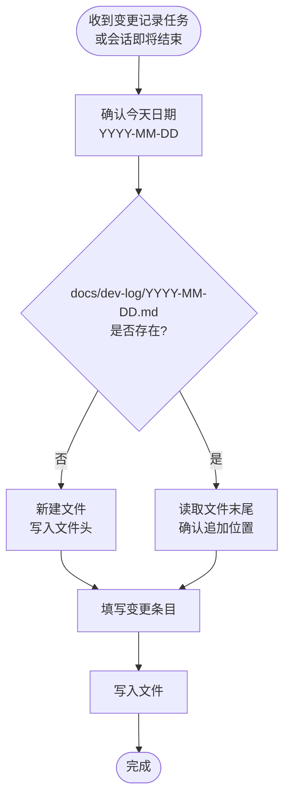

# 开发日志记录规范

## 核心原则

**每次对 team-standards 的变更（新增 Skill、修改规则、调整配置、发版）必须在当天的开发日志中留下记录。**

日志是变更的溯源依据，记录"为什么改"比记录"改了什么"更重要。

---

## 日志目录结构

```
docs/dev-log/
  YYYY-MM-DD.md     ← 每天一个文件，当天所有变更追加到同一文件
```

**规则：**
- 文件名固定为 `YYYY-MM-DD`（ISO 8601 格式，如 `2026-04-02.md`）
- 当天已有文件时，在末尾追加新条目，不新建文件
- 当天无文件时，新建并写入文件头 + 第一条记录

---

## 执行流程



---

## 文件格式

### 新建文件时的文件头

```markdown
# 开发日志 · YYYY-MM-DD

```

### 每条变更条目格式

```markdown
## HH:MM · {变更类型} · {变更对象}

**原因：** {为什么要做这个变更，背景和动机}

**改动：**
- {具体改了什么，一行一项}

**影响：**
- {对哪些 Skill / 规则 / 行为有影响}
```

### 变更类型标签

| 标签 | 含义 |
|------|------|
| `新增 Skill` | 在 skills/ 下新建了 SKILL.md |
| `修改 Skill` | 修改了已有 SKILL.md 的内容 |
| `新增模板` | 在 skill 目录下新增了辅助模板文件 |
| `修改配置` | 修改了 CLAUDE.md、plugin.json、marketplace.json |
| `发版` | 升级了 version 字段并 push |
| `修复规则` | 补充了某个 Skill 中的漏洞或错误描述 |

---

## 示例

```markdown
# 开发日志 · 2026-04-02

## 14:30 · 新增 Skill · bug-doc-required

**原因：** 发现 AI 在编写 bug 分析文档时缺少结构约束，调用链用文字描述、根因不用表格，导致文档质量不稳定。

**改动：**
- 新建 skills/bug-doc-required/SKILL.md
- 新建 skills/bug-doc-required/template.md

**影响：**
- 今后编写 docs/bug/ 下的文档时触发此 Skill
- 强制要求 Mermaid 调用链图和根因表格

---

## 15:10 · 发版 · team-standards 1.2.0 → 1.3.0

**原因：** 新增了 bug-doc-required 和 pre-implementation-code-orientation 两个 Skill，需要 push 让团队成员通过 /plugin update 获取。

**改动：**
- plugin.json version: 1.2.0 → 1.3.0
- marketplace.json version: 1.2.0 → 1.3.0
- CLAUDE.md Skill 索引表新增两行

**影响：**
- 团队成员执行 /plugin update 后可见这两个 Skill
```

---

## 红色警告

| 想法 | 正确处理 |
|------|----------|
| "改动很小，不用记" | 所有变更都要记，小改动日后更难追溯 |
| "代码提交里有 commit message 了" | commit message 记录了改什么，日志记录了为什么改，两者互补 |
| "下次再补" | 当场记录，细节最准确，延后记录信息失真 |
| "时间不知道填什么" | 用当前时间估算即可，精确到分钟 |
