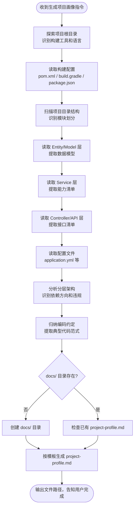

# 生成项目画像（Project Profile）

## 核心原则

**代码感知是一切 AI 辅助开发的基石。** 本 Skill 将项目代码转化为结构化 Markdown 文档，作为需求分析、方案设计、方案审查等后续环节的知识上下文。

核心思想：**不重复造轮子** — 让编码工具（Claude Code / Cursor / Windsurf 等）充当代码理解引擎，本 Skill 只定义输出规范。

---

## 触发场景

用户说以下任意一种时，**必须**调用本 Skill：
- 生成项目画像 / generate project profile
- 扫描项目生成 Markdown / 生成项目 profile
- 为 AI Agent 准备项目上下文
- 更新 project-profile.md

---

## 与 init-project-docs 的关系

| 维度 | init-project-docs | generate-project-profile |
|------|-------------------|--------------------------|
| **目标读者** | 人（开发者阅读理解项目） | AI Agent（程序化消费知识上下文） |
| **输出文件** | 3 份文档（概要 + 架构 + 开发参考） | 1 份文档（project-profile.md） |
| **侧重点** | 业务流程图、架构图、开发场景速查 | 结构化数据表格、编码约定代码片段 |
| **使用方式** | 人工阅读 | 注入 Agent Context / 向量化分片检索 |

两者可以共存，不冲突。

---

## 执行流程

---

## 输出规范

### 文件路径

`docs/project-profile.md`

### 文档结构（10 维度）

严格按以下模板输出，参考 `template.md`。

| # | 维度 | 数据来源 | 说明 |
|---|------|---------|------|
| 1 | 项目概述 | 根目录 + 构建配置 | 项目名、用途、构建工具、语言版本、模块列表 |
| 2 | 技术栈 | pom.xml / package.json 等 | 框架、中间件、版本，按分类表格 |
| 3 | 项目结构 | 目录树扫描 | 关键目录 + 职责说明 |
| 4 | 分层架构 | import 分析 + 包结构 | 分层模式、依赖方向、违规项 |
| 5 | 数据模型 | Entity/Model/表结构 | 实体、核心字段、关联关系 |
| 6 | Service 能力清单 | Service 接口/类 | 公开方法签名 + 一句话说明 |
| 7 | API 接口 | Controller 层 | Method + URL + 入参 + 出参 |
| 8 | 外部依赖服务 | 配置文件 + Feign/HttpClient | 服务名、协议、用途 |
| 9 | 配置概要 | application*.yml/properties | 关键配置项，敏感值脱敏 |
| 10 | 编码约定 | 代码归纳 | 命名规范、异常处理模式、通用基类，附典型代码片段 |

---

## 维度详细说明

### 维度 1-4：全局认知（方案设计必读）

这四个维度回答「项目是什么、用了什么技术、代码怎么组织」。是后续所有环节的前提。

### 维度 5-8：数据与接口（具体编码必读）

- **数据模型**：写 Entity / SQL 的依据
- **Service 能力**：避免重复实现已有能力
- **API 接口**：扩展接口或前后端对接的依据
- **外部依赖**：集成外部服务时不重复造轮子

### 维度 9-10：配置与约定（代码风格必读）

- **配置概要**：知道哪些行为可配置
- **编码约定**：这是**最容易被忽略但最重要的维度**。没有它，Agent 生成的代码即使逻辑正确，也会和项目风格格格不入

---

## 编码约定维度（维度 10）采集指南

这个维度需要从代码中**归纳**，不是简单提取。重点关注：

1. **异常处理模式** — 项目用统一异常类还是 Result 包装？怎么抛、怎么捕？
2. **返回值包装** — 用 `Result<T>` / `ResponseEntity` / 裸返回？
3. **参数校验方式** — JSR303 注解 / 手动校验 / AOP？
4. **日志规范** — log 变量命名、日志级别使用习惯
5. **通用基类/工具类** — BaseEntity / BaseService / 自定义工具类
6. **命名习惯** — DTO/VO/Request/Response 后缀规则

**必须附 2-3 个从项目中提取的真实代码片段**，展示项目的"标准写法"。

---

## 质量标准

- **AI 友好**：表格优先，避免大段叙述；每个维度可独立被向量化分片
- **信息完整**：找不到的维度标注「未检测到」，不要编造
- **脱敏处理**：密码、密钥、Token 等敏感配置值用 `***` 替代
- **可验证**：每个维度的数据都能追溯到具体文件路径
- **可增量更新**：文档头部记录生成时间，便于判断是否过期

---

## 语言与框架适配

本 Skill **不限定语言和框架**。根据项目实际情况调整：

| 项目类型 | 构建配置 | 数据模型来源 | Service 来源 | API 来源 |
|---------|---------|-------------|-------------|---------|
| Java Spring | pom.xml | @Entity / @Table | @Service 类 | @RestController |
| Java MyBatis | pom.xml | Mapper XML / Entity | @Service 类 | @RestController |
| Node.js | package.json | Prisma schema / Mongoose model | service/ 目录 | router/ 或 controller/ |
| Python Django | requirements.txt | models.py | views.py / services/ | urls.py |
| Go | go.mod | model/ 目录 | service/ 目录 | handler/ 或 router/ |
| Vue/React | package.json | 不适用 | store/ / composables/ | api/ 目录 |

---

## 探索策略

1. **先读构建配置**（pom.xml / package.json），确定语言、框架、模块结构
2. **按模块扫描**，多模块项目逐模块分析
3. **Service 层优先读接口**（`I*.java`），减少 token 消耗
4. **Controller 层重点读注解和方法签名**，不需要读方法体
5. **Entity 层完整读取**，字段信息不能遗漏
6. **配置文件完整读取**，但敏感值脱敏
7. **编码约定需要读 2-3 个典型实现类的完整代码**，才能归纳出模式

---

## Mermaid 语法强制规范

- 节点/边标签含 `=`、`,`、`/`、`<`、`>`、`(`、`)`、`[`、`]`、`:` 时**必须加引号**
- `<` `>` 改用文字（如：大于、小于、请求体、响应体）
- 不使用 emoji
- `classDiagram` 方法名不含中文

---

## 注意事项

1. 本 Skill 属于**分析类**，不进入功能开发或 bug 修复链路
2. 生成完成后**不需要**触发 `design-doc-required`
3. 如项目已有 `project-profile.md`，询问用户是覆盖还是跳过
4. 多模块项目生成一份统一的 profile，不按模块拆分
5. 前端项目跳过「数据模型」和「分层架构」维度，标注「不适用」
