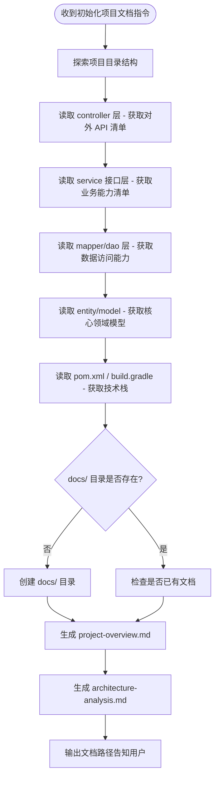

# 项目文档初始化

## 触发场景

用户说以下任意一种时，**必须**调用本 skill：
- 初始化项目文档
- 分析项目能力
- 生成项目概要/架构分析
- init project docs / analyze project

---

## 执行流程

---

## 输出文档规范

### 文档 1：project-overview.md（项目概要）

存放路径：`docs/project-overview.md`

包含章节（参考 `overview-template.md`）：
1. **项目定位** — 一句话描述服务职责
2. **技术栈** — 语言、框架、中间件版本
3. **业务能力概述** — 按业务域分组列出能力（3-5 个主域）
4. **核心业务流程图** — Mermaid flowchart，覆盖主链路（2-4 条）
5. **外部服务依赖** — 表格：服务名 | 用途
6. **消息事件** — 表格：事件名 | 说明
7. **API 接口一览** — 按 Controller 分组，表格：方法 | 路径 | 说明

### 文档 2：architecture-analysis.md（架构能力分析）

存放路径：`docs/architecture-analysis.md`

包含章节（参考 `architecture-template.md`）：
1. **分层架构总览** — Mermaid 架构图，展示 Controller→Service→Mapper→DB 关系
2. **Controller 层（API 层）** — 每个 Controller 的职责 + 端点列表
3. **Service 层（业务逻辑层）** — 每个 Service 接口的业务职责 + 核心方法签名
4. **Mapper/DAO 层（数据访问层）** — 主要数据实体 + 关键查询能力
5. **领域模型** — 核心实体关系图（Mermaid ER 图）
6. **组件层（Component）** — 核心计算/通信组件及职责（如有）
7. **状态机** — 核心实体的状态流转（Mermaid stateDiagram）

---

## Mermaid 语法强制规范

> 来源：team-standards Mermaid 规范（见 MEMORY.md）

- 节点/边标签含 `=`、`,`、`/`、`<`、`>`、`(`、`)`、`[`、`]`、`:` 时**必须加引号**
- `<` `>` 改用文字（如：大于、小于、请求体、响应体）
- 不使用 emoji
- `classDiagram` 方法名不含中文

---

## 文档质量标准

- **AI 友好**：每份文档开头有"快速索引"，让 AI 读一次就能定位关键信息
- **业务优先**：先写业务能力和流程，后写技术细节
- **可维护**：文档头部注明"基于 service 层自动分析生成，如有结构调整请同步更新"
- **简洁**：表格优先，避免大段叙述；每个 Service 职责用 1-2 句话概括

---

## 注意事项

1. 探索阶段优先读 **service 接口文件**（`I*.java`），不读 `impl`，避免无效 token 消耗
2. 若项目使用 Kotlin + Java 混合，两个目录都要探索
3. mapper/DAO 层只需列出实体名和关键查询方法，不需要列出所有 CRUD
4. 生成完成后，**不需要**更新 `design-doc-required` 流程（本 skill 属于分析类，非开发类）
