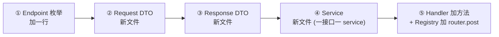

# korepos-backend-service · 快速入门

> **定位**：本 README 是 skill 的**入口索引**。详细规则、范例、红线全部在 [SKILL.md](SKILL.md)，本文负责"新人 5 分钟看完 → 知道写新接口要动哪几个文件 → 知道详细规范去 SKILL.md 哪一节查"。
>
> **标准样板**：所有"接口怎么写"的问题统一参照 `/confirm/refund/transaction` 这条链路（即下方"接口落盘 5 处改动"展开的 confirm 范本）。新接口照着这条链路对位拷贝即可。

---

## 1. skill 自身的结构

```text
skills/korepos-backend-service/
├── README.md                              # 本文件 — 入口 / 索引 / 5 分钟概览
├── SKILL.md                               # 详细规范全文(~1900 行,含 8 步编写顺序、ACL、红线、自检清单)
├── TODO.md                                # skill 演进待办
└── templates/
    ├── init-verification-endpoint.md      # 初始化 ping 验证端点(需求未定时起手用)
    ├── ui-contract-template.md            # UI 对接手册模板(给前端的契约文档)
    └── test-service-smoke-template.md     # service smoke test 模板(Step 9 联调辅助)
```

### 在 skill 里找东西

| 我想查 | 去哪一节 |
|---|---|
| 触发时机、生效范围 | SKILL.md frontmatter `description` |
| 目录结构是什么样子 | SKILL.md「目录结构模板」 |
| backend 能 import 什么 / 不能 import 什么 | SKILL.md「引用边界」 |
| BackendInfra 怎么用、什么时候扩展 | SKILL.md「BackendInfra 门面规则」（本 README §2 也有概要） |
| 一个 service 类该长什么样 | SKILL.md「Service 粒度规则」+「Step 5：Service」 |
| internal 原子能力层什么时候用 | SKILL.md「Service/internal 原子能力层」 |
| Service 装配中转 DTO 什么时候建 | SKILL.md「Service 装配中转 DTO」 |
| 新增一个接口要按什么顺序落盘 | SKILL.md「八步编写顺序」（本 README §3 给最简清单） |
| 一个接口的 5 个文件具体怎么写 | SKILL.md Step 1~8 各章节 + 本 README §4 范本表 |
| 改了 wire 字段要不要做 ACL | SKILL.md「ACL：内部类型与 wire DTO 的边界」 |
| 已开启对接的接口能不能改字段 | SKILL.md「DTO ↔ UI 对接手册双向绑定」+「已开启对接接口的额外保护」 |
| 我违反了哪条红线 | SKILL.md「禁区（违规即停）」表 |

---

## 2. backend_infra 结构

`lib/common/backend_infra/` 是 backend 层访问"非 backend 层"的**唯一通道**。Service / DAO 不直接 `ref.read(...)` 拉其它模块，而是通过本门面拿能力。

```text
lib/common/backend_infra/
├── backend_infra.dart                     # ★ 门面接口 (abstract interface BackendInfra)
├── backend_infra_riverpod.dart            # ★ riverpod 实现 _RiverpodBackendInfra,把 Provider 桥接到接口
├── backend_infra_riverpod.g.dart
├── daos/                                  # ★ 共享 DAO(跨模块复用,通过 @riverpod 单独 Provider 暴露)
│   ├── bill_dao.dart                      #   BackendBillDao
│   ├── orders_dao.dart                    #   BackendOrdersDao
│   ├── order_item_dao.dart
│   ├── order_item_payment_allocate_dao.dart
│   ├── order_transaction_dao.dart
│   ├── refund_eligibility_dao.dart
│   ├── refund_amount_dao.dart
│   ├── refund_allocation_dao.dart
│   ├── refund_button_availability_dao.dart
│   ├── ... 共 ~17 个,每个 DAO 都是单文件 + .g.dart
│   └── models/                            #   DAO 私有 Row 实体(JOIN/聚合的强类型返回)
├── services/                              # ★ 跨 feature 业务原子能力(daos 的对偶,组合 dao + 业务规则)
│   ├── INDEX.md                           # ★ 强制维护索引: 写新 service 前必查
│   ├── order_refundable_amount_service.dart        #   按 originalOrderId 算可退余额
│   ├── transaction_lookup_service.dart             #   按 transactionId 查原支付流水
│   └── ...                                #   每个文件 + .g.dart, 命名不带 feature 前缀
│                                          #   详见 SKILL.md §BackendInfra/services/ 章节
├── cloud/                                 # ★ 云端 HTTP 调用统一子门面(CloudApiPort)
│   ├── cloud_api_port.dart                #   abstract interface
│   ├── cloud_api_client.dart              #   实现
│   ├── endpoint/
│   └── dto/
├── enums/                                 # ★ backend 层共享枚举(PaymentType / RefundMethodType / RefundTransactionState 等)
├── logging/                               #   BackendModuleLogger(按模块+日期+8MB 分卷的调试日志)
├── db_patches/                            #   schema 兼容 / 数据修正脚本
└── kpay_online_refund_outcome.dart        #   refundKpayOnline() 的返回值对象(共享 value object)
```

### `BackendInfra` 接口提供什么（[backend_infra.dart](../../../korepos-refund/lib/common/backend_infra/backend_infra.dart)）

| Getter / 方法 | 用途 | 何时用 |
|---|---|---|
| `db` | drift `AppDatabase` 句柄 | DAO 内部访问数据库；service 包 `_infra.db.transaction(() async {...})` |
| `auth` | 当前登录员工信息 | `_infra.auth.employeeInfo.account.employeeId` 取 operatorId |
| `store` | 当前绑定门店 | `_infra.store.boundStoreInfo.storeId` / `timeZone` / `currency` |
| `kvStorage` | 本地 KV 存储 | `_infra.kvStorage.getTenantId()` |
| `dataSync` | 主副设备数据同步事件上报 | `_infra.dataSync.addBatchDataSyncReport(orderIds, ...)` |
| `lang` | 语言设置 | `_infra.lang.currentLocale`（handler 层用） |
| `createOrderRepo()` | 构造订单本地仓储工厂 | 生成退款订单号等场景 |
| `settlement` | 结账分摊引擎（支付/退款共用） | `_infra.settlement.allocateAndPersist(...)` |
| `refundKpayOnline(...)` | KPay 线上退款同步调用 | confirm 阶段对 paymentType==1 流水发起远端退款 |
| `cloud` | 云端 HTTP 接口统一子门面（v1） | 跨 backend 共享的云端调用 |
| `ws` | WebSocket 服务端（主→副 POS 广播） | 状态变更后 `_infra.ws.sendAllMessageWithPayload(...)` |
| `payment` | POS 支付渠道（KPay 撤销/退款） | `_infra.payment.posRefund(...)` |
| `paymentCallback` | POS 支付回调分发 | `_infra.paymentCallback.registerReopenRefundCompleter(...)` |
| `orderRepository` | 订单推送仓储 | `_infra.orderRepository.pushOrderData(orderId)` |
| `device` | 设备信息（主/副 POS 身份） | `_infra.device.currentDeviceInfo.deviceName` |
| `kpayPlatformPublicKey` | KPay 平台工作密钥 | 反结账 posRefund 时 RSA 加密管理员密码 |

### Service / DAO 的依赖注入两种方式（视依赖落点）

```dart
@riverpod
RefundV2ConfirmService refundV2ConfirmService(Ref ref) =>
    RefundV2ConfirmService(
      // ① 跨非 backend 层的能力 → 走 BackendInfra 门面
      infra: ref.read(backendInfraProvider),
      // ② 共享 DAO（在 backend_infra/daos/ 下）→ 直接 ref.read 对应 dao Provider
      pendingDao: ref.read(pendingOnlineRefundDaoProvider),
      eligibilityDao: ref.read(refundEligibilityDaoProvider),
      // ③ 同模块 / 跨模块 backend 层的 service / 子能力 → 直接 ref.read
      validation: ref.read(refundValidationServiceProvider),
      persistence: ref.read(refundPersistenceServiceProvider),
      priceService: ref.read(refundV2PriceServiceProvider),
      poller: ref.read(kPayStatusPollerProvider),
    );
```

> **service / dao 类内部禁止再 `ref.read(...)`**。一切依赖在 `@riverpod` 工厂层注入完毕，类内只通过 `_infra.xxx` / `_xxxDao` / `_xxxService` 引用。

### 新增一个跨模块依赖时该挂哪里

| 依赖落在哪一层 | 处理方式 | 详见 |
|---|---|---|
| **其它模块的 backend 层**（`features/{x}/backend/...`）| 直接 import，不必走门面（同属后台代码区，独立服务化时一起搬） | SKILL.md「引用边界 §情况 A」 |
| **其它模块的非 backend 层**（`application/data/domain/presentation`）| 走 BackendInfra 扩展三步：① 接口加 getter ② riverpod 实现桥接 ③ service 通过 `_infra.xxx` 调 | SKILL.md「情况 B」 |
| **新实现的"backend 内部基础设施"**（云端 HTTP / WS 推送 / 设备协议） | **不挂 BackendInfra**！必须建独立子门面 + 平级 Provider 注入（参考 `cloud/cloud_api_port.dart`） | SKILL.md「情况 C」 |
| **跨 feature 业务原子能力**（≥2 feature 共享的业务计算 / 组合查询） | 沉到 `backend_infra/services/`，**写新 service 前先查 `services/INDEX.md`**，已有则直接 `ref.read` 注入 | SKILL.md「§BackendInfra/services/ 跨模块业务原子能力层」 |

> **核心心智**：`BackendInfra` 是「**旧实现防腐过渡门面**」——演进终点是字段被一个个清空。新实现进 BackendInfra = 让新代码伪装成"将要清空的过渡通道"，重构时统计"还剩多少旧实现要剥离"会被污染。
>
> **写新 service 主流程前的强制工作流**：先读 `lib/common/backend_infra/services/INDEX.md` 检索是否已有可复用业务原子能力 → 有则直接注入 → 无则写完后反向评估是否抽到 `backend_infra/services/`（≥2 feature 复用即抽）。详见 SKILL.md §BackendInfra/services/。

---

## 3. 接口落盘 5 处改动（每加一个接口固定动这 5 处）

> **入口端：每加一个接口，代码侧动的位置固定 5 处**。`api_intranet_handler.dart` 的挂载行**不动**（模块第一次上线时已挂好）。



| # | 改动点 | 文件 | 看 confirm 范本 |
|---|---|---|---|
| ① | Endpoint 枚举追加一行 | `common/enums/endpoints/{module}_endpoint.dart`（新模块）<br>或 `backend(v2)/endpoint/{module}_endpoint.dart`（refund 历史） | [refund_v2_endpoint.dart#L10](../../../korepos-refund/lib/features/refund/backendv2/endpoint/refund_v2_endpoint.dart) `confirmRefund('/confirm/refund/transaction')` |
| ② | Request DTO 新文件 | `common/models/request/{action}_request.dart`（**新模块**，`@JsonSerializable()`）<br>或 `backendv2/dto/request/{action}_request.dart`（**refund 历史**，`@freezed`） | [confirm_refund_request.dart](../../../korepos-refund/lib/features/refund/backendv2/dto/request/confirm_refund_request.dart) |
| ③ | Response DTO 新文件 | `common/models/response/{action}_response.dart`（新模块）<br>或 `backendv2/dto/response/{action}_response.dart`（refund 历史） | [confirm_refund_response.dart](../../../korepos-refund/lib/features/refund/backendv2/dto/response/confirm_refund_response.dart) |
| ④ | Service 新文件（一接口一 service） | `backend/service/{action}_service.dart` | [refund_confirm_service.dart](../../../korepos-refund/lib/features/refund/backendv2/service/refund_confirm_service.dart) |
| ⑤ | Handler 加方法 + Registry 加 router.post | `backend/endpoint/{module}_handler.dart` 加 5 行方法<br>`backend/registry/{module}_backend_routes.dart` 加 1 行 `router.post(...)` | [refund_v2_handler.dart](../../../korepos-refund/lib/features/refund/backendv2/endpoint/refund_v2_handler.dart) + [refund_v2_routes.dart](../../../korepos-refund/lib/features/refund/backendv2/registry/refund_v2_routes.dart) |

> **DAO 不在"5 处改动"里**：DAO 是数据访问的复用单元，能复用就复用。新接口只在"找不到现成 DAO 方法"时才扩 DAO（首选 `common/backend_infra/daos/` 里现成 DAO 加方法，其次本模块 `backend/dao/` 加文件）。详见 SKILL.md「Step 4：DAO」。

---

## 4. 标准样板：`/confirm/refund/transaction` 链路逐文件展开

> **结构和写法照抄、目录位置注意例外**：confirm 接口在 `backendv2/dto/` 下用 `freezed`，是 refund 模块的历史遗留；**新模块的 DTO 必须放 `features/{module}/common/models/`，用 `@JsonSerializable()`**。这是唯一不要照抄的点。

### 文件 ① — Endpoint 枚举

[`backendv2/endpoint/refund_v2_endpoint.dart`](../../../korepos-refund/lib/features/refund/backendv2/endpoint/refund_v2_endpoint.dart)

```dart
enum RefundV2Endpoint implements ApiEndpoint {
  /// 全流程退款入口
  confirmRefund('/confirm/refund/transaction'),
  // ... 其它 endpoint

  const RefundV2Endpoint(this.path);
  @override
  final String path;
}
```

**写法要点**：枚举值名 = handler / service 的方法名（camelCase）；path 是 kebab-case 业务语义路径；每条加 dartdoc 一句话说明用途。

### 文件 ② — Request DTO

[`backendv2/dto/request/confirm_refund_request.dart`](../../../korepos-refund/lib/features/refund/backendv2/dto/request/confirm_refund_request.dart)

```dart
@freezed                                              // ← refund 历史路径用 freezed;新模块用 @JsonSerializable()
class ConfirmRefundRequest with _$ConfirmRefundRequest {
  const factory ConfirmRefundRequest({
    required int originalOrderId,
    @Default(<int>[]) List<int> selectedOrderItemIds,
    required List<String> refundReasons,
    required double refundAmount,
    required List<RefundMethod> refundMethods,
    @Default(false) bool includeMergeTable,
    Map<String, dynamic>? selectOption,               // ← 透传给 priceService 的算价入参
  }) = _ConfirmRefundRequest;

  factory ConfirmRefundRequest.fromJson(Map<String, dynamic> json) =>
      _$ConfirmRefundRequestFromJson(json);
}
```

**写法要点**：每个字段必有 dartdoc 说明业务含义、取值来源、默认值语义（**禁带 `[ADDED]` / 日期 / 版本标记**，变更历史归 git / design doc，见 coding-standards-common §5.4）；列表字段在构造器层用 `@Default(<T>[])` 兜底；可选字段在 dartdoc 写明 null 含义。

### 文件 ③ — Response DTO

[`backendv2/dto/response/confirm_refund_response.dart`](../../../korepos-refund/lib/features/refund/backendv2/dto/response/confirm_refund_response.dart)

```dart
@freezed
class ConfirmRefundResponse with _$ConfirmRefundResponse {
  const factory ConfirmRefundResponse({
    required bool success,
    int? refundOrderId,
    int? refundBillId,
    @Default(<int>[]) List<int> refundTransactionIds,
    List<KposRefundTransactionInfo>? kposRefundTransactionList,
    List<KposCancelTransactionInfo>? kposCancelTransactionList,
    List<KPayOnlineRefundResultInfo>? kpayOnlineResults,
  }) = _ConfirmRefundResponse;

  factory ConfirmRefundResponse.fromJson(Map<String, dynamic> json) =>
      _$ConfirmRefundResponseFromJson(json);
}

@freezed
class KposRefundTransactionInfo with _$KposRefundTransactionInfo { /* ... */ }

@freezed
class KposCancelTransactionInfo with _$KposCancelTransactionInfo { /* ... */ }

@freezed
class KPayOnlineRefundResultInfo with _$KPayOnlineRefundResultInfo { /* ... */ }
```

**写法要点**：主响应只承载 `data` 部分（不包 code/message，由 `IntranetHandlerBase` 统一处理）；嵌套类放同文件下方（粒度不够用嵌套就拆 record/class 而不是塞 Map）；列表字段在 dartdoc 注明"无则 null/空"语义。

### 文件 ④ — Service

[`backendv2/service/refund_confirm_service.dart`](../../../korepos-refund/lib/features/refund/backendv2/service/refund_confirm_service.dart)

```dart
@riverpod
RefundV2ConfirmService refundV2ConfirmService(Ref ref) =>
    RefundV2ConfirmService(
      infra: ref.read(backendInfraProvider),
      pendingDao: ref.read(pendingOnlineRefundDaoProvider),
      poller: ref.read(kPayStatusPollerProvider),
      validation: ref.read(refundValidationServiceProvider),
      eligibilityDao: ref.read(refundEligibilityDaoProvider),
      persistence: ref.read(refundPersistenceServiceProvider),
      priceService: ref.read(refundV2PriceServiceProvider),
    );

class RefundV2ConfirmService {
  static const _logModule = '退货退款-confirm';
  final BackendInfra _infra;
  final PendingOnlineRefundDao _pendingDao;
  final KPayStatusPoller _poller;
  final RefundValidationService _validation;
  final RefundEligibilityDao _eligibilityDao;
  final RefundPersistenceService _persistence;
  final RefundV2PriceService _priceService;

  RefundV2ConfirmService({
    required BackendInfra infra,
    required PendingOnlineRefundDao pendingDao,
    required KPayStatusPoller poller,
    required RefundValidationService validation,
    required RefundEligibilityDao eligibilityDao,
    required RefundPersistenceService persistence,
    required RefundV2PriceService priceService,
  })  : _infra = infra,
        _pendingDao = pendingDao,
        _poller = poller,
        _validation = validation,
        _eligibilityDao = eligibilityDao,
        _persistence = persistence,
        _priceService = priceService;

  /// 全流程退款入口
  /// 对齐云端: com.kpaygroup.pos.order.modules.service.v1.impl.RefundServiceImpl#confirmRefund
  Future<ConfirmRefundResponse> confirm(ConfirmRefundRequest req) async {
    // ① 阶段 1: 校验链路三段式(前置三道闸)
    _validateMethodsAmountSum(req);
    final totalMaxRefund = await _validation.calculateOrderMaxRefundAmount(req.originalOrderId);
    if (req.refundAmount > totalMaxRefund + 0.005) {
      throw ApiIntranetException(MessageKey.refundAmountExceed);
    }
    await _validation.validateRefundAmountByChannel(...);

    // ② 上下文 / 业务条件分支
    final ctx = await _buildContext(req);

    // ③ 事务编排(只调 DAO 方法,不出现任何 SQL)
    final inner = await _infra.db.transaction(() async {
      final refundOrderId = await _persistence.writeRefundOrder(...);
      final refundBillId = await _persistence.writeRefundBill(...);
      // ...
      return _Inner(refundOrderId: refundOrderId, refundBillId: refundBillId);
    });

    // ④ 事务外的容错调用(失败不回滚事务)
    await _infra.dataSync.addBatchDataSyncReport(...);

    return ConfirmRefundResponse(success: true, refundOrderId: inner.refundOrderId, ...);
  }

  /// 入参校验抽 _private 方法,不内联到主流程
  void _validateMethodsAmountSum(ConfirmRefundRequest req) { /* ... */ }
  Future<_Ctx> _buildContext(ConfirmRefundRequest req) async { /* ... */ }
}

/// 事务上下文(service 私有,不进 wire)
class _Ctx { /* ... */ }
class _Inner { /* ... */ }
```

**写法要点**：

- **一接口一 service** + **类内单一 public 方法**（方法名 = handler 转发名）
- **构造器注入一切依赖**，类内**禁止** `ref.read(...)`
- public 方法必有 dartdoc「对齐云端：{Java 类全路径}#方法」
- **核心红线**：service 文件内**禁止任何 SQL**（`customSelect` / `select(table)` / `update(table)` / `delete(table)` / `into(table).insert` / `_db.batch` 全部不允许）；唯一例外是 `db.transaction(() async {...})`，但事务体内每一步只能是 `await _xxxDao.method(...)`
- 健壮性 / 参数校验代码必须抽 `_private` 方法
- 调云端 HTTP / 跨子门面 / POS 硬件协议前必须用 DB 实读值做边界兜底校验（`_assertXxxWithinBound`，金额加 ±0.005 浮点容差）
- 详细规则见 SKILL.md「Step 5：Service」+「外部调用前的边界兜底校验」

### 文件 ⑤ — Handler 转发 + Registry 挂路由

**Handler**：[`backendv2/endpoint/refund_v2_handler.dart`](../../../korepos-refund/lib/features/refund/backendv2/endpoint/refund_v2_handler.dart)

```dart
class RefundV2Handler {
  final Ref _ref;
  static const IntranetHandlerBase _base = IntranetHandlerBase();
  RefundV2Handler({required Ref ref}) : _ref = ref;
  Locale get _locale => _ref.read(backendInfraProvider).lang.currentLocale;

  Future<Response> confirm(Request request) => _base.handle(
        request: request,
        locale: _locale,
        logTag: 'RefundV2Handler.confirm',
        parse: ConfirmRefundRequest.fromJson,
        action: (req) => _ref.read(refundV2ConfirmServiceProvider).confirm(req),
        encode: (resp) => resp.toJson(),
      );

  // 其它接口同样 5 行...
}
```

**Registry**：[`backendv2/registry/refund_v2_routes.dart`](../../../korepos-refund/lib/features/refund/backendv2/registry/refund_v2_routes.dart)

```dart
void registerRefundV2Routes(Router router, Ref ref) {
  final handler = ref.read(refundV2HandlerProvider);
  router.post(RefundV2Endpoint.confirmRefund.path, handler.confirm);
  // ... 其它路由
}
```

**写法要点**：handler 方法体严格 5 行（构造 base → parse / action / encode），不写 try-catch / jsonDecode 等模板代码（全在 `IntranetHandlerBase` 里）；registry 里就是 `router.post(枚举.path, handler.方法名)` 一行。

### 还有：DAO 的位置选择（按情况新增）

| 场景 | 落地位置 | 例 |
|---|---|---|
| 跨模块复用的 DAO（`bill` / `orders` / `order_item_payment_allocate` 等核心表） | `lib/common/backend_infra/daos/{table}_dao.dart` | 本次新增的 `BackendBillDao.findFirstPaidBillIdByOrderId` |
| 仅本模块用的 DAO（`refund_eligibility` / `refund_amount` / `refund_button_availability` 等业务派生查询） | 也可放 `common/backend_infra/daos/`（refund 现状），或建模块 `backend/dao/` 自持 | `RefundEligibilityDao` / `RefundAmountDao` |
| 新模块从零起手 | `lib/features/{module}/backend/dao/{table}_dao.dart` + `dao/models/{xxx}_row.dart` | `pending_online_refund_dao.dart`（payment 模块） |

DAO 内部规则（核心 5 条）：

1. **DAO 是 SQL 唯一容器**：service / orchestrator / handler / registry / internal 全部禁用 drift 调用，SQL 只在 DAO 文件出现
2. **一方法一 SQL**：DAO public 方法 = 一条 INSERT / UPDATE / SELECT / DELETE，不写 `db.transaction(...)`，事务由 service 包
3. **不读 `_infra.auth/store/kvStorage`**：tenantId / operatorId / storeId / now 等上下文由 service 整理后**作为入参传入**
4. **返回必须强类型**：用 drift 自动 Row（单表全字段查询）或自定义 `*Row` 实体类（JOIN / 聚合）；**禁止** `Map<String, dynamic>` / `List<QueryRow>` / `dynamic`
5. 命名：`findXxx` / `insertXxx` / `updateXxx` / `softDeleteXxx`，动词在前；忌用 `writeXxx` / `processXxx` 这种含编排意味的动词

详见 SKILL.md「Step 4：DAO」。

---

## 5. 八步编写顺序（落盘前完整 checklist）

> 实际落盘按 SKILL.md「八步编写顺序」节执行；此处只列骨架。

| Step | 动作 | 详见 SKILL.md |
|---|---|---|
| 1 | Endpoint 枚举加一条（kebab-case path） | 「Step 1：Endpoint 枚举」 |
| 1.5 | 业务枚举（按需，写到 `common/enums/business/`） | 「Step 1.5：业务枚举」 |
| 2 | Request DTO（`common/models/request/`，`@JsonSerializable()`） | 「Step 2：Request DTO」 |
| 3 | Response DTO（`common/models/response/`，`@JsonSerializable()`） | 「Step 3：Response DTO」 |
| 2/3 通用 | 跑 `dart run build_runner build --delete-conflicting-outputs` | 「Step 2/3 通用：build_runner」 |
| 4 | DAO（按需新增 / 复用 `common/backend_infra/daos/` 现成方法） | 「Step 4：DAO」 |
| 5 | Service（一接口一 service，事务编排，禁裸 SQL） | 「Step 5：Service」 |
| 6 | Handler 加方法（5 行 `_base.handle(...)`） | 「Step 6：Handler」 |
| 7 | Registry 加路由（`router.post(枚举.path, handler.方法)`） | 「Step 7：Registry」 |
| 8 | 在 `api_intranet_handler.dart` 挂载 `register{Module}BackendRoutes`（**模块第一次上线时做一次**，后续接口不动） | 「Step 8：在 ApiIntranetHandler 挂载路由」 |
| 9 | （强烈推荐）生成 services 层 smoke test 联调入口 | 「Step 9：生成 services 层冒烟入口」+ [test-service-smoke-template.md](templates/test-service-smoke-template.md) |

---

## 6. 红线快速回顾（违规即停）

按 SKILL.md「禁区」表抽出最常踩的 8 条：

| # | 红线 | 详见 |
|---|---|---|
| 1 | service 文件内出现 SQL（`customSelect` / `select(table)` / `update(table)` / `into(table).insert` / `_db.batch`）| Step 5「Service 内禁止任何 SQL」核心红线 |
| 2 | DAO 内部包 `db.transaction(...)` 做多步编排 | Step 4 |
| 3 | DAO 方法返回 `Map<String, dynamic>` / `List<QueryRow>` / `dynamic` | Step 4「查询返回类型」 |
| 4 | service / DAO 类内出现 `ref.read(xxxProvider)` | BackendInfra 门面规则 |
| 5 | 一个 service 文件 expose 多个 public 方法 / 服务多个 endpoint | Service 粒度规则 |
| 6 | service A 直接 import service B | Service 粒度规则 §「跨接口复用」 |
| 7 | 直接 import 其它 feature 的非 backend / 非 common 层（`presentation/application/data/domain`）| 引用边界 |
| 8 | service 调云端 / 硬件前没用 DB 实读值做边界兜底校验 | Step 5「外部调用前的边界兜底校验」 |

---

## 7. 路径速查

| 我要找 | 仓库路径 |
|---|---|
| BackendInfra 接口 | `lib/common/backend_infra/backend_infra.dart` |
| BackendInfra riverpod 实现 | `lib/common/backend_infra/backend_infra_riverpod.dart` |
| 共享 DAO | `lib/common/backend_infra/daos/` |
| 共享枚举 | `lib/common/backend_infra/enums/` |
| 子门面（云端 HTTP） | `lib/common/backend_infra/cloud/` |
| confirm 标准样板（5 文件） | `lib/features/refund/backendv2/{endpoint,dto,service,registry}/` |
| skill 详细规范 | `skills/korepos-backend-service/SKILL.md` |
| 初始化 ping 模板 | `skills/korepos-backend-service/templates/init-verification-endpoint.md` |
| UI 对接手册模板 | `skills/korepos-backend-service/templates/ui-contract-template.md` |
| service smoke test 模板 | `skills/korepos-backend-service/templates/test-service-smoke-template.md` |

---

## 8. 与其它 skill 的协作关系

| 协作 skill | 何时介入 |
|---|---|
| `design-doc-required` | 收到接口需求 → 先起草设计文档 / UI 对接手册 → 然后才进本 skill 的 8 步落盘 |
| `pre-implementation-code-orientation` | 设计文档 / bug 文档确认后、开始写第一行代码前，从文档代码坐标精准 Read 关键文件 |
| `coding-violation-log` | 编码前回顾 `docs/coding-violations.md`；用户纠正写法时立刻登记 |
| `bugfix-coding-style` | bug 修复 / 对齐云端 / 删冗余时，源码只描述当前正确逻辑、禁变更日志注释 |
| `arch-lint` | Flutter 架构违规检测（presentation 禁 SQL/HTTP / 金额禁 double / DAO 不可被 presentation 直调等） |
| `cross-project-locator` | 涉及 ≥2 个 kpay POS 工程的跨项目调用链追踪 |
| `daily-work-log` | 每次 Edit/Write 业务源码后写工时日志 |

详见 SKILL.md「与其它 skill 的位置关系」节。
