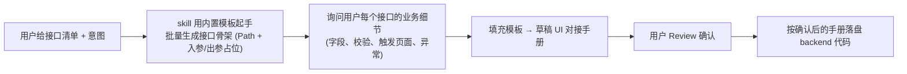

# korepos backend 业务接口编写规范

> **薄入口设计**：本文件只承载触发条件、违规自检前置、前置文档处理、8 步骨架、自检清单、禁区。详细规则按主题拆到 `rules/` 子文档，写代码时按需载入。

## 子规则导航（按主题分文件）

| 子文档 | 覆盖范围 | 何时读 |
|---|---|---|
| [rules/directory-and-imports.md](./rules/directory-and-imports.md) | 目录结构模板 + 引用边界（允许 / 禁止 import） | 新模块首次接入；扩展现模块时如目录结构有疑问 |
| [rules/backend-infra.md](./rules/backend-infra.md) | BackendInfra 门面规则（情况 A/B/C）+ `common/backend_infra/services/` 跨 feature 业务原子能力层 | 新增跨模块依赖；写新实现的云端通信 / WS / 设备协议；下沉跨 feature 业务能力 |
| [rules/service-rules.md](./rules/service-rules.md) | Service 粒度（一接口一 service）+ 长方法拆 `_xxxStep` + `service/internal/` 原子能力 + `service/models/` 装配中转 DTO + DB 字段值与枚举绑定 | 写任何 service 前必读 |
| [rules/dao-rules.md](./rules/dao-rules.md) | Step 4：DAO 原子化 SQL + 禁止业务编排 + 强类型 Row 实体（JPA 风格） | 写任何 DAO 前必读 |
| [rules/step5-service.md](./rules/step5-service.md) | Step 5：Service 完整范本 + 强制规则 + 外部调用前的边界兜底校验 | 写任何 service 前必读，与 service-rules.md 配合 |
| [rules/dto-and-acl.md](./rules/dto-and-acl.md) | Step 2/3：DTO 注解 + 字段类型 + Request / Response + DTO↔UI 对接手册同步 + ACL 三档策略 + 存量 `backend/dto/` 处理 | 写 / 编辑任何 wire DTO 前必读 |
| [rules/wiring-steps.md](./rules/wiring-steps.md) | Step 1 / 1.5（Endpoint + 业务枚举）+ Step 6 / 7 / 8 / 9（Handler / Registry / 路由挂载 / smoke test）+ Service↔Endpoint 暴露关系总览 | 路由层落盘时按 step 顺序读对应小节 |
| [templates/ui-contract-template.md](./templates/ui-contract-template.md) | UI 对接手册模板（8 节结构） | 用户只给接口清单时（挡位 B）起草手册 |
| [templates/init-verification-endpoint.md](./templates/init-verification-endpoint.md) | 初始化 ping 验证端点（7 文件骨架） | 用户要"先搭 backend 骨架"时 |
| [templates/test-service-smoke-template.md](./templates/test-service-smoke-template.md) | Step 9 service smoke test 模板 | 每个新增 service 同步生成 |

---

## 核心原则

**korepos 业务模块的后端接口必须按 `features/{module}/backend/` 模板编写，作为未来独立服务的蓝本。backend 与 UI 彻底分离：其它模块的 `presentation / application / data / domain` 层访问**只能**通过 `common/backend_infra` 门面；**其它模块的 `backend/` 层可以直接互相 import**（同属后台团队代码区，独立服务化时会一起搬走）。**

**默认目标目录：`lib/features/{module}/backend/`**（不是 `backendv2/`）。

- 模块**没有 `backend/`** → 新建 `backend/`，按 [rules/directory-and-imports.md](./rules/directory-and-imports.md) 模板落盘
- 模块**已有 `backend/`** → 直接写进去；若里面已有老结构（`application/data/domain`），新代码按本模板的 `endpoint/registry/dto/service/dao/` 与之并存
- 模块**同时已有 `backendv2/`** → 这是 refund 模块的历史遗留（详见下节），**不要新建 backendv2/**，除非模块原有的 `backend/` 下存在路径或包名冲突且迁移成本过高，此时需与用户确认后再决定

### 参考范本

- **主范本**：`features/refund/backendv2/`（代码结构与门面用法作为范本，**但 `backendv2/` 命名本身是历史遗留，不要模仿**）
- **目录命名范本**：`features/payment/backend/`（新模块命名对标这个）

#### 最佳实践活范本：`/confirm/refund/transaction` 链路

写新接口时，先打开下方 5 个文件通读一遍，作为 endpoint / request / response / service / dao 编排的"活范本"。该接口完整覆盖了"事务编排 + 多 DAO 协作 + 子 service 注入 + 边界兜底校验 + 容错调用"的典型形态。

| 角色 | 文件路径 | 关键看点 |
|---|---|---|
| Endpoint 枚举 | `lib/features/refund/backendv2/endpoint/refund_v2_endpoint.dart#L10`（`confirmRefund('/confirm/refund/transaction')`） | 一行一个 endpoint，路径与方法名 camel→snake 对齐 |
| Request DTO | `lib/features/refund/backendv2/dto/request/confirm_refund_request.dart` | 字段级 dartdoc 写明业务含义 / 取值来源 / 默认值语义（**禁带 `[ADDED]` / 日期 / 版本标记**，变更历史归 git / design doc，见 coding-standards-common §5.4）；**目录例外**：confirm_refund 走的是 backendv2 历史 dto 路径，**新接口的 request 必须放 `features/{module}/common/models/request/`**（详见 [rules/dto-and-acl.md § Step 2](./rules/dto-and-acl.md#step-2request-dto)） |
| Response DTO | `lib/features/refund/backendv2/dto/response/confirm_refund_response.dart` | 主响应类 + 嵌套 freezed 类（`KposRefundTransactionInfo` / `KposCancelTransactionInfo` / `KPayOnlineRefundResultInfo`）的拆分粒度；同样**目录例外**——新接口走 `common/models/response/` |
| Service | `lib/features/refund/backendv2/service/refund_confirm_service.dart` | 构造器注入 `BackendInfra` + 多个原子 DAO + 子 service；service 内只调 DAO 方法、不接触任何 SQL（详见 [rules/step5-service.md § 强制规则](./rules/step5-service.md#强制规则)） |
| DAO 注入与调用 | 同上 service 文件的 `@riverpod` 工厂 + 构造器 | DAO 通过 `ref.read(xxxDaoProvider)` 在工厂层注入，service 类持 `final XxxDao _dao` |

> **写新接口时的"参照拷贝"清单**：从该链路拷贝的 5 类形态 = ① endpoint 枚举一行 ② Request 字段+dartdoc 模式 ③ Response（含嵌套）模式 ④ service `@riverpod` 工厂 + 构造器注入 ⑤ DAO 调用替换成本接口的原子方法。**不要拷贝的**：`backendv2/` 这个名字本身、`backendv2/dto/` 这个 DTO 目录位置（两者都是历史遗留，详见下节）。

### 关于 `refund/backendv2/` 的历史说明

refund 模块走了 `backendv2/` 是因为 `features/refund/backend/` 早已被另一批正在搬运中的老骨架占用（内含 `application/data/domain`），为避免两批代码在同一目录下互相踩脚，当时开了个 `backendv2/` 做隔离。这是**一次性的历史决定**，不是通用命名约定。

- 新模块：一律用 `backend/`
- refund 现存的 `backendv2/`：继续在里面加代码（不要往 `backend/` 挪，避免跨 PR 大搬家）
- 待老 `refund/backend/` 完全下线那天，`backendv2/` 再整体改名回 `backend/`

---

## 编写 backend 代码前的违规自检（强制前置）

**触发时机**：AI 即将 Edit/Write 任何路径含 `lib/features/{module}/backend/`、`lib/features/{module}/common/`（仅当 backend 接口涉及）或 `lib/common/backend_infra/` 下的 `.dart` 文件时——**包括首次编辑该文件**。

**核心原则**：**先做路径合规预检 → 再扫存量违规 → 汇报清单 → 等用户确认处置 → 才动手编辑**。

- **路径合规预检不通过直接动代码 = 流程违反**（典型："凭模块内一致性把新 DTO 写到 `backend/dto/`"）
- **违规清单不汇报直接动代码 = 流程违反**

### 第零步：目标路径合规预检（必须先于扫存量违规）

按 [rules/directory-and-imports.md](./rules/directory-and-imports.md) 节当前规范，对每个**新建文件**核对目标路径：

| 文件类型 | ✅ 必须的目标路径 | ❌ 红色警告（看到立即停） |
|---|---|---|
| Request DTO | `features/{module}/common/models/request/` | 目标路径含 `backend/dto/`（无论目录是否已存在） |
| Response DTO | `features/{module}/common/models/response/` | 目标路径含 `backend/dto/`（无论目录是否已存在） |
| 路由枚举 | `features/{module}/common/enums/endpoints/` | 新建 `backend/endpoint/{module}_endpoint.dart`，或往已存在的同名文件追加新枚举值（新代码） |
| 业务枚举 | `features/{module}/common/enums/business/` | 目标路径含 `backend/enums/` 或 `backend/dto/` 内嵌枚举 |
| Service | `features/{module}/backend/service/` 或 `service/internal/` | 出现 `backend/application/`、`backend/data/`（v1 老骨架） |
| DAO | `features/{module}/backend/dao/` 或 `lib/common/backend_infra/daos/` | 出现 `backend/data/repos/`、`backend/data/sources/`（v1 老骨架） |
| Handler | `features/{module}/backend/endpoint/{module}_handler.dart` | 文件名错位、或 handler 不薄壳（详见 [rules/wiring-steps.md § Step 6](./rules/wiring-steps.md#step-6handler)） |
| Registry | `features/{module}/backend/registry/{module}_backend_routes.dart` | 函数名缺 `register{Module}BackendRoutes` 形式 |

**反 Anti-pattern（这些推理一旦出现立即停下回到合规路径）**：

| 错误推理 | 正确处理 |
|---|---|
| ❌ "模块内已有 N 个 DTO 在 `backend/dto/`，为了一致性新 DTO 也放那里" | 新 DTO 必须放 `common/models/`，模块内一致性 ≠ 跟随历史缺陷继续繁殖 |
| ❌ "目录已存在，所以追加文件不算新增、不算违规" | 目录历史存在 ≠ 路径合规；详见 [rules/dto-and-acl.md § 存量处理](./rules/dto-and-acl.md#现存-backenddto-副本与-backendendpointmodule_endpointdart-路由枚举的存量处理) |
| ❌ "skill 举例只有 refund/backendv2，所以本模块不适用" | 「现存 `backend/dto/` 存量处理」是通用规则，判定信号是 `backend/dto/` 目录形态而非模块名 |
| ❌ "common/ 目录还不存在，建起来太麻烦，先放 backend/dto/" | `common/models/` / `common/enums/` 目录由首次编辑时自动创建，不构成借口 |

**预检处置**：

- **预检通过**：进入「第一步：扫存量违规」
- **预检不通过**：立即调整目标路径到合规位置（首次创建 common/ 子目录视为正常工作量）；如用户明确指示要走老路径（如"模块统一保留 backend/dto/ 风格"），必须在回复中**显式标注违反 skill 规范**并征得用户口头确认，而不是默认照做

### 第一步：扫存量违规（grep 目标文件 + 同模块同层文件）

| 违规模式 | grep 关键字 | 对应红线 |
|---|---|---|
| 裸 SQL 在 service / orchestrator / handler / registry / internal 文件 | `customSelect` / `select(` / `update(` / `delete(` / `into(` / `_db.batch` | [rules/step5-service.md § 强制规则](./rules/step5-service.md#强制规则)「Service 内禁止任何 SQL」 |
| 单方法 ≥80 行 | 看 `Future<...> _xxx(...)` 起止行号差 | [rules/service-rules.md § Service 方法粒度规则](./rules/service-rules.md#service-方法粒度规则长方法必拆私有-_xxxstep) |
| DB 字段过滤值 / 状态判断用裸数字 | `item_type = [0-9]` / `state = [0-9]` / `flag = [0-9]` / `?? [0-9]` 在 customSelect / Value / 比较表达式中 | [rules/service-rules.md § DB 字段值与枚举绑定](./rules/service-rules.md#db-字段值与枚举绑定魔法数字硬规则) |
| 错误用 `throw Exception(...)` 而非 `ApiIntranetException` | `throw Exception(` | 错误处理规则 |

### 第二步：汇报违规清单

把扫到的违规以表格形式输出给用户：

```markdown
| 违规类型 | 文件:行 | 内容 |
|---|---|---|
| 裸 SQL | refund_price_service.dart:80 | `db.customSelect('SELECT * FROM orders ...')` |
| 长方法 | refund_price_service.dart:67-500 | `_calculateRefundPriceRaw` 430 行 |
| 魔法值 | refund_price_service.dart:88 | `item_type = 1` 应改 `ItemType.payment.code` |
```

### 第三步：与用户确认处置（三选一）

| 选项 | 何时选 |
|---|---|
| **(a) 仅做本次任务，违规暂留** + 登记到 `docs/coding-violations.md` 待后续单独清理 | 本次任务与违规无关；违规多到一次顺手修不完 |
| **(b) 顺手把本次 PR 范围内的违规一并修** | 违规 ≤ 3 处且与本次任务在同一文件 |
| **(c) 单独立项重构** | 违规过多（10+ 处） / 牵涉跨文件大改 |

**未与用户确认前不要擅自修存量违规**——扩大 diff 范围 = 流程违反。

### 例外（不需要扫）

- 创建全新文件（无存量代码可扫）
- 只读 grep / 只读 Read（不打算改文件）
- 修改非 backend 路径（`presentation/` / `application/` 等）

---

## 前置条件：接口出入参文档（三挡处理）

一份合格的 UI 对接手册必须包含：

1. **接口清单**：接口名 → Path 的一一映射表
2. **每个接口的出入参**：字段名 / 类型 / 必填 / 业务说明，入参一张表、出参一张表
3. **公共约定**：响应统一 `ApiIntranetResponse { success, message, data: T }`，DTO 只描述 `data` 部分
4. **隐含注入字段**：`operatorId / operatorName / posDeviceNo / tenantId` 等由 `BackendInfra` 从登录态注入，**不出现在入参表里**

根据用户提供的信息完整度，按以下**三挡**处理——不要一看到缺文档就停下索要：

### 挡位 A — 用户已给完整 UI 对接手册

直接按文档逐接口落盘代码，跳过 B / C。

### 挡位 B — 用户只给了接口清单 + 需求意图（最常见）

> 例："帮我实现反结账的 7 个接口：createReopen / executeRefund / cancelReopen / ..."

**先用 [templates/ui-contract-template.md](./templates/ui-contract-template.md) 生成一份**《{模块}-UI对接手册-{YYYYMMDD}-v1.md》**草稿**，存放到 `docs/{模块}/` 下，每个接口套用【单接口模板】，**用户补充业务细节 → 你按模板扩展 → 确认后再编码**。

流程：



### 挡位 C — 用户只说一句话（"加个查询接口"）

先向用户追问 3 个最小必要输入：

1. 接口属于哪个模块（对应哪个 `features/{module}/backend/`）？
2. 这个接口干什么业务（一句话），触发页面是哪个？
3. 核心入参有哪些（至少列 1-2 个字段名）？

拿到回答后回到 **挡位 B** 的流程：起草手册 → 补细节 → Review → 编码。**绝不自行脑补业务字段**。

### 举一反三工作流

用户说："我还要加 `getXxxDetail` 和 `deleteXxx` 两个接口"：

1. 打开 `docs/{模块}/{模块}-UI对接手册-*.md`
2. §2 接口清单表追加两行；§4 复制【单接口模板】块两次
3. 追问用户这两个接口的**字段细节**（不凭空造），补全字段表
4. 用户 Review 后 → 回到下方「八步编写顺序」落盘代码

**每增一个接口，代码侧对应动的位置固定 5 处**：
Endpoint 枚举加一条 → Request DTO 新文件 → Response DTO 新文件 → Service 加一个 public 方法 → Handler 加一个方法 → Registry 加一行 `router.post(...)`。

`api_intranet_handler.dart` 的挂载行 **不动**（模块第一次上线时已经挂好）。

---

## 初始化方案：需求未定时的验证端点

**适用场景**：用户想先把 `features/{module}/backend/` 的目录、BackendInfra 门面、路由注册链路跑通，具体业务接口还没定。

**不要因为需求模糊就停下来** —— 直接按 [templates/init-verification-endpoint.md](./templates/init-verification-endpoint.md) 生成一个 `ping` 验证端点：

- 路径：`POST /{module}/ping`
- 入参：`{ echo: string }`
- 出参：`{ echo, serverTimeMillis, tenantId }`
- 依赖：仅 `BackendInfra.kvStorage.getTenantId()`，不触碰任何业务表
- 目的：**端到端跑通链路**（JSON 编解码 / freezed 生成 / `IntranetHandlerBase` / Registry / `api_intranet_handler.dart` 挂载 / build_runner）

该模板产出 7 个完整可编译文件，并给出 `api_intranet_handler.dart` 挂载点修改步骤、Postman 验证步骤、以及后续删除 `ping` 的 checklist。

### 何时走初始化方案

- ✅ 用户说「先搭个 backend 骨架」「给我一个可跑的 backend 起点」「{模块} backend 初始化」
- ✅ 新模块从 0 建，UI 对接手册还没写
- ✅ 想先验证 BackendInfra 门面在该模块能注入
- ❌ 用户已给 UI 对接手册 → 直接走「八步编写顺序」，不要搭 ping

### 真实接口上线后的 `ping` 处置

首个真实业务接口（按 UI 对接手册）落地后：

- 可选「保留 ping 用作健康检查」—— 则路径改为 `/{module}/health` 并在 dartdoc 里改写用途说明
- 默认「移除 ping」—— 按初始化模板末尾 checklist 逐项清理；Registry 的 `register{Module}BackendRoutes` 挂载行**保留**（真实接口仍要走它）

---

## 八步编写顺序（必须按顺序落盘）

每一步都要在落盘前把**这一步文件的完整内容**展示给用户确认，不得批量生成整包。完整的步骤细节见各子文档：

| Step | 内容 | 详细规则 |
|---|---|---|
| **Step 1** | Endpoint 枚举 — `common/enums/endpoints/{module}_endpoint.dart` | [rules/wiring-steps.md § Step 1](./rules/wiring-steps.md#step-1endpoint-枚举) |
| **Step 1.5** | 业务枚举（按需） — `common/enums/business/` | [rules/wiring-steps.md § Step 1.5](./rules/wiring-steps.md#step-15业务枚举按需) |
| **Step 2** | Request DTO — `common/models/request/{action}_request.dart`（含 DTO 注解强制 + 字段类型强制） | [rules/dto-and-acl.md § Step 2](./rules/dto-and-acl.md#step-2request-dto) |
| **Step 3** | Response DTO — `common/models/response/{action}_response.dart` | [rules/dto-and-acl.md § Step 3](./rules/dto-and-acl.md#step-3response-dto) |
| **Step 2/3 通用** | build_runner — `dart run build_runner build --delete-conflicting-outputs` | [rules/dto-and-acl.md § build_runner](./rules/dto-and-acl.md#step-23-通用build_runner) |
| **Step 4** | DAO — `backend/dao/{table}_dao.dart`（原子 SQL + 强类型 Row） | [rules/dao-rules.md](./rules/dao-rules.md) |
| **Step 5** | Service — `backend/service/{action}_service.dart`（事务编排 + 外部调用兜底校验） | [rules/step5-service.md](./rules/step5-service.md) + [rules/service-rules.md](./rules/service-rules.md) |
| **Step 6** | Handler — `backend/endpoint/{module}_handler.dart`（薄壳） | [rules/wiring-steps.md § Step 6](./rules/wiring-steps.md#step-6handler) |
| **Step 7** | Registry — `backend/registry/{module}_backend_routes.dart` | [rules/wiring-steps.md § Step 7](./rules/wiring-steps.md#step-7registry) |
| **Step 8** | 在 `api_intranet_handler.dart` 挂载路由（**必须完成，否则 404**） | [rules/wiring-steps.md § Step 8](./rules/wiring-steps.md#step-8在-apiintranethandler-挂载路由必须完成否则接口不可访问) |
| **Step 9** | services 层冒烟/调试入口（联调辅助） | [rules/wiring-steps.md § Step 9](./rules/wiring-steps.md#step-9生成-services-层冒烟调试入口联调辅助强烈推荐) |

> Step 5 Service 同时受 [rules/service-rules.md](./rules/service-rules.md)（粒度 / 长方法拆分 / internal 原子能力 / service/models / DB 字段枚举绑定）约束；Step 5 的写法范本与边界兜底校验集中在 [rules/step5-service.md](./rules/step5-service.md)。

---

## 完成后自检清单

执行完 Step 8 后，对新生成的代码逐项自检：

| 检查项 | 通过条件 |
|---|---|
| **目录结构** | 严格符合 `common/{enums/{endpoints,business},models/{request,response}}` + `backend/{endpoint(handler),registry,service/{,internal,models},dao/{,models}}`；新代码不新增 `backend/dto/`、`backend/endpoint/{module}_endpoint.dart`、`application/data/domain/` 等已废弃路径 |
| **service 粒度** | 每个 service 文件只对应 1 个 endpoint，类内只暴露 1 个 public 方法（方法名 = handler 转发方法名）；跨接口复用沉入 `service/{purpose}_orchestrator.dart` 或 `service/internal/`；service 之间无互相 import |
| **DAO 原子化** | 每个 DAO public 方法 = 一条原子 SQL；DAO 内部**不出现** `db.transaction(`；DAO 不读 `_infra.auth` / `_infra.store` 等上下文（除 `_infra.db`）；事务编排在 service |
| **DAO 返回强类型实体（JPA 风格）** | DAO 方法返回类型必须是 drift 自动 Row（单表）或自定义 `*Row` 实体类（JOIN/聚合）；**禁止** `Future<Map<String, dynamic>>` / `Future<List<QueryRow>>` / `Future<dynamic>`；自定义 Row 类**默认放本模块** `backend/dao/models/`（仅当 ≥2 模块实际复用时才上提到 `lib/common/services/database/models/`），DAO 顶部 `export` |
| **service/internal 复用提醒** | 写主 service 时已 grep 模块内同类片段；发现 ≥2 处重复 → 已主动建议下沉到 `service/internal/{capability}_service.dart`（用户确认前不擅自抽） |
| **service 装配中转 DTO** | service 装配段 `Map<String, dynamic>` / 私有 record 满足任一阈值（字段 ≥5 / 跨方法 ≥2 处用 / 有 toJson / dartdoc >3 行）时已主动建议抽到 `backend/service/models/`；用户确认前不擅自抽。小 record（字段 ≤3 + 单方法内传递）保留 service 文件底部 `_` 前缀私有 |
| import 边界 | grep 新增代码：无 `features/{module}/{data,application,presentation,domain}/` 引用；其它 feature 的非 common/非 backend 层引用走 BackendInfra；无 `*_notifier.dart` / widget 引用 |
| BackendInfra 使用 | Service / DAO 构造器接受 `BackendInfra`，方法体内 **不出现** `ref.read(` |
| **外部调用前的边界兜底校验** | 凡 service 调云端 HTTP / 跨子门面 / POS 硬件协议的"业务数值"（金额、数量、配额等），若本地 DB 有可查的上限/边界，已用 DB 实读值做边界校验（不信任入参/前序内存对象）；校验逻辑抽 `_assertXxxWithinBound` 私有方法；金额比较加 ±0.005 浮点容差；失败抛 `ApiIntranetException`。详见 [rules/step5-service.md § 外部调用前的边界兜底校验](./rules/step5-service.md#外部调用前的边界兜底校验健壮性硬规则) |
| **DTO 在 common 且 wire 干净** | request/response DTO 在 `features/{module}/common/models/{request,response}/`；用 `@JsonSerializable()`（不写 freezed）；**不出现** `@JsonKey(includeToJson: false, includeFromJson: false)` 标注的 internal 字段 — internal 字段一律拆到 backend 私有 record / `_` 前缀类 |
| **路由枚举在 common** | `{Module}Endpoint` 在 `features/{module}/common/enums/endpoints/`，handler 通过 import 引用；backend/endpoint/ 下不存在 `{module}_endpoint.dart` |
| Handler 薄壳 | 每个 handler 方法 ≤ 8 行，只含 `_base.handle/handleRaw` 调用 |
| 路由注册 | `api_intranet_handler.dart` backend 路由块新增一行 `register{Module}BackendRoutes(router, _ref)` |
| 代码生成 | 所有含 `part '*.g.dart'` 的文件，提醒用户跑 `dart run build_runner build --delete-conflicting-outputs`（现有 freezed 副本保留期间 `*.freezed.dart` 也要生成） |
| 注释完备 | 每个类 / public 方法有 dartdoc；对齐云端注释标注了 Java 类全路径；魔法数字有枚举说明 |
| 代码 → 文档引用 | 每个 Endpoint 枚举值 / Request DTO / Response DTO 的 dartdoc 第一行含 ``文档：`docs/{模块}/{模块}-UI对接手册-*.md` §4.N`` |
| 文档 → 代码引用 | UI 对接手册每个 §4.N 小节末尾写有「对应代码」段，列出 Endpoint 枚举值 / Request DTO / Response DTO 在 `common/` 下的相对路径 |
| 对接手册一致性 | 新增接口的 Path、入参字段、出参字段与 UI 对接手册逐项对齐；若本次有字段/接口变更，已改 §1 版本号并追加 §8 变更记录 |
| **ACL 分级标注** | 每个新增字段已明确是 wire 还是 internal；wire → 进 common DTO；internal → 进 backend 私有 record / `_` 前缀类（L1）或独立 internal 枚举/类（L2/L3）；common DTO 上**禁出现**含 `@JsonKey(includeToJson: false)` 注解的字段 |
| **已对接接口保护** | 对本次涉及的接口，已 grep `presentation/` / `frontend/` 确认是否已被 UI 调用；若已对接，本次改动未违反「允许/禁止」矩阵（未删 wire 字段、未改字段类型、未变魔法数字语义） |
| **测试入口生成（Step 9）** | 每个新增 service 在 `test/features/{module}/backend/services/` 下生成 `{action}_service_test.dart`；`_support/` 4 个基础文件已存在（首次接入则一并落地）；`flows/` 与 `_support/seed/` 保留 `.gitkeep` 占位；harness 的 service getter 区已追加新 service（grep 幂等） |
| 同步提醒输出 | 若本次是**首次**为该模块生成 backend 代码，回复末尾带上「⚠️ 同步提醒」段落（内容见 [rules/dto-and-acl.md § 前端归属提醒](./rules/dto-and-acl.md#前端归属提醒生成首个接口时必须输出)） |

若任一项不通过，**必须在回复用户前修正**，而不是先落盘再等用户发现。

---

## 与其他 skill 的位置关系

```
design-doc-required（设计文档 + coding.md 已确认）
        ↓
pre-implementation-code-orientation（代码坐标加载）
        ↓
korepos-backend-service（← 本 skill，backend 模板编写）
        ↓
arch-lint（架构违规扫描）
        ↓
git-commit-standards（提交）
```

本 skill 不替代 `design-doc-required` — 新需求仍须先有设计文档与 UI 对接手册，本 skill 只负责**把已确认的接口契约落盘成代码**。

---

## 禁区（违规即停）

| 行为 | 为什么禁止 |
|---|---|
| 新模块命名为 `backendv2/` | `backendv2` 是 refund 的一次性历史名，新模块一律用 `backend/` |
| 在 `backend/` 下新建 `application/` 或 `data/` 或 `domain/` 目录（新代码） | 这是 v1 老结构；新代码走 `endpoint(handler) / registry / service / dao` 加 `common/` 共享契约层 |
| **新建 `backend/dto/` 目录、或往已存在的 `backend/dto/` 追加新 DTO 文件、或在 backend 任意位置自持 DTO 副本** | DTO 必须放 `features/{module}/common/models/{request,response}/`，UI 与 backend 共用；backend 不再自持。⚠️ **目录已存在不构成豁免** —— 详见 [rules/dto-and-acl.md § 存量处理](./rules/dto-and-acl.md#现存-backenddto-副本与-backendendpointmodule_endpointdart-路由枚举的存量处理) |
| **新建 `backend/endpoint/{module}_endpoint.dart` 路由枚举文件、或往已存在的同名文件追加新枚举值（新代码）** | 路由枚举搬到 `features/{module}/common/enums/endpoints/`；backend/endpoint/ 仅留 `{module}_handler.dart` 与 `intranet_handler_base.dart`。已存在的旧枚举文件由「机会主义迁移」清理；**新枚举值默认放 common，不得追加到旧文件**（用户明确要求保持模块内一致时按用户指示，但需在回复中显式标注违反 skill） |
| **DTO 用 freezed**（新代码） | 与现有 `refund/common/models/` 风格分裂；统一用 `@JsonSerializable()` 单边支持 fromJson/toJson |
| **common DTO 加 `@JsonKey(includeToJson: false, includeFromJson: false)` 标注的 internal 字段** | common 是 UI 与 backend 共享的契约层，internal 字段 IDE 仍会提示给 UI 端；必须拆到 backend 私有 record / `_` 前缀类（详见 [rules/dto-and-acl.md § ACL L1](./rules/dto-and-acl.md#l1-样例最常用与-common-dto-物理隔离)） |
| **DAO 内部包 `db.transaction(...)` 做多步 SQL 编排** | 违反 DAO 原子化原则（[rules/dao-rules.md](./rules/dao-rules.md)）；事务由 service 包，DAO 一方法一 SQL |
| **DAO 内部读 `_infra.auth` / `_infra.store` / `_infra.kvStorage`** | 上下文耦合，DAO 无法独立测试；service 整理 tenantId/operatorId/storeId 后作为入参传入 |
| **DAO 方法返回 `Map<String, dynamic>` / `List<QueryRow>` / `dynamic`** | 弱类型 JDBC 风格，调方靠字符串 key 取字段，IDE 不补全、拼错运行时才崩；必须用 drift 自动 Row 或自定义 `*Row` 实体类（JPA 风格） |
| **Service 内出现任何 SQL（`_db.customSelect` / `_db.select(table)` / `_db.update(table)` / `_db.delete(table)` / `into(table).insert` / `_infra.db.batch(...)` 等）** | 业务编排与数据访问耦合，schema 变更时 SQL 散落多处无主、单测要 mock 整个 db、字符串字段名靠 `row.read('xxx')` 拼写错运行时才崩、独立服务化时无法分包搬走；service 仅允许 `db.transaction(...)` 包事务，体内每一步必须是 `await _xxxDao.method(...)` 调用，SQL 一律下沉到 DAO（详见 [rules/step5-service.md § 强制规则](./rules/step5-service.md#强制规则)「Service 内禁止任何 SQL」核心红线）|
| 在 Service / DAO 里写 `ref.read(xxxProvider)` | 绕过 BackendInfra 门面，独立服务化时会大范围返工 |
| 一个 service 文件 expose 多个 public 业务方法 / 一个 service 服务多个 endpoint | 违反「一接口一 service」debug 友好原则；本端 service ≈ 云端 Controller，不要按 ServiceImpl 的合并方式写 |
| service A 直接 import service B 复用业务能力 | 跨接口复用必须沉到 `service/internal/{capability}_service.dart` 或 `service/{purpose}_orchestrator.dart`；service 之间维持平级独立 |
| 直接 import 其它 feature 的**非 backend / 非 common 层**（`presentation/**`、`application/**`、`data/**`、`domain/**`）、`*_notifier.dart`、widget | backend 侵入 UI 层，违反前后端彻底分离。其它 feature 的 `backend/` 与 `common/` 层不受此限 |
| 复用 `features/{module}/domain/` 的模型作为 backend DTO | domain 是 UI 领域模型，与 wire 契约无关；backend 必须从 `common/models/` 取 DTO |
| 在 handler 里手写 `try-catch` / `jsonDecode` | 偏离 IntranetHandlerBase 模板，日志/错误映射会不一致 |
| 跳过 UI 对接手册自行推断接口形状 | 字段漂移 —— 前端最终拿不到预期字段 |
| 改了 DTO 字段 / Endpoint 但不同步 UI 对接手册 §4.N / §1 版本 / §8 变更记录 | 文档会发给前端团队对接使用，漂移即线上字段错位 |
| 同一次 PR 同时改 backend 和 `features/{module}/presentation/` | 违反「backend 与 UI 彻底分开开发」；UI 切换由 UI 团队做（注：本次允许同 PR 改 `common/` —— 它是 UI 与 backend 共享契约真源） |
| 在设计/编码文档里把「UI 怎么调新接口」作为 checkbox 任务 | 越界；backend 只声明契约，不规划 UI diff |
| 对已对接接口的 wire 字段做破坏性改动（删字段、改类型、可选→必填、魔法数字语义变） | 违反已开启对接接口保护矩阵；必须走新接口或 `/v2/` 路径 |
| **service 调云端/硬件前不做 DB 实读兜底校验，直接信任入参或前序内存对象** | 一旦上游计算偏差或 DB 状态异常，错误金额/数量直接打到云端，回错信息泛化（"金额大于流水"），定位成本高且回滚链路远比拦截一次复杂；必须用 DB 实读边界（原流水 pay_amount、累计已退 sum 等）兜底，校验抽 `_private` 方法 |
| **在已有的巨型方法 / 老骨架文件里就地追加新逻辑（新增 N 行内联在旧 service / 旧 repository / 旧 endpoint 段里）** | 新逻辑放到新 service / 新子门面 / 新原子能力暴露 public 方法（一开始就符合 SKILL 目标态：DAO 唯一容器 SQL / 私有方法粒度 / 强类型 / 一接口一 service），旧文件只 +1 行调用；典型应用：扩展数据同步链路漏处理的字段、给老 repository 补字段映射、给老 endpoint 接受新 payload 段时，全部走"新结构暴露 + 旧代码引用"。详见 `architecture-ddd-lite-fullstack` 的 [rules/structure-quality-gates.md § 新代码落点决策](../architecture-ddd-lite-fullstack/rules/structure-quality-gates.md#新代码落点决策扩展现有功能时不要在旧结构堆叠) |
