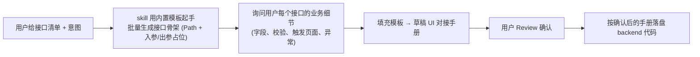

# korepos backend 业务接口编写规范

## 核心原则

**korepos 业务模块的后端接口必须按 `features/{module}/backend/` 模板编写，作为未来独立服务的蓝本。backend 与 UI 彻底分离，跨模块访问只能通过 `common/backend_infra` 门面。**

**默认目标目录：`lib/features/{module}/backend/`**（不是 `backendv2/`）。

- 模块**没有 `backend/`** → 新建 `backend/`，按下方模板落盘
- 模块**已有 `backend/`** → 直接写进去；若里面已有老结构（`application/data/domain`），新代码按本模板的 `endpoint/registry/dto/service/dao/` 与之并存
- 模块**同时已有 `backendv2/`** → 这是 refund 模块的历史遗留（详见下节），**不要新建 backendv2/**，除非模块原有的 `backend/` 下存在路径或包名冲突且迁移成本过高，此时需与用户确认后再决定

### 参考范本

- **主范本**：`features/refund/backendv2/`（代码结构与门面用法作为范本，**但 `backendv2/` 命名本身是历史遗留，不要模仿**）
- **目录命名范本**：`features/payment/backend/`（新模块命名对标这个）

### 关于 `refund/backendv2/` 的历史说明

refund 模块走了 `backendv2/` 是因为 `features/refund/backend/` 早已被另一批正在搬运中的老骨架占用（内含 `application/data/domain`），为避免两批代码在同一目录下互相踩脚，当时开了个 `backendv2/` 做隔离。这是**一次性的历史决定**，不是通用命名约定。

- 新模块：一律用 `backend/`
- refund 现存的 `backendv2/`：继续在里面加代码（不要往 `backend/` 挪，避免跨 PR 大搬家）
- 待老 `refund/backend/` 完全下线那天，`backendv2/` 再整体改名回 `backend/`

---

## 前置条件：接口出入参文档（三挡处理）

一份合格的 UI 对接手册必须包含：

1. **接口清单**：接口名 → Path 的一一映射表
2. **每个接口的出入参**：字段名 / 类型 / 必填 / 业务说明，入参一张表、出参一张表
3. **公共约定**：响应统一 `ApiIntranetResponse { success, message, data: T }`，DTO 只描述 `data` 部分
4. **隐含注入字段**：`operatorId / operatorName / posDeviceNo / tenantId` 等由 `BackendInfra` 从登录态注入，**不出现在入参表里**

根据用户提供的信息完整度，按以下**三挡**处理——不要一看到缺文档就停下索要：

### 挡位 A — 用户已给完整 UI 对接手册

直接按文档逐接口落盘代码，跳过 B / C。

### 挡位 B — 用户只给了接口清单 + 需求意图（最常见）

> 例："帮我实现反结账的 7 个接口：createReopen / executeRefund / cancelReopen / ..."

**先用下方内置模板生成一份**《{模块}-UI对接手册-{YYYYMMDD}-v1.md》**草稿**，存放到 `docs/{模块}/` 下，每个接口套用【单接口模板】，**用户补充业务细节 → 你按模板扩展 → 确认后再编码**。

流程：



### 挡位 C — 用户只说一句话（"加个查询接口"）

先向用户追问 3 个最小必要输入：

1. 接口属于哪个模块（对应哪个 `features/{module}/backend/`）？
2. 这个接口干什么业务（一句话），触发页面是哪个？
3. 核心入参有哪些（至少列 1-2 个字段名）？

拿到回答后回到 **挡位 B** 的流程：起草手册 → 补细节 → Review → 编码。**绝不自行脑补业务字段**。

---

## UI 对接手册模板（独立文件）

UI 对接手册模板单独落在 **[templates/ui-contract-template.md](templates/ui-contract-template.md)**，不在本 skill 中内联，便于直接拷贝为 `docs/{模块}/{模块}-UI对接手册-{YYYYMMDD}-v1.md` 的起始版本。

模板含 8 节结构（基本信息 / 接口清单 / 公共约定 / 出入参 / 页面调用总览 / 跨页状态 / WebSocket / 变更记录），第 4 节给出【单接口模板】块（注释标记起止），扩展新接口时复制该块即可。

### 举一反三工作流

用户说："我还要加 `getXxxDetail` 和 `deleteXxx` 两个接口"：

1. 打开 `docs/{模块}/{模块}-UI对接手册-*.md`
2. §2 接口清单表追加两行；§4 复制【单接口模板】块两次
3. 追问用户这两个接口的**字段细节**（不凭空造），补全字段表
4. 用户 Review 后 → 回到下方「八步编写顺序」落盘代码

**每增一个接口，代码侧对应动的位置固定 5 处**：
Endpoint 枚举加一条 → Request DTO 新文件 → Response DTO 新文件 → Service 加一个 public 方法 → Handler 加一个方法 → Registry 加一行 `router.post(...)`。

`api_intranet_handler.dart` 的挂载行 **不动**（模块第一次上线时已经挂好）。

---

## 初始化方案：需求未定时的验证端点

**适用场景**：用户想先把 `features/{module}/backend/` 的目录、BackendInfra 门面、路由注册链路跑通，具体业务接口还没定。

**不要因为需求模糊就停下来** —— 直接按 **[templates/init-verification-endpoint.md](templates/init-verification-endpoint.md)** 生成一个 `ping` 验证端点：

- 路径：`POST /{module}/ping`
- 入参：`{ echo: string }`
- 出参：`{ echo, serverTimeMillis, tenantId }`
- 依赖：仅 `BackendInfra.kvStorage.getTenantId()`，不触碰任何业务表
- 目的：**端到端跑通链路**（JSON 编解码 / freezed 生成 / `IntranetHandlerBase` / Registry / `api_intranet_handler.dart` 挂载 / build_runner）

该模板产出 7 个完整可编译文件（Endpoint 枚举 / Handler / Routes / Request DTO / Response DTO / Service / `intranet_handler_base.dart` 拷贝指引），并给出 `api_intranet_handler.dart` 挂载点修改步骤、Postman 验证步骤、以及后续删除 `ping` 的 checklist。

### 何时走初始化方案

- ✅ 用户说「先搭个 backend 骨架」「给我一个可跑的 backend 起点」「{模块} backend 初始化」
- ✅ 新模块从 0 建，UI 对接手册还没写
- ✅ 想先验证 BackendInfra 门面在该模块能注入
- ❌ 用户已给 UI 对接手册 → 直接走「八步编写顺序」，不要搭 ping

### 真实接口上线后的 `ping` 处置

首个真实业务接口（按 UI 对接手册）落地后：

- 可选「保留 ping 用作健康检查」—— 则路径改为 `/{module}/health` 并在 dartdoc 里改写用途说明
- 默认「移除 ping」—— 按初始化模板末尾 checklist 逐项清理；Registry 的 `register{Module}BackendRoutes` 挂载行**保留**（真实接口仍要走它）

---

## 目录结构模板（必须严格遵循）

```
lib/features/{module}/backend/
├── endpoint/
│   ├── {module}_endpoint.dart            # 路由枚举 implements ApiEndpoint
│   ├── {module}_handler.dart             # shelf HTTP handler，仅 parse/action/encode 薄壳
│   └── intranet_handler_base.dart        # [直接从 refund/backendv2 拷贝复用] 通用模板基类
├── registry/
│   └── {module}_backend_routes.dart      # register{Module}BackendRoutes(router, ref) — 挂路由
├── dto/
│   ├── request/
│   │   └── {action}_request.dart         # freezed + json_serializable 入参
│   └── response/
│       └── {action}_response.dart        # freezed + json_serializable 出参（data 部分）
├── service/
│   └── {module}_{feature}_service.dart   # 业务编排（依赖 BackendInfra + DAO），@riverpod Provider
└── dao/
    └── {module}_{table}_dao.dart         # 纯 DB SQL/事务，@riverpod Provider
```

**禁止出现的目录**（这是老 `backend/` 的 v1 风格，新代码不要用）：
- `backend/application/` ❌（service 直接放 `service/` 下）
- `backend/data/` ❌（DAO 直接放 `dao/` 下）
- `backend/domain/` ❌（DTO 直接放 `dto/request/` 与 `dto/response/`）
- `backend/presentation/` ❌（backend 不允许碰 UI 层）

**特例**：若模块的 `backend/` 已存在 `application/data/domain`（老骨架），新代码仍按上方五层结构并存落盘，**不要迁移老代码**（避免跨 PR 大搬家）；老代码下线由另行 PR 处理。

---

## 引用边界（backend 独立服务化蓝本）

`backend/` 将整体拷贝到未来的独立服务中，import 边界就是服务边界。

### ✅ 允许引用（视为基础能力，会一起拷走）

- `lib/common/**` — 数据库 / 日志 / 网络 / 存储 / 通用工具
- `lib/common/backend_infra/**` — 门面层（**必经之路**，详见下一节）
- `lib/features/auth/application/auth_service.dart` — **只通过 `infra.auth`**，禁止直接 import
- `lib/features/order/data/order_local_repository.dart` — **只通过 `infra.createOrderRepo()`**
- `lib/features/store/application/store_service.dart` — **只通过 `infra.store`**

### ❌ 禁止引用（违反即阻止落盘）

- `lib/features/{module}/domain/**` — 前端 UI 领域模型；backend 须自持副本到 `backend/dto/`
- `lib/features/{module}/data/**`、`application/**`、`presentation/**` — UI 侧（同模块内 UI 文件同样禁引）
- `lib/features/payment/**`、`cart/**`、`bill/**` 等其他业务 feature — 一律经 BackendInfra 暴露或拒绝引用
- 任何 `*_notifier.dart` / `*_view_model.dart` / `*_controller.dart`（UI 层 Riverpod 控制器）
- `package:flutter/widgets.dart`、`package:flutter/material.dart`（仅 `debugPrint` 场景豁免，用 `package:flutter/foundation.dart`）
- 同模块老 `backend/application/`、`backend/data/`（如果共存期）—— 新代码不反向依赖老骨架，老代码下线时直接删

**发现越界 import 时立刻停下**，与调用方确认是走 BackendInfra 扩展，还是该项不属于 backend 职责。

---

## BackendInfra 门面规则

所有跨模块/跨层依赖 **只能** 通过 `BackendInfra` 接口（`lib/common/backend_infra/backend_infra.dart`）访问。

### Service / DAO 的标准依赖注入形态

```dart
@riverpod
XxxService xxxService(Ref ref) => XxxService(
      infra: ref.read(backendInfraProvider),
      dao: ref.read(xxxDaoProvider),
    );

class XxxService {
  final BackendInfra _infra;
  final XxxDao _dao;
  XxxService({required BackendInfra infra, required XxxDao dao})
      : _infra = infra,
        _dao = dao;
}
```

Service / DAO 内部 **不允许** 再出现 `ref.read(...)`。想拿什么从 `_infra` 取：`_infra.db` / `_infra.auth` / `_infra.store` / `_infra.kvStorage` / `_infra.dataSync` / `_infra.lang` / `_infra.createOrderRepo()` / `_infra.settlement`。

### 新增跨模块依赖的流程（必须走扩展 BackendInfra）

若业务逻辑确实需要一个现在 `BackendInfra` 还没暴露的能力（比如某模块的 repository），**禁止直接 import**，改走以下三步：

1. 在 `backend_infra.dart` 接口上新增一个方法/getter，**写清楚独立服务化剥离路径注释**（参考 `createOrderRepo()` 和 `settlement` 的注释样式）
2. 在 `backend_infra_riverpod.dart` 的 `_RiverpodBackendInfra` 实现里用 `_ref.read(...)` 把 Provider 桥接上
3. Service / DAO 通过 `_infra.xxx` 调用，**对业务层透明**

这是唯一合法的跨模块扩展路径。

---

## 八步编写顺序（必须按顺序落盘）

每一步都要在落盘前把**这一步文件的完整内容**展示给用户确认，不得批量生成整包。

### Step 1：Endpoint 枚举

`endpoint/{module}_endpoint.dart`

```dart
import '../../../../common/services/networking/remote_service/api_endpoint.dart';

/// {模块} 端点枚举
///
/// 对应 UI 对接手册 §{章节号} 定义的 N 个接口。
/// 路径策略：原则上与前端清单一致；若与老骨架路径冲突则加 `/v2/` 前缀避让，在此注释说明。
enum {Module}Endpoint implements ApiEndpoint {
  /// {接口 1 中文名 / UI 对接手册 §4.x}
  actionOne('/xxx/one'),

  /// {接口 2 中文名 / UI 对接手册 §4.x}
  actionTwo('/xxx/two');

  const {Module}Endpoint(this.path);

  @override
  final String path;
}
```

- 每个枚举值 **必须有 dartdoc 注释**，指向 UI 对接手册对应章节
- 路径小写，动词在前（`confirm/`、`get/`、`update/`、`rollback/`、`create/`、`cancel/`）
- 与老骨架冲突时加 `/v2/` 前缀，并在 dartdoc 里写明"为避让老骨架"；非冲突接口**不加任何前缀**

### Step 2：Request DTO

`dto/request/{action}_request.dart`（每个接口一个文件）

```dart
import 'package:freezed_annotation/freezed_annotation.dart';

part '{action}_request.freezed.dart';
part '{action}_request.g.dart';

/// 接口 POST {/path} 入参（UI 对接手册 §4.x）
///
/// 字段语义逐一对应 UI 对接手册的入参表。
@freezed
class {Action}Request with _${Action}Request {
  const factory {Action}Request({
    /// {字段 1 业务含义、单位、取值范围、来源}
    required int orderId,

    /// {字段 2 可空原因说明}
    String? someOptional,
  }) = _{Action}Request;

  factory {Action}Request.fromJson(Map<String, dynamic> json) =>
      _${Action}RequestFromJson(json);
}
```

- 所有字段必须有行内 dartdoc，说明**业务含义**（对接手册里的「说明」列搬过来）
- 必填字段用 `required`，可空字段标注默认或 null 的业务含义
- 魔法数字（如 `paymentType: 1=KPay 2=现金 3=自定义`）必须在 dartdoc 里枚举出来
- **禁止** import `features/{module}/domain/`，DTO 是 backend 自持副本

### Step 3：Response DTO

`dto/response/{action}_response.dart`（对应 `ApiIntranetResponse.data` 的形状）

```dart
import 'package:freezed_annotation/freezed_annotation.dart';

part '{action}_response.freezed.dart';
part '{action}_response.g.dart';

/// 接口 POST {/path} 出参 data（UI 对接手册 §4.x）
@freezed
class {Action}Response with _${Action}Response {
  const factory {Action}Response({
    required bool success,

    /// {字段说明 + 构建来源，例如"DAO Step 9 写入 order_transaction"}
    int? recordId,

    /// {列表为空时的语义 — 前端如何判空}
    @Default(<int>[]) List<int> affectedOrderIds,
  }) = _{Action}Response;

  factory {Action}Response.fromJson(Map<String, dynamic> json) =>
      _${Action}ResponseFromJson(json);
}
```

- Response 只包含 `data` 字段，**不包裹 code/message**（由 `IntranetHandlerBase` 统一处理）
- 列表字段用 `@Default(<int>[])` 给空列表，避免前端判 null
- 失败场景的字段取值必须在 dartdoc 里写明（例如「失败时 `recordId` 为 null，UI 端无终态需登记」）

### Step 4：DAO

`dao/{module}_{table}_dao.dart`

```dart
import 'package:drift/drift.dart';
import 'package:flutter_riverpod/flutter_riverpod.dart';
import 'package:riverpod_annotation/riverpod_annotation.dart';

import '../../../../common/backend_infra/backend_infra.dart';
import '../../../../common/backend_infra/backend_infra_riverpod.dart';
import '../../../../common/services/database/app_database.dart';

part '{module}_{table}_dao.g.dart';

@riverpod
{Module}{Table}Dao {module}{Table}Dao(Ref ref) =>
    {Module}{Table}Dao(ref.read(backendInfraProvider));

/// {模块} {表} 持久化 DAO
///
/// 对齐云端：{对应 Java 类完整类名 + 方法}
class {Module}{Table}Dao {
  final BackendInfra _infra;

  {Module}{Table}Dao(this._infra);

  AppDatabase get db => _infra.db;
  int get _tenantId => _infra.kvStorage.getTenantId() ?? 1;

  Future<{Result}> writeXxx({Params} params) async {
    final now = DateTime.now().millisecondsSinceEpoch;
    final employee = _infra.auth.employeeInfo;
    final store = _infra.store.boundStoreInfo;
    final businessDate = await _infra.store.calculateBusinessDate();

    return await db.transaction(() async {
      // ===== Step 1: INSERT {table_a} — {业务语义} =====
      // ...
      // ===== Step 2: UPDATE {table_b} — {业务语义} =====
      // ...
    });
  }
}
```

- 写操作必须包 `db.transaction()`，事务内抛异常自动回滚
- 每步 SQL 必须加 `// ===== Step N: 操作 → 表名 — 业务语义 =====` 注释
- 类级 dartdoc **必须** 标注「对齐云端：{Java 类全路径}#方法名」
- tenantId / employeeId / storeId / businessDate 统一从 `_infra` 取，**不允许** 从 Provider 直接拿
- 纯本地 DB 流程不用写 rollback 方法；**只有**「先写 DB 再调外部服务」的 Saga 场景才写补偿方法

### Step 5：Service

`service/{module}_{feature}_service.dart`

```dart
import 'package:flutter/foundation.dart'; // 仅 debugPrint
import 'package:flutter_riverpod/flutter_riverpod.dart';
import 'package:riverpod_annotation/riverpod_annotation.dart';

import '../../../../common/backend_infra/backend_infra.dart';
import '../../../../common/backend_infra/backend_infra_riverpod.dart';
import '../../../../common/services/networking/constants/api_intranet/api_intranet_message_key.dart';
import '../../../../common/services/networking/intranet_service/api_intranet_exception.dart';
import '../dao/{module}_{table}_dao.dart';
import '../dto/request/{action}_request.dart';
import '../dto/response/{action}_response.dart';

part '{module}_{feature}_service.g.dart';

@riverpod
{Module}{Feature}Service {module}{Feature}Service(Ref ref) =>
    {Module}{Feature}Service(
      infra: ref.read(backendInfraProvider),
      dao: ref.read({module}{Table}DaoProvider),
    );

/// {模块} {feature} 编排 service
///
/// 对齐云端：{Java 类全路径}#{方法}
class {Module}{Feature}Service {
  final BackendInfra _infra;
  final {Module}{Table}Dao _dao;

  {Module}{Feature}Service({
    required BackendInfra infra,
    required {Module}{Table}Dao dao,
  })  : _infra = infra,
        _dao = dao;

  Future<{Action}Response> actionOne({Action}Request req) async {
    try {
      // 1. 前置校验与参数整形（抽私有方法）
      final params = await _buildParams(req);
      // 2. 本地事务入库
      final result = await _dao.writeXxx(params);
      // 3. 数据同步事件上报
      await _infra.dataSync.addBatchDataSyncReport(/* ... */);
      return _buildResponse(true, result);
    } on ApiIntranetException {
      rethrow; // 受控业务异常冒泡到 handler
    } catch (e, st) {
      debugPrint('actionOne 失败: $e\n$st');
      return const {Action}Response(success: false);
    }
  }

  /// 参数组装 — 从 req + DB 现状构造入库参数
  Future<{Params}> _buildParams({Action}Request req) async { /* ... */ }

  /// 返回体组装 — 从 DAO 结果映射成 Response
  {Action}Response _buildResponse(bool success, {Result} result) { /* ... */ }

  /// 前置数据校验 — 缺失时抛业务异常
  Future<Order> _fetchOrderOrFail(int orderId) async {
    final order = /* ... */;
    if (order == null) throw ApiIntranetException(MessageKey.notFound);
    return order;
  }
}
```

规则：
- **public 方法 = 对外接口**：类级 / 方法级 dartdoc **必须**写「对齐云端：{Java 类全路径}#方法」
- **参数组装、校验、辅助查询必须抽 `_private` 方法**，不得内联在主流程里（参考记忆：健壮性代码不内联）
- **只 import `BackendInfra` + DAO + DTO + common**，禁止 `ref.read(xxxProvider)` 方式直接拉其他模块
- **业务异常用 `ApiIntranetException(MessageKey.xxx)`**，由 handler 层统一本地化
- 失败场景：受控异常 rethrow；未预期异常 catch 后返回 `success: false` 的响应，不让 HTTP 500 冒泡
- **详细注释**（参考记忆 `feedback_refund_code_comments.md`）：
  - 业务规则判断 → 注释写明"为什么这样判"
  - 魔法数字（状态码、枚举值）→ 枚举所有可能值及语义
  - 字段取值来源 → 注明 DB 列 / 入参字段 / 云端对齐路径
  - 容错降级（比如分摊失败仅记日志不回滚）→ 注明"为何不回滚"

### Step 6：Handler

`endpoint/{module}_handler.dart` — 全部走 `IntranetHandlerBase` 模板，每个方法仅 5 行

```dart
import 'dart:ui';
import 'package:flutter_riverpod/flutter_riverpod.dart';
import 'package:riverpod_annotation/riverpod_annotation.dart';
import 'package:shelf/shelf.dart';

import '../../../../common/backend_infra/backend_infra_riverpod.dart';
import '../dto/request/{action}_request.dart';
import '../service/{module}_{feature}_service.dart';
import 'intranet_handler_base.dart';

part '{module}_handler.g.dart';

@riverpod
{Module}Handler {module}Handler(Ref ref) => {Module}Handler(ref: ref);

/// {模块} HTTP handler 集合
///
/// 每个方法本体仅 3-5 行：构造 Base 模板 → 指定 parse / action / encode。
/// try-catch、日志、错误映射、JSON 读写全部下沉到 [IntranetHandlerBase]。
class {Module}Handler {
  final Ref _ref;
  static const IntranetHandlerBase _base = IntranetHandlerBase();

  {Module}Handler({required Ref ref}) : _ref = ref;

  Locale get _locale => _ref.read(backendInfraProvider).lang.currentLocale;

  Future<Response> actionOne(Request request) => _base.handle(
        request: request,
        locale: _locale,
        logTag: '{Module}Handler.actionOne',
        parse: {Action}Request.fromJson,
        action: (req) =>
            _ref.read({module}{Feature}ServiceProvider).actionOne(req),
        encode: (resp) => resp.toJson(),
      );
}
```

- **禁止** 在 handler 里手写 `try-catch` / `jsonDecode` / `request.readAsString()` — 一律走 `_base.handle(...)`
- Rust FFI 或已经返回 `{code,message,data}` 整包的场景走 `_base.handleRaw(...)`
- `logTag` 规范：`{Module}Handler.{方法名}`，用于 `ZoneLogger.record` 排错

### Step 7：Registry

`registry/{module}_backend_routes.dart`

```dart
import 'package:flutter_riverpod/flutter_riverpod.dart';
import 'package:shelf_router/shelf_router.dart';

import '../endpoint/{module}_endpoint.dart';
import '../endpoint/{module}_handler.dart';

/// 把 {模块} backend 的 N 条路径挂到传入的 [router] 上。
void register{Module}BackendRoutes(Router router, Ref ref) {
  final handler = ref.read({module}HandlerProvider);

  router.post({Module}Endpoint.actionOne.path, handler.actionOne);
  router.post({Module}Endpoint.actionTwo.path, handler.actionTwo);
}
```

文件命名对标已存在的 `features/payment/backend/registry/payment_backend_routes.dart`（函数名 `registerPaymentBackendRoutes`）。

### Step 8：在 ApiIntranetHandler 挂载路由（必须完成，否则接口不可访问）

Service 写完不等于接口上线。**Service → Handler → Registry → `api_intranet_handler.dart`** 四环缺一不可，最后一环是在全局 shelf Router 上注册子路由，没做这一步前端调任何 `/{module}/...` 都会 404。

挂载点：**`lib/common/services/networking/intranet_service/api_intranet_handler.dart`**。该文件里已有 backend 路由挂载区块（现有挂载行：`registerRefundV2Routes(router, _ref)` 与 `registerPaymentBackendRoutes(router, _ref)`），新模块在同一块内追加一行即可。

模式：

```dart
// 文件顶部：加一条 import（按字母序排在其他 backend registry import 旁）
import 'package:kpos/features/{module}/backend/registry/{module}_backend_routes.dart';

// 文件中部的路由构建区块 — 找到 backend 路由挂载块：
// === backendv2 路由（v2 接口，独立于 v1）===
registerRefundV2Routes(router, _ref);                // 历史遗留：refund 走 backendv2

// === {module}/backend 路由 ===
register{Module}BackendRoutes(router, _ref);         // ← 新增行

// === payment/backend 路由（POS offline 退款回调独立入口）===
registerPaymentBackendRoutes(router, _ref);
```

**硬约束**：
- **只能修改 `api_intranet_handler.dart` 这一处**。不允许在其他模块的 endpoint 注册点、别处的 Router 构建点挂 backend 路由
- **不删 / 不改已有注释行与已有 registry 调用**（v1 老骨架在自己的 PR 下线，本次不动）
- 如果本次是**同模块追加新接口**（不是首次接入）→ `register{Module}BackendRoutes` 挂载行已存在，**不要重复添加**，只在 Registry 文件里加 `router.post(...)` 即可

**验证挂载成功**：
1. 重启 POS 进程（shelf router 构建时一次性读入）
2. `curl -X POST http://{POS-IP}:{PORT}/{接口 path} -d '{"...":"..."}' -H 'Content-Type: application/json'`
3. 预期回 `ApiIntranetResponse` 结构的 JSON（不管 success=true/false 都算通，只要不是 404）

---

## Service ↔ Endpoint 暴露关系总览

为避免漏挂路由，一份能让前端调到的接口必须满足**四层联动**：

```
UI 对接手册           Service 方法                 Handler 方法                Registry 挂路由           api_intranet_handler
{actionName}     →    actionName(req)        →    actionName(Request)     →    router.post(...)     →    register{Module}BackendRoutes(router,_ref)
{Path}                                             _base.handle(parse,         ↑                          ↑
                                                   action, encode)             用 Endpoint 枚举.path      只挂一次（首次接入）
```

**读法**：每一行从左到右必须同名对应。UI 对接手册里新增一个接口名 / Path，对应：
- Service 里新增一个 public 方法（方法名 = 接口名 camelCase）
- Handler 里新增一个方法（方法名同上，委托给 Service）
- Endpoint 枚举里新增一个枚举值（枚举名同上，path 就是接口的 Path）
- Registry 里新增一行 `router.post({Module}Endpoint.{name}.path, handler.{name})`

**四行里哪怕漏一环**，接口都**暴露不出去**：
- 漏 Service public 方法 → Handler 没法调
- 漏 Handler 方法 → Registry 引用不到
- 漏 Endpoint 枚举值 → 没有路径字符串可挂
- 漏 Registry 的 `router.post` → 路径未注册，前端 404

落盘完每个接口前，对照这张表把四行都补齐再进入自检清单。

---

## 完成后自检清单

执行完 Step 8 后，对新生成的代码逐项自检：

| 检查项 | 通过条件 |
|---|---|
| 目录结构 | 严格符合 `backend/{endpoint,registry,dto/{request,response},service,dao}/`；新代码不新增 `application/data/domain` 目录（存量老骨架可并存） |
| import 边界 | grep 整个新增 backend 代码：无 `features/{module}/{data,application,presentation,domain}/` 引用；无 `features/payment/**`、`features/cart/**` 等其他 feature 引用；无 `*_notifier.dart` / widget 引用 |
| BackendInfra 使用 | Service / DAO 构造器接受 `BackendInfra`，方法体内 **不出现** `ref.read(` |
| DTO 自闭环 | request/response DTO **不 import** `features/{module}/domain/**`，均为 freezed 自持副本 |
| Handler 薄壳 | 每个 handler 方法 ≤ 8 行，只含 `_base.handle/handleRaw` 调用 |
| 路由注册 | `api_intranet_handler.dart` backend 路由块新增一行 `register{Module}BackendRoutes(router, _ref)` |
| 代码生成 | 所有含 `part '*.freezed.dart'` / `part '*.g.dart'` 的文件，提醒用户跑 `dart run build_runner build --delete-conflicting-outputs` |
| 注释完备 | 每个类 / public 方法有 dartdoc；对齐云端注释标注了 Java 类全路径；魔法数字有枚举说明 |
| 对接手册一致性 | 新增接口的 Path、入参字段、出参字段与 UI 对接手册逐项对齐 |

若任一项不通过，**必须在回复用户前修正**，而不是先落盘再等用户发现。

---

## 与其他 skill 的位置关系

```
design-doc-required（设计文档 + coding.md 已确认）
        ↓
pre-implementation-code-orientation（代码坐标加载）
        ↓
korepos-backend-service（← 本 skill，backend 模板编写）
        ↓
arch-lint（架构违规扫描）
        ↓
git-commit-standards（提交）
```

本 skill 不替代 `design-doc-required` — 新需求仍须先有设计文档与 UI 对接手册，本 skill 只负责**把已确认的接口契约落盘成代码**。

---

## 禁区（违规即停）

| 行为 | 为什么禁止 |
|---|---|
| 新模块命名为 `backendv2/` | `backendv2` 是 refund 的一次性历史名，新模块一律用 `backend/` |
| 在 `backend/` 下新建 `application/` 或 `data/` 或 `domain/` 目录（新代码） | 这是 v1 老结构；新代码走 `endpoint/registry/dto/service/dao/` |
| 在 Service / DAO 里写 `ref.read(xxxProvider)` | 绕过 BackendInfra 门面，独立服务化时会大范围返工 |
| 直接 import `features/{other}/presentation/**`、`*_notifier.dart`、widget | backend 侵入 UI 层，违反前后端彻底分离 |
| 复用 `features/{module}/domain/` 的 freezed 模型作为 backend DTO | 两侧耦合；未来模型演化会互相牵制 |
| 在 handler 里手写 `try-catch` / `jsonDecode` | 偏离 IntranetHandlerBase 模板，日志/错误映射会不一致 |
| 跳过 UI 对接手册自行推断接口形状 | 字段漂移 —— 前端最终拿不到预期字段 |
| 同一次 PR 同时改 backend 和 `features/{module}/presentation/` | 违反「backend 与 UI 彻底分开开发」；UI 切换由 UI 团队做 |
| 在设计/编码文档里把「UI 怎么调新接口」作为 checkbox 任务 | 越界；backend 只声明契约，不规划 UI diff |
