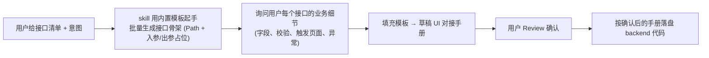
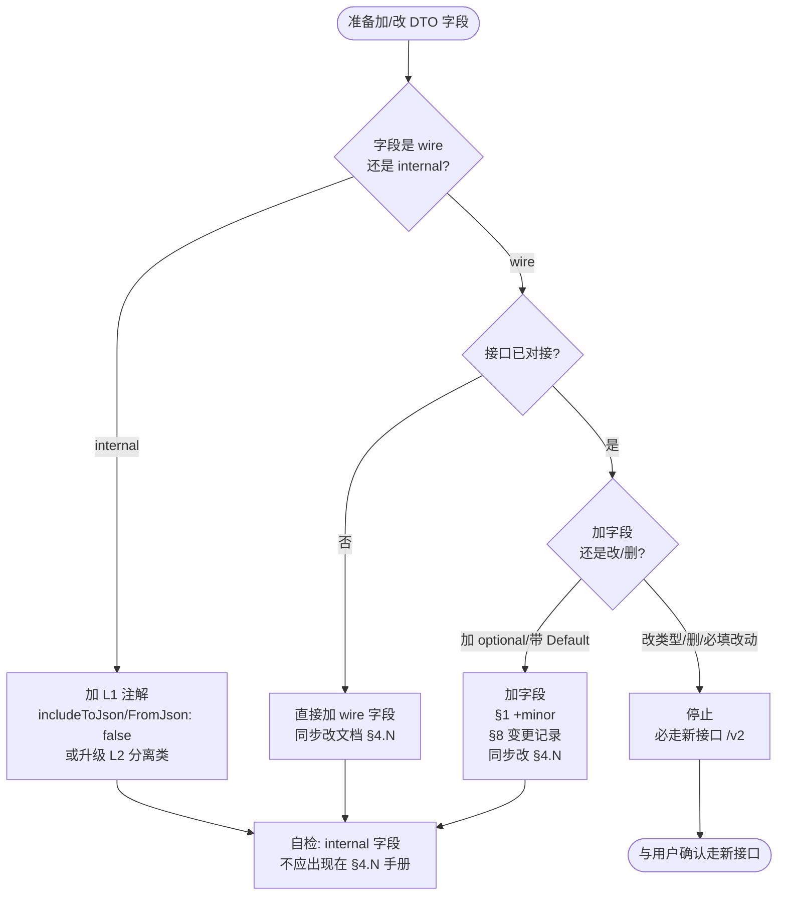

# korepos backend 业务接口编写规范

## 核心原则

**korepos 业务模块的后端接口必须按 `features/{module}/backend/` 模板编写，作为未来独立服务的蓝本。backend 与 UI 彻底分离：其它模块的 `presentation / application / data / domain` 层访问**只能**通过 `common/backend_infra` 门面；**其它模块的 `backend/` 层可以直接互相 import**（同属后台团队代码区，独立服务化时会一起搬走）。**

**默认目标目录：`lib/features/{module}/backend/`**（不是 `backendv2/`）。

- 模块**没有 `backend/`** → 新建 `backend/`，按下方模板落盘
- 模块**已有 `backend/`** → 直接写进去；若里面已有老结构（`application/data/domain`），新代码按本模板的 `endpoint/registry/dto/service/dao/` 与之并存
- 模块**同时已有 `backendv2/`** → 这是 refund 模块的历史遗留（详见下节），**不要新建 backendv2/**，除非模块原有的 `backend/` 下存在路径或包名冲突且迁移成本过高，此时需与用户确认后再决定

### 参考范本

- **主范本**：`features/refund/backendv2/`（代码结构与门面用法作为范本，**但 `backendv2/` 命名本身是历史遗留，不要模仿**）
- **目录命名范本**：`features/payment/backend/`（新模块命名对标这个）

### 关于 `refund/backendv2/` 的历史说明

refund 模块走了 `backendv2/` 是因为 `features/refund/backend/` 早已被另一批正在搬运中的老骨架占用（内含 `application/data/domain`），为避免两批代码在同一目录下互相踩脚，当时开了个 `backendv2/` 做隔离。这是**一次性的历史决定**，不是通用命名约定。

- 新模块：一律用 `backend/`
- refund 现存的 `backendv2/`：继续在里面加代码（不要往 `backend/` 挪，避免跨 PR 大搬家）
- 待老 `refund/backend/` 完全下线那天，`backendv2/` 再整体改名回 `backend/`

---

## 前置条件：接口出入参文档（三挡处理）

一份合格的 UI 对接手册必须包含：

1. **接口清单**：接口名 → Path 的一一映射表
2. **每个接口的出入参**：字段名 / 类型 / 必填 / 业务说明，入参一张表、出参一张表
3. **公共约定**：响应统一 `ApiIntranetResponse { success, message, data: T }`，DTO 只描述 `data` 部分
4. **隐含注入字段**：`operatorId / operatorName / posDeviceNo / tenantId` 等由 `BackendInfra` 从登录态注入，**不出现在入参表里**

根据用户提供的信息完整度，按以下**三挡**处理——不要一看到缺文档就停下索要：

### 挡位 A — 用户已给完整 UI 对接手册

直接按文档逐接口落盘代码，跳过 B / C。

### 挡位 B — 用户只给了接口清单 + 需求意图（最常见）

> 例："帮我实现反结账的 7 个接口：createReopen / executeRefund / cancelReopen / ..."

**先用下方内置模板生成一份**《{模块}-UI对接手册-{YYYYMMDD}-v1.md》**草稿**，存放到 `docs/{模块}/` 下，每个接口套用【单接口模板】，**用户补充业务细节 → 你按模板扩展 → 确认后再编码**。

流程：



### 挡位 C — 用户只说一句话（"加个查询接口"）

先向用户追问 3 个最小必要输入：

1. 接口属于哪个模块（对应哪个 `features/{module}/backend/`）？
2. 这个接口干什么业务（一句话），触发页面是哪个？
3. 核心入参有哪些（至少列 1-2 个字段名）？

拿到回答后回到 **挡位 B** 的流程：起草手册 → 补细节 → Review → 编码。**绝不自行脑补业务字段**。

---

## UI 对接手册模板（独立文件）

UI 对接手册模板单独落在 **[templates/ui-contract-template.md](templates/ui-contract-template.md)**，不在本 skill 中内联，便于直接拷贝为 `docs/{模块}/{模块}-UI对接手册-{YYYYMMDD}-v1.md` 的起始版本。

模板含 8 节结构（基本信息 / 接口清单 / 公共约定 / 出入参 / 页面调用总览 / 跨页状态 / WebSocket / 变更记录），第 4 节给出【单接口模板】块（注释标记起止），扩展新接口时复制该块即可。

### 举一反三工作流

用户说："我还要加 `getXxxDetail` 和 `deleteXxx` 两个接口"：

1. 打开 `docs/{模块}/{模块}-UI对接手册-*.md`
2. §2 接口清单表追加两行；§4 复制【单接口模板】块两次
3. 追问用户这两个接口的**字段细节**（不凭空造），补全字段表
4. 用户 Review 后 → 回到下方「八步编写顺序」落盘代码

**每增一个接口，代码侧对应动的位置固定 5 处**：
Endpoint 枚举加一条 → Request DTO 新文件 → Response DTO 新文件 → Service 加一个 public 方法 → Handler 加一个方法 → Registry 加一行 `router.post(...)`。

`api_intranet_handler.dart` 的挂载行 **不动**（模块第一次上线时已经挂好）。

---

## 初始化方案：需求未定时的验证端点

**适用场景**：用户想先把 `features/{module}/backend/` 的目录、BackendInfra 门面、路由注册链路跑通，具体业务接口还没定。

**不要因为需求模糊就停下来** —— 直接按 **[templates/init-verification-endpoint.md](templates/init-verification-endpoint.md)** 生成一个 `ping` 验证端点：

- 路径：`POST /{module}/ping`
- 入参：`{ echo: string }`
- 出参：`{ echo, serverTimeMillis, tenantId }`
- 依赖：仅 `BackendInfra.kvStorage.getTenantId()`，不触碰任何业务表
- 目的：**端到端跑通链路**（JSON 编解码 / freezed 生成 / `IntranetHandlerBase` / Registry / `api_intranet_handler.dart` 挂载 / build_runner）

该模板产出 7 个完整可编译文件（Endpoint 枚举 / Handler / Routes / Request DTO / Response DTO / Service / `intranet_handler_base.dart` 拷贝指引），并给出 `api_intranet_handler.dart` 挂载点修改步骤、Postman 验证步骤、以及后续删除 `ping` 的 checklist。

### 何时走初始化方案

- ✅ 用户说「先搭个 backend 骨架」「给我一个可跑的 backend 起点」「{模块} backend 初始化」
- ✅ 新模块从 0 建，UI 对接手册还没写
- ✅ 想先验证 BackendInfra 门面在该模块能注入
- ❌ 用户已给 UI 对接手册 → 直接走「八步编写顺序」，不要搭 ping

### 真实接口上线后的 `ping` 处置

首个真实业务接口（按 UI 对接手册）落地后：

- 可选「保留 ping 用作健康检查」—— 则路径改为 `/{module}/health` 并在 dartdoc 里改写用途说明
- 默认「移除 ping」—— 按初始化模板末尾 checklist 逐项清理；Registry 的 `register{Module}BackendRoutes` 挂载行**保留**（真实接口仍要走它）

---

## 目录结构模板（必须严格遵循）

业务模块代码物理分两层：

1. **`features/{module}/common/`** — **契约层（wire 真源）**：UI 与 backend 共用的 JSON DTO + 共享枚举（路由枚举 + 业务枚举），`@JsonSerializable()`，**禁止 freezed**（与现有 common 风格保持一致）
2. **`features/{module}/backend/`** — **后端蓝本层**：独立服务化时整体拷走；只含 endpoint(handler) / registry / service / dao，**不再自持 DTO 与路由枚举**（一律从 common 引用）

```
lib/features/{module}/
├── common/                                  # 契约层 ── UI + backend 共用
│   ├── enums/
│   │   ├── endpoints/
│   │   │   └── {module}_endpoint.dart       # 路由枚举 implements ApiEndpoint
│   │   └── business/
│   │       ├── {xxx}_state_enum.dart        # 业务状态枚举（订单/账单/流水状态等）
│   │       └── {yyy}_type_enum.dart         # 业务类型枚举（PaymentType / RefundMethodType 等）
│   └── models/
│       ├── request/
│       │   └── {action}_request.dart        # @JsonSerializable() 入参 DTO
│       └── response/
│           └── {action}_response.dart       # @JsonSerializable() 出参 DTO（data 部分）
└── backend/                                  # 后端蓝本 ── 独立服务化时整体搬走
    ├── endpoint/
    │   ├── {module}_handler.dart            # shelf HTTP handler，仅 parse/action/encode 薄壳
    │   └── intranet_handler_base.dart       # [直接从 refund/backendv2 拷贝复用] 通用模板基类
    ├── registry/
    │   └── {module}_backend_routes.dart     # register{Module}BackendRoutes(router, ref) — 挂路由
    ├── service/
    │   ├── internal/                        # ★ 原子能力层(多 service 复用单元,不挂 endpoint)
    │   │   └── {capability}_service.dart    # 详见「Service/internal 原子能力层」节
    │   ├── {action}_service.dart            # 一接口一 service,编排 DAO + 事务 + BackendInfra
    │   └── {purpose}_orchestrator.dart      # 跨 service 共享的写入/校验链路（粗粒度编排）
    └── dao/
        └── {table}_dao.dart                 # ★ 原子 SQL 一方法一语句,禁止业务编排,事务由 service 包(详见 Step 4)
```

### 关键约束（与历史 `backend/dto/` 自持副本的差异）

| 项 | 旧约束（历史） | 新约束 |
|---|---|---|
| DTO 位置 | `backend/dto/{request,response}/` 自持副本 | `common/models/{request,response}/` 共享，UI 与 backend 一份 |
| DTO 框架 | freezed + json_serializable | **`@JsonSerializable()` 单边**（与现有 common 一致），不写 freezed |
| 路由枚举 | `backend/endpoint/{module}_endpoint.dart` | `common/enums/endpoints/{module}_endpoint.dart` |
| 业务枚举 | 散落在 `backend/dto/` 下 | `common/enums/business/` 统一 |
| backend 引用 common | 不允许（彻底自闭环） | **必须走 common**（DTO 与路由枚举不能在 backend 重写） |
| UI 引用 common | 之前未明确 | 允许且推荐（UI 调 backend 接口直接复用同一份 DTO，无需再写转换） |
| internal 调试字段 | 直接 `@JsonKey(includeToJson: false)` 加在 backend DTO | common DTO **必须 wire 干净**；internal 字段拆到 backend 私有 record/class（详见 ACL 节） |
| DAO 粒度 | 含 `db.transaction()` 事务编排 + 多步 SQL | **原子 SQL 一方法一语句**，事务由 service 包（详见 Step 4） |

**禁止出现的目录**（老 `backend/` v1 风格 + 已废弃的 backend 自持 DTO 风格）：

- `backend/application/` ❌（service 直接放 `service/` 下）
- `backend/data/` ❌（DAO 直接放 `dao/` 下）
- `backend/domain/` ❌（任何 backend 自持的 DTO 都禁止；DTO 一律到 `common/models/`）
- `backend/presentation/` ❌（backend 不允许碰 UI 层）
- `backend/dto/` ❌（**新增禁止**——DTO 必须放 `common/models/`，backend 不再自持）
- `backend/endpoint/{module}_endpoint.dart` ❌（**新增禁止**——路由枚举搬到 `common/enums/endpoints/`；`backend/endpoint/` 目录仅留 `{module}_handler.dart` 与 `intranet_handler_base.dart`）

**存量例外**：`refund/backendv2/dto/` 与 `refund/backendv2/endpoint/refund_v2_endpoint.dart` 是历史缺陷副本（与 `refund/common/models/` 双轨并存），**新接口一律走 common，不要往 backendv2/dto/ 加新文件**；存量副本的迁移由独立 PR 处理（详见「现存 backend/dto/ 存量处理」节）。

**老骨架并存特例**：若模块的 `backend/` 已存在 `application/data/domain`（v1 老骨架），新代码仍按上方结构并存落盘，**不要迁移老代码**（避免跨 PR 大搬家）；老代码下线由另行 PR 处理。

---

## 引用边界（backend 独立服务化蓝本）

`backend/` 将整体拷贝到未来的独立服务中，import 边界就是服务边界。

**核心心智模型**：

- **backend 阵营互通**：所有 `features/{x}/backend/` 同属"后台团队介入开发的代码区"，互相 import 不受限；未来独立服务化时这些目录会一起搬走
- **非 backend 层是禁区**：UI 团队维护的 `presentation/` / `application/` / `data/` / `domain/` 不得被 backend 引用（破坏分离），跨此类依赖必须走 `BackendInfra` 门面

### ✅ 允许引用（视为基础能力，会一起拷走）

- `lib/common/**` — 数据库 / 日志 / 网络 / 存储 / 通用工具
- `lib/common/backend_infra/**` — 门面层（**非 backend 层**依赖的必经之路，详见下一节）
- **`lib/features/{module}/common/**`** — **本模块**的契约层（DTO + 共享枚举），backend service / handler / dao 都从这里 import；同时 UI 也读这层 → 是双方共享真源
- **`lib/features/{other}/common/**`** — 其它模块的契约层（跨模块拿对方的 DTO / 共享枚举时走这里）
- **`lib/features/{other}/backend/**`** — 其它模块的 backend 层（同属后台团队代码区，可直接 import；含 `service / dao / endpoint / registry` 任一子目录）
- `lib/features/auth/application/auth_service.dart` — **只通过 `infra.auth`**，禁止直接 import
- `lib/features/order/data/order_local_repository.dart` — **只通过 `infra.createOrderRepo()`**
- `lib/features/store/application/store_service.dart` — **只通过 `infra.store`**

### ❌ 禁止引用（违反即阻止落盘）

- `lib/features/{module}/domain/**` — 前端 UI 领域模型；backend 须从 `common/models/` 取 DTO，**不得**借用 domain 模型
- `lib/features/{module}/data/**`、`application/**`、`presentation/**` — UI 侧（同模块内 UI 文件同样禁引）
- `lib/features/{other}/{data,application,presentation,domain}/**` — 其它 feature 的**非 backend / 非 common 层** — 一律经 BackendInfra 暴露或拒绝引用
- 任何 `*_notifier.dart` / `*_view_model.dart` / `*_controller.dart`（UI 层 Riverpod 控制器）
- `package:flutter/widgets.dart`、`package:flutter/material.dart`（仅 `debugPrint` 场景豁免，用 `package:flutter/foundation.dart`）
- 同模块老 `backend/application/`、`backend/data/`、`backend/dto/`（如果共存期）—— 新代码不反向依赖老骨架/旧 DTO 副本，老代码下线时直接删

**发现越界 import 时立刻停下**，与调用方确认：

- 如果是其它模块的 **common 层** → 直接 import 即可（DTO/枚举共享真源）
- 如果是其它模块的 **backend 层** → 直接 import 即可，不必走门面（本 skill v1.10 起放开）
- 如果是其它模块的 **非 backend / 非 common 层**（application / data / domain / presentation）→ 走 BackendInfra 扩展，或该项不属于 backend 职责

---

## BackendInfra 门面规则

**跨到非 backend 层的依赖**（其它 feature 的 `application / data / domain / presentation`）**只能** 通过 `BackendInfra` 接口（`lib/common/backend_infra/backend_infra.dart`）访问。其它 feature 的 **backend 层**不受此约束，可直接 import。

### Service / DAO 的标准依赖注入形态

```dart
@riverpod
XxxService xxxService(Ref ref) => XxxService(
      infra: ref.read(backendInfraProvider),
      dao: ref.read(xxxDaoProvider),
    );

class XxxService {
  final BackendInfra _infra;
  final XxxDao _dao;
  XxxService({required BackendInfra infra, required XxxDao dao})
      : _infra = infra,
        _dao = dao;
}
```

Service / DAO 内部 **不允许** 再出现 `ref.read(...)`。想拿什么从 `_infra` 取：`_infra.db` / `_infra.auth` / `_infra.store` / `_infra.kvStorage` / `_infra.dataSync` / `_infra.lang` / `_infra.createOrderRepo()` / `_infra.settlement`。

### 新增跨模块依赖的流程

先判断依赖落在哪一层，再决定路径：

#### 情况 A — 依赖的是其它模块的 **backend 层**（service / dao / dto / endpoint）

**直接 import** 即可，不需要走门面扩展。

典型场景：`features/refund/backend/` 的 service 需要调 `features/payment/backend/service/KPayOnlineRefundService`。两者同属后台团队代码区，独立服务化时会一起搬走，无需做 ACL 隔离。

#### 情况 B — 依赖的是其它模块的 **非 backend 层**（application / data / domain / presentation）

**禁止直接 import**，走 BackendInfra 扩展的以下三步：

1. 在 `backend_infra.dart` 接口上新增一个方法/getter，**写清楚独立服务化剥离路径注释**（参考 `createOrderRepo()` 和 `settlement` 的注释样式）
2. 在 `backend_infra_riverpod.dart` 的 `_RiverpodBackendInfra` 实现里用 `_ref.read(...)` 把 Provider 桥接上
3. Service / DAO 通过 `_infra.xxx` 调用，**对业务层透明**

这是跨到非 backend 层的唯一合法扩展路径。

#### 情况 C — 新实现的「backend 内部基础设施」（云端通信 / WS 推送 / 设备协议等）

**禁止挂到 `BackendInfra` 门面上**，必须建立**独立子门面 + 独立 Riverpod provider**，与 `BackendInfra` **平级**注入。

##### 为什么不能挂到 BackendInfra

`BackendInfra` 的真实定位是**「旧实现防腐过渡门面」**。通览 `backend_infra.dart` 现有字段，每个 getter 注释里清一色写着「独立服务化：xxx 后改成 RPC / 远程调用 / 配置下发」——它的演进终点是字段被一个个**清空**（每剥离一个旧实现，对应字段就移除）。

把新实现塞进 `BackendInfra` = 让新代码伪装成「将要清空的过渡通道」，**视觉上无法区分新旧**，重构演进时统计「还剩多少旧实现要剥离」会污染。

##### 判断「是不是新实现」的 1 个问句

> 这段代码是不是从 0 开始按 `features/{module}/backend/` 蓝本写的？（而不是包装某个 `features/{x}/{application,data,domain,presentation}/...` 下原有的旧 service / repository？）

- 是 → **新实现** → 走情况 C，独立门面
- 否 → **旧实现包装** → 走情况 B，挂 BackendInfra

##### 新实现独立门面的标准目录形态

```text
lib/common/backend_infra/{capability}/        # 与 backend_infra.dart 平级,各自独立
├── {capability}_port.dart                    # 子门面接口 (abstract interface)
├── {capability}_client.dart                  # 实现 (纯 HTTP / WS / 协议适配,无业务编排)
├── {capability}_client.g.dart
├── endpoint/                                 # 仅当涉及云端 HTTP
│   └── {capability}_endpoint.dart
└── dto/                                      # 子门面自持的 Request / Response,不复用业务模块 DTO
    ├── ...
```

`{capability}` 命名按能力域定（例：`kpay_online` / `device_protocol` / `cloud_push`），不要塞 `infra_` 前缀也不要叫 `xxx_facade`。

##### 调用方注入与使用形态

**正例**——子门面与 BackendInfra 平级注入：

```dart
@riverpod
XxxService xxxService(Ref ref) => XxxService(
      infra: ref.read(backendInfraProvider),
      kpayOnline: ref.read(kpayOnlinePortProvider),  // ← 平级,不是 _infra 的子节点
      dao: ref.read(xxxDaoProvider),
    );

class XxxService {
  final BackendInfra _infra;            // 旧实现走门面
  final KpayOnlinePort _kpayOnline;     // 新实现走独立门面
  final XxxDao _dao;

  XxxService({
    required BackendInfra infra,
    required KpayOnlinePort kpayOnline,
    required XxxDao dao,
  })  : _infra = infra,
        _kpayOnline = kpayOnline,
        _dao = dao;

  Future<void> run() async {
    final tenantId = _infra.kvStorage.getTenantId();        // 旧实现 → _infra
    final outcome = await _kpayOnline.refund(...);          // 新实现 → 独立门面
  }
}
```

视觉上立刻能区分：`_infra.xxx` = 旧实现包装、`_{capability}.xxx` = 新实现独立门面。

##### 红线

| 红线 | 错误形态 | 正确形态 |
| --- | --- | --- |
| 不要在 `BackendInfra` 上加 `{Capability}Port get {capability}` 转发 getter | `_infra.kpayOnline.refund(...)` | `_kpayOnline.refund(...)` |
| 不要在子门面 `client` 实现里持有 `BackendInfra`（基础设施反向依赖业务通道） | `KpayOnlineClient({required BackendInfra infra, ...})` | 子门面只依赖 `ApiInterface` / `WebSocketService` 等基础设施原语 |
| 不要把新实现的 DTO 放在 `features/{x}/backend/dto/` 等业务模块目录下 | DTO 散落在某个 feature 的 backend 目录 | DTO 与 client 同居 `common/backend_infra/{capability}/dto/` |

##### 已有反例（不要模仿）

`BackendInfra.cloud`（`CloudApiPort get cloud`）是 v1 阶段的过渡遗留——本应作为独立门面但被挂到了 BackendInfra 上。新代码**不要**沿用这个形态；该字段会在下一轮重构时拆出独立门面，让 `BackendInfra` 回归「纯旧实现防腐层」语义。

---

## Service 粒度规则：一接口一 service（debug 友好原则）

### 心智模型先校准

`backend/service/` 在 Flutter 端虽然叫 service，但语义角色 = **云端 Spring 的 Controller**（HTTP 入口的薄编排层），**不是云端的 ServiceImpl**。

| 视角 | 云端 Java | 本端 Flutter backend |
|---|---|---|
| `endpoint/{module}_handler.dart` | DispatcherServlet 路由分发（基础设施） | shelf 路由 + parse/encode 模板 |
| `service/{module}_{action}_service.dart` | `XxxController.actionOne(req)` | 一接口一 service，承接对应 endpoint |
| `service/{purpose}_orchestrator.dart` | `XxxServiceImpl` 跨方法的复用编排 | 多 service 共享的写入/校验链路 |
| `dao/` | `Mapper / Repository` | 纯 DB SQL/事务 |

云端 ServiceImpl 把多个业务方法塞一个类里有合理性（DI 便宜、跨方法事务、Spring AOP 织入）；本端 backend 不具备这些约束,debug 时**栈干净、日志定位、版本控制 diff 收敛**的友好度更重要 → **一接口一 service**。

### 强制规则

1. **粒度**:`backend/service/` 下每个 `.dart` 文件**只对应 1 个 HTTP endpoint**(即 Registry 里 1 行 `router.post(...)`)
2. **类内单一 public 方法**:方法名与 handler 转发方法名一致(例:`RefundV2Handler.confirm()` → `RefundConfirmService.confirm()`);私有 `_xxx()` 数量不限,前置校验 / 参数组装 / 响应组装继续抽 `_private`
3. **文件命名**:`{module}_{action}_service.dart`,`{action}` = handler 方法名 snake_case,与 Endpoint 枚举值同名(camel→snake)
4. **跨接口复用**:多个 service 共用的写入/校验/编排链路(典型如取消订单的「db.transaction + KPay 退款 + 数据同步」三段式)必须沉到独立文件 `service/{purpose}_orchestrator.dart`,以「编排器」名字承载(参考现存 `whole_order_cancel_orchestrator.dart`)
5. **service 之间禁止互相 import**:复用一律走 orchestrator / 共享 helper / DAO;service A 想调 service B 的能力 = 把 B 的能力下沉为 orchestrator,两个 service 各自调 orchestrator
6. **DTO 自闭环不变**:每个 service 自己声明依赖的 Request / Response,Step 2/3 流程不变

### 反例 → 正例

❌ **反例**:同一 service 暴露多个 public 方法

```dart
// service/refund_query_service.dart  ← 1 个文件 expose 3 个 endpoint,debug 时栈与日志混在一起
class RefundV2QueryService {
  Future<GetMaxRefundableAmountResponse> getMaxAmount(...) {...}
  Future<GetRefundAllocationsResponse> getAllocations(...) {...}
  Future<GetRefundProductsResponse> getProducts(...) {...}
}
```

✅ **正例**:拆成 3 个文件,Handler/Service/Endpoint/Registry 四层 1:1:1:1 对齐

```
service/get_max_refundable_amount_service.dart   → class GetMaxRefundableAmountService { Future<...> getMaxAmount(req); }
service/get_refund_allocations_service.dart      → class GetRefundAllocationsService    { Future<...> getAllocations(req); }
service/get_refund_products_service.dart         → class GetRefundProductsService       { Future<...> getProducts(req); }
```

### 命名一致性收敛

历史代码里两种命名风格并存,新代码**只允许动作型**:

| 风格 | 例 | 是否允许新增 |
|---|---|---|
| 动作型 `{action}_{resource}_service.dart` | `cancel_refund_order_service.dart` | ✅ 允许 |
| 域型 `{module}_{domain}_service.dart` | `refund_write_service.dart` | ❌ 不允许新增,文件名必须包含动作 |

> **存量 1:N 文件不改**:`refund_query_service.dart` 等历史文件由专项 PR 拆分,本规则**自本条目落入 SKILL.md 之日起仅对新增 service 文件强制生效**,改动现有文件时若机会成熟可顺手拆,但不要为了拆而开 PR。

---

## Service/internal 原子能力层（细粒度复用单元）

### 概念与定位

`backend/service/internal/` 存放**多个 service 共享的原子能力**，例如：

- "按 `transactionId` 修改退款流水状态 + 时间戳 + 操作人" — 多个回调入口都会触发
- "查询订单是否已被联台占用" — 多个写入接口都要前置校验
- "组装 KPay 回调持久化的 8 字段" — confirm / write / callback-apply 都要做

**与 orchestrator 的差异**：

| 层 | 职责 | 粒度 | 命名 | 是否包事务 |
|---|---|---|---|---|
| `service/{action}_service.dart` | 一接口一 service，主流程 | 大 | 动词+资源 | ✅ 包顶层事务 |
| `service/{purpose}_orchestrator.dart` | 跨接口共享的写入/校验链路 | 中 | `{purpose}_orchestrator` | 通常不包，由调方注入事务上下文 |
| `service/internal/{capability}_service.dart` | 单一可复用业务能力 | 小（可能含 1-3 步 SQL 编排） | `{capability}_service` | 不包顶层事务，可被多种 orchestrator/service 内嵌 |

### 何时下沉到 internal/（**复用提醒规则**）

写新接口时，遇到以下信号**主动建议**用户把能力下沉到 `service/internal/`：

| 信号 | 例 |
|---|---|
| 同一段"取数→判定→写库"逻辑在**本模块** ≥ 2 个 service 出现 | 退款回调成功 / 失败两条链路都要"修改流水状态 + 写时间 + 推数据同步" |
| 业务术语强烈（"退款流水回写"、"账单状态切换"、"分摊重算"），跨方法粘贴会丢上下文 | "退款流水回写"在 callback / confirm-rollback / write 三处出现 |
| service 主流程超过 80 行且核心操作能用一句业务术语命名 | service 里 30 行专门做"组装数据同步事件参数"——抽 `data_sync_event_builder_service` |

**判定 ≥ 2 次复用**：grep 模块内 service 文件，看相同的 SQL/编排片段是否出现两次以上。仅出现一次的 → **暂不下沉**（YAGNI），加注释 `// FIXME(reuse): 若 X 接口也要做这事，下沉到 service/internal/`。

### internal/ 写法约定

```dart
// service/internal/refund_callback_persistence_service.dart
import 'package:flutter_riverpod/flutter_riverpod.dart';
import 'package:riverpod_annotation/riverpod_annotation.dart';

import '../../../../../common/backend_infra/backend_infra.dart';
import '../../../../../common/backend_infra/backend_infra_riverpod.dart';
import '../../dao/refund_transaction_dao.dart';

part 'refund_callback_persistence_service.g.dart';

@riverpod
RefundCallbackPersistenceService refundCallbackPersistenceService(Ref ref) =>
    RefundCallbackPersistenceService(
      infra: ref.read(backendInfraProvider),
      txDao: ref.read(refundTransactionDaoProvider),
    );

/// 退款流水回写原子能力
///
/// 多个 service 复用：refund_callback_apply_service / refund_confirm_service / refund_rollback_service
/// 单一职责：按 transactionId 改流水状态 + 写回调时间 + 操作人。**不包事务**——由调方在外层事务里调用。
class RefundCallbackPersistenceService {
  final BackendInfra _infra;
  final RefundTransactionDao _txDao;

  RefundCallbackPersistenceService({
    required BackendInfra infra,
    required RefundTransactionDao txDao,
  })  : _infra = infra,
        _txDao = txDao;

  /// 把回调结果落到 order_transaction 表
  ///
  /// 注：本方法**不开新事务**。调方应在 `db.transaction(() async { ... })` 内调用,
  /// 或本身就是只读 + 单条 UPDATE 不需事务。
  Future<void> persistCallbackResult({
    required int transactionId,
    required int newState,
    required int callbackTimeMillis,
    required int operatorId,
  }) async {
    await _txDao.updateTransactionState(
      transactionId: transactionId,
      newState: newState,
      modifyTimeMillis: callbackTimeMillis,
      operatorId: operatorId,
    );
  }
}
```

#### 强制规则

- **路径**：`backend/service/internal/{capability}_service.dart`
- **命名**：以**能力**命名，**不带动作前缀**——`refund_callback_persistence_service`、`order_lock_check_service`、`data_sync_event_builder_service`；**禁用** action 前缀（`cancel_xxx`、`confirm_xxx`），那是顶层 service 命名风格
- **不挂 endpoint**：internal service 不出现在 `Registry` 里，不暴露 HTTP path
- **不包顶层事务**：`db.transaction()` 永远在调用方（顶层 service 或 orchestrator）；internal 内部的方法要么是单条 SQL，要么明确"调方需在事务内调用"
- **可被多个 service 注入**：通过 `@riverpod` Provider 暴露，调方在构造器注入
- **Dartdoc 必须列出复用方**：类级 dartdoc 写明"被 X / Y / Z service 复用"，便于改动时评估影响面
- **范本**：`refund/backendv2/service/internal/refund_callback_persistence_service.dart`

### internal/ 的"提醒"工作流（写代码时主动触发）

写新 service 时按以下步骤主动审视：

1. **写完 service 主流程后**，反向 grep：本模块 `service/` 下其它文件是否有相似片段？（搜索关键 SQL where 子句、关键方法名、关键魔法数字）
2. **发现 ≥2 个 service 重复** → 给用户**主动建议**：「我注意到 `xxxService` 也在做同样的「按 transactionId 改流水」操作，建议抽到 `service/internal/refund_callback_persistence_service.dart` 做原子能力层；我可以帮你抽出来吗？」
3. **得到用户确认后**，再做下沉重构：先建 internal/ 文件 → 改老 service 调用 → 跑 build_runner
4. **未确认前不要擅自抽**：避免抽出"看似可复用、实际两边语义微妙不同"的伪原子能力

> 此规则建议性，不强制阻断。**仅在重复 ≥2 次时才提醒**，第一次出现允许 YAGNI 复制粘贴 + `FIXME(reuse)` 注释埋点。

---

## 八步编写顺序（必须按顺序落盘）

每一步都要在落盘前把**这一步文件的完整内容**展示给用户确认，不得批量生成整包。

### Step 1：Endpoint 枚举

**路径**：`lib/features/{module}/common/enums/endpoints/{module}_endpoint.dart`

> 路由枚举放在 **common 层**（不是 backend），原因：UI 客户端调用接口时也需要类型安全引用 path（避免硬编码字符串），与 backend handler 共用同一个枚举值即可保证两边的 path 永远一致。

```dart
import '../../../../../common/services/networking/remote_service/api_endpoint.dart';

/// {模块} 端点枚举
///
/// 对接文档：`docs/{模块}/{模块}-UI对接手册-{YYYYMMDD}-v1.md`
/// 路径策略：原则上与前端清单一致；若与老骨架路径冲突则加 `/v2/` 前缀避让，在此注释说明。
enum {Module}Endpoint implements ApiEndpoint {
  /// {接口 1 中文名}
  /// 文档：`docs/{模块}/{模块}-UI对接手册-*.md` §4.1
  actionOne('/xxx/one'),

  /// {接口 2 中文名}
  /// 文档：`docs/{模块}/{模块}-UI对接手册-*.md` §4.2
  actionTwo('/xxx/two');

  const {Module}Endpoint(this.path);

  @override
  final String path;
}
```

- 每个枚举值 **必须有 dartdoc 注释**，指向 UI 对接手册对应章节
- 路径小写，动词在前（`confirm/`、`get/`、`update/`、`rollback/`、`create/`、`cancel/`）
- 与老骨架冲突时加 `/v2/` 前缀，并在 dartdoc 里写明"为避让老骨架"；非冲突接口**不加任何前缀**
- import path 多了一级 `../`：`common/enums/endpoints/` → `common/services/networking/remote_service/`，5 级而非 4 级（旧版 backend/endpoint/ 是 4 级）

### Step 1.5：业务枚举（按需）

接口 DTO 字段引用的业务枚举（状态、类型、原因码）放 `lib/features/{module}/common/enums/business/`，例如：

```
common/enums/business/
├── {module}_state_enum.dart        # 订单/账单状态
├── payment_type_enum.dart          # 业务枚举（internal 域）
└── refund_method_type_enum.dart    # wire 枚举（前端契约面）
```

规则：

- **业务状态/类型枚举**（不区分 wire/internal 的）→ 直接放 `business/` 下，命名 `{xxx}_{state|type|reason}_enum.dart`
- **ACL L2 双枚举**（一个 internal 一个 wire，详见 ACL 节）→ 两个文件都放 `business/`，命名后缀显式标注用途
- 已存在的 refund 业务枚举范本：`refund/common/enums/{order_state_type_enum, bill_state_type_enum, transaction_state_type_enum, kpos_pay_result_enum, prepared_reason_type_enum}.dart`
- 这些 `business/` 枚举可被 UI、backend、跨模块共同 import — 是契约层的一部分

### Step 2：Request DTO

**路径**：`lib/features/{module}/common/models/request/{action}_request.dart`（每个接口一个文件）

> DTO 落在 **common 层**，UI 与 backend 共用同一份。统一用 `@JsonSerializable()`（不是 freezed）—— 与现有 `refund/common/models/` 风格保持一致，单边支持 `fromJson` / `toJson`。

```dart
import 'package:json_annotation/json_annotation.dart';

part '{action}_request.g.dart';

/// 接口 POST {/path} 入参
///
/// 文档：`docs/{模块}/{模块}-UI对接手册-*.md` §4.N 入参表
///
/// 字段语义逐一对应 UI 对接手册的入参表。任何字段增删改后，
/// **必须同步更新文档的 §4.N 入参表 + §8 变更记录**（详见「DTO ↔ UI 对接手册双向绑定」节）。
///
/// wire 干净规则：本类**不允许**出现 `@JsonKey(includeToJson: false)` 标注的 internal 字段；
/// service 内部需要的过滤/调试字段一律拆到 backend 私有 record/class（详见「ACL」节）。
@JsonSerializable()
class {Action}Request {
  /// {字段 1 业务含义、单位、取值范围、来源}
  final int orderId;

  /// {字段 2 可空原因说明}
  final String? someOptional;

  const {Action}Request({
    required this.orderId,
    this.someOptional,
  });

  factory {Action}Request.fromJson(Map<String, dynamic> json) =>
      _${Action}RequestFromJson(json);

  Map<String, dynamic> toJson() => _${Action}RequestToJson(this);
}
```

- 所有字段必须有行内 dartdoc，说明**业务含义**（对接手册里的「说明」列搬过来）
- 必填字段在构造器里 `required`，可空字段标注默认或 null 的业务含义
- 魔法数字（如 `paymentType: 1=KPay 2=现金 3=自定义`）必须在 dartdoc 里枚举出来
- **禁止** import `features/{module}/domain/`（前端 UI 领域模型，与 wire 契约无关）
- **禁止** 在 common DTO 上加 `@JsonKey(includeToJson: false)` 隐藏 internal 字段 —— common 是 UI 看得见的契约层，internal 字段去 backend 私有 class（参考 ACL 节）
- 列表/Map 默认值在构造器里给（如 `this.tags = const <String>[]`），避免前端判 null

### Step 3：Response DTO

**路径**：`lib/features/{module}/common/models/response/{action}_response.dart`（对应 `ApiIntranetResponse.data` 的形状）

```dart
import 'package:json_annotation/json_annotation.dart';

part '{action}_response.g.dart';

/// 接口 POST {/path} 出参 data
///
/// 文档：`docs/{模块}/{模块}-UI对接手册-*.md` §4.N 出参表
///
/// 任何字段增删改后，**必须同步更新文档的 §4.N 出参表 + §8 变更记录**。
@JsonSerializable()
class {Action}Response {
  final bool success;

  /// {字段说明 + 构建来源，例如"DAO Step 9 写入 order_transaction"}
  final int? recordId;

  /// {列表为空时的语义 — 前端如何判空}
  final List<int> affectedOrderIds;

  const {Action}Response({
    required this.success,
    this.recordId,
    this.affectedOrderIds = const <int>[],
  });

  factory {Action}Response.fromJson(Map<String, dynamic> json) =>
      _${Action}ResponseFromJson(json);

  Map<String, dynamic> toJson() => _${Action}ResponseToJson(this);
}
```

- Response 只包含 `data` 字段，**不包裹 code/message**（由 `IntranetHandlerBase` 统一处理）
- 列表字段用构造器默认值 `= const <int>[]`，避免前端判 null
- 失败场景的字段取值必须在 dartdoc 里写明（例如「失败时 `recordId` 为 null，UI 端无终态需登记」）
- 同样禁用 `@JsonKey(includeToJson: false)` 内部字段，理由同 Request

### Step 2/3 通用：build_runner

新增 / 修改 `*.dart` 后跑：

```bash
dart run build_runner build --delete-conflicting-outputs
```

会生成 `*_request.g.dart` / `*_response.g.dart`（含 `_$XxxFromJson` / `_$XxxToJson` 函数）。**不要手写 `.g.dart`**。

### Step 4：DAO（原子化 SQL，禁止业务编排）

**路径**：`backend/dao/{table}_dao.dart`（命名以**表名**为主，一个表一个 DAO 文件）

#### 核心规则：DAO 只是 SQL 的容器，不是事务编排者

| 维度 | DAO 应该做 | DAO **不应该**做 |
|---|---|---|
| 粒度 | 一个 public 方法 = 一条原子 SQL（INSERT 一条、UPDATE 一条、SELECT 一条） | 一个方法里"先 INSERT a 表，再 UPDATE b 表，再 SELECT c 表"——这是编排，归 service |
| 事务 | **不写** `db.transaction(() async {...})` | 拥有 `db.transaction(...)` 包裹多步 SQL —— 事务由 service 包 |
| 业务条件 | 收 service 整理好的参数（如 `int orderId, int newState`），照 SQL 执行 | 在方法里判断"如果 X 就走 SQL A、否则走 SQL B"——这是业务逻辑，归 service |
| 上下文注入 | tenantId / employeeId / storeId / businessDate 由 service 整理后**作为参数传入** | DAO 内部读 `_infra.auth` / `_infra.store` 等去取——上下文耦合，独立测试痛苦 |
| 跨表读取 | 单条 SELECT JOIN 是一条原子 SQL ✅ | 先 SELECT a 表再 SELECT b 表合并 → 拆两个方法，service 编排 |

#### ❌ 反例（refund/backendv2 当前 DAO 的缺陷模式）

```dart
class RefundTransactionDao {
  // 反例：DAO 既包事务，又拼上下文，又做多步业务编排
  Future<RefundResult> writeRefund(WriteRefundParams params) async {
    final now = DateTime.now().millisecondsSinceEpoch;
    final employee = _infra.auth.employeeInfo;          // ← 不该在 DAO 里取上下文
    final businessDate = await _infra.store.calculateBusinessDate();

    return await db.transaction(() async {              // ← 不该在 DAO 里包事务
      // ===== Step 1: INSERT 退款子订单 =====
      final refundOrderId = await db.into(orders).insert(...);
      // ===== Step 2: UPDATE 父订单状态 =====
      await (db.update(orders)..where(...)).write(...);
      // ===== Step 3: INSERT 退款 bill =====
      // ===== Step 4: UPDATE 原 bill 状态 =====
      // ===== Step 5: INSERT 退款流水 =====
      return RefundResult(...);
    });
  }
}
```

问题：
- service 想换 step 顺序、加补偿、跳过某步都改不动 DAO（DAO 锁死了流程）
- 单元测试这一个方法就要造 5 张表的 fixture
- 跨方法复用不了任何一步（其它接口想"只更新父订单状态"也要复制粘贴）

#### ✅ 正例（原子化 DAO + service 编排事务）

```dart
class OrderDao {
  final BackendInfra _infra;
  OrderDao(this._infra);
  AppDatabase get db => _infra.db;

  /// 插入一条订单记录,返回新订单 ID。**单 SQL 原子操作**。
  Future<int> insertOrder({
    required int tenantId,
    required int storeId,
    required int orderType,
    required int orderState,
    required double payAmount,
    required int createTimeMillis,
    required int operatorId,
    // ... 其它字段
  }) async {
    return await db.into(orders).insert(OrdersCompanion.insert(
      tenantId: tenantId,
      storeId: Value(storeId),
      orderType: Value(orderType),
      orderState: Value(orderState),
      payAmount: Value(payAmount),
      createTime: Value(createTimeMillis),
      createAccountId: Value(operatorId),
      // ...
    ));
  }

  /// 更新指定订单的状态。**单 SQL 原子操作**。
  Future<int> updateOrderState({
    required int orderId,
    required int newState,
    required int modifyTimeMillis,
    required int operatorId,
  }) async {
    return await (db.update(orders)..where((t) => t.orderId.equals(orderId)))
        .write(OrdersCompanion(
      orderState: Value(newState),
      modifyTime: Value(modifyTimeMillis),
      modifyAccountId: Value(operatorId),
    ));
  }

  /// 按主键读单条订单。返回 null 表示不存在。
  Future<Order?> findById(int orderId) =>
      (db.select(orders)..where((t) => t.orderId.equals(orderId)))
          .getSingleOrNull();
}
```

事务编排在 service：

```dart
class RefundConfirmService {
  Future<ConfirmRefundResponse> confirm(ConfirmRefundRequest req) async {
    // 1. service 整理上下文(只在这里取一次)
    final now = DateTime.now().millisecondsSinceEpoch;
    final operatorId = _infra.auth.employeeInfo.account.employeeId;
    final tenantId = _infra.kvStorage.getTenantId() ?? 1;
    final storeId = _infra.store.boundStoreInfo.storeId;

    // 2. service 包事务,组合 DAO 原子方法
    final result = await _infra.db.transaction(() async {
      final refundOrderId = await _orderDao.insertOrder(
        tenantId: tenantId, storeId: storeId,
        orderType: 2, orderState: 6, payAmount: req.refundAmount,
        createTimeMillis: now, operatorId: operatorId,
      );
      await _orderDao.updateOrderState(
        orderId: req.originalOrderId, newState: 7,
        modifyTimeMillis: now, operatorId: operatorId,
      );
      final refundBillId = await _billDao.insertBill(/* ... */);
      // ...
      return _Internal(refundOrderId: refundOrderId, refundBillId: refundBillId);
    });

    return ConfirmRefundResponse(/* ... */);
  }
}
```

#### Step 4 落盘规则

- **粒度**：一个 public 方法 = 一条原子 SQL；如果你写出 `db.transaction(...)` 在 DAO 里，**立刻拆开**
- **命名**：`{verb}{Entity}` 动词在前 — `insertOrder` / `updateOrderState` / `findBillById` / `softDeleteRefundOrder` / `selectByXxx`；忌用 `writeXxx` / `processXxx` 这种含编排意味的动词
- **入参**：业务上下文（tenantId / operatorId / storeId / businessDate / now）由 service 计算后**作为参数传入**；DAO 不读 `_infra.auth` / `_infra.store`
- **唯一允许从 `_infra` 取的东西**：`_infra.db`（数据库句柄本身）。其它一律走入参
- **返回类型必须强类型实体**（详见下方「查询返回类型」节）：禁止 `Map<String, dynamic>` / `List<QueryRow>` / `List<Map<...>>` 弱类型返回
- **类级 dartdoc**：标注「对齐云端：{Java Mapper / Repository 全路径}#方法」（如果有云端对应）
- **构造器**：保持原样接 `BackendInfra` 即可（只是为了拿 `db`），不影响入参规则

#### 查询返回类型必须强类型实体（JPA 风格，禁止 JDBC 风格）

**核心规则**：DAO 方法的返回值类型必须让调方在编译期就能看到字段名与类型——拒绝 `Map<String, dynamic>`、拒绝 `QueryRow`、拒绝 `dynamic`。

**三档返回类型选择**（按场景从简到繁）：

| 档位 | 用法 | 范本 | 何时用 |
|---|---|---|---|
| **A. Drift 自动 Row 类** | `select(orders).where(...).getSingleOrNull()` 直接返回 drift 生成的 `Order` / `Bill` row | `OrderDao.findById` 返回 `Future<Order?>` | 单表查询，字段集 = 表字段集 |
| **B. 自定义 `*Row` 实体类** | `customSelect(...).get()` 后 `.map((r) => XxxRow(...))` 包装；实体类放 `lib/common/services/database/models/` | `BillDao.findPayableBills` 返回 `Future<List<PayableBillRow>>` | JOIN / 计算列 / 子集字段 / 字段需重命名 |
| **C. 自定义 `*SummaryRow` 实体类** | 同 B，但承载 SUM/COUNT/AVG 等聚合结果，字段语义是"汇总值" | `OrderDao.sumAmountsByOrderIds` 应改返 `Future<OrderAmountsSummaryRow?>`（当前是 `Map<String, double>?`，是反例） | 聚合查询，字段全部是数值汇总 |

> 这三档都是 **JPA 风格**：调方拿到的是 dart 强类型对象，IDE 自动补全字段名、字段拼写错编译期就报。**Map / QueryRow 是 JDBC 风格**——拼错字段名运行时才崩，且查询语义靠 doc 描述而不是类型。

##### ❌ 反例（项目里现存的 JDBC 风格代码，不要复制）

```dart
// 反例 1: 返回 Map<String, dynamic>,字段名是字符串
Future<Map<String, double>?> sumAmountsByOrderIds(List<int> orderIds) async {
  final result = await customSelect('SELECT SUM(...) AS total_amount, ...').getSingleOrNull();
  if (result == null) return null;
  return {
    'totalAmount': result.readNullable<double>('total_amount') ?? 0,
    'payAmount': result.readNullable<double>('pay_amount') ?? 0,
    // ...10 个字段全靠字符串 key
  };
}

// 调方使用:
final m = await dao.sumAmountsByOrderIds([1, 2]);
final total = m?['totalAmount']; // ← 拼错 key 运行时才发现,IDE 不补全

// 反例 2: 返回 List<QueryRow>(drift 通用行类型)
Future<List<QueryRow>> findRefundableMainItems(List<int> orderIds) async {
  return customSelect('SELECT oi.order_item_id, oi.commodity_name, ...').get();
}

// 调方使用:
final rows = await dao.findRefundableMainItems([1]);
final id = rows.first.read<int>('order_item_id'); // ← 同样的字符串问题
```

##### ✅ 正例（用自定义实体类承载结果集）

**Step 1：在 `lib/common/services/database/models/` 下建实体文件**

```dart
// lib/common/services/database/models/order_amounts_summary_row.dart

/// 订单金额汇总行(DAO 层 DTO)
///
/// 由 [OrderDao.sumAmountsByOrderIds] 返回,联台订单按 SUM 聚合后的字段集合。
/// 字段语义对齐云端 `OrderAmountAggregator.java#aggregate`。
///
/// **不进 wire**:这是 DAO 层内部表示,service 拿到后会重新映射成 common DTO。
class OrderAmountsSummaryRow {
  const OrderAmountsSummaryRow({
    required this.totalAmount,
    required this.payAmount,
    required this.orderDiscountAmount,
    required this.commodityDiscountAmount,
    required this.discountAmount,
    required this.taxAmount,
    required this.taxAddonAmount,
    required this.taxIncludeAmount,
    required this.serviceFeeAmount,
    required this.tipAmount,
  });

  final double totalAmount;
  final double payAmount;
  final double orderDiscountAmount;
  final double commodityDiscountAmount;
  final double discountAmount;
  final double taxAmount;
  final double taxAddonAmount;
  final double taxIncludeAmount;
  final double serviceFeeAmount;
  final double tipAmount;
}
```

**Step 2：DAO 方法返回该实体**

```dart
// daos/order_dao.dart
import '../models/order_amounts_summary_row.dart';

export '../models/order_amounts_summary_row.dart'; // 调方 import dao 即可拿到实体

class OrderDao extends DatabaseAccessor<AppDatabase> with _$OrderDaoMixin {
  /// 联台订单金额汇总。返回 null 表示 orderIds 为空或无匹配。
  Future<OrderAmountsSummaryRow?> sumAmountsByOrderIds(List<int> orderIds) async {
    if (orderIds.isEmpty) return null;
    final placeholders = orderIds.map((_) => '?').join(',');
    final result = await customSelect(
      '''
      SELECT
        SUM(COALESCE(o.total_amount, 0))    AS total_amount,
        SUM(COALESCE(o.pay_amount, 0))      AS pay_amount,
        ...
      FROM orders o
      WHERE o.order_id IN ($placeholders) AND o.deleted = 0
      ''',
      variables: orderIds.map(Variable.withInt).toList(),
    ).getSingleOrNull();

    if (result == null) return null;
    return OrderAmountsSummaryRow(
      totalAmount: result.readNullable<double>('total_amount') ?? 0,
      payAmount: result.readNullable<double>('pay_amount') ?? 0,
      // ...其余字段
    );
  }
}
```

**Step 3：调方拿到强类型对象**

```dart
final summary = await orderDao.sumAmountsByOrderIds([1001, 1002]);
if (summary == null) return _emptyResponse();
final total = summary.totalAmount;     // ← IDE 自动补全,类型 double
final pay = summary.payAmount;          // ← 字段拼错编译期就报错
```

##### 实体类落地约定

| 项 | 规则 |
|---|---|
| **物理位置** | `lib/common/services/database/models/{purpose}_row.dart` —— 与 `daos/` 平级，便于跨模块复用 |
| **命名后缀** | `*Row`（普通查询）/ `*SummaryRow`（聚合查询）/ `*ProjectionRow`（子集投影） |
| **类型** | 普通 `class`，`final` 字段，`const` 构造器 + `required`；**不写** `fromJson` / `toJson`（DAO 内部 DTO，不进 wire，详见 ACL 节） |
| **字段类型** | 严格强类型：`int / double / String / DateTime / int? / double?...`；**禁用** `dynamic` / `Object` |
| **可空语义** | 字段可空（`int?`）= "DB 列允许 NULL 或 SUM/MIN 在空集时返回 NULL"；不可空（`int`）= "DAO 内部已用 `?? 默认值` 兜底" |
| **export** | DAO 文件顶部 `export '../models/{xxx}_row.dart';` —— 调方 `import 'order_dao.dart'` 就能拿到实体，无需双 import |

##### 何时不必新建 `*Row`：drift 自动 Row 已经够用

如果 SQL 是单表 `SELECT * FROM orders WHERE ...` 这种全字段查询，**直接返 drift 自动生成的 `Order` / `Bill` row**（drift 已经帮你做了 JPA 风格映射）：

```dart
Future<Order?> findById(int orderId) =>
    (select(orders)..where((t) => t.orderId.equals(orderId))).getSingleOrNull();

Future<List<Order>> findByMergeTableId(int mergeTableId) =>
    (select(orders)..where((t) =>
        t.mergeTableId.equals(mergeTableId) & t.deleted.equals(0))).get();
```

**不要**为单表全字段查询额外造一个 `OrderRow` 类——drift 生成的 `Order` 就是它，重复造轮子。

##### 现存 OrderDao JDBC 风格代码处理

`OrderDao` 当前有 5+ 个方法返回 `Future<Map<String, dynamic>>` 或 `Future<List<QueryRow>>`（`sumAmountsByOrderIds` / `findRefundExtras` / `findRefundableMainItems` / `findAllItemsByOrderIds` / `getRefundedQuantities`）—— **存量缺陷代码**，按"现存 backend/dto/ 存量处理"原则：

- **新接口** → 一律走 `*Row` 实体路径，**禁止** Map / QueryRow 返回
- **改老 DAO 方法主体时** → 顺手把 Map/QueryRow 返回改成 `*Row` 实体，调方 service 同步改（机会主义迁移）
- **不为单纯迁移开 PR**

#### Drift 工具兼容性

drift 的 SELECT JOIN / UPDATE WHERE / INSERT 都属于"原子 SQL"，写在一个 DAO 方法里没问题。**反例信号**：DAO 方法体里出现 `db.transaction(...)` / `await dao.xxx(...)` 嵌套调用 / `if (条件) { update A } else { update B }` 这类多步业务分支。

### Step 5：Service（事务编排者）

**路径**：`backend/service/{action}_service.dart`（动作型命名，一接口一 service —— 详见「Service 粒度规则」节）

> Service 是**事务编排层**：包 `db.transaction()`、组合 DAO 原子方法、整理上下文、做业务条件分支。DAO 不再做这些（详见 Step 4）。

```dart
import 'package:flutter/foundation.dart'; // 仅 debugPrint
import 'package:flutter_riverpod/flutter_riverpod.dart';
import 'package:riverpod_annotation/riverpod_annotation.dart';

import '../../../../common/backend_infra/backend_infra.dart';
import '../../../../common/backend_infra/backend_infra_riverpod.dart';
import '../../../../common/services/networking/constants/api_intranet/api_intranet_message_key.dart';
import '../../../../common/services/networking/intranet_service/api_intranet_exception.dart';
// DTO 来自 common 契约层(UI + backend 共用,不是 backend 自持副本)
import '../../common/models/request/{action}_request.dart';
import '../../common/models/response/{action}_response.dart';
// DAO 来自本模块 backend
import '../dao/{table_a}_dao.dart';
import '../dao/{table_b}_dao.dart';
// 原子能力(可选,见「Service/internal 原子能力层」节)
import 'internal/{capability}_service.dart';

part '{action}_service.g.dart';

@riverpod
{Action}Service {action}Service(Ref ref) =>
    {Action}Service(
      infra: ref.read(backendInfraProvider),
      orderDao: ref.read(orderDaoProvider),
      billDao: ref.read(billDaoProvider),
      // capabilityService: ref.read({capability}ServiceProvider),  // 可选
    );

/// {模块} {action} 编排 service
///
/// 对齐云端：{Java 类全路径}#{方法}
class {Action}Service {
  final BackendInfra _infra;
  final OrderDao _orderDao;
  final BillDao _billDao;

  {Action}Service({
    required BackendInfra infra,
    required OrderDao orderDao,
    required BillDao billDao,
  })  : _infra = infra,
        _orderDao = orderDao,
        _billDao = billDao;

  /// {一句话职责} — 对齐云端 {Java#method}
  Future<{Action}Response> {action}({Action}Request req) async {
    try {
      // 1. 前置校验
      final original = await _fetchOrderOrFail(req.originalOrderId);

      // 2. 参数整形 + 上下文（抽私有方法）
      final ctx = _buildContext();

      // 3. 本地事务编排（service 包,不在 DAO 包）
      final inner = await _infra.db.transaction(() async {
        final newOrderId = await _orderDao.insertOrder(
          tenantId: ctx.tenantId, storeId: ctx.storeId,
          orderType: 2, orderState: 6, payAmount: req.refundAmount,
          createTimeMillis: ctx.now, operatorId: ctx.operatorId,
        );
        await _orderDao.updateOrderState(
          orderId: req.originalOrderId, newState: 7,
          modifyTimeMillis: ctx.now, operatorId: ctx.operatorId,
        );
        final newBillId = await _billDao.insertBill(/* ... */);
        return _Inner(orderId: newOrderId, billId: newBillId);
      });

      // 4. 容错调用（事务外,失败仅记日志不回滚）
      await _infra.dataSync.addBatchDataSyncReport(
        [inner.orderId], 'order', 'create',
      );

      return {Action}Response(
        success: true,
        recordId: inner.orderId,
      );
    } on ApiIntranetException {
      rethrow; // 受控业务异常冒泡到 handler
    } catch (e, st) {
      debugPrint('{action} 失败: $e\n$st');
      return const {Action}Response(success: false);
    }
  }

  /// 上下文整理 — 一次性读 _infra,事务内不再回头取
  _Ctx _buildContext() {
    return _Ctx(
      now: DateTime.now().millisecondsSinceEpoch,
      operatorId: _infra.auth.employeeInfo.account.employeeId,
      tenantId: _infra.kvStorage.getTenantId() ?? 1,
      storeId: _infra.store.boundStoreInfo.storeId,
    );
  }

  /// 前置数据校验 — 缺失时抛业务异常
  Future<Order> _fetchOrderOrFail(int orderId) async {
    final order = await _orderDao.findById(orderId);
    if (order == null) throw ApiIntranetException(MessageKey.notFound);
    return order;
  }
}

/// 事务上下文(service 私有 record,不进 wire)
class _Ctx {
  final int now, operatorId, tenantId, storeId;
  const _Ctx({
    required this.now, required this.operatorId,
    required this.tenantId, required this.storeId,
  });
}

/// 事务内部产物(service 私有,跨步骤传递,不进 Response)
class _Inner {
  final int orderId, billId;
  const _Inner({required this.orderId, required this.billId});
}
```

#### 强制规则

- **一接口一 service**：每个 service 文件只对应 1 个 endpoint，类内只暴露 1 个 public 方法（详见上方「Service 粒度规则」节）；跨接口复用的链路下沉到 `service/{purpose}_orchestrator.dart` 或 `service/internal/{capability}_service.dart`，**严禁** service A 直接 import service B
- **事务编排归 service**：`db.transaction()` 必须出现在 service，不在 DAO；service 内部按"读上下文 → 事务内组合 DAO → 事务外容错调用"三段式
- **public 方法 = 对外接口**：类级 / 方法级 dartdoc **必须**写「对齐云端：{Java 类全路径}#方法」
- **参数组装 / 校验 / 辅助查询 / 上下文打包 必须抽 `_private` 方法**，不得内联在主流程里
- **DTO 来自 common**：`import '../../common/models/{request,response}/...';` —— 不再 import `../dto/`
- **只 import `BackendInfra` + DAO + 本模块 common + 原子能力 + lib/common`**，禁止 `ref.read(xxxProvider)` 方式直接拉其他模块（其它模块依赖走 BackendInfra 门面或其它模块 backend 直接 import）
- **业务异常用 `ApiIntranetException(MessageKey.xxx)`**，由 handler 层统一本地化
- **失败场景**：受控异常 rethrow；未预期异常 catch 后返回 `success: false` 的响应，不让 HTTP 500 冒泡
- **internal 类型不进 wire**：service 内部用的 record/class（`_Ctx` / `_Inner` 这种）必须用 `_` 前缀私有化，**永远不要**让它们出现在 Request/Response 字段类型里
- **详细注释**：
  - 业务规则判断 → 注释写明"为什么这样判"
  - 魔法数字（状态码、枚举值）→ 枚举所有可能值及语义
  - 字段取值来源 → 注明 DB 列 / 入参字段 / 云端对齐路径
  - 容错降级（比如分摊失败仅记日志不回滚）→ 注明"为何不回滚"

#### 复用提醒（重要）

写 service 时如果发现"这段事务编排 / 这块校验 / 这次跨表读取"在**本模块多个 service** 出现 ≥2 次，**主动建议**用户把它下沉到：

- 跨接口写入/校验链路（多步事务复合）→ `service/{purpose}_orchestrator.dart`（粗粒度编排器）
- 单一原子能力（如"按 transactionId 修改退款流水状态"）→ `service/internal/{capability}_service.dart`（细粒度复用单元）

详见「Service/internal 原子能力层」节。

### Step 6：Handler

`endpoint/{module}_handler.dart` — 全部走 `IntranetHandlerBase` 模板，每个方法仅 5 行

```dart
import 'dart:ui';
import 'package:flutter_riverpod/flutter_riverpod.dart';
import 'package:riverpod_annotation/riverpod_annotation.dart';
import 'package:shelf/shelf.dart';

import '../../../../common/backend_infra/backend_infra_riverpod.dart';
import '../dto/request/{action}_request.dart';
import '../service/{module}_{feature}_service.dart';
import 'intranet_handler_base.dart';

part '{module}_handler.g.dart';

@riverpod
{Module}Handler {module}Handler(Ref ref) => {Module}Handler(ref: ref);

/// {模块} HTTP handler 集合
///
/// 每个方法本体仅 3-5 行：构造 Base 模板 → 指定 parse / action / encode。
/// try-catch、日志、错误映射、JSON 读写全部下沉到 [IntranetHandlerBase]。
class {Module}Handler {
  final Ref _ref;
  static const IntranetHandlerBase _base = IntranetHandlerBase();

  {Module}Handler({required Ref ref}) : _ref = ref;

  Locale get _locale => _ref.read(backendInfraProvider).lang.currentLocale;

  Future<Response> actionOne(Request request) => _base.handle(
        request: request,
        locale: _locale,
        logTag: '{Module}Handler.actionOne',
        parse: {Action}Request.fromJson,
        action: (req) =>
            _ref.read({module}{Feature}ServiceProvider).actionOne(req),
        encode: (resp) => resp.toJson(),
      );
}
```

- **禁止** 在 handler 里手写 `try-catch` / `jsonDecode` / `request.readAsString()` — 一律走 `_base.handle(...)`
- Rust FFI 或已经返回 `{code,message,data}` 整包的场景走 `_base.handleRaw(...)`
- `logTag` 规范：`{Module}Handler.{方法名}`，用于 `ZoneLogger.record` 排错

### Step 7：Registry

`registry/{module}_backend_routes.dart`

```dart
import 'package:flutter_riverpod/flutter_riverpod.dart';
import 'package:shelf_router/shelf_router.dart';

import '../endpoint/{module}_endpoint.dart';
import '../endpoint/{module}_handler.dart';

/// 把 {模块} backend 的 N 条路径挂到传入的 [router] 上。
void register{Module}BackendRoutes(Router router, Ref ref) {
  final handler = ref.read({module}HandlerProvider);

  router.post({Module}Endpoint.actionOne.path, handler.actionOne);
  router.post({Module}Endpoint.actionTwo.path, handler.actionTwo);
}
```

文件命名对标已存在的 `features/payment/backend/registry/payment_backend_routes.dart`（函数名 `registerPaymentBackendRoutes`）。

### Step 8：在 ApiIntranetHandler 挂载路由（必须完成，否则接口不可访问）

Service 写完不等于接口上线。**Service → Handler → Registry → `api_intranet_handler.dart`** 四环缺一不可，最后一环是在全局 shelf Router 上注册子路由，没做这一步前端调任何 `/{module}/...` 都会 404。

挂载点：**`lib/common/services/networking/intranet_service/api_intranet_handler.dart`**。该文件里已有 backend 路由挂载区块（现有挂载行：`registerRefundV2Routes(router, _ref)` 与 `registerPaymentBackendRoutes(router, _ref)`），新模块在同一块内追加一行即可。

模式：

```dart
// 文件顶部：加一条 import（按字母序排在其他 backend registry import 旁）
import 'package:kpos/features/{module}/backend/registry/{module}_backend_routes.dart';

// 文件中部的路由构建区块 — 找到 backend 路由挂载块：
// === backendv2 路由（v2 接口，独立于 v1）===
registerRefundV2Routes(router, _ref);                // 历史遗留：refund 走 backendv2

// === {module}/backend 路由 ===
register{Module}BackendRoutes(router, _ref);         // ← 新增行

// === payment/backend 路由（POS offline 退款回调独立入口）===
registerPaymentBackendRoutes(router, _ref);
```

**硬约束**：
- **只能修改 `api_intranet_handler.dart` 这一处**。不允许在其他模块的 endpoint 注册点、别处的 Router 构建点挂 backend 路由
- **不删 / 不改已有注释行与已有 registry 调用**（v1 老骨架在自己的 PR 下线，本次不动）
- 如果本次是**同模块追加新接口**（不是首次接入）→ `register{Module}BackendRoutes` 挂载行已存在，**不要重复添加**，只在 Registry 文件里加 `router.post(...)` 即可

**验证挂载成功**：
1. 重启 POS 进程（shelf router 构建时一次性读入）
2. `curl -X POST http://{POS-IP}:{PORT}/{接口 path} -d '{"...":"..."}' -H 'Content-Type: application/json'`
3. 预期回 `ApiIntranetResponse` 结构的 JSON（不管 success=true/false 都算通，只要不是 404）

### Step 9：生成 services 层冒烟/调试入口（联调辅助，强烈推荐）

> Step 1-8 是路由必经环节；**Step 9 不挂路由**，但每个新落盘的 service 都应配一份冒烟测试入口，给联调和自测用。完整模板见 **[templates/test-service-smoke-template.md](templates/test-service-smoke-template.md)**。

**目的**：
- 不起 POS 进程，`flutter test {file}` 单独触发 service
- 改入参直接编辑 dart 文件，省 Postman
- 真实抛错堆栈直接打印
- **不做断言**——这不是 TDD 测试，只是手动调参 + 打印结果的入口；带断言的 flow 测试由开发联调结束后另写

**目录布局**（始终用 `backend/`，refund 测试目录沿用此命名而不跟源码 `backendv2/`，未来 backendv2 改回 backend 时测试 0 迁移）：

```
test/features/{module}/backend/
├── _support/                              # 首次接入该模块时一次性落地
│   ├── test_harness.dart                  # ProviderContainer + 注入 Fake + 暴露 service getter
│   ├── fakes.dart                         # BackendInfra 依赖的跨模块 service 替身
│   ├── test_db.dart                       # 内存 DB / 文件副本 DB / seed SQL 灌入
│   ├── step_runner.dart                   # 给 flows 用的多步编排器
│   └── seed/.gitkeep                      # 占位空目录,业务场景 SQL 由开发自定义
├── flows/.gitkeep                         # 占位空目录,联调结束后开发自己按 step_runner 补
└── services/                              # ← 每写一个 service 同步生成一份
    └── {action}_service_test.dart
```

**源码 → 测试 路径映射**：

| 源码文件 | 测试文件 |
|---|---|
| `lib/features/{module}/backend/service/{action}_service.dart` | `test/features/{module}/backend/services/{action}_service_test.dart` |
| `lib/features/refund/backendv2/service/{action}_service.dart` | `test/features/refund/backend/services/{action}_service_test.dart` |

**Step 9 落地动作**（对每个新增 service 重复）：

1. **判断 `test/features/{module}/backend/_support/test_harness.dart` 是否已存在**
   - 不存在 → 拷模板第 3-6 节内容落 4 个 `_support/` 文件 + 2 个 `.gitkeep`（首次接入该模块）
   - 已存在 → 跳过基础文件，仅在 `test_harness.dart` 末尾的 service getter 区**幂等追加**新 getter（grep `get {newServiceGetter} =>` 已存在则跳过）
2. **生成** `services/{action}_service_test.dart` —— 套模板第 2 节，填占位符（`{module}` / `{backend|backendv2}` / `{ActionRequest}` / `{serviceGetter}` / `{action}` / `{/path}`），入参字段全给 `0` / `''` / `[]` / `false`，标 `// TODO: 按 §4.N 入参表`
3. **回报用户**：列出新增/修改的测试文件路径，给出 `flutter test {file}` 命令一键跑

**Step 9 禁区**：

| 行为 | 为什么禁止 |
|---|---|
| 在 services smoke test 里写 `expect(...)` 业务断言 | 那是 `flows/` 测试的职责；smoke 入口的语义就是"能跑、能改入参、能看输出"，加了断言会模糊定位 |
| 主动给 `flows/` 或 `_support/seed/` 生成内容 | 业务场景语义重，必须由开发联调时定义；用户主动要求时再扩展 |
| 修改已存在 `test_harness.dart` 的 Fake 列表 / Provider override | 当前 6 Fake 是 refund/backendv2 依赖的 BackendInfra 决定的；新模块若需要不同 Fake，独立 PR 处理 |

---

## Service ↔ Endpoint 暴露关系总览

为避免漏挂路由，一份能让前端调到的接口必须满足**四层联动**：

```
UI 对接手册           Service 方法                 Handler 方法                Registry 挂路由           api_intranet_handler
{actionName}     →    actionName(req)        →    actionName(Request)     →    router.post(...)     →    register{Module}BackendRoutes(router,_ref)
{Path}                                             _base.handle(parse,         ↑                          ↑
                                                   action, encode)             用 Endpoint 枚举.path      只挂一次（首次接入）
```

**读法**：每一行从左到右必须同名对应。UI 对接手册里新增一个接口名 / Path，对应：
- Service 里新增一个 public 方法（方法名 = 接口名 camelCase）
- Handler 里新增一个方法（方法名同上，委托给 Service）
- Endpoint 枚举里新增一个枚举值（枚举名同上，path 就是接口的 Path）
- Registry 里新增一行 `router.post({Module}Endpoint.{name}.path, handler.{name})`

**四行里哪怕漏一环**，接口都**暴露不出去**：
- 漏 Service public 方法 → Handler 没法调
- 漏 Handler 方法 → Registry 引用不到
- 漏 Endpoint 枚举值 → 没有路径字符串可挂
- 漏 Registry 的 `router.post` → 路径未注册，前端 404

落盘完每个接口前，对照这张表把四行都补齐再进入自检清单。

---

## DTO ↔ UI 对接手册双向绑定与同步

**UI 对接手册是给前端团队对接用的真源文档**。前端照着 §4 的字段表写调用代码 —— 文档与 backend DTO 漂移一天，前端就写错接口一天。因此：

### 绑定规则（生成代码时必须建立）

**双向互指**，grep 任一侧都能定位到另一侧：

1. **代码 → 文档**：每个 Endpoint 枚举值、Request DTO、Response DTO 的 dartdoc 第一行必须写
   ```dart
   /// 文档：`docs/{模块}/{模块}-UI对接手册-*.md` §4.N
   ```
   `*.md` 的通配是刻意的 —— 让 grep 对日期后缀不敏感，手册升版时不会让代码里的路径失效。

2. **文档 → 代码**：UI 对接手册 §4.N 小节末尾必须加一行
   ```markdown
   **对应代码**：
   - Endpoint 枚举：`lib/features/{module}/backend/endpoint/{module}_endpoint.dart#{actionName}`
   - Request DTO：`lib/features/{module}/backend/dto/request/{action}_request.dart`
   - Response DTO：`lib/features/{module}/backend/dto/response/{action}_response.dart`
   ```

生成代码时**两侧同步写入**，不允许只写单边。

### 同步时机（后续维护，任一项触发即必须同步文档）

| 触发场景 | 同步动作 |
|---|---|
| 新增 / 删除 / 重命名 Request DTO 字段 | 改 §4.N 入参表 + 改 §1 版本 + 追加 §8 变更记录 |
| 新增 / 删除 / 重命名 Response DTO 字段 | 改 §4.N 出参表 + 改 §1 版本 + 追加 §8 变更记录 |
| 字段类型 / 必填 / 默认值变化 | 改 §4.N 对应字段行 + §8 变更记录 |
| 魔法数字枚举扩容（如 `paymentType: 1/2/3` → `1/2/3/4`） | 改 §4.N 说明列 + §8 变更记录 |
| 新增 Endpoint 枚举值 | 改 §2 接口清单表 + 新加 §4.N 小节 + §8 变更记录 |
| 删除 Endpoint 枚举值 | 改 §2 接口清单表 + 删 §4.N 小节（或标注「已废弃」）+ §8 变更记录 |
| Endpoint path 变更（例如加 /v2/ 前缀） | 改 §4.N 的 Path 表格行 + §2 备注列 + §8 变更记录 |
| 接口语义/幂等性/触发页面/异常码变化 | 改 §4.N 对应段落 + §8 变更记录 |

### §1 版本号与 §8 变更记录的格式

每次同步，§1 基本信息表的版本号按语义递增：

| 变更类型 | 版本变化 |
|---|---|
| 破坏性变更（删字段 / 改字段类型 / 改必填 / 删接口） | 主版本 +1（v1 → v2） |
| 新增字段 / 新增接口 / 新增可选参数 | 次版本 +1（v1 → v1.1） |
| 魔法数字扩容 / 字段说明补充 / Path 不涉及破坏的调整 | 修订版本 +1（v1 → v1.0.1） |

§8 追加一行（与历史同格式）：

```markdown
| v1.1 | 2026-04-21 | 张凯 | `ActionOneRequest` 新增可选字段 `reasonText`；`ActionOneResponse` 的 `status` 魔法数字扩至 1/2/3/4（新增 4=已取消） |
```

### 代码编辑时的工作流

每当 Claude 在当前 skill 下动 `backend/dto/**/*.dart` 或 `backend/endpoint/*_endpoint.dart`：

1. **先读文档**：从 DTO 的 dartdoc 取路径，Read 打开 UI 对接手册 §4.N
2. **对字段**：Diff 当前手册 §4.N 表 vs DTO 字段，列出差异
3. **同步写入**：改代码的同时改文档（Edit markdown 表、改版本号、加变更记录）
4. **回报用户**：「代码改了 X，文档 §4.N 同步改了 Y，版本 v1 → v1.1」

**严禁只改代码不改文档**。前端团队下一次拉文档时看到的就是旧契约，线上会出问题。

### 前端归属提醒（生成首个接口时必须输出）

**每当本 skill 首次为某模块生成 backend 代码时**，最后回复必须带上这段话：

> ⚠️ 同步提醒
> 本次生成的 DTO / Endpoint 已经绑定了 `docs/{模块}/{模块}-UI对接手册-*.md`。该文档**后续会交给前端团队对接使用**，前端按 §4 字段表写调用代码。
> 从此刻起，任何对 Request / Response / Endpoint 的改动（增删字段、改类型、改枚举值、改 path）都**必须同步回改该文档的 §4.N + §1 版本号 + §8 变更记录**，两侧严禁漂移。
> 若未来改动未通过本 skill（人手直接编辑 DTO），请自行走同步流程；建议后续补一个 Dart 契约测试作为硬闸。

---

## ACL（Anti-Corruption Layer）：内部类型与 wire DTO 的边界

**接口上线对接后，HTTP 响应 JSON 即契约；内部调试/编排所需的字段绝不可无意泄漏到 wire。** 本节规定三档 ACL 策略与已对接接口的保护规则。

### 大前提：common DTO 是 wire 真源，必须保持干净

DTO 物理位置为 `features/{module}/common/models/`，UI 与 backend **共用同一份**。规则反转：

- ❌ **不允许**在 common DTO 上加 `@JsonKey(includeToJson: false, includeFromJson: false)` 标注的 internal 字段
- ❌ **不允许**让 common DTO 充当 service 内部传值容器（即使该字段在 toJson 时被注解豁免）
- ✅ internal 字段 / 中间产物 / 调试 trace 一律拆到 **backend 私有 record / class**，与 common DTO 物理隔离

理由：common 是 UI 与 backend 共享的契约真源，UI 端读到 `RefundTransactionResult` 时**没有任何字段是它"看不见"的**。即使加了注解 wire 干净，UI 端 IDE 还是会列出字段、字段还是会出现在 freezed copyWith 选项里、未来谁加误用风险都比留在 backend 内部高。

### 背景与原则

- **场景一（最常见）**：service 编排层需要"DAO → service → service"传递中间状态字段（如 `originalPayChannelCode`、内部派生标志位、回调 trace），用于过滤/分支判断；这些字段从未供前端消费 → 用 backend 私有 record / class 承载
- **场景二**：云端（Java）字段增减不可直接透传到终端 wire；需要 mapper 映射；接口字段命名 camel vs snake 不一致 → 用 mapper 层
- **场景三**：业务枚举有"内部分类口径"vs"前端合约面"两套；如 `PaymentType`（5 个分支）vs `RefundMethodType`（4 个 UI 看到的方式），值不一一对应 → 双枚举物理分离

**总原则**：

> **业务可自由演进 backend 私有类型，common 契约层只能加不能减、能不动尽量不动**。每次新增字段先问"是 wire 还是 internal"——**internal-first 优先**。

### 三档 ACL 策略（按侵入度从轻到重）

| 档位 | 做法 | 何时用 |
|---|---|---|
| **L1 — 私有 record / `_` 前缀类** | service 文件内 `class _Inner { ... }` / `class _Ctx { ... }` 承载 internal 字段；wire DTO 只暴露 UI 需要的字段；mapping 在 service `_buildResponse(...)` 私有方法里完成 | 内部字段 1-3 个，仅当前 service 用；典型如事务内中间产物、上下文打包 |
| **L2 — 双枚举 / 双 DTO 物理分离** | 一个 internal 枚举 + 一个 wire 枚举两套；或一个 internal record + 一个 common DTO 两套；两边通过 `code` / 显式 mapper 函数对应 | 已有先例：`PaymentType`（internal，业务分类）vs `RefundMethodType`（wire，UI 合约字面），通过 `code` 值隐式对应；多 service 共享某 internal 类型 |
| **L3 — Mapper 层** | 在 `backend/mapper/` 下建 mapper 类：`toWire(internal) → wire` / `fromWire(wire) → internal`，wire DTO 在 common，internal 类在 backend | 模块接口 ≥ 5 且每个都有内外差异；或字段名本身 snake vs camel 跨侧不同；或与云端 Java DTO 字段集差距大 |

> 大多数场景 **L1 够用**。加内部字段时**默认 L1**，只有拆分压力出现（字段数多、语义分歧大、跨多 service 复用）时升 L2；L3 一般新模块初始设计时就要决定，中途难切。

### 判断「字段是 wire 还是 internal」的三问

加新字段前问自己：

1. **前端会消费吗？** UI 对接手册 §4.N 里是否列了这个字段？
2. **是 service/dao 派生给自己判断用的？**（比如过滤条件、中间状态、调试 trace）
3. **是 DB 列原始值，service 为了做决策读出来的？**（比如 `originalPayChannelCode` 供 service 过滤）

**三问任一答 internal → 走 L1（backend 私有 record，不进 common）**；只有明确是"给 UI 消费"才加进 common DTO。

### L1 样例（最常用，与 common DTO 物理隔离）

❌ **反例**（旧版做法，新规则禁止——把 internal 字段塞进 wire DTO）：

```dart
// common/models/response/refund_transaction_response.dart
@JsonSerializable()
class RefundTransactionResponse {
  final int transactionId;
  final double refundAmount;

  // ❌ 禁止 — common 是契约层,internal 字段不能出现在这里
  @JsonKey(includeToJson: false, includeFromJson: false)
  final String originalPayChannelCode;
  // ...
}
```

✅ **正例**（internal 字段拆到 backend 私有类，wire DTO 干净）：

```dart
// common/models/response/refund_transaction_response.dart  ← wire 契约,UI 看到的字段
@JsonSerializable()
class RefundTransactionResponse {
  /// Wire 字段 — 文档 §4.3 出参表列出，供前端消费
  final int transactionId;
  final double refundAmount;

  const RefundTransactionResponse({
    required this.transactionId,
    required this.refundAmount,
  });

  factory RefundTransactionResponse.fromJson(Map<String, dynamic> json) =>
      _$RefundTransactionResponseFromJson(json);
  Map<String, dynamic> toJson() => _$RefundTransactionResponseToJson(this);
}

// backend/service/refund_query_service.dart  ← service 内私有 record,跨方法传递 internal 字段
class _RefundTxRow {
  final int transactionId;
  final double refundAmount;
  /// 取值对齐云端 `TransactionV1ServiceImpl.java:652` 过滤字段；
  /// 当值 ∈ {KPOS_CARD, KPOS_QR} 时 `_buildResponse` 才把该流水放进 kposList
  final String originalPayChannelCode;
  const _RefundTxRow({
    required this.transactionId,
    required this.refundAmount,
    required this.originalPayChannelCode,
  });
}

class RefundQueryService {
  Future<RefundTransactionResponse> query(...) async {
    final List<_RefundTxRow> rows = await _txDao.selectByXxx(...);
    final filtered = rows.where(_isKposChannel).toList();
    return _buildResponse(filtered);
  }

  bool _isKposChannel(_RefundTxRow r) =>
      r.originalPayChannelCode == 'KPOS_CARD' ||
      r.originalPayChannelCode == 'KPOS_QR';

  RefundTransactionResponse _buildResponse(List<_RefundTxRow> rows) {
    // mapping internal → wire,丢弃 originalPayChannelCode 等 internal 字段
    return RefundTransactionResponse(
      transactionId: rows.first.transactionId,
      refundAmount: rows.first.refundAmount,
    );
  }
}
```

效果：

- HTTP 响应 JSON **不含** `originalPayChannelCode`（common DTO 根本就没这个字段）
- UI 端读 `RefundTransactionResponse` 时 IDE 提示里**也看不见** internal 字段（不像 L1 注解版那样 IDE 仍提示）
- service 内部按业务需要随意演进 `_RefundTxRow`，对 wire 0 影响

### L2 样例（双枚举物理分离，已在项目内应用）

`refund/common/enums/business/` 里 `PaymentType`（internal 业务枚举）和 `RefundMethodType`（wire 枚举）就是 L2 的典型：

```dart
// common/enums/business/payment_type_enum.dart — 内部业务枚举,对齐云端 PaymentTypeEnum
enum PaymentType {
  kpay(1), cash(2), custom(3), bankCard(4), qrCode(5);
  final int code;
  const PaymentType(this.code);
}

// common/enums/business/refund_method_type_enum.dart — wire format 枚举,JSON 字面量
enum RefundMethodType {
  kpay(1), cash(2), custom(3), kpayOffline(4);
  final int code;
  const RefundMethodType(this.code);
  static RefundMethodType fromCode(int code) { /* ... */ }
}
```

两套枚举通过 `code` 值隐式对应，物理隔离；**内部枚举改（删 `kpayOffline`、加 `bankCard`/`qrCode`）wire 枚举完全不动 → HTTP JSON 零破坏**。

> 注：双枚举两个文件都放 `common/enums/business/` 下（UI / backend 都可能引用其中之一）。区分点不在物理位置，而在**用途**——文件名要让读者一眼看出"这个是 wire 字面契约"还是"这个是内部业务分类"。

### L3 样例（Mapper 层，重）

```
backend/mapper/
├── refund_transaction_mapper.dart       # internal record ↔ common DTO
└── payment_type_mapper.dart             # internal 枚举 ↔ wire 枚举
```

```dart
class RefundTransactionMapper {
  static RefundTransactionResponse toWire(_RefundTxRow internal) =>
      RefundTransactionResponse(
        transactionId: internal.transactionId,
        refundAmount: internal.refundAmount,
      );
}
```

仅当 mapping 跨多个 service 复用 / mapping 逻辑本身有规则（不只是字段拷贝）时才上 L3。否则 L1 的"service 内部 `_buildResponse` 私有方法"就够。

### 已开启对接接口的额外保护

**DTO 一旦被 UI 按 §4.N 对接，其 wire 部分视为契约冻结**。后续改动分类：

| 操作 | 允许 | 附加约束 |
|---|---|---|
| 加 wire 字段（带 `@Default` 或可选） | ✅ | §1 版本 +minor（v1 → v1.1），§8 变更记录 |
| 加 internal 字段（L1 注解或 L2 独立类） | ✅ | JSON 字节级不变，无版本变更 |
| 删 wire 字段 | ❌ | 必走新接口 / `/v2/` 路径 |
| 改 wire 字段类型（int ↔ string 等） | ❌ | 同上 |
| 必填 → 可选 | ⚠️ | §8 记录；前端可能仍按必填传，无破坏 |
| 可选 → 必填 | ❌ | 破坏老版本 UI |
| 魔法数字扩容（`1/2/3` → `1/2/3/4`） | ✅ | dartdoc 枚举更新，§4.N 说明列更新，§8 记录 |
| 魔法数字取值语义变更（`4=A` → `4=B`） | ❌ | 必走新接口；旧 UI 会按旧语义解读 |

**硬约束**：每次改 DTO 字段**前**，先 grep `features/{module}/presentation/`、`features/{module}/frontend/` 里是否已有 UI 调用对应接口；有 = 已对接 = 启动上表规则。

### 判断流（AI 编辑 DTO 时自检）



### 已对接接口 grep 识别方法

对 refund 模块：

```bash
# 1. 列出当前模块已暴露的接口 path
grep -E "\('/v[12]?/refund/" lib/features/refund/backendv2/endpoint/*.dart

# 2. 对每个 path，grep UI 是否调过
grep -rn "/v2/refund/confirm" lib/features/refund/{presentation,frontend,application}/

# 3. 有命中 = 已对接，启动保护规则
```

Skill 在 Edit DTO 前**必须跑**这一步识别，把结果和字段改动影响一起 report 给用户再决策。

---

## 现存 backend/dto/ 与 backend/endpoint/{module}_endpoint.dart 存量处理

`refund/backendv2/dto/`（11+ 份 freezed Request/Response 副本）与 `refund/backendv2/endpoint/refund_v2_endpoint.dart`（路由枚举）是**历史缺陷副本**，与当前 `refund/common/models/` + `refund/common/enums/` 双轨并存。

### 处置原则

| 场景 | 动作 |
|---|---|
| **新增接口** | ✅ 一律走 `common/`，**禁止**往 `backendv2/dto/` 加新文件、**禁止**往 `backendv2/endpoint/refund_v2_endpoint.dart` 加新枚举值；新接口的 Endpoint 枚举值加在 `common/enums/endpoints/refund_endpoint.dart`（首次添加该文件时一并新建） |
| **改老接口字段** | ✅ 直接改 `common/` 下的 DTO；**不要**回头改 `backendv2/dto/` 下的副本（让副本自然腐朽，下次顺手迁） |
| **下次改老接口主流程时（同一 PR）** | ✅ 顺手把该接口的 `backendv2/dto/{action}_request.dart` + `backendv2/dto/{action}_response.dart` 删掉，service/handler import 改成 `common/models/...`，跑 build_runner —— **这是机会主义迁移**，不强制 |
| **专门为迁移开 PR** | ❌ 不要 — 跨 PR 大搬家成本高且容易引战；让迁移随业务改动自然发生 |
| **`registerRefundV2Routes` 的 path 引用** | 当 `common/enums/endpoints/refund_endpoint.dart` 落地后，可逐步把 `RefundV2Endpoint.xxx.path` 替换成 `RefundEndpoint.xxx.path`；**保留** `registerRefundV2Routes` 函数名（动 `api_intranet_handler.dart` 的挂载行风险大，等 backendv2 整体改名 PR 一并处理） |

### 双轨期一致性问题

如果 `backendv2/dto/get_refund_allocations_request.dart`（freezed 副本）和 `common/models/request/get_refund_allocations_request.dart`（JsonSerializable 真源）**字段对不上**，应：

1. 以 **common 为准**——它是 wire 真源
2. 老的 backendv2/dto/ 副本是局部失真，等迁移时一并清掉
3. **不要**往 backendv2/dto/ 加 `@Default` 或新字段去对齐 common —— 那等于在缺陷版本上贴胶布

### 老接口的 import 现状

- service 文件目前 import `../dto/request/...`（backendv2 副本）
- 改 service 主流程时，**优先**把 import 改成 `../../common/models/request/...`（按本节"机会主义迁移"规则），同 PR 删掉 backendv2 副本
- 如果老接口 service 在历史代码大段没人动，**保持现状**——不要为它单独发 PR

### 下线节点

未来某天 `refund/backendv2/dto/` 完全空了（所有接口都迁完）→ 删空目录 + 把 `refund_v2_endpoint.dart` 删掉 / 改名 → `registerRefundV2Routes` 改名为 `registerRefundBackendRoutes`（与其它模块对齐）。这一步走独立 PR，不在本 skill 流程内。

---

## 完成后自检清单

执行完 Step 8 后，对新生成的代码逐项自检：

| 检查项 | 通过条件 |
|---|---|
| **目录结构** | 严格符合 `common/{enums/{endpoints,business},models/{request,response}}` + `backend/{endpoint(handler),registry,service/{,internal},dao}`；新代码不新增 `backend/dto/`、`backend/endpoint/{module}_endpoint.dart`、`application/data/domain/` 等已废弃路径 |
| **service 粒度** | 每个 service 文件只对应 1 个 endpoint，类内只暴露 1 个 public 方法（方法名 = handler 转发方法名）；跨接口复用沉入 `service/{purpose}_orchestrator.dart` 或 `service/internal/`；service 之间无互相 import |
| **DAO 原子化** | 每个 DAO public 方法 = 一条原子 SQL；DAO 内部**不出现** `db.transaction(`；DAO 不读 `_infra.auth` / `_infra.store` 等上下文（除 `_infra.db`）；事务编排在 service |
| **DAO 返回强类型实体（JPA 风格）** | DAO 方法返回类型必须是 drift 自动 Row（单表）或自定义 `*Row` 实体类（JOIN/聚合）；**禁止** `Future<Map<String, dynamic>>` / `Future<List<QueryRow>>` / `Future<dynamic>`；自定义 Row 类放 `lib/common/services/database/models/`，DAO 顶部 `export` |
| **service/internal 复用提醒** | 写主 service 时已 grep 模块内同类片段；发现 ≥2 处重复 → 已主动建议下沉到 `service/internal/{capability}_service.dart`（用户确认前不擅自抽） |
| import 边界 | grep 新增代码：无 `features/{module}/{data,application,presentation,domain}/` 引用；其它 feature 的非 common/非 backend 层引用走 BackendInfra；无 `*_notifier.dart` / widget 引用 |
| BackendInfra 使用 | Service / DAO 构造器接受 `BackendInfra`，方法体内 **不出现** `ref.read(` |
| **DTO 在 common 且 wire 干净** | request/response DTO 在 `features/{module}/common/models/{request,response}/`；用 `@JsonSerializable()`（不写 freezed）；**不出现** `@JsonKey(includeToJson: false, includeFromJson: false)` 标注的 internal 字段 — internal 字段一律拆到 backend 私有 record / `_` 前缀类 |
| **路由枚举在 common** | `{Module}Endpoint` 在 `features/{module}/common/enums/endpoints/`，handler 通过 import 引用；backend/endpoint/ 下不存在 `{module}_endpoint.dart` |
| Handler 薄壳 | 每个 handler 方法 ≤ 8 行，只含 `_base.handle/handleRaw` 调用 |
| 路由注册 | `api_intranet_handler.dart` backend 路由块新增一行 `register{Module}BackendRoutes(router, _ref)` |
| 代码生成 | 所有含 `part '*.g.dart'` 的文件，提醒用户跑 `dart run build_runner build --delete-conflicting-outputs`（现有 freezed 副本保留期间 `*.freezed.dart` 也要生成） |
| 注释完备 | 每个类 / public 方法有 dartdoc；对齐云端注释标注了 Java 类全路径；魔法数字有枚举说明 |
| 代码 → 文档引用 | 每个 Endpoint 枚举值 / Request DTO / Response DTO 的 dartdoc 第一行含 ``文档：`docs/{模块}/{模块}-UI对接手册-*.md` §4.N`` |
| 文档 → 代码引用 | UI 对接手册每个 §4.N 小节末尾写有「对应代码」段，列出 Endpoint 枚举值 / Request DTO / Response DTO 在 `common/` 下的相对路径 |
| 对接手册一致性 | 新增接口的 Path、入参字段、出参字段与 UI 对接手册逐项对齐；若本次有字段/接口变更，已改 §1 版本号并追加 §8 变更记录 |
| **ACL 分级标注** | 每个新增字段已明确是 wire 还是 internal；wire → 进 common DTO；internal → 进 backend 私有 record / `_` 前缀类（L1）或独立 internal 枚举/类（L2/L3）；common DTO 上**禁出现**含 `@JsonKey(includeToJson: false)` 注解的字段 |
| **已对接接口保护** | 对本次涉及的接口，已 grep `presentation/` / `frontend/` 确认是否已被 UI 调用；若已对接，本次改动未违反「允许/禁止」矩阵（未删 wire 字段、未改字段类型、未变魔法数字语义） |
| **测试入口生成（Step 9）** | 每个新增 service 在 `test/features/{module}/backend/services/` 下生成 `{action}_service_test.dart`；`_support/` 4 个基础文件已存在（首次接入则一并落地）；`flows/` 与 `_support/seed/` 保留 `.gitkeep` 占位；harness 的 service getter 区已追加新 service（grep 幂等） |
| 同步提醒输出 | 若本次是**首次**为该模块生成 backend 代码，回复末尾带上「⚠️ 同步提醒」段落（内容见「DTO ↔ UI 对接手册双向绑定与同步」节） |

若任一项不通过，**必须在回复用户前修正**，而不是先落盘再等用户发现。

---

## 与其他 skill 的位置关系

```
design-doc-required（设计文档 + coding.md 已确认）
        ↓
pre-implementation-code-orientation（代码坐标加载）
        ↓
korepos-backend-service（← 本 skill，backend 模板编写）
        ↓
arch-lint（架构违规扫描）
        ↓
git-commit-standards（提交）
```

本 skill 不替代 `design-doc-required` — 新需求仍须先有设计文档与 UI 对接手册，本 skill 只负责**把已确认的接口契约落盘成代码**。

---

## 禁区（违规即停）

| 行为 | 为什么禁止 |
|---|---|
| 新模块命名为 `backendv2/` | `backendv2` 是 refund 的一次性历史名，新模块一律用 `backend/` |
| 在 `backend/` 下新建 `application/` 或 `data/` 或 `domain/` 目录（新代码） | 这是 v1 老结构；新代码走 `endpoint(handler) / registry / service / dao` 加 `common/` 共享契约层 |
| **新增** `backend/dto/` 目录或在 backend 下自持 DTO 副本 | DTO 必须放 `features/{module}/common/models/{request,response}/`，UI 与 backend 共用；backend 不再自持 |
| **新增** `backend/endpoint/{module}_endpoint.dart` 路由枚举文件 | 路由枚举搬到 `features/{module}/common/enums/endpoints/`；backend/endpoint/ 仅留 `{module}_handler.dart` 与 `intranet_handler_base.dart` |
| **DTO 用 freezed**（新代码） | 与现有 `refund/common/models/` 风格分裂；统一用 `@JsonSerializable()` 单边支持 fromJson/toJson |
| **common DTO 加 `@JsonKey(includeToJson: false, includeFromJson: false)` 标注的 internal 字段** | common 是 UI 与 backend 共享的契约层，internal 字段 IDE 仍会提示给 UI 端；必须拆到 backend 私有 record / `_` 前缀类（详见 ACL L1） |
| **DAO 内部包 `db.transaction(...)` 做多步 SQL 编排** | 违反 DAO 原子化原则（Step 4）；事务由 service 包，DAO 一方法一 SQL |
| **DAO 内部读 `_infra.auth` / `_infra.store` / `_infra.kvStorage`** | 上下文耦合，DAO 无法独立测试；service 整理 tenantId/operatorId/storeId 后作为入参传入 |
| **DAO 方法返回 `Map<String, dynamic>` / `List<QueryRow>` / `dynamic`** | 弱类型 JDBC 风格，调方靠字符串 key 取字段，IDE 不补全、拼错运行时才崩；必须用 drift 自动 Row 或自定义 `*Row` 实体类（JPA 风格） |
| 在 Service / DAO 里写 `ref.read(xxxProvider)` | 绕过 BackendInfra 门面，独立服务化时会大范围返工 |
| 一个 service 文件 expose 多个 public 业务方法 / 一个 service 服务多个 endpoint | 违反「一接口一 service」debug 友好原则；本端 service ≈ 云端 Controller，不要按 ServiceImpl 的合并方式写 |
| service A 直接 import service B 复用业务能力 | 跨接口复用必须沉到 `service/internal/{capability}_service.dart` 或 `service/{purpose}_orchestrator.dart`；service 之间维持平级独立 |
| 直接 import 其它 feature 的**非 backend / 非 common 层**（`presentation/**`、`application/**`、`data/**`、`domain/**`）、`*_notifier.dart`、widget | backend 侵入 UI 层，违反前后端彻底分离。其它 feature 的 `backend/` 与 `common/` 层不受此限 |
| 复用 `features/{module}/domain/` 的模型作为 backend DTO | domain 是 UI 领域模型，与 wire 契约无关；backend 必须从 `common/models/` 取 DTO |
| 在 handler 里手写 `try-catch` / `jsonDecode` | 偏离 IntranetHandlerBase 模板，日志/错误映射会不一致 |
| 跳过 UI 对接手册自行推断接口形状 | 字段漂移 —— 前端最终拿不到预期字段 |
| 改了 DTO 字段 / Endpoint 但不同步 UI 对接手册 §4.N / §1 版本 / §8 变更记录 | 文档会发给前端团队对接使用，漂移即线上字段错位 |
| 同一次 PR 同时改 backend 和 `features/{module}/presentation/` | 违反「backend 与 UI 彻底分开开发」；UI 切换由 UI 团队做（注：本次允许同 PR 改 `common/` —— 它是 UI 与 backend 共享契约真源） |
| 在设计/编码文档里把「UI 怎么调新接口」作为 checkbox 任务 | 越界；backend 只声明契约，不规划 UI diff |
| 对已对接接口的 wire 字段做破坏性改动（删字段、改类型、可选→必填、魔法数字语义变） | 违反已开启对接接口保护矩阵；必须走新接口或 `/v2/` 路径 |
