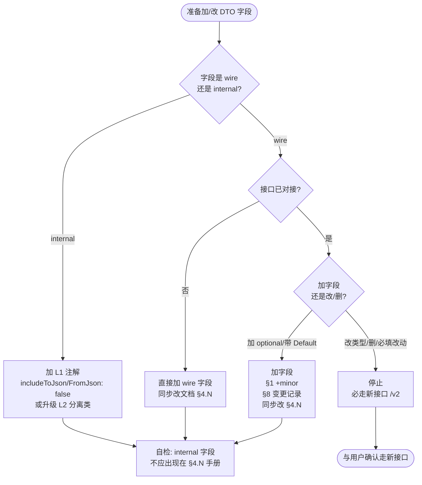

# DTO 规则与 ACL（wire vs internal 边界）

> 子文档 of [korepos-backend-service/SKILL.md](../SKILL.md)。
> 本文件覆盖 Step 2/3（Request / Response DTO）的注解强制约束、字段类型强制约束、DTO ↔ UI 对接手册双向同步、ACL（Anti-Corruption Layer）三档策略、以及 backend/dto/ 副本的存量处理。
> Step 2/3 在 8 步编写顺序中的位置见 [wiring-steps.md](./wiring-steps.md)。

## Step 2/3 通用：DTO 注解强制约束（@JsonSerializable + explicitToJson:true，禁止 @freezed）

**所有 wire DTO（`features/{module}/common/models/request|response/` 下的 Request/Response 类，含嵌套子 DTO）必须用 `@JsonSerializable(explicitToJson: true)`，禁止用 `@freezed`。** Hook `hooks/check-dto-annotation.js` 默认启用，违规即阻断。

### 为什么必须 `explicitToJson: true`

项目未配置全局 `explicit_to_json`（`build.yaml` 不存在）。json_serializable / freezed 默认 `toJson` **不递归**——生成代码里 `'nested': instance.nested` 直接赋值，嵌套子项仍是原对象（不是 Map）。仅 `jsonEncode(dto)` 时 Dart SDK 才会隐式调子项 `toJson` 完成 wire 序列化。

但 service 内部经常 `dto.toJson()` 拿 Map 做就地修改 / Map 风格读字段（如 `map['xxx']`），此时拿到的是嵌套对象不是 Map，`as Map<String, dynamic>` cast 直接抛 `_TypeError`。**已在算价接口 commit `b8dc1a610` 踩坑修复一次**。

加 `explicitToJson: true` 强制 toJson 递归调子项 toJson，从根上避坑。

### 为什么禁 `@freezed`

| 维度 | `@JsonSerializable(explicitToJson: true)` | `@freezed` |
|---|---|---|
| `toJson` 递归 | ✅ 强制 | ❌ 默认不递归（同上踩坑点） |
| `fromJson` 严格校验 | ✅ `CheckedFromJsonException` | ✅ 同 |
| 字段拼写编译期 | ✅ | ✅ |
| 不可变 / `copyWith` / `==` | ❌（wire DTO 不需要） | ✅ |
| 生成代码体积 | 小 | 大（含 `_$XxxImpl` mixin） |

wire DTO 短生命周期（构造一次发出 / 解析一次消费），不需要 `不可变 / copyWith / ==` 三件套。`@JsonSerializable(explicitToJson: true)` 等价覆盖**所有真实需求**且避开 freezed 的 toJson 不递归坑。

### 强制写法

```dart
import 'package:json_annotation/json_annotation.dart';

part '{action}_request.g.dart';

@JsonSerializable(explicitToJson: true)
class {Action}Request {
  final int orderId;
  final List<NestedDto> items;

  const {Action}Request({
    required this.orderId,
    this.items = const [],
  });

  factory {Action}Request.fromJson(Map<String, dynamic> json) =>
      _${Action}RequestFromJson(json);

  Map<String, dynamic> toJson() => _${Action}RequestToJson(this);
}
```

### 唯一例外

只有当类**同时满足以下两条**时才允许使用 `@freezed`：
- 需要 sealed class / union types（`@Freezed(unionKey: ...)`）表达多态结果
- 需要 Dart 3 pattern matching（`switch` expression）消费

普通 wire DTO 不在例外范围。需走例外时在文件头注释里写明理由（`// FREEZED-EXCEPTION: <原因>`），hook 检测到该标记后放行。

### Hook 兜底

`hooks/check-dto-annotation.js`（默认启用 PreToolUse Write/Edit/MultiEdit）拦截 `lib/features/*/common/models/(request|response)/*.dart` 的违规：
- 检测到 `@freezed`（无 `FREEZED-EXCEPTION` 标记）→ exit 2 阻断
- 检测到裸 `@JsonSerializable()`（缺 `explicitToJson: true`）→ exit 2 阻断
- 输出错误信息 + 修复建议回灌给 AI

存量违规由「编辑前违规自检」节负责，编辑既有违规文件时同步修正。

---

## Step 2/3 通用：字段类型强制约束（禁止 `Object?` / `dynamic` / `Map<String, dynamic>` 容忍多形态）

**所有 Request / Response / Data 块字段必须声明唯一确定的类型**（`String` / `int` / `double` / `bool` / 强类型子 DTO / 强类型 List / 强类型 Map），**禁止**用 `Object?` / `dynamic` / `Map<String, dynamic>` / `List<Map<String, dynamic>>` 来同时承载多条产生分支（短路 vs Rust FFI、本地组装 vs 云端透传 等）的不同形态。多形态融合一律在 service 层完成后再写入 DTO 的固定类型字段。

### 反例（必须改造）

`features/refund/common/models/response/calculate_refund_price_response.dart` 顶层金额 `taxAmount` / `serviceFeeAmount` / `tipAmount` / `refundAmount` 当前声明为 `Object?`，理由是"短路分支返回 `num`、Rust FFI 分支返回 `String`"——这种两形态混合契约**违反本规则**。同文件嵌套块 `selectedOption` / `posOrder` / `serviceFeeData` / `mainItems` / `orderAdditionalFees` / `orderTaxes` 用 `Map<String, dynamic>` / `List<Map<String, dynamic>>` 占位也是反例。

```dart
// ❌ 反例：Object? / Map<String, dynamic> 容忍多形态
final Object? taxAmount;            // Rust=String 短路=num → 必须归一
final Map<String, dynamic>? posOrder; // 26 字段 vs 36 字段 → 必须建强类型子类
final List<Map<String, dynamic>> orderTaxes; // → 必须建 OrderTaxDto

// ✅ 正例：service 层提前归一，DTO 字段唯一类型
final String taxAmount;             // 统一序列化为 String，调用方不再分支判断
final PosOrderDto? posOrder;        // 强类型嵌套，字段拼写编译期校验
final List<OrderTaxDto> orderTaxes; // 强类型列表
```

### 为什么

- **契约边界**：wire DTO 是 UI / backend / 文档共识的契约层，多形态融合应在 service 层封死，不应外泄给调用方做运行时分支
- **编译期保护**：固定类型让调用方拥有 IDE 跳转、字段拼写校验、`json_serializable` 直接 codegen；`Object?` / `Map<String, dynamic>` 退化成 hash-map 编程，字段拼错运行时才炸
- **杜绝 `parseRustDecimal` 分支扩散**：若每个调用方都要 `parseRustDecimal(taxAmount)`，等价于把"两形态"这个 backend 内部细节硬塞给所有 UI 调用方
- **嵌套结构同样禁占位**：`Map<String, dynamic>` / `List<Map<String, dynamic>>` 嵌套块属于"省事但失去字段拼写校验"的反模式，必须建强类型子 DTO

### 强制做法

- 写新 Request/Response 时，每个字段必须能用一句话回答"返回什么具体类型"——回答不出来就**先回 service 层归一**或**拆分支建独立 DTO**，再回头建字段
- **多形态归一在 service**：金额类字段统一在 service 层转 `String`（保留小数精度）或转 `double`（精度可接受时），DTO 侧字段就声明为 `String` / `double`；`String` 序列化由 backend_infra 工具方法统一
- **嵌套结构建强类型子 DTO**：分支字段并集时，差异字段在另一分支为 null，子 DTO 字段全部声明 `Type?`，service 层负责按分支填空
- **可空就用 `Type?`**：字段确实可能为空时声明 `String?` / `double?` / `PosOrderDto?`，**不要用 `Object?` 替代可空语义**
- **存量改造**：编辑 `Object?` / `Map<String, dynamic>` / `List<Map<String, dynamic>>` 字段所属的 DTO 文件时，必须顺手把字段改为强类型，并把分支差异搬到对应 service（短路侧 toString / 转 double，Rust 侧 `parseRustDecimal` 后再写回 DTO）；不允许"只改我的字段、其他保持反例"
- **review 必查项**：design-doc / 接口契约定稿前，把"是否存在 `Object` / `dynamic` / `Map<String, dynamic>` / `List<Map<String, dynamic>>` 字段"列为评审硬卡点

### 唯一例外

字段语义本身就是"任意 JSON 值"（如真正自由的扩展位、第三方透传的 raw payload）才允许 `Object?` / `Map<String, dynamic>`，必须在 dartdoc 里写明"语义=任意 JSON，非分支多形态"。**金额 / 数量 / 状态 / 业务 ID / 嵌套业务对象不在例外范围。**

---

## Step 2：Request DTO

**路径**：`lib/features/{module}/common/models/request/{action}_request.dart`（每个接口一个文件）

> DTO 落在 **common 层**，UI 与 backend 共用同一份。注解必须用 `@JsonSerializable(explicitToJson: true)`（详见上方「DTO 注解强制约束」），单边支持 `fromJson` / `toJson`。

```dart
import 'package:json_annotation/json_annotation.dart';

part '{action}_request.g.dart';

/// 接口 POST {/path} 入参
///
/// 文档：`docs/{模块}/{模块}-UI对接手册-*.md` §4.N 入参表
///
/// 字段语义逐一对应 UI 对接手册的入参表。任何字段增删改后，
/// **必须同步更新文档的 §4.N 入参表 + §8 变更记录**（详见「DTO ↔ UI 对接手册双向绑定」节）。
///
/// wire 干净规则：本类**不允许**出现 `@JsonKey(includeToJson: false)` 标注的 internal 字段；
/// service 内部需要的过滤/调试字段一律拆到 backend 私有 record/class（详见「ACL」节）。
@JsonSerializable(explicitToJson: true)
class {Action}Request {
  /// {字段 1 业务含义、单位、取值范围、来源}
  final int orderId;

  /// {字段 2 可空原因说明}
  final String? someOptional;

  const {Action}Request({
    required this.orderId,
    this.someOptional,
  });

  factory {Action}Request.fromJson(Map<String, dynamic> json) =>
      _${Action}RequestFromJson(json);

  Map<String, dynamic> toJson() => _${Action}RequestToJson(this);
}
```

- 所有字段必须有行内 dartdoc，说明**业务含义**（对接手册里的「说明」列搬过来）
- 必填字段在构造器里 `required`，可空字段标注默认或 null 的业务含义
- 魔法数字（如 `paymentType: 1=KPay 2=现金 3=自定义`）必须在 dartdoc 里枚举出来
- **禁止** import `features/{module}/domain/`（前端 UI 领域模型，与 wire 契约无关）
- **禁止** 在 common DTO 上加 `@JsonKey(includeToJson: false)` 隐藏 internal 字段 —— common 是 UI 看得见的契约层，internal 字段去 backend 私有 class（参考 ACL 节）
- 列表/Map 默认值在构造器里给（如 `this.tags = const <String>[]`），避免前端判 null

## Step 3：Response DTO

**路径**：`lib/features/{module}/common/models/response/{action}_response.dart`（对应 `ApiIntranetResponse.data` 的形状）

> 注解必须用 `@JsonSerializable(explicitToJson: true)`（详见上方「DTO 注解强制约束」）。

```dart
import 'package:json_annotation/json_annotation.dart';

part '{action}_response.g.dart';

/// 接口 POST {/path} 出参 data
///
/// 文档：`docs/{模块}/{模块}-UI对接手册-*.md` §4.N 出参表
///
/// 任何字段增删改后，**必须同步更新文档的 §4.N 出参表 + §8 变更记录**。
@JsonSerializable(explicitToJson: true)
class {Action}Response {
  final bool success;

  /// {字段说明 + 构建来源，例如"DAO Step 9 写入 order_transaction"}
  final int? recordId;

  /// {列表为空时的语义 — 前端如何判空}
  final List<int> affectedOrderIds;

  const {Action}Response({
    required this.success,
    this.recordId,
    this.affectedOrderIds = const <int>[],
  });

  factory {Action}Response.fromJson(Map<String, dynamic> json) =>
      _${Action}ResponseFromJson(json);

  Map<String, dynamic> toJson() => _${Action}ResponseToJson(this);
}
```

- Response 只包含 `data` 字段，**不包裹 code/message**（由 `IntranetHandlerBase` 统一处理）
- 列表字段用构造器默认值 `= const <int>[]`，避免前端判 null
- 失败场景的字段取值必须在 dartdoc 里写明（例如「失败时 `recordId` 为 null，UI 端无终态需登记」）
- 同样禁用 `@JsonKey(includeToJson: false)` 内部字段，理由同 Request

## Step 2/3 通用：build_runner

新增 / 修改 `*.dart` 后跑：

```bash
dart run build_runner build --delete-conflicting-outputs
```

会生成 `*_request.g.dart` / `*_response.g.dart`（含 `_$XxxFromJson` / `_$XxxToJson` 函数）。**不要手写 `.g.dart`**。

---

## DTO ↔ UI 对接手册双向绑定与同步

**UI 对接手册是给前端团队对接用的真源文档**。前端照着 §4 的字段表写调用代码 —— 文档与 backend DTO 漂移一天，前端就写错接口一天。因此：

### 绑定规则（生成代码时必须建立）

**双向互指**，grep 任一侧都能定位到另一侧：

1. **代码 → 文档**：每个 Endpoint 枚举值、Request DTO、Response DTO 的 dartdoc 第一行必须写
   ```dart
   /// 文档：`docs/{模块}/{模块}-UI对接手册-*.md` §4.N
   ```
   `*.md` 的通配是刻意的 —— 让 grep 对日期后缀不敏感，手册升版时不会让代码里的路径失效。

2. **文档 → 代码**：UI 对接手册 §4.N 小节末尾必须加一行
   ```markdown
   **对应代码**：
   - Endpoint 枚举：`lib/features/{module}/backend/endpoint/{module}_endpoint.dart#{actionName}`
   - Request DTO：`lib/features/{module}/backend/dto/request/{action}_request.dart`
   - Response DTO：`lib/features/{module}/backend/dto/response/{action}_response.dart`
   ```

生成代码时**两侧同步写入**，不允许只写单边。

### 同步时机（后续维护，任一项触发即必须同步文档）

| 触发场景 | 同步动作 |
|---|---|
| 新增 / 删除 / 重命名 Request DTO 字段 | 改 §4.N 入参表 + 改 §1 版本 + 追加 §8 变更记录 |
| 新增 / 删除 / 重命名 Response DTO 字段 | 改 §4.N 出参表 + 改 §1 版本 + 追加 §8 变更记录 |
| 字段类型 / 必填 / 默认值变化 | 改 §4.N 对应字段行 + §8 变更记录 |
| 魔法数字枚举扩容（如 `paymentType: 1/2/3` → `1/2/3/4`） | 改 §4.N 说明列 + §8 变更记录 |
| 新增 Endpoint 枚举值 | 改 §2 接口清单表 + 新加 §4.N 小节 + §8 变更记录 |
| 删除 Endpoint 枚举值 | 改 §2 接口清单表 + 删 §4.N 小节（或标注「已废弃」）+ §8 变更记录 |
| Endpoint path 变更（例如加 /v2/ 前缀） | 改 §4.N 的 Path 表格行 + §2 备注列 + §8 变更记录 |
| 接口语义/幂等性/触发页面/异常码变化 | 改 §4.N 对应段落 + §8 变更记录 |

### §1 版本号与 §8 变更记录的格式

每次同步，§1 基本信息表的版本号按语义递增：

| 变更类型 | 版本变化 |
|---|---|
| 破坏性变更（删字段 / 改字段类型 / 改必填 / 删接口） | 主版本 +1（v1 → v2） |
| 新增字段 / 新增接口 / 新增可选参数 | 次版本 +1（v1 → v1.1） |
| 魔法数字扩容 / 字段说明补充 / Path 不涉及破坏的调整 | 修订版本 +1（v1 → v1.0.1） |

§8 追加一行（与历史同格式）：

```markdown
| v1.1 | 2026-04-21 | 张凯 | `ActionOneRequest` 新增可选字段 `reasonText`；`ActionOneResponse` 的 `status` 魔法数字扩至 1/2/3/4（新增 4=已取消） |
```

### 代码编辑时的工作流

每当 Claude 在当前 skill 下动 `backend/dto/**/*.dart` 或 `backend/endpoint/*_endpoint.dart`：

1. **先读文档**：从 DTO 的 dartdoc 取路径，Read 打开 UI 对接手册 §4.N
2. **对字段**：Diff 当前手册 §4.N 表 vs DTO 字段，列出差异
3. **同步写入**：改代码的同时改文档（Edit markdown 表、改版本号、加变更记录）
4. **回报用户**：「代码改了 X，文档 §4.N 同步改了 Y，版本 v1 → v1.1」

**严禁只改代码不改文档**。前端团队下一次拉文档时看到的就是旧契约，线上会出问题。

### 前端归属提醒（生成首个接口时必须输出）

**每当本 skill 首次为某模块生成 backend 代码时**，最后回复必须带上这段话：

> ⚠️ 同步提醒
> 本次生成的 DTO / Endpoint 已经绑定了 `docs/{模块}/{模块}-UI对接手册-*.md`。该文档**后续会交给前端团队对接使用**，前端按 §4 字段表写调用代码。
> 从此刻起，任何对 Request / Response / Endpoint 的改动（增删字段、改类型、改枚举值、改 path）都**必须同步回改该文档的 §4.N + §1 版本号 + §8 变更记录**，两侧严禁漂移。
> 若未来改动未通过本 skill（人手直接编辑 DTO），请自行走同步流程；建议后续补一个 Dart 契约测试作为硬闸。

---

## ACL（Anti-Corruption Layer）：内部类型与 wire DTO 的边界

**接口上线对接后，HTTP 响应 JSON 即契约；内部调试/编排所需的字段绝不可无意泄漏到 wire。** 本节规定三档 ACL 策略与已对接接口的保护规则。

### 大前提：common DTO 是 wire 真源，必须保持干净

DTO 物理位置为 `features/{module}/common/models/`，UI 与 backend **共用同一份**。规则反转：

- ❌ **不允许**在 common DTO 上加 `@JsonKey(includeToJson: false, includeFromJson: false)` 标注的 internal 字段
- ❌ **不允许**让 common DTO 充当 service 内部传值容器（即使该字段在 toJson 时被注解豁免）
- ✅ internal 字段 / 中间产物 / 调试 trace 一律拆到 **backend 私有 record / class**，与 common DTO 物理隔离

理由：common 是 UI 与 backend 共享的契约真源，UI 端读到 `RefundTransactionResult` 时**没有任何字段是它"看不见"的**。即使加了注解 wire 干净，UI 端 IDE 还是会列出字段、字段还是会出现在 freezed copyWith 选项里、未来谁加误用风险都比留在 backend 内部高。

### 背景与原则

- **场景一（最常见）**：service 编排层需要"DAO → service → service"传递中间状态字段（如 `originalPayChannelCode`、内部派生标志位、回调 trace），用于过滤/分支判断；这些字段从未供前端消费 → 用 backend 私有 record / class 承载
- **场景二**：云端（Java）字段增减不可直接透传到终端 wire；需要 mapper 映射；接口字段命名 camel vs snake 不一致 → 用 mapper 层
- **场景三**：业务枚举有"内部分类口径"vs"前端合约面"两套；如 `PaymentType`（5 个分支）vs `RefundMethodType`（4 个 UI 看到的方式），值不一一对应 → 双枚举物理分离

**总原则**：

> **业务可自由演进 backend 私有类型，common 契约层只能加不能减、能不动尽量不动**。每次新增字段先问"是 wire 还是 internal"——**internal-first 优先**。

### 三档 ACL 策略（按侵入度从轻到重）

| 档位 | 做法 | 何时用 |
|---|---|---|
| **L1 — 私有 record / `_` 前缀类** | service 文件内 `class _Inner { ... }` / `class _Ctx { ... }` 承载 internal 字段；wire DTO 只暴露 UI 需要的字段；mapping 在 service `_buildResponse(...)` 私有方法里完成 | 内部字段 1-3 个，仅当前 service 用；典型如事务内中间产物、上下文打包 |
| **L2 — 双枚举 / 双 DTO 物理分离** | 一个 internal 枚举 + 一个 wire 枚举两套；或一个 internal record + 一个 common DTO 两套；两边通过 `code` / 显式 mapper 函数对应 | 已有先例：`PaymentType`（internal，业务分类）vs `RefundMethodType`（wire，UI 合约字面），通过 `code` 值隐式对应；多 service 共享某 internal 类型 |
| **L3 — Mapper 层** | 在 `backend/mapper/` 下建 mapper 类：`toWire(internal) → wire` / `fromWire(wire) → internal`，wire DTO 在 common，internal 类在 backend | 模块接口 ≥ 5 且每个都有内外差异；或字段名本身 snake vs camel 跨侧不同；或与云端 Java DTO 字段集差距大 |

> 大多数场景 **L1 够用**。加内部字段时**默认 L1**，只有拆分压力出现（字段数多、语义分歧大、跨多 service 复用）时升 L2；L3 一般新模块初始设计时就要决定，中途难切。

### 判断「字段是 wire 还是 internal」的三问

加新字段前问自己：

1. **前端会消费吗？** UI 对接手册 §4.N 里是否列了这个字段？
2. **是 service/dao 派生给自己判断用的？**（比如过滤条件、中间状态、调试 trace）
3. **是 DB 列原始值，service 为了做决策读出来的？**（比如 `originalPayChannelCode` 供 service 过滤）

**三问任一答 internal → 走 L1（backend 私有 record，不进 common）**；只有明确是"给 UI 消费"才加进 common DTO。

### L1 样例（最常用，与 common DTO 物理隔离）

❌ **反例**（旧版做法，新规则禁止——把 internal 字段塞进 wire DTO）：

```dart
// common/models/response/refund_transaction_response.dart
@JsonSerializable()
class RefundTransactionResponse {
  final int transactionId;
  final double refundAmount;

  // ❌ 禁止 — common 是契约层,internal 字段不能出现在这里
  @JsonKey(includeToJson: false, includeFromJson: false)
  final String originalPayChannelCode;
  // ...
}
```

✅ **正例**（internal 字段拆到 backend 私有类，wire DTO 干净）：

```dart
// common/models/response/refund_transaction_response.dart  ← wire 契约,UI 看到的字段
@JsonSerializable()
class RefundTransactionResponse {
  /// Wire 字段 — 文档 §4.3 出参表列出，供前端消费
  final int transactionId;
  final double refundAmount;

  const RefundTransactionResponse({
    required this.transactionId,
    required this.refundAmount,
  });

  factory RefundTransactionResponse.fromJson(Map<String, dynamic> json) =>
      _$RefundTransactionResponseFromJson(json);
  Map<String, dynamic> toJson() => _$RefundTransactionResponseToJson(this);
}

// backend/service/refund_query_service.dart  ← service 内私有 record,跨方法传递 internal 字段
class _RefundTxRow {
  final int transactionId;
  final double refundAmount;
  /// 取值对齐云端 `TransactionV1ServiceImpl.java:652` 过滤字段；
  /// 当值 ∈ {KPOS_CARD, KPOS_QR} 时 `_buildResponse` 才把该流水放进 kposList
  final String originalPayChannelCode;
  const _RefundTxRow({
    required this.transactionId,
    required this.refundAmount,
    required this.originalPayChannelCode,
  });
}

class RefundQueryService {
  Future<RefundTransactionResponse> query(...) async {
    final List<_RefundTxRow> rows = await _txDao.selectByXxx(...);
    final filtered = rows.where(_isKposChannel).toList();
    return _buildResponse(filtered);
  }

  bool _isKposChannel(_RefundTxRow r) =>
      r.originalPayChannelCode == 'KPOS_CARD' ||
      r.originalPayChannelCode == 'KPOS_QR';

  RefundTransactionResponse _buildResponse(List<_RefundTxRow> rows) {
    // mapping internal → wire,丢弃 originalPayChannelCode 等 internal 字段
    return RefundTransactionResponse(
      transactionId: rows.first.transactionId,
      refundAmount: rows.first.refundAmount,
    );
  }
}
```

效果：

- HTTP 响应 JSON **不含** `originalPayChannelCode`（common DTO 根本就没这个字段）
- UI 端读 `RefundTransactionResponse` 时 IDE 提示里**也看不见** internal 字段（不像 L1 注解版那样 IDE 仍提示）
- service 内部按业务需要随意演进 `_RefundTxRow`，对 wire 0 影响

### L2 样例（双枚举物理分离，已在项目内应用）

`refund/common/enums/business/` 里 `PaymentType`（internal 业务枚举）和 `RefundMethodType`（wire 枚举）就是 L2 的典型：

```dart
// common/enums/business/payment_type_enum.dart — 内部业务枚举,对齐云端 PaymentTypeEnum
enum PaymentType {
  kpay(1), cash(2), custom(3), bankCard(4), qrCode(5);
  final int code;
  const PaymentType(this.code);
}

// common/enums/business/refund_method_type_enum.dart — wire format 枚举,JSON 字面量
enum RefundMethodType {
  kpay(1), cash(2), custom(3), kpayOffline(4);
  final int code;
  const RefundMethodType(this.code);
  static RefundMethodType fromCode(int code) { /* ... */ }
}
```

两套枚举通过 `code` 值隐式对应，物理隔离；**内部枚举改（删 `kpayOffline`、加 `bankCard`/`qrCode`）wire 枚举完全不动 → HTTP JSON 零破坏**。

> 注：双枚举两个文件都放 `common/enums/business/` 下（UI / backend 都可能引用其中之一）。区分点不在物理位置，而在**用途**——文件名要让读者一眼看出"这个是 wire 字面契约"还是"这个是内部业务分类"。

### L3 样例（Mapper 层，重）

```
backend/mapper/
├── refund_transaction_mapper.dart       # internal record ↔ common DTO
└── payment_type_mapper.dart             # internal 枚举 ↔ wire 枚举
```

```dart
class RefundTransactionMapper {
  static RefundTransactionResponse toWire(_RefundTxRow internal) =>
      RefundTransactionResponse(
        transactionId: internal.transactionId,
        refundAmount: internal.refundAmount,
      );
}
```

仅当 mapping 跨多个 service 复用 / mapping 逻辑本身有规则（不只是字段拷贝）时才上 L3。否则 L1 的"service 内部 `_buildResponse` 私有方法"就够。

### 已开启对接接口的额外保护

**DTO 一旦被 UI 按 §4.N 对接，其 wire 部分视为契约冻结**。后续改动分类：

| 操作 | 允许 | 附加约束 |
|---|---|---|
| 加 wire 字段（带 `@Default` 或可选） | ✅ | §1 版本 +minor（v1 → v1.1），§8 变更记录 |
| 加 internal 字段（L1 注解或 L2 独立类） | ✅ | JSON 字节级不变，无版本变更 |
| 删 wire 字段 | ❌ | 必走新接口 / `/v2/` 路径 |
| 改 wire 字段类型（int ↔ string 等） | ❌ | 同上 |
| 必填 → 可选 | ⚠️ | §8 记录；前端可能仍按必填传，无破坏 |
| 可选 → 必填 | ❌ | 破坏老版本 UI |
| 魔法数字扩容（`1/2/3` → `1/2/3/4`） | ✅ | dartdoc 枚举更新，§4.N 说明列更新，§8 记录 |
| 魔法数字取值语义变更（`4=A` → `4=B`） | ❌ | 必走新接口；旧 UI 会按旧语义解读 |

**硬约束**：每次改 DTO 字段**前**，先 grep `features/{module}/presentation/`、`features/{module}/frontend/` 里是否已有 UI 调用对应接口；有 = 已对接 = 启动上表规则。

### 判断流（AI 编辑 DTO 时自检）



### 已对接接口 grep 识别方法

对 refund 模块：

```bash
# 1. 列出当前模块已暴露的接口 path
grep -E "\('/v[12]?/refund/" lib/features/refund/backendv2/endpoint/*.dart

# 2. 对每个 path，grep UI 是否调过
grep -rn "/v2/refund/confirm" lib/features/refund/{presentation,frontend,application}/

# 3. 有命中 = 已对接，启动保护规则
```

Skill 在 Edit DTO 前**必须跑**这一步识别，把结果和字段改动影响一起 report 给用户再决策。

---

## 现存 `backend/dto/` 副本与 `backend/endpoint/{module}_endpoint.dart` 路由枚举的存量处理

> **本节规则适用于任何已经按 `backend/dto/ + freezed` 旧风格落地的模块**，不限于 refund/backendv2/。已知典型样本：`refund/backendv2/dto/`、`reopen_order/backend/dto/`、`refund/backendv2/endpoint/refund_v2_endpoint.dart`、`reopen_order/backend/endpoint/reopen_order_endpoint.dart`。**模块名不重要，目录形态才是判定信号**：只要 `features/{x}/backend/dto/` 或 `features/{x}/backend/endpoint/{x}_endpoint.dart` 已经存在并住着旧风格 DTO / 路由枚举，就启动本节规则——新接口一律走 `common/`，让旧副本由"机会主义迁移"自然下线。

`refund/backendv2/dto/`（11+ 份 freezed Request/Response 副本）、`reopen_order/backend/dto/`（v2 落地的 7 接口 freezed 副本）、`refund/backendv2/endpoint/refund_v2_endpoint.dart`（路由枚举）等都是**历史缺陷副本**，与当前 `common/models/` + `common/enums/` 新规范双轨并存。

### ⚠️ 反 Anti-pattern（编辑前必须警惕）

| 错误论证 | 真相 |
|---|---|
| ❌ "模块内现有 N 个接口都是 `backend/dto/ + freezed`，为了一致性新增的第 N+1 个也走老路径" | **错**。模块内一致性 ≠ 跟随历史缺陷继续繁殖；新接口必须按 skill 当前规范走 `common/models/`。模块内「双轨期」是必经过渡，不是对新代码的豁免理由 |
| ❌ "目录已存在，不算 `新增 backend/dto/ 目录`，所以追加文件不违规" | **错**。「禁区·新增 `backend/dto/` 目录」的本意包括"已存在的 `backend/dto/` 下追加新 DTO 文件"；目录历史存在 ≠ 路径合规 |
| ❌ "skill 里举的反例只有 refund/backendv2，所以我的模块（reopen_order 等）不适用本节规则" | **错**。本节是**通用规则**，举例只是表象；判定信号是 `backend/dto/` 目录形态，不是模块名 |

### 处置原则

| 场景 | 动作 |
|---|---|
| **新增接口** | ✅ 一律走 `common/models/{request,response}/` + `common/enums/endpoints/`，**禁止**往任何已存在的 `backend/dto/` 加新文件、**禁止**往任何已存在的 `backend/endpoint/{module}_endpoint.dart` 加新枚举值；新模块的 Endpoint 枚举值加在 `common/enums/endpoints/{module}_endpoint.dart`（首次添加该文件时一并新建） |
| **改老接口字段** | ✅ 直接改 `common/` 下的 DTO；**不要**回头改 `backend/dto/` 下的副本（让副本自然腐朽，下次顺手迁） |
| **下次改老接口主流程时（同一 PR）** | ✅ 顺手把该接口的 `backend/dto/{action}_request.dart` + `backend/dto/{action}_response.dart` 删掉，service/handler import 改成 `common/models/...`，跑 build_runner —— **这是机会主义迁移**，不强制 |
| **专门为迁移开 PR** | ❌ 不要 — 跨 PR 大搬家成本高且容易引战；让迁移随业务改动自然发生 |
| **老路由枚举文件**（如 `refund/backendv2/endpoint/refund_v2_endpoint.dart` / `reopen_order/backend/endpoint/reopen_order_endpoint.dart`） | 当 `common/enums/endpoints/{module}_endpoint.dart` 落地后，可逐步把老枚举值搬过去；**保留** `register{Module}BackendRoutes` 函数名（动 `api_intranet_handler.dart` 的挂载行风险大，等 backend 整体改名 PR 一并处理） |

### 双轨期一致性问题

如果 `backend/dto/{action}_request.dart`（freezed 副本）和 `common/models/request/{action}_request.dart`（JsonSerializable 真源）**字段对不上**，应：

1. 以 **common 为准**——它是 wire 真源
2. 老的 `backend/dto/` 副本是局部失真，等迁移时一并清掉
3. **不要**往 `backend/dto/` 加 `@Default` 或新字段去对齐 common —— 那等于在缺陷版本上贴胶布

### 老接口的 import 现状

- service 文件目前 import `../dto/request/...`（`backend/dto/` 副本）
- 改 service 主流程时，**优先**把 import 改成 `../../common/models/request/...`（按本节"机会主义迁移"规则），同 PR 删掉旧副本
- 如果老接口 service 在历史代码大段没人动，**保持现状**——不要为它单独发 PR

### 下线节点

未来某天某模块的 `backend/dto/` 完全空了（所有接口都迁完）→ 删空目录 + 把老路由枚举文件删掉 / 改名 → `register{Module}BackendRoutes` 函数名保持稳定（与其它模块对齐）。这一步走独立 PR，不在本 skill 流程内。
