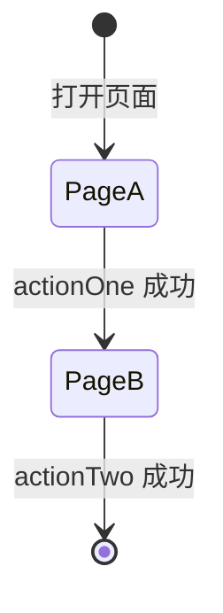

# {模块中文名} UI 对接手册

> 面向前端开发，**仅提供接口出入参说明**。业务逻辑、SQL、事务边界请看 `{模块}-{日期}-coding.md`。
>
> 主设计文档：`{模块}-{日期}-v1.md`

---

## 1. 基本信息

| 项 | 内容 |
|---|---|
| 文档类型 | UI 对接手册（仅出入参） |
| 版本号 | v1 |
| 创建日期 | {YYYY-MM-DD} |
| 作者 | {张凯} |
| 受众 | Flutter 前端开发 |

---

## 2. 接口清单与前端定义映射

| 前端清单接口名 | 本文档章节 | Path | 备注 |
|---|---|---|---|
| `actionOne` | 4.1 | `POST /xxx/one` | ✅ 名称一致 |
| `actionTwo` | 4.2 | `POST /xxx/two` | ⚠️ 与旧骨架冲突，加 `/v2/` 前缀避让（详见 §3.1） |

---

## 3. 公共约定

- UI 通过 Riverpod Provider 调用：主 POS → `{Module}Service`；副 POS → `{Module}IntranetRepository`。Provider 自动路由，UI 无感知。
- 请求体统一 JSON；响应统一 `ApiIntranetResponse { success: bool, message: string, data: T }`。下文每个接口只列 `data` 内容。
- `operatorId / operatorName / posDeviceNo / tenantId` 由 Repository 注入，UI 不传。

### 3.1 路径冲突避让说明（仅冲突接口才写本节）

| 接口 | 新 backend 路径 | 为何加 v2 前缀 |
|---|---|---|
| `actionTwo` | `/v2/xxx/two` | 模块根 `features/{module}/application/xxx_server_service.dart` 已占用 `/xxx/two`，避让 |

---

## 4. 接口出入参

<!-- ============ 单接口模板 起 ============ -->

### 4.N `{actionName}` — {接口中文名}

| 项 | 内容 |
|---|---|
| Path | `POST /xxx/path` |
| 触发页面 | {UI 侧哪个页面 / 哪个按钮触发} |
| 幂等 | {是 / 否；不幂等时写明重复调用后果} |

**入参**：

| 字段 | 类型 | 必填 | 说明 |
|---|---|---|---|
| `orderId` | int | 是 | 订单 ID（联台传任一子订单 ID，服务端自动聚合） |
| `reasonText` | string | 否 | 原因文本，长度 ≤ 255；为空则取预设默认值 |

**出参 `data`**：

| 字段 | 类型 | 说明 |
|---|---|---|
| `success` | bool | 是否成功 |
| `recordId` | int | 新建记录 ID，失败时为 null |
| `affectedOrderIds` | int[] | 联台受影响订单 ID；非联台返空列表 |

**业务规则**（写给后端同学，前端可略读）：

- 触发前置校验：订单必须处于 `orderState=6`（已结账）
- 异常场景：原订单不存在 → `ApiIntranetException(MessageKey.notFound)`
- 对齐云端：`com.kpaygroup.pos.order.modules.service.v1.impl.XxxServiceImpl#actionName`

<!-- ============ 单接口模板 止 ============ -->

### 4.N+1 `{actionName2}` — {下一个接口}

{复制上方单接口模板填充}

---

## 5. 页面调用总览（可选）

---

## 6. 跨页状态传递（可选，有状态接力时必填）

| 状态字段 | 来源 | 使用点 |
|---|---|---|
| `recordId` | `actionOne` 返回 | `actionTwo` / `cancelX` 入参 |

---

## 7. WebSocket 事件（可选，有异步推送时必填）

| 事件 type | Payload | UI 建议订阅页面 |
|---|---|---|

---

## 8. 变更记录

| 版本 | 日期 | 作者 | 变更内容 |
|---|---|---|---|
| v1 | {YYYY-MM-DD} | {张凯} | 初版 |

---

## 模板填充要点（写手册前读这一节）

- 占位符 `{…}` 全部替换为真实值，**不允许残留**花括号
- 入参字段里**不出现** `operatorId / operatorName / posDeviceNo / tenantId`（注入字段）
- 出参字段必须标注**失败场景取值**（如 `null` / `-1` / 空列表）
- 魔法数字（状态码、枚举值）在「说明」列直接枚举全部值，例：`paymentType: 1=KPay 2=现金 3=自定义`
- 每个接口必须写一行「对齐云端：{Java 类全路径}#{方法}」—— 对齐不上就去设计文档里找，或向用户确认
- 扩展新接口时：**复制「单接口模板 起/止」注释之间整块**，只改 §4.N 编号和内部字段，结构不动
